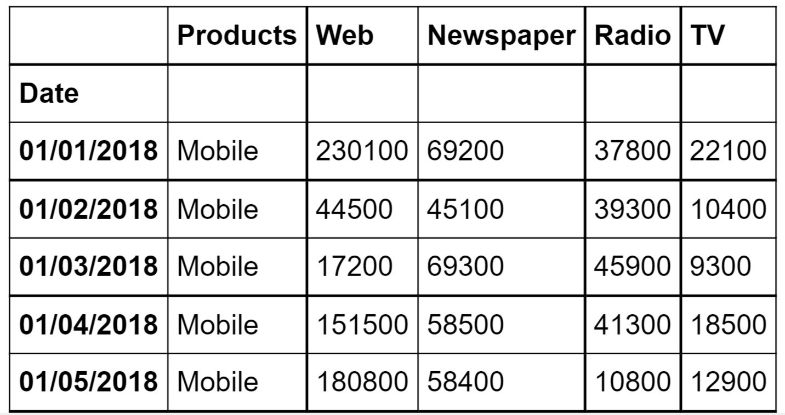
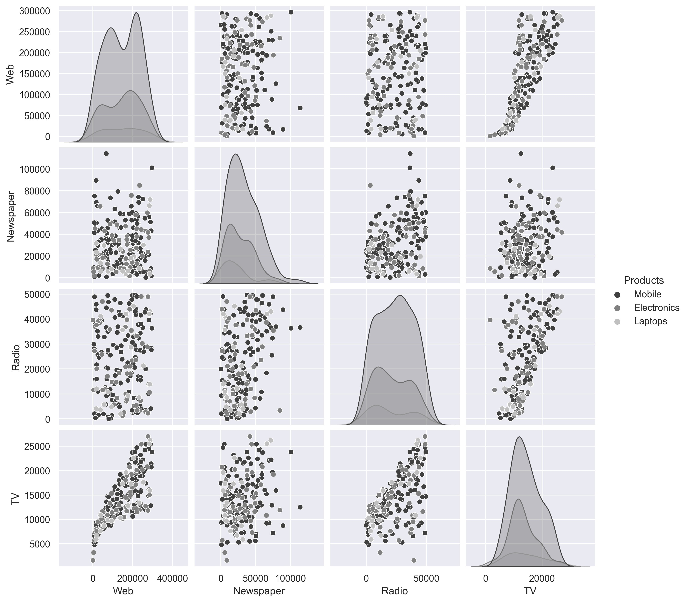

# Chapter02 - **Data Exploration and Visualization**

## **Mục tiêu học tập**

_Sau khi hoàn thành bài học này, học viên sẽ có thể:_

- Khám phá, phân tích và biến đổi dữ liệu một cách hiệu quả
- Sử dụng các hàm thống kê mô tả để hiểu dữ liệu
- Xây dựng pivot table và thực hiện phân tích so sánh
- Tạo các biểu đồ trực quan hóa bằng Matplotlib và Seaborn
- Áp dụng các kỹ thuật nâng cao trong phân tích dữ liệu

## **Lý thuyết**

### **Phần 1: Khám phá, phân tích và biến đổi dữ liệu (Data Exploration, Analysis, and Reshaping)**

#### **1.1 Giới thiệu về Data Exploration**

Data Exploration là quá trình khám phá dữ liệu để hiểu rõ cấu trúc, đặc điểm và các pattern ẩn trong dữ liệu.

#### **1.2 Import các thư viện cần thiết**

```python
import pandas as pd
import numpy as np
import matplotlib.pyplot as plt
import seaborn as sns
import warnings
warnings.filterwarnings('ignore')

# Cài đặt hiển thị
pd.set_option('display.max_columns', None)
pd.set_option('display.width', None)
```

#### **1.3 Tải và khám phá dữ liệu cơ bản**

```python
# Tạo dữ liệu mẫu để demo
np.random.seed(42)
data = {
    'employee_id': range(1, 1001),
    'name': [f'Employee_{i}' for i in range(1, 1001)],
    'department': np.random.choice(['IT', 'Sales', 'HR', 'Marketing', 'Finance'], 1000),
    'salary': np.random.normal(50000, 15000, 1000).astype(int),
    'experience': np.random.randint(0, 20, 1000),
    'age': np.random.randint(22, 65, 1000),
    'performance_score': np.random.choice(['Low', 'Medium', 'High'], 1000, p=[0.2, 0.5, 0.3]),
    'city': np.random.choice(['Hà Nội', 'TP.HCM', 'Đà Nẵng', 'Cần Thơ'], 1000)
}

df = pd.DataFrame(data)

# Khám phá cơ bản
print("1. Kích thước dữ liệu:")
print(f"Shape: {df.shape}")

print("\n2. Thông tin tổng quan:")
print(df.info())

print("\n3. 5 dòng đầu tiên:")
print(df.head())

print("\n4. 5 dòng cuối:")
print(df.tail())

print("\n5. Tên các cột:")
print(df.columns.tolist())
```

#### _**1.4 Khám phá dữ liệu bị thiếu và dữ liệu trùng lặp**_
```python
# Kiểm tra dữ liệu bị thiếu
print("Dữ liệu bị thiếu:")
print(df.isnull().sum())

# Kiểm tra tỷ lệ dữ liệu bị thiếu
missing_percent = (df.isnull().sum() / len(df)) * 100
print("\nTỷ lệ dữ liệu bị thiếu (%):")
print(missing_percent[missing_percent > 0])

# Kiểm tra dữ liệu trùng lặp
print(f"\nSố dòng trùng lặp: {df.duplicated().sum()}")

# Thêm một số giá trị NaN để demo
df.loc[df.sample(50).index, 'salary'] = np.nan
df.loc[df.sample(30).index, 'experience'] = np.nan

print("Sau khi thêm dữ liệu thiếu:")
print(df.isnull().sum())
```

#### _**1.5 Làm sạch và biến đổi dữ liệu**_

```python
# Xử lý dữ liệu thiếu
# Cách 1: Loại bỏ các dòng có dữ liệu thiếu
df_dropped = df.dropna()

# Cách 2: Điền giá trị thiếu
df_filled = df.copy()
df_filled['salary'].fillna(df_filled['salary'].median(), inplace=True)
df_filled['experience'].fillna(df_filled['experience'].median(), inplace=True)

# Cách 3: Điền theo nhóm
df_group_filled = df.copy()
df_group_filled['salary'] = df_group_filled.groupby('department')['salary'].transform(
    lambda x: x.fillna(x.median())
)

print("Kích thước sau khi xử lý:")
print(f"Dropped: {df_dropped.shape}")
print(f"Filled: {df_filled.shape}")
print(f"Group filled: {df_group_filled.shape}")
```

#### **1.6 Selecting and Renaming Attributes (Chọn và đổi tên thuộc tính)**

```python
# Chọn cột cụ thể
selected_cols = df_filled[['name', 'department', 'salary', 'experience']]
print("Chọn các cột cụ thể:")
print(selected_cols.head())

# Chọn cột theo điều kiện
numeric_cols = df_filled.select_dtypes(include=[np.number])
categorical_cols = df_filled.select_dtypes(include=['object'])

print(f"\nCác cột số: {numeric_cols.columns.tolist()}")
print(f"Các cột phân loại: {categorical_cols.columns.tolist()}")

# Đổi tên cột
df_renamed = df_filled.rename(columns={
    'employee_id': 'emp_id',
    'name': 'full_name',
    'department': 'dept',
    'salary': 'monthly_salary',
    'experience': 'years_exp',
    'performance_score': 'performance'
})

print("\nDữ liệu sau khi đổi tên:")
print(df_renamed.columns.tolist())

# Chọn và đổi tên cùng lúc
df_subset = df_filled[['employee_id', 'salary', 'experience']].rename(columns={
    'employee_id': 'id',
    'salary': 'pay',
    'experience': 'exp'
})

print("\nSubset với tên mới:")
print(df_subset.head())

# Sử dụng loc và iloc cho việc chọn dữ liệu nâng cao
# Chọn theo điều kiện và cột
high_salary_emp = df_filled.loc[df_filled['salary'] > 70000, ['name', 'department', 'salary']]
print(f"\nNhân viên lương cao (> 70000): {len(high_salary_emp)} người")
print(high_salary_emp.head())

# Chọn theo vị trí
first_10_rows_3_cols = df_filled.iloc[:10, :3]
print("\n10 dòng đầu, 3 cột đầu:")
print(first_10_rows_3_cols)
```

#### _**1.7 Reshaping the Data (Biến đổi cấu trúc dữ liệu)**_

```python
# Pivot - Chuyển từ long format sang wide format
print("=== PIVOT OPERATIONS ===")

# Tạo dữ liệu mẫu để demo pivot
pivot_data = pd.DataFrame({
    'employee': ['A', 'A', 'B', 'B', 'C', 'C'] * 2,
    'metric': ['salary', 'experience'] * 6,
    'value': [50000, 5, 60000, 8, 45000, 3, 55000, 6, 70000, 10, 48000, 4],
    'year': [2023] * 6 + [2024] * 6
})

print("Dữ liệu gốc (long format):")
print(pivot_data)

# Pivot table
pivoted = pivot_data.pivot_table(values='value', index='employee', 
                                columns='metric', aggfunc='mean')
print("\nSau khi pivot (wide format):")
print(pivoted)

# Melt - Chuyển từ wide format sang long format
print("\n=== MELT OPERATIONS ===")

# Tạo wide format data
wide_data = pd.DataFrame({
    'employee': ['A', 'B', 'C'],
    'salary_2023': [50000, 60000, 45000],
    'salary_2024': [55000, 65000, 48000],
    'exp_2023': [5, 8, 3],
    'exp_2024': [6, 9, 4]
})

print("Dữ liệu wide format:")
print(wide_data)

# Melt để chuyển về long format
melted = pd.melt(wide_data, id_vars=['employee'], 
                value_vars=['salary_2023', 'salary_2024', 'exp_2023', 'exp_2024'],
                var_name='metric_year', value_name='value')

print("\nSau khi melt (long format):")
print(melted)

# Tách cột metric_year thành 2 cột
melted[['metric', 'year']] = melted['metric_year'].str.split('_', expand=True)
melted = melted.drop('metric_year', axis=1)
print("\nSau khi tách cột:")
print(melted)

# Stack và Unstack
print("\n=== STACK/UNSTACK OPERATIONS ===")

# Tạo MultiIndex DataFrame
arrays = [['A', 'A', 'B', 'B'], ['salary', 'experience', 'salary', 'experience']]
index = pd.MultiIndex.from_arrays(arrays, names=['employee', 'metric'])
multi_df = pd.DataFrame({'2023': [50000, 5, 60000, 8], '2024': [55000, 6, 65000, 9]}, index=index)

print("MultiIndex DataFrame:")
print(multi_df)

# Stack - chuyển columns thành rows
stacked = multi_df.stack()
print("\nSau khi stack:")
print(stacked)

# Unstack - chuyển rows thành columns
unstacked = stacked.unstack()
print("\nSau khi unstack:")
print(unstacked)

# Ứng dụng với dữ liệu thực tế
print("\n=== ỨNG DỤNG VỚI DỮ LIỆU THỰC TẾ ===")

# Group và reshape
dept_metrics = df_filled.groupby(['department', 'city']).agg({
    'salary': 'mean',
    'experience': 'mean'
}).round(2)

print("Grouped data (MultiIndex):")
print(dept_metrics.head(10))

# Unstack để tạo pivot table
dept_pivot = dept_metrics.unstack(level='city')
print("\nPivot table từ MultiIndex:")
print(dept_pivot.head())

# Reset index để flatten
dept_flat = dept_pivot.reset_index()
print("\nFlattened data:")
print(dept_flat.head())
```

#### **1.8 Biến đổi dữ liệu (Data Transformation)**

```python
# Tạo các cột mới
df_filled['salary_group'] = pd.cut(df_filled['salary'], 
                                  bins=[0, 40000, 60000, 80000, float('inf')],
                                  labels=['Low', 'Medium', 'High', 'Very High'])

df_filled['experience_level'] = df_filled['experience'].apply(
    lambda x: 'Junior' if x < 3 else 'Mid' if x < 8 else 'Senior'
)

# Mã hóa categorical variables
df_encoded = pd.get_dummies(df_filled, columns=['department', 'performance_score'])

print("Dữ liệu sau khi biến đổi:")
print(df_filled[['salary', 'salary_group', 'experience', 'experience_level']].head())
```

### **Phần 2: Thống kê mô tả (Summary and Descriptive Statistics)**

#### **2.1 Thống kê cơ bản**

```python
# Thống kê mô tả cho biến số
print("Thống kê mô tả cho các biến số:")
print(df_filled.describe())

print("\nThống kê mô tả cho các biến phân loại:")
print(df_filled.describe(include='object'))
```

#### **2.2 Các hàm thống kê chi tiết**

```python
# Thống kê từng biến
def detailed_stats(df, column):
    """Hàm tính thống kê chi tiết cho một cột"""
    if df[column].dtype in ['int64', 'float64']:
        stats = {
            'count': df[column].count(),
            'mean': df[column].mean(),
            'median': df[column].median(),
            'mode': df[column].mode().iloc[0] if not df[column].mode().empty else None,
            'std': df[column].std(),
            'var': df[column].var(),
            'min': df[column].min(),
            'max': df[column].max(),
            'range': df[column].max() - df[column].min(),
            'q1': df[column].quantile(0.25),
            'q3': df[column].quantile(0.75),
            'iqr': df[column].quantile(0.75) - df[column].quantile(0.25),
            'skewness': df[column].skew(),
            'kurtosis': df[column].kurtosis()
        }
        return pd.Series(stats)
    else:
        return f"Cột {column} không phải là dữ liệu số"

# Áp dụng cho cột salary
salary_stats = detailed_stats(df_filled, 'salary')
print("Thống kê chi tiết cho cột salary:")
print(salary_stats)
```

#### **2.3 Thống kê theo nhóm**

```python
# Thống kê theo department
dept_stats = df_filled.groupby('department').agg({
    'salary': ['mean', 'median', 'std', 'count'],
    'experience': ['mean', 'median'],
    'age': ['mean', 'std']
}).round(2)

print("Thống kê theo phòng ban:")
print(dept_stats)

# Thống kê nhiều chiều
multi_group_stats = df_filled.groupby(['department', 'performance_score']).agg({
    'salary': ['mean', 'count'],
    'experience': 'mean'
}).round(2)

print("\nThống kê theo phòng ban và hiệu suất:")
print(multi_group_stats.head(10))
```

#### _**2.4 Phân tích correlation**_

```python
# Ma trận correlation
numeric_cols = df_filled.select_dtypes(include=[np.number]).columns
correlation_matrix = df_filled[numeric_cols].corr()

print("Ma trận correlation:")
print(correlation_matrix.round(3))

# Tìm correlation cao nhất
def find_high_correlations(df, threshold=0.5):
    corr_matrix = df.corr().abs()
    high_corr = []
    
    for i in range(len(corr_matrix.columns)):
        for j in range(i+1, len(corr_matrix.columns)):
            if corr_matrix.iloc[i, j] >= threshold:
                high_corr.append({
                    'var1': corr_matrix.columns[i],
                    'var2': corr_matrix.columns[j],
                    'correlation': corr_matrix.iloc[i, j]
                })
    
    return pd.DataFrame(high_corr).sort_values('correlation', ascending=False)

high_corr = find_high_correlations(df_filled[numeric_cols], 0.3)
print(f"\nCác cặp biến có correlation >= 0.3:")
print(high_corr)
```

#### **2.5 The UNIQUE() Function**

```python
print("=== SỬ DỤNG UNIQUE() FUNCTION ===")

# Tìm các giá trị duy nhất trong mỗi cột
print("1. Unique values trong từng cột:")

# Các giá trị duy nhất trong department
unique_depts = df_filled['department'].unique()
print(f"Departments: {unique_depts}")
print(f"Số lượng departments: {len(unique_depts)}")

# Unique values cho performance_score
unique_performance = df_filled['performance_score'].unique()
print(f"\nPerformance scores: {unique_performance}")
print(f"Số lượng performance levels: {len(unique_performance)}")

# Unique values cho city
unique_cities = df_filled['city'].unique()
print(f"\nCities: {unique_cities}")
print(f"Số lượng cities: {len(unique_cities)}")

# Số lượng unique values cho các cột số
print(f"\nUnique salaries: {df_filled['salary'].nunique()}")
print(f"Unique experience levels: {df_filled['experience'].nunique()}")
print(f"Unique ages: {df_filled['age'].nunique()}")

# Unique values với điều kiện
print("\n2. Unique values theo điều kiện:")

# Unique departments trong IT có salary > 60000
it_high_salary = df_filled[(df_filled['department'] == 'IT') & 
                          (df_filled['salary'] > 60000)]
print(f"Performance scores của IT employees có lương > 60000:")
print(f"{it_high_salary['performance_score'].unique()}")

# Tổng hợp unique values cho tất cả cột categorical
categorical_cols = df_filled.select_dtypes(include=['object']).columns
print("\n3. Tổng hợp unique values cho tất cả categorical columns:")
for col in categorical_cols:
    unique_vals = df_filled[col].unique()
    print(f"{col}: {len(unique_vals)} unique values")
    if len(unique_vals) <= 10:  # Chỉ hiển thị nếu ít hơn 10 values
        print(f"  Values: {list(unique_vals)}")
    else:
        print(f"  Sample values: {list(unique_vals[:5])}...")
```

#### **2.6 The VALUE_COUNTS() Function**

```python
print("=== SỬ DỤNG VALUE_COUNTS() FUNCTION ===")

# Value counts cơ bản
print("1. Đếm tần số cơ bản:")

# Đếm số nhân viên theo department
dept_counts = df_filled['department'].value_counts()
print("Số nhân viên theo phòng ban:")
print(dept_counts)

# Hiển thị tỷ lệ phần trăm
dept_percentages = df_filled['department'].value_counts(normalize=True) * 100
print("\nTỷ lệ phần trăm theo phòng ban:")
print(dept_percentages.round(2))

# Value counts cho performance_score
print("\n2. Phân bố performance score:")
performance_counts = df_filled['performance_score'].value_counts()
print(performance_counts)

# Sắp xếp theo index thay vì theo count
performance_sorted = df_filled['performance_score'].value_counts().sort_index()
print("\nPerformance score (sắp xếp theo thứ tự):")
print(performance_sorted)

# Value counts cho dữ liệu số (binning)
print("\n3. Value counts cho dữ liệu số:")

# Chia salary thành bins và đếm
salary_bins = pd.cut(df_filled['salary'], bins=5)
salary_counts = salary_bins.value_counts().sort_index()
print("Phân bố lương theo khoảng:")
print(salary_counts)

# Experience levels
exp_counts = df_filled['experience_level'].value_counts()
print("\nSố lượng nhân viên theo level kinh nghiệm:")
print(exp_counts)

# Value counts với dropna=False để bao gồm NaN
print("\n4. Value counts bao gồm missing values:")
# Tạo một cột có missing values để demo
df_temp = df_filled.copy()
df_temp.loc[df_temp.sample(50).index, 'city'] = np.nan

city_counts_with_nan = df_temp['city'].value_counts(dropna=False)
print("City counts (bao gồm NaN):")
print(city_counts_with_nan)

# Value counts kết hợp với groupby
print("\n5. Value counts theo nhóm:")

# Đếm performance score theo từng department
for dept in df_filled['department'].unique():
    dept_data = df_filled[df_filled['department'] == dept]
    print(f"\n{dept} department - Performance distribution:")
    print(dept_data['performance_score'].value_counts())

# Sử dụng crosstab để có cái nhìn tổng quan hơn
print("\n6. Crosstab - Value counts đa chiều:")
crosstab = pd.crosstab(df_filled['department'], df_filled['performance_score'])
print("Department vs Performance Score:")
print(crosstab)

# Crosstab với tỷ lệ phần trăm
crosstab_pct = pd.crosstab(df_filled['department'], df_filled['performance_score'], 
                          normalize='index') * 100
print("\nDepartment vs Performance Score (%):")
print(crosstab_pct.round(1))

# Top/Bottom values
print("\n7. Top và Bottom values:")

# Top 3 departments có nhiều nhân viên nhất
top_depts = df_filled['department'].value_counts().head(3)
print("Top 3 departments:")
print(top_depts)

# Bottom 2 departments
bottom_depts = df_filled['department'].value_counts().tail(2)
print("\nBottom 2 departments:")
print(bottom_depts)

# Value counts cho multiple columns
print("\n8. Value counts cho combination của columns:")

# Kết hợp department và performance
combined_counts = df_filled.groupby(['department', 'performance_score']).size()
print("Department + Performance combinations:")
print(combined_counts.head(10))

# Chuyển thành percentage
combined_pct = (combined_counts / len(df_filled)) * 100
print("\nCombination percentages:")
print(combined_pct.head(10).round(2))
```

### **Phần 3: Pivot Tables và Phân tích So sánh**

#### **3.1 Tạo Pivot Tables**

```python
# Pivot table cơ bản
pivot_basic = pd.pivot_table(df_filled, 
                            values='salary', 
                            index='department', 
                            columns='performance_score',
                            aggfunc='mean')

print("Pivot table cơ bản (Lương trung bình theo phòng ban và hiệu suất):")
print(pivot_basic.round(0))

# Pivot table với nhiều metrics
pivot_multi = pd.pivot_table(df_filled,
                            values=['salary', 'experience', 'age'],
                            index='department',
                            columns='city',
                            aggfunc={'salary': 'mean', 
                                    'experience': 'mean', 
                                    'age': 'mean'})

print("\nPivot table với nhiều metrics:")
print(pivot_multi.round(2))
```

#### _**3.2 Pivot Tables nâng cao**_

```python
# Pivot table với subtotals
pivot_subtotal = pd.pivot_table(df_filled,
                               values='salary',
                               index=['department', 'experience_level'],
                               columns='performance_score',
                               aggfunc=['mean', 'count'],
                               fill_value=0,
                               margins=True)

print("Pivot table với subtotals:")
print(pivot_subtotal.round(0))

# Cross-tabulation
cross_tab = pd.crosstab(df_filled['department'], 
                       df_filled['performance_score'],
                       normalize='index') * 100

print("\nCross-tabulation (% theo hàng):")
print(cross_tab.round(1))
```

#### _**3.3 Phân tích so sánh**_

```python
from scipy import stats

# So sánh lương giữa các phòng ban
def compare_groups(df, group_col, value_col):
    groups = []
    group_names = []
    
    for name, group in df.groupby(group_col):
        groups.append(group[value_col].dropna())
        group_names.append(name)
    
    # ANOVA test
    f_stat, p_value = stats.f_oneway(*groups)
    
    results = {
        'F-statistic': f_stat,
        'p-value': p_value,
        'significant': p_value < 0.05
    }
    
    return results, group_names, groups

# So sánh lương giữa các phòng ban
anova_result, dept_names, dept_groups = compare_groups(df_filled, 'department', 'salary')

print("Kết quả ANOVA test - So sánh lương giữa các phòng ban:")
print(f"F-statistic: {anova_result['F-statistic']:.4f}")
print(f"p-value: {anova_result['p-value']:.4f}")
print(f"Có sự khác biệt có ý nghĩa: {anova_result['significant']}")

# T-test giữa hai nhóm
it_salaries = df_filled[df_filled['department'] == 'IT']['salary'].dropna()
sales_salaries = df_filled[df_filled['department'] == 'Sales']['salary'].dropna()

t_stat, p_val = stats.ttest_ind(it_salaries, sales_salaries)

print(f"\nT-test giữa IT và Sales:")
print(f"t-statistic: {t_stat:.4f}")
print(f"p-value: {p_val:.4f}")
print(f"Có sự khác biệt có ý nghĩa: {p_val < 0.05}")
```

### **Phần 4: Trực quan hóa dữ liệu với Matplotlib và Seaborn**

#### **4.1 Cơ bản về Matplotlib**

```python
# Thiết lập style
plt.style.use('seaborn-v0_8')
plt.rcParams['figure.figsize'] = (12, 8)
plt.rcParams['font.size'] = 10

# Density Plots với Matplotlib
print("=== DENSITY PLOTS VỚI MATPLOTLIB ===")

fig, axes = plt.subplots(2, 2, figsize=(15, 10))

# 1. Histogram với density
axes[0,0].hist(df_filled['salary'], bins=30, alpha=0.7, color='skyblue', 
               edgecolor='black', density=True)
axes[0,0].set_title('Density Plot - Lương (Histogram)')
axes[0,0].set_xlabel('Lương')
axes[0,0].set_ylabel('Density')

# 2. Kernel Density Estimation
from scipy.stats import gaussian_kde
salary_data = df_filled['salary'].dropna()
density = gaussian_kde(salary_data)
xs = np.linspace(salary_data.min(), salary_data.max(), 200)
axes[0,1].plot(xs, density(xs), color='red', linewidth=2)
axes[0,1].fill_between(xs, density(xs), alpha=0.3, color='red')
axes[0,1].set_title('Kernel Density Estimation - Lương')
axes[0,1].set_xlabel('Lương')
axes[0,1].set_ylabel('Density')

# 3. Multiple Density Plots
for dept in df_filled['department'].unique():
    dept_salary = df_filled[df_filled['department'] == dept]['salary'].dropna()
    axes[1,0].hist(dept_salary, alpha=0.5, label=dept, bins=20, density=True)
axes[1,0].set_title('Density Plots theo Department')
axes[1,0].set_xlabel('Lương')
axes[1,0].set_ylabel('Density')
axes[1,0].legend()

# 4. 2D Density Plot (Contour)
x = df_filled['experience'].dropna()
y = df_filled['salary'].dropna()
axes[1,1].hexbin(x, y, gridsize=20, cmap='Blues')
axes[1,1].set_title('2D Density Plot - Experience vs Salary')
axes[1,1].set_xlabel('Experience')
axes[1,1].set_ylabel('Salary')

plt.tight_layout()
plt.show()

# Bar Charts với Matplotlib
print("\n=== BAR CHARTS VỚI MATPLOTLIB ===")

fig, axes = plt.subplots(2, 2, figsize=(15, 10))

# 1. Vertical Bar Chart
dept_counts = df_filled['department'].value_counts()
axes[0,0].bar(dept_counts.index, dept_counts.values, color='lightblue', alpha=0.8)
axes[0,0].set_title('Vertical Bar Chart - Số nhân viên theo Department')
axes[0,0].set_xlabel('Department')
axes[0,0].set_ylabel('Số lượng')
axes[0,0].tick_params(axis='x', rotation=45)

# 2. Horizontal Bar Chart
axes[0,1].barh(dept_counts.index, dept_counts.values, color='lightgreen', alpha=0.8)
axes[0,1].set_title('Horizontal Bar Chart - Số nhân viên theo Department')
axes[0,1].set_xlabel('Số lượng')
axes[0,1].set_ylabel('Department')

# 3. Grouped Bar Chart
dept_perf = pd.crosstab(df_filled['department'], df_filled['performance_score'])
x = np.arange(len(dept_perf.index))
width = 0.25

for i, perf_level in enumerate(dept_perf.columns):
    axes[1,0].bar(x + i*width, dept_perf[perf_level], width, 
                  label=perf_level, alpha=0.8)

axes[1,0].set_title('Grouped Bar Chart - Performance theo Department')
axes[1,0].set_xlabel('Department')
axes[1,0].set_ylabel('Số lượng')
axes[1,0].set_xticks(x + width)
axes[1,0].set_xticklabels(dept_perf.index, rotation=45)
axes[1,0].legend()

# 4. Stacked Bar Chart
dept_perf.plot(kind='bar', stacked=True, ax=axes[1,1], alpha=0.8)
axes[1,1].set_title('Stacked Bar Chart - Performance theo Department')
axes[1,1].set_xlabel('Department')
axes[1,1].set_ylabel('Số lượng')
axes[1,1].tick_params(axis='x', rotation=45)
axes[1,1].legend()

plt.tight_layout()
plt.show()

# Box Plots với Matplotlib
print("\n=== BOX PLOTS VỚI MATPLOTLIB ===")

fig, axes = plt.subplots(2, 2, figsize=(15, 10))

# 1. Single Box Plot
axes[0,0].boxplot(df_filled['salary'].dropna())
axes[0,0].set_title('Box Plot - Phân bố Lương')
axes[0,0].set_ylabel('Lương')

# 2. Multiple Box Plots
dept_data = [df_filled[df_filled['department'] == dept]['salary'].dropna() 
             for dept in df_filled['department'].unique()]
axes[0,1].boxplot(dept_data, labels=df_filled['department'].unique())
axes[0,1].set_title('Box Plots - Lương theo Department')
axes[0,1].set_xlabel('Department')
axes[0,1].set_ylabel('Lương')
axes[0,1].tick_params(axis='x', rotation=45)

# 3. Box Plot với outliers highlight
box_plot = axes[1,0].boxplot(df_filled['salary'].dropna(), patch_artist=True)
box_plot['boxes'][0].set_facecolor('lightblue')
box_plot['boxes'][0].set_alpha(0.7)
axes[1,0].set_title('Box Plot với Outliers Highlighted')
axes[1,0].set_ylabel('Lương')

# 4. Horizontal Box Plot
axes[1,1].boxplot(df_filled['experience'].dropna(), vert=False)
axes[1,1].set_title('Horizontal Box Plot - Experience')
axes[1,1].set_xlabel('Years of Experience')

plt.tight_layout()
plt.show()

# Scatter Plots với Matplotlib
print("\n=== SCATTER PLOTS VỚI MATPLOTLIB ===")

fig, axes = plt.subplots(2, 2, figsize=(15, 10))

# 1. Basic Scatter Plot
axes[0,0].scatter(df_filled['experience'], df_filled['salary'], alpha=0.6)
axes[0,0].set_title('Scatter Plot - Experience vs Salary')
axes[0,0].set_xlabel('Experience (years)')
axes[0,0].set_ylabel('Salary')

# 2. Scatter Plot với color coding
colors = {'IT': 'red', 'Sales': 'blue', 'HR': 'green', 'Marketing': 'orange', 'Finance': 'purple'}
for dept in df_filled['department'].unique():
    dept_data = df_filled[df_filled['department'] == dept]
    axes[0,1].scatter(dept_data['experience'], dept_data['salary'], 
                     label=dept, alpha=0.6, color=colors.get(dept, 'gray'))
axes[0,1].set_title('Scatter Plot với Color Coding theo Department')
axes[0,1].set_xlabel('Experience (years)')
axes[0,1].set_ylabel('Salary')
axes[0,1].legend()

# 3. Scatter Plot với size coding
sizes = df_filled['age'] * 2  # Scale age để làm size
axes[1,0].scatter(df_filled['experience'], df_filled['salary'], 
                 s=sizes, alpha=0.5, c='blue')
axes[1,0].set_title('Scatter Plot với Size theo Age')
axes[1,0].set_xlabel('Experience (years)')
axes[1,0].set_ylabel('Salary')

# 4. Scatter Plot Matrix (simplified)
from pandas.plotting import scatter_matrix
numeric_data = df_filled[['salary', 'experience', 'age']].dropna()
scatter_matrix(numeric_data, ax=axes[1,1], alpha=0.6, figsize=(6, 6))
axes[1,1].set_title('Scatter Plot Matrix')

plt.tight_layout()
plt.show()
```

#### 4.2 Trực quan hóa với Seaborn cơ bản

```python
# Thiết lập style cho seaborn
sns.set_style("whitegrid")
sns.set_palette("husl")

# 1. Boxplot
plt.figure(figsize=(12, 8))
plt.subplot(2, 2, 1)
sns.boxplot(data=df_filled, x='department', y='salary')
plt.title('Phân bố lương theo phòng ban')
plt.xticks(rotation=45)

# 2. Violin plot
plt.subplot(2, 2, 2)
sns.violinplot(data=df_filled, x='performance_score', y='salary')
plt.title('Phân bố lương theo hiệu suất')

# 3. Heatmap correlation
plt.subplot(2, 2, 3)
correlation_matrix = df_filled[numeric_cols].corr()
sns.heatmap(correlation_matrix, annot=True, cmap='coolwarm', center=0, fmt='.2f')
plt.title('Ma trận correlation')

# 4. Count plot
plt.subplot(2, 2, 4)
sns.countplot(data=df_filled, x='department', hue='performance_score')
plt.title('Số lượng nhân viên theo phòng ban và hiệu suất')
plt.xticks(rotation=45)

plt.tight_layout()
plt.show()
```

#### **4.2 Trực quan hóa với Seaborn**

```python
# Thiết lập style cho seaborn
sns.set_style("whitegrid")
sns.set_palette("husl")

# Density Plots với Seaborn
print("=== DENSITY PLOTS VỚI SEABORN ===")

fig, axes = plt.subplots(2, 2, figsize=(15, 10))

# 1. Histogram với KDE
sns.histplot(data=df_filled, x='salary', kde=True, ax=axes[0,0])
axes[0,0].set_title('Histogram với KDE - Salary')

# 2. KDE plot
sns.kdeplot(data=df_filled, x='salary', ax=axes[0,1])
axes[0,1].set_title('KDE Plot - Salary')

# 3. Multiple KDE plots
for dept in df_filled['department'].unique():
    dept_data = df_filled[df_filled['department'] == dept]['salary']
    sns.kdeplot(data=dept_data, label=dept, ax=axes[1,0])
axes[1,0].set_title('Multiple KDE Plots theo Department')
axes[1,0].legend()

# 4. 2D KDE plot
sns.kdeplot(data=df_filled, x='experience', y='salary', ax=axes[1,1])
axes[1,1].set_title('2D KDE Plot - Experience vs Salary')

plt.tight_layout()
plt.show()

# Bar Charts với Seaborn
print("\n=== BAR CHARTS VỚI SEABORN ===")

fig, axes = plt.subplots(2, 2, figsize=(15, 10))

# 1. Count plot
sns.countplot(data=df_filled, x='department', ax=axes[0,0])
axes[0,0].set_title('Count Plot - Department')
axes[0,0].tick_params(axis='x', rotation=45)

# 2. Bar plot với mean
sns.barplot(data=df_filled, x='department', y='salary', ax=axes[0,1])
axes[0,1].set_title('Bar Plot - Lương trung bình theo Department')
axes[0,1].tick_params(axis='x', rotation=45)

# 3. Count plot với hue
sns.countplot(data=df_filled, x='department', hue='performance_score', ax=axes[1,0])
axes[1,0].set_title('Count Plot với Hue - Department và Performance')
axes[1,0].tick_params(axis='x', rotation=45)

# 4. Bar plot với hue
sns.barplot(data=df_filled, x='department', y='salary', hue='performance_score', ax=axes[1,1])
axes[1,1].set_title('Bar Plot với Hue - Salary theo Department và Performance')
axes[1,1].tick_params(axis='x', rotation=45)

plt.tight_layout()
plt.show()

# Box Plots với Seaborn
print("\n=== BOX PLOTS VỚI SEABORN ===")

fig, axes = plt.subplots(2, 2, figsize=(15, 10))

# 1. Basic box plot
sns.boxplot(data=df_filled, y='salary', ax=axes[0,0])
axes[0,0].set_title('Box Plot - Salary')

# 2. Box plot theo category
sns.boxplot(data=df_filled, x='department', y='salary', ax=axes[0,1])
axes[0,1].set_title('Box Plot - Salary theo Department')
axes[0,1].tick_params(axis='x', rotation=45)

# 3. Box plot với hue
sns.boxplot(data=df_filled, x='department', y='salary', hue='performance_score', ax=axes[1,0])
axes[1,0].set_title('Box Plot với Hue - Salary theo Department và Performance')
axes[1,0].tick_params(axis='x', rotation=45)

# 4. Violin plot (tương tự box plot nhưng hiển thị density)
sns.violinplot(data=df_filled, x='department', y='salary', ax=axes[1,1])
axes[1,1].set_title('Violin Plot - Salary theo Department')
axes[1,1].tick_params(axis='x', rotation=45)

plt.tight_layout()
plt.show()

# Scatter Plots với Seaborn
print("\n=== SCATTER PLOTS VỚI SEABORN ===")

fig, axes = plt.subplots(2, 2, figsize=(15, 10))

# 1. Basic scatter plot
sns.scatterplot(data=df_filled, x='experience', y='salary', ax=axes[0,0])
axes[0,0].set_title('Scatter Plot - Experience vs Salary')

# 2. Scatter plot với hue
sns.scatterplot(data=df_filled, x='experience', y='salary', hue='department', ax=axes[0,1])
axes[0,1].set_title('Scatter Plot với Color - Department')

# 3. Scatter plot với size và hue
sns.scatterplot(data=df_filled, x='experience', y='salary', 
                hue='performance_score', size='age', ax=axes[1,0])
axes[1,0].set_title('Scatter Plot với Hue và Size')

# 4. Regression plot
sns.regplot(data=df_filled, x='experience', y='salary', ax=axes[1,1])
axes[1,1].set_title('Regression Plot - Experience vs Salary')

plt.tight_layout()
plt.show()
```dgecolor='black')
axes[0,0].set_title('Phân bố lương')
axes[0,0].set_xlabel('Lương')
axes[0,0].set_ylabel('Tần số')

# Histogram cho experience
axes[0,1].hist(df_filled['experience'], bins=20, alpha=0.7, color='lightgreen', edgecolor='black')
axes[0,1].set_title('Phân bố kinh nghiệm')
axes[0,1].set_xlabel('Số năm kinh nghiệm')
axes[0,1].set_ylabel('Tần số')

# Scatter plot
axes[1,0].scatter(df_filled['experience'], df_filled['salary'], alpha=0.6)
axes[1,0].set_title('Mối quan hệ giữa kinh nghiệm và lương')
axes[1,0].set_xlabel('Kinh nghiệm (năm)')
axes[1,0].set_ylabel('Lương')

# Bar plot
dept_avg_salary = df_filled.groupby('department')['salary'].mean()
axes[1,1].bar(dept_avg_salary.index, dept_avg_salary.values, color='orange', alpha=0.7)
axes[1,1].set_title('Lương trung bình theo phòng ban')
axes[1,1].set_xlabel('Phòng ban')
axes[1,1].set_ylabel('Lương trung bình')
axes[1,1].tick_params(axis='x', rotation=45)

plt.tight_layout()
plt.show()
```
#### _**4.4 Biểu đồ nâng cao với Matplotlib và Seaborn**_

```python
# 1. Advanced Matplotlib Visualizations
print("=== ADVANCED MATPLOTLIB TECHNIQUES ===")

# Custom styling và multiple subplots
fig = plt.figure(figsize=(20, 12))

# Define custom color palettes
colors_dept = plt.cm.Set3(np.linspace(0, 1, len(df_filled['department'].unique())))
colors_perf = {'Low': '#ff7f7f', 'Medium': '#ffff7f', 'High': '#7fff7f'}

# 1. Density plot comparison với multiple layers
ax1 = plt.subplot(2, 4, 1)
for i, dept in enumerate(df_filled['department'].unique()):
    dept_data = df_filled[df_filled['department'] == dept]['salary'].dropna()
    density = gaussian_kde(dept_data)
    xs = np.linspace(dept_data.min(), dept_data.max(), 100)
    ax1.plot(xs, density(xs), label=dept, linewidth=2, color=colors_dept[i])
    ax1.fill_between(xs, density(xs), alpha=0.2, color=colors_dept[i])

ax1.set_title('Multi-layer Density Plots\nSalary Distribution by Department', fontsize=12)
ax1.set_xlabel('Salary')
ax1.set_ylabel('Density')
ax1.legend(fontsize=8)
ax1.grid(True, alpha=0.3)

# 2. Advanced Bar Chart với error bars
ax2 = plt.subplot(2, 4, 2)
dept_stats = df_filled.groupby('department')['salary'].agg(['mean', 'std']).reset_index()
bars = ax2.bar(dept_stats['department'], dept_stats['mean'], 
               yerr=dept_stats['std'], capsize=5, alpha=0.7, 
               color=colors_dept, edgecolor='black', linewidth=1)

# Add value labels on bars
for bar in bars:
    height = bar.get_height()
    ax2.text(bar.get_x() + bar.get_width()/2., height + 1000,
            f'{height:.0f}', ha='center', va='bottom', fontweight='bold')

ax2.set_title('Advanced Bar Chart\nMean Salary ± SD by Department', fontsize=12)
ax2.set_xlabel('Department')
ax2.set_ylabel('Mean Salary')
ax2.tick_params(axis='x', rotation=45)
ax2.grid(axis='y', alpha=0.3)

# 3. Enhanced Box Plot với customization
ax3 = plt.subplot(2, 4, 3)
dept_data_list = [df_filled[df_filled['department'] == dept]['salary'].dropna() 
                 for dept in df_filled['department'].unique()]

box_plot = ax3.boxplot(dept_data_list, labels=df_filled['department'].unique(),
                      patch_artist=True, showmeans=True, meanline=True)

# Customize box colors
for patch, color in zip(box_plot['boxes'], colors_dept):
    patch.set_facecolor(color)
    patch.set_alpha(0.7)

# Customize other elements
for element in ['whiskers', 'fliers', 'medians', 'caps']:
    plt.setp(box_plot[element], color='black', linewidth=1)

plt.setp(box_plot['means'], color='red', linewidth=2)

ax3.set_title('Enhanced Box Plot\nSalary Distribution with Means', fontsize=12)
ax3.set_xlabel('Department')
ax3.set_ylabel('Salary')
ax3.tick_params(axis='x', rotation=45)
ax3.grid(axis='y', alpha=0.3)

# 4. Multi-dimensional Scatter với annotations
ax4 = plt.subplot(2, 4, 4)
scatter = ax4.scatter(df_filled['experience'], df_filled['salary'], 
                     c=df_filled['age'], s=100, alpha=0.6, 
                     cmap='viridis', edgecolors='black', linewidth=0.5)

# Add colorbar
cbar = plt.colorbar(scatter, ax=ax4)
cbar.set_label('Age', rotation=270, labelpad=15)

# Add trend line
z = np.polyfit(df_filled['experience'], df_filled['salary'], 1)
p = np.poly1d(z)
ax4.plot(df_filled['experience'], p(df_filled['experience']), 
         "r--", alpha=0.8, linewidth=2)

# Add correlation coefficient
correlation = df_filled['experience'].corr(df_filled['salary'])
ax4.text(0.05, 0.95, f'Correlation: {correlation:.3f}', 
         transform=ax4.transAxes, fontsize=10,
         bbox=dict(boxstyle="round,pad=0.3", facecolor="yellow", alpha=0.7))

ax4.set_title('Multi-dimensional Scatter\nExperience vs Salary (colored by Age)', fontsize=12)
ax4.set_xlabel('Experience (years)')
ax4.set_ylabel('Salary')
ax4.grid(True, alpha=0.3)

# 5. Stacked Area Chart
ax5 = plt.subplot(2, 4, 5)
# Create time series data for demo
monthly_data = df_filled.groupby(['city', pd.cut(df_filled['age'], bins=3)]).size().unstack(fill_value=0)
monthly_data.plot(kind='area', stacked=True, ax=ax5, alpha=0.7)
ax5.set_title('Stacked Area Chart\nEmployee Distribution by City & Age Group', fontsize=12)
ax5.set_xlabel('City')
ax5.set_ylabel('Number of Employees')
ax5.legend(title='Age Group', bbox_to_anchor=(1.05, 1), loc='upper left')
ax5.tick_params(axis='x', rotation=45)

# 6. Radar Chart (Spider Plot)
ax6 = plt.subplot(2, 4, 6, projection='polar')
# Prepare data for radar chart
dept_metrics = df_filled.groupby('department').agg({
    'salary': 'mean',
    'experience': 'mean', 
    'age': 'mean'
}).round(2)

# Normalize data to 0-1 scale
dept_metrics_norm = (dept_metrics - dept_metrics.min()) / (dept_metrics.max() - dept_metrics.min())

# Set up radar chart
angles = np.linspace(0, 2 * np.pi, len(dept_metrics.columns), endpoint=False)
angles = np.concatenate((angles, [angles[0]]))  # Complete the circle

for i, dept in enumerate(dept_metrics.index[:3]):  # Show only first 3 for clarity
    values = dept_metrics_norm.loc[dept].values
    values = np.concatenate((values, [values[0]]))  # Complete the circle
    
    ax6.plot(angles, values, 'o-', linewidth=2, label=dept, color=colors_dept[i])
    ax6.fill(angles, values, alpha=0.1, color=colors_dept[i])

ax6.set_xticks(angles[:-1])
ax6.set_xticklabels(dept_metrics.columns)
ax6.set_ylim(0, 1)
ax6.set_title('Radar Chart\nDepartment Metrics (Normalized)', fontsize=12, pad=20)
ax6.legend(loc='upper right', bbox_to_anchor=(1.2, 1.0))

# 7. Heatmap with hierarchical clustering
ax7 = plt.subplot(2, 4, 7)
# Create correlation matrix
corr_matrix = df_filled[['salary', 'experience', 'age']].corr()

# Create heatmap
im = ax7.imshow(corr_matrix, cmap='coolwarm', aspect='auto', vmin=-1, vmax=1)

# Add text annotations
for i in range(len(corr_matrix.columns)):
    for j in range(len(corr_matrix.columns)):
        text = ax7.text(j, i, f'{corr_matrix.iloc[i, j]:.2f}',
                       ha="center", va="center", color="black", fontweight='bold')

ax7.set_xticks(range(len(corr_matrix.columns)))
ax7.set_yticks(range(len(corr_matrix.columns)))
ax7.set_xticklabels(corr_matrix.columns)
ax7.set_yticklabels(corr_matrix.columns)
ax7.set_title('Custom Correlation Heatmap', fontsize=12)

# Add colorbar
cbar = plt.colorbar(im, ax=ax7, shrink=0.8)
cbar.set_label('Correlation Coefficient')

# 8. Violin plot with statistical annotations
ax8 = plt.subplot(2, 4, 8)
parts = ax8.violinplot([df_filled[df_filled['performance_score'] == perf]['salary'].dropna() 
                       for perf in ['Low', 'Medium', 'High']], 
                      positions=[1, 2, 3], showmeans=True, showmedians=True)

# Customize violin colors
colors_violin = ['#ff9999', '#ffff99', '#99ff99']
for pc, color in zip(parts['bodies'], colors_violin):
    pc.set_facecolor(color)
    pc.set_alpha(0.7)

# Add statistical test results
from scipy.stats import kruskal
stat, p_val = kruskal(*[df_filled[df_filled['performance_score'] == perf]['salary'].dropna() 
                       for perf in ['Low', 'Medium', 'High']])

ax8.text(0.5, 0.95, f'Kruskal-Wallis Test\np-value: {p_val:.4f}', 
         transform=ax8.transAxes, fontsize=9,
         bbox=dict(boxstyle="round,pad=0.3", facecolor="lightblue", alpha=0.8),
         horizontalalignment='center')

ax8.set_xticks([1, 2, 3])
ax8.set_xticklabels(['Low', 'Medium', 'High'])
ax8.set_title('Enhanced Violin Plot\nSalary by Performance with Stats', fontsize=12)
ax8.set_xlabel('Performance Score')
ax8.set_ylabel('Salary')
ax8.grid(axis='y', alpha=0.3)

plt.tight_layout()
plt.show()

# 2. Interactive-style plots với Seaborn
print("\n=== INTERACTIVE-STYLE SEABORN PLOTS ===")

# Create a comprehensive dashboard
fig, axes = plt.subplots(2, 3, figsize=(18, 12))

# Plot 1: Enhanced Swarm Plot
ax = axes[0, 0]
sns.swarmplot(data=df_filled.sample(300), x='performance_score', y='salary', 
              hue='department', ax=ax, size=4, alpha=0.7)
ax.set_title('Swarm Plot\nDetailed Salary Distribution', fontsize=12)
ax.legend(bbox_to_anchor=(1.05, 1), loc='upper left')

# Plot 2: Ridge Plot (multiple KDE)
ax = axes[0, 1]
for i, dept in enumerate(df_filled['department'].unique()):
    dept_data = df_filled[df_filled['department'] == dept]['salary']
    density = gaussian_kde(dept_data)
    xs = np.linspace(dept_data.min(), dept_data.max(), 100)
    ax.fill_between(xs, i + density(xs) * 0.5, i, alpha=0.6, label=dept)
    
ax.set_yticks(range(len(df_filled['department'].unique())))
ax.set_yticklabels(df_filled['department'].unique())
ax.set_title('Ridge Plot\nSalary Distribution by Department', fontsize=12)
ax.set_xlabel('Salary')

# Plot 3: Correlation network-style plot
ax = axes[0, 2]
corr = df_filled[['salary', 'experience', 'age']].corr()
mask = np.triu(np.ones_like(corr, dtype=bool))
sns.heatmap(corr, mask=mask, annot=True, cmap='RdYlBu_r', center=0,
            square=True, linewidths=0.5, cbar_kws={"shrink": .8}, ax=ax)
ax.set_title('Correlation Network\nUpper Triangle Only', fontsize=12)

# Plot 4: Multi-level categorical plot
ax = axes[1, 0]
# Create age groups for better visualization
df_plot = df_filled.copy()
df_plot['age_group'] = pd.cut(df_filled['age'], bins=3, labels=['Young', 'Middle', 'Senior'])

sns.boxplot(data=df_plot, x='department', y='salary', hue='age_group', ax=ax)
ax.set_title('Multi-level Box Plot\nSalary by Department and Age Group', fontsize=12)
ax.tick_params(axis='x', rotation=45)

# Plot 5: Advanced regression plot with confidence intervals
ax = axes[1, 1]
sns.regplot(data=df_filled, x='experience', y='salary', ax=ax, 
           scatter_kws={'alpha': 0.5, 's': 30}, line_kws={'color': 'red'})

# Add polynomial regression line
z = np.polyfit(df_filled['experience'], df_filled['salary'], 2)
p = np.poly1d(z)
x_smooth = np.linspace(df_filled['experience'].min(), df_filled['experience'].max(), 100)
ax.plot(x_smooth, p(x_smooth), 'g--', alpha=0.8, linewidth=2, label='Polynomial fit')

ax.set_title('Advanced Regression Plot\nLinear vs Polynomial Fit', fontsize=12)
ax.legend()

# Plot 6: Faceted histogram
ax = axes[1, 2]
# Create a single plot showing distribution comparison
performance_order = ['Low', 'Medium', 'High']
colors_perf_list = ['#ff7f7f', '#ffff7f', '#7fff7f']

for i, perf in enumerate(performance_order):
    data = df_filled[df_filled['performance_score'] == perf]['salary']
    ax.hist(data, bins=20, alpha=0.6, label=perf, color=colors_perf_list[i], density=True)
    
    # Add mean line
    mean_val = data.mean()
    ax.axvline(mean_val, color=colors_perf_list[i], linestyle='--', 
              linewidth=2, alpha=0.8)

ax.set_title('Performance Comparison\nSalary Distribution with Means', fontsize=12)
ax.set_xlabel('Salary')
ax.set_ylabel('Density')
ax.legend()
ax.grid(axis='y', alpha=0.3)

plt.tight_layout()
plt.show()

print("✅ All advanced visualizations completed!")
print("📊 Key techniques covered:")
print("   - Multi-layer density plots")
print("   - Statistical annotations")
print("   - Custom color schemes")
print("   - Error bars and confidence intervals")
print("   - Radar charts and polar plots")
print("   - Ridge plots and violin plots")
print("   - Interactive-style layouts")
```

### _**Phần 5: Các Vấn đề Nâng cao**_

#### _5.1 Xử lý Outliers_

```python
def detect_outliers_iqr(df, column):
    """Phát hiện outliers bằng phương pháp IQR"""
    Q1 = df[column].quantile(0.25)
    Q3 = df[column].quantile(0.75)
    IQR = Q3 - Q1
    lower_bound = Q1 - 1.5 * IQR
    upper_bound = Q3 + 1.5 * IQR
    
    outliers = df[(df[column] < lower_bound) | (df[column] > upper_bound)]
    return outliers, lower_bound, upper_bound

def detect_outliers_zscore(df, column, threshold=3):
    """Phát hiện outliers bằng Z-score"""
    z_scores = np.abs(stats.zscore(df[column].dropna()))
    outliers = df[z_scores > threshold]
    return outliers

# Phát hiện outliers trong lương
salary_outliers_iqr, lower, upper = detect_outliers_iqr(df_filled, 'salary')
salary_outliers_zscore = detect_outliers_zscore(df_filled, 'salary')

print(f"Số outliers phát hiện bằng IQR: {len(salary_outliers_iqr)}")
print(f"Số outliers phát hiện bằng Z-score: {len(salary_outliers_zscore)}")

# Trực quan hóa outliers
fig, axes = plt.subplots(1, 2, figsize=(15, 5))

# Boxplot
axes[0].boxplot(df_filled['salary'].dropna())
axes[0].set_title('Boxplot - Phát hiện outliers')
axes[0].set_ylabel('Lương')

# Scatter plot với outliers được highlight
axes[1].scatter(df_filled['experience'], df_filled['salary'], alpha=0.6, label='Normal')
axes[1].scatter(salary_outliers_iqr['experience'], salary_outliers_iqr['salary'], 
               color='red', alpha=0.8, label='Outliers')
axes[1].set_xlabel('Kinh nghiệm')
axes[1].set_ylabel('Lương')
axes[1].set_title('Scatter plot với outliers')
axes[1].legend()

plt.tight_layout()
plt.show()
```

#### _5.2 Phân tích Clustering_

```python
from sklearn.cluster import KMeans
from sklearn.preprocessing import StandardScaler

# Chuẩn bị dữ liệu cho clustering
features_for_clustering = ['salary', 'experience', 'age']
X = df_filled[features_for_clustering].dropna()

# Chuẩn hóa dữ liệu
scaler = StandardScaler()
X_scaled = scaler.fit_transform(X)

# Tìm số cluster tối ưu bằng Elbow method
inertias = []
K_range = range(1, 11)

for k in K_range:
    kmeans = KMeans(n_clusters=k, random_state=42)
    kmeans.fit(X_scaled)
    inertias.append(kmeans.inertia_)

# Vẽ biểu đồ Elbow
plt.figure(figsize=(10, 6))
plt.plot(K_range, inertias, 'bo-')
plt.xlabel('Số clusters (k)')
plt.ylabel('Inertia')
plt.title('Elbow Method để tìm số cluster tối ưu')
plt.grid(True)
plt.show()

# Áp dụng K-means với k=3
kmeans = KMeans(n_clusters=3, random_state=42)
clusters = kmeans.fit_predict(X_scaled)

# Thêm cluster labels vào dataframe
X_with_clusters = X.copy()
X_with_clusters['cluster'] = clusters

# Phân tích clusters
cluster_summary = X_with_clusters.groupby('cluster').agg({
    'salary': ['mean', 'std', 'count'],
    'experience': ['mean', 'std'],
    'age': ['mean', 'std']
}).round(2)

print("Thống kê các clusters:")
print(cluster_summary)

# Trực quan hóa clusters
fig, axes = plt.subplots(1, 2, figsize=(15, 6))

# 2D visualization
scatter = axes[0].scatter(X_with_clusters['experience'], X_with_clusters['salary'], 
                         c=X_with_clusters['cluster'], cmap='viridis', alpha=0.6)
axes[0].set_xlabel('Kinh nghiệm')
axes[0].set_ylabel('Lương')
axes[0].set_title('Clusters trong không gian Kinh nghiệm-Lương')
plt.colorbar(scatter, ax=axes[0])

# Boxplot cho từng cluster
X_with_clusters_melted = X_with_clusters.melt(id_vars=['cluster'], 
                                             value_vars=['salary', 'experience', 'age'])
sns.boxplot(data=X_with_clusters_melted, x='cluster', y='value', hue='variable', ax=axes[1])
axes[1].set_title('Phân bố các features theo cluster')

plt.tight_layout()
plt.show()
```

#### _5.3 Time Series Analysis (với dữ liệu giả định)_

```python
# Tạo dữ liệu time series giả định
dates = pd.date_range('2020-01-01', '2023-12-31', freq='M')
np.random.seed(42)
revenue = 1000000 + np.cumsum(np.random.normal(50000, 100000, len(dates)))
revenue = np.maximum(revenue, 0)  # Đảm bảo không âm

ts_data = pd.DataFrame({
    'date': dates,
    'revenue': revenue
})

ts_data.set_index('date', inplace=True)

# Phân tích xu hướng
ts_data['revenue_ma_3'] = ts_data['revenue'].rolling(window=3).mean()
ts_data['revenue_ma_12'] = ts_data['revenue'].rolling(window=12).mean()

# Tính growth rate
ts_data['growth_rate'] = ts_data['revenue'].pct_change() * 100

# Trực quan hóa time series
fig, axes = plt.subplots(2, 1, figsize=(15, 10))

# Revenue và moving averages
axes[0].plot(ts_data.index, ts_data['revenue'], label='Revenue', linewidth=1)
axes[0].plot(ts_data.index, ts_data['revenue_ma_3'], label='MA 3 months', linewidth=2)
axes[0].plot(ts_data.index, ts_data['revenue_ma_12'], label='MA 12 months', linewidth=2)
axes[0].set_title('Revenue theo thời gian với Moving Averages')
axes[0].set_ylabel('Revenue')
axes[0].legend()
axes[0].grid(True)

# Growth rate
axes[1].plot(ts_data.index, ts_data['growth_rate'], color='red', alpha=0.7)
axes[1].axhline(y=0, color='black', linestyle='--', alpha=0.5)
axes[1].set_title('Growth Rate theo thời gian')
axes[1].set_ylabel('Growth Rate (%)')
axes[1].set_xlabel('Thời gian')
axes[1].grid(True)

plt.tight_layout()
plt.show()

# Seasonality analysis
ts_data['month'] = ts_data.index.month
ts_data['year'] = ts_data.index.year

monthly_avg = ts_data.groupby('month')['revenue'].mean()

plt.figure(figsize=(10, 6))
monthly_avg.plot(kind='bar')
plt.title('Revenue trung bình theo tháng (Seasonal Pattern)')
plt.xlabel('Tháng')
plt.ylabel('Revenue trung bình')
plt.xticks(range(12), ['Jan', 'Feb', 'Mar', 'Apr', 'May', 'Jun',
                       'Jul', 'Aug', 'Sep', 'Oct', 'Nov', 'Dec'], rotation=45)
plt.grid(True, alpha=0.3)
plt.tight_layout()
plt.show()
```

#### _5.4 Advanced Statistical Analysis_

```python
from scipy.stats import chi2_contingency, pearsonr
from sklearn.linear_model import LinearRegression
from sklearn.metrics import r2_score

# Chi-square test cho categorical variables
contingency_table = pd.crosstab(df_filled['department'], df_filled['performance_score'])
chi2, p_val, dof, expected = chi2_contingency(contingency_table)

print("Chi-square test - Mối quan hệ giữa phòng ban và hiệu suất:")
print(f"Chi-square statistic: {chi2:.4f}")
print(f"p-value: {p_val:.4f}")
print(f"Degrees of freedom: {dof}")
print(f"Có mối quan hệ có ý nghĩa: {p_val < 0.05}")

# Hồi quy tuyến tính
X = df_filled[['experience', 'age']].dropna()
y = df_filled.loc[X.index, 'salary']

model = LinearRegression()
model.fit(X, y)
y_pred = model.predict(X)

r2 = r2_score(y, y_pred)

print(f"\nHồi quy tuyến tính - Dự đoán lương:")
print(f"R-squared: {r2:.4f}")
print(f"Coefficients: Experience = {model.coef_[0]:.2f}, Age = {model.coef_[1]:.2f}")
print(f"Intercept: {model.intercept_:.2f}")

# Trực quan hóa kết quả hồi quy
plt.figure(figsize=(12, 5))

plt.subplot(1, 2, 1)
plt.scatter(y, y_pred, alpha=0.6)
plt.plot([y.min(), y.max()], [y.min(), y.max()], 'r--', lw=2)
plt.xlabel('Actual Salary')
plt.ylabel('Predicted Salary')
plt.title(f'Actual vs Predicted Salary (R² = {r2:.3f})')

plt.subplot(1, 2, 2)
residuals = y - y_pred
plt.scatter(y_pred, residuals, alpha=0.6)
plt.axhline(y=0, color='r', linestyle='--')
plt.xlabel('Predicted Salary')
plt.ylabel('Residuals')
plt.title('Residual Plot')

plt.tight_layout()
```
## **Bài tập Thực hành**
### Bài tập cơ bản
#### **Exercise 2.01: Exploring the Attributes in Sales Data**
You and your team are creating a marketing campaign for a client. All they've handed you is a file called sales.csv, which as they explained, contains the company's historical sales records. Apart from that, you know nothing about this dataset. 
Using this data, you'll need to derive insights that will be used to create a comprehensive marketing campaign. Not all insights may be useful to the business, but since you will be presenting your findings to various teams first, an insight that's useful for one team may not matter much for the other team. So, your approach would be to gather as many actionable insights as possible and present those to the stakeholders. 


```python
# 1.	Open a new Jupyter Notebook to implement this exercise. Save the file as Exercise2-01.ipnyb.
#     In a new Jupyter Notebook cell, import the pandas library as follows
import pandas as pd

2.	Create a new pandas DataFrame named sales and read the sales.csv file into it.
#     Examine if your data is properly loaded by checking the first few values in
#     the DataFrame by using the head() command:
sales = pd.read_csv('sales.csv') sales.head()

#     Examine the columns of the DataFrame using the following code:
sales.columns

# 4. Use the info function to print the datatypes of columns of sales DataFrame using the following code:
sales.info()

# 5.	To check the time frame of the data, use the unique function on the Year column:
sales['Year'].unique()

# 6.	Use the unique function again to find out the types of products that the company is selling:
sales['Product line'].unique()

# 7.	Now, check the Product type column:
sales['Product type'].unique()

# 8.	Check the Product column to find the unique categories present in it:
sales['Product'].unique()

# 9.	Now, check the Order method type column to find out the ways through which the customer can place an order:
sales['Order method type'].unique()

# 10. Use the same function again on the Retailer country column to find out
#     the countries where the client has a presence:
sales['Retailer country'].unique()

# 11. Now that you have analyzed the categorical values, get a quick summary of
#     the numerical fields using the describe function:
sales.describe()

# 12. Analyze the spread of the categorical columns in the data using the  value_counts() function.
#     This would shed light on how the data is distributed. Start with the Year column:
sales['Year'].value_counts()

# 13. Use the same function on the Product line column:
sales['Product line'].value_counts()

# 14. Now, check for the Product type column:
sales['Product type'].value_counts()

# 15. Now, find out the most popular order method using the following code:
sales['Order method type'].value_counts()

# 16. Finally, check for the Retailer country column along with their respective counts:
sales['Retailer country'].value_counts()

# 17. Get insights into country-wide statistics now. Group attributes such as Revenue,
#     Planned revenue, Product cost, Quantity, and Gross profit by their countries,
#     and sum their corresponding values. Use the following code:
sales.groupby('Retailer country')[['Revenue','Planned revenue', 'Product cost', 'Quantity', 'Gross profit']].sum()

# 18. Now find out the country whose product performance was affected the worst when sales dipped.
#     Use the following code to group data by Retailer country:
sales.dropna().groupby('Retailer country')[['Revenue', 'Planned revenue', Product cost', 'Quantity',
                        'Unit cost', 'Unit price', 'Gross profit', 'Unit sale price']].min()

# 19. Similarly, generate statistics for other categorical variables, such as Year,
#     Product line, Product type, and Product. Use the following code for the Year variable:
sales.groupby('Year')[['Revenue', 'Planned revenue', 'Product cost', Quantity', 'Unit cost',
                       'Unit price', 'Gross profit', 'Unit sale price']].sum()

# 20. Use the following code for the Product line variable:
sales.groupby('Product line')[['Revenue', 'Planned revenue', 'Product cost', 'Quantity', 'Unit cost', 
                               'Unit price', 'Gross profit', 'Unit sale price']].sum()

# 21. Now, find out which order method contributes to the maximum revenue:
sales.groupby('Order method type')[['Revenue', 'Planned revenue', 'Product cost', 'Quantity',
                                    'Gross profit']].sum()

```
#### **Exercise 2.02: Calculating Conversion Ratios for Website Ads.**
You are the owner of a website that randomly shows advertisements A or B to users each time a page is loaded. The performance of these advertisements is captured in a simple file called conversion_rates.csv. The file contains two columns: converted and group. If an advertisement succeeds in getting a user to click on it, the converted field gets the value 1, otherwise, it gets 0 by default; the group field denotes which ad was clicked – A or B. 
As you can see, comparing the performance of these two ads is not that easy when the data is stored in this format. Use the skills you've learned so far, store this data in a data frame and modify it to show, in one table, information about:
1.	The number of views ads in each group got.
2.	The number of ads converted in each group.
3.	The conversion ratio for each group.

Code:

```python
# 1.	Import the pandas library using the import command, as follows:
import pandas as pd

# 2.	Create a new pandas DataFrame named data and read the  conversion_rates.csv file into it.
#     Examine if your data is properly loaded by checking the first few values in the DataFrame
#     by using the head() command:
data = pd.read_csv('conversion_rates.csv')
data.head()

# 3. Group the data by the group column and count the number of conversions. 
#    Store the result in a DataFrame named converted_df:
converted_df = data.groupby('group').sum() converted_df

# 4. We would like to find out how many people have viewed the advertisement.
#    For that use the groupby function to group the data and the count() function
#    to count the number of times each advertisement was displayed.
#    Store the result in a DataFrame viewed_df. Also, make sure you change the column name from
#     converted to viewed:
viewed_df = data.groupby('group').count().rename({'converted':'viewed'},axis = 'columns')
viewed_df

# 5. Combine the converted_df and viewed_df datasets in a new DataFrame, named stats using the following commands:
stats = converted_df.merge(viewed_df, on = 'group') stats

# 6. Create a new column called conversion_ratio that displays the ratio of converted ads to
#     the number of views the ads received:
stats['conversion_ratio'] = stats['converted'] / stats['viewed']
stats

# 7. Create a DataFrame df where group A's conversion ratio is accessed as df['A'] ['conversion_ratio'].
#    Use the stack function for this operation:
df = stats.stack()
df

# 8.	Check the conversion ratio of group A using the following code:
df['A']['conversion_ratio']

# 9.	To bring back the data to its original form we can reverse the rows with the columns in
#    the stats DataFrame with the unstack() function twice:
stats.unstack().unstack()

```

To use the header parameter to make sure that the entries in the first row are read as column names. 
The header = 1 parameter reads the first row as the header:

```python
campaign_data = pd.read_csv("data.csv", header = 1)

 campaign_data.head()
```

Examine the last five rows using the tail() function

```python
campaign_data.tail()
Loading Data from sales.csv
```

Create a new DataFrame called sales.

 ```python
sales = pd.read_csv("sales.csv")
```

Look at the first five rows of the sales DataFrame

```python
sales.head()
```

To check for null values and examine the data types of the columns

```python
sales.info()
```

#### **Exercise 2.03: Visualizing Data With pandas**
In this exercise, you'll be revisiting the sales.csv file you worked on in _Exercise 2.01, Exploring the Attributes in Sales Data_. This time, you'll need to visualize the sales data to answer the following two questions:
1.	Which mode of order generates the most revenue?
2.	How have the following parameters varied over four years: Revenue, Planned revenue, and Gross profit?
You will make use of bar plots and box plots to explore the distribution of the Revenue column.
 
_Perform the following steps to achieve the aim of this exercise:_

Code:

```python
# 1.	Import the pandas library using the import command as follows:
import pandas as pd

# 2.	Create a new panda DataFrame named sales and load the sales.csv file into it.
#     Examine if your data is properly loaded by checking the first few values in the DataFrame by using the head() command:
sales = pd.read_csv("sales.csv")
sales.head()

# 3.	Group the Revenue by Order method type and create a bar plot:
sales.groupby('Order method type').sum().plot(kind = 'bar', y = 'Revenue', color='gray')

# 4.	Now group the columns by year and create boxplots to get an idea on a relative scale:
sales.groupby('Year')[['Revenue', 'Planned revenue', 'Gross profit']].plot(kind= 'box', color='gray')

```
#### **Activity 201: Analyzing Advertisements**
Your company has collated data on the advertisement views through various mediums in a file called Advertising.csv. 
The advert campaign ran through radio, TV, web, and newspaper and you need to mine the data to answer the following questions:
1.	What are the unique values present in the Products column? 
2.	How many data points belong to each category in the Products column?
3.	What are the total views across each category in the Products column?
4.	Which product has the highest viewership on TV?
5.	Which product has the lowest viewership on the web?
Follow the following steps to achieve the aim of this activity:
1.	Open a new Jupyter Notebook and load pandas and the visualization libraries that you will need.
2.	Load the data into a pandas DataFrame named ads and look at the first few rows. Your DataFrame should look as follows:
 
3.	Understand the distribution of numerical variables in the dataset using the describe function. 
4.	Plot the relationship between the variables in the dataset with the help of pair plots. You can use the hue parameter as Products. The hue parameter determines which column can be used for color encoding. Using Products as a hue parameter will show the different products in various shades of gray.
 

### Bài tập tổng hợp

#### Bài tập 1: Phân tích dữ liệu bán hàng

**Đề bài:** Cho dataset về doanh số bán hàng của một cửa hàng, hãy thực hiện phân tích toàn diện.

```python
# Tạo dữ liệu bán hàng mẫu
np.random.seed(123)
sales_data = {
    'order_id': range(1, 2001),
    'customer_id': np.random.randint(1, 500, 2000),
    'product_category': np.random.choice(['Electronics', 'Clothing', 'Home', 'Sports', 'Books'], 2000),
    'sales_amount': np.random.gamma(2, 50, 2000).astype(int),
    'quantity': np.random.randint(1, 10, 2000),
    'discount': np.random.uniform(0, 0.3, 2000),
    'order_date': pd.date_range('2023-01-01', periods=2000, freq='D')[:2000],
    'customer_age': np.random.randint(18, 70, 2000),
    'city': np.random.choice(['Hà Nội', 'TP.HCM', 'Đà Nẵng', 'Cần Thơ', 'Hải Phòng'], 2000),
    'payment_method': np.random.choice(['Credit Card', 'Cash', 'Bank Transfer'], 2000, p=[0.5, 0.3, 0.2])
}

sales_df = pd.DataFrame(sales_data)
sales_df['total_revenue'] = sales_df['sales_amount'] * sales_df['quantity'] * (1 - sales_df['discount'])

print("Dataset bán hàng đã tạo:")
print(sales_df.head())
print(f"Shape: {sales_df.shape}")
```

**Yêu cầu:**

1. **Khám phá dữ liệu cơ bản:**
   - Thống kê mô tả cho tất cả các biến
   - Kiểm tra dữ liệu thiếu và outliers
   - Phân tích phân bố của các biến chính

2. **Phân tích theo thời gian:**
   - Xu hướng doanh thu theo thời gian
   - Phân tích seasonal patterns
   - Tính growth rate

3. **Phân tích theo nhóm:**
   - So sánh doanh thu giữa các danh mục sản phẩm
   - Phân tích khách hàng theo độ tuổi
   - So sánh hiệu quả các phương thức thanh toán

4. **Trực quan hóa:**
   - Tạo dashboard tổng quan
   - Sử dụng cả Matplotlib và Seaborn
   - Tối thiểu 6 biểu đồ khác nhau

**Hướng dẫn giải:**

```python
# 1. Khám phá dữ liệu cơ bản
print("=== KHÁM PHÁ DỮ LIỆU CỞ BẢN ===")
print("\n1.1. Thống kê mô tả:")
print(sales_df.describe())

print("\n1.2. Thông tin dataset:")
print(sales_df.info())

print("\n1.3. Kiểm tra dữ liệu thiếu:")
print(sales_df.isnull().sum())

# 1.4. Phát hiện outliers
def analyze_outliers(df, column):
    Q1 = df[column].quantile(0.25)
    Q3 = df[column].quantile(0.75)
    IQR = Q3 - Q1
    lower = Q1 - 1.5 * IQR
    upper = Q3 + 1.5 * IQR
    
    outliers = df[(df[column] < lower) | (df[column] > upper)]
    return len(outliers), (lower, upper)

numeric_cols = ['sales_amount', 'quantity', 'total_revenue', 'customer_age']
print("\n1.4. Phân tích outliers:")
for col in numeric_cols:
    outlier_count, bounds = analyze_outliers(sales_df, col)
    print(f"{col}: {outlier_count} outliers (bounds: {bounds[0]:.2f} - {bounds[1]:.2f})")

# 2. Phân tích theo thời gian
print("\n=== PHÂN TÍCH THEO THỜI GIAN ===")

# Tạo dữ liệu theo ngày
daily_sales = sales_df.groupby('order_date').agg({
    'total_revenue': 'sum',
    'order_id': 'count'
}).rename(columns={'order_id': 'order_count'})

# Thêm moving averages
daily_sales['revenue_ma_7'] = daily_sales['total_revenue'].rolling(7).mean()
daily_sales['revenue_ma_30'] = daily_sales['total_revenue'].rolling(30).mean()

# Tính growth rate
daily_sales['revenue_growth'] = daily_sales['total_revenue'].pct_change() * 100

print("2.1. Thống kê doanh thu hàng ngày:")
print(daily_sales['total_revenue'].describe())

# 2.2. Seasonal analysis
sales_df['month'] = sales_df['order_date'].dt.month
sales_df['day_of_week'] = sales_df['order_date'].dt.day_name()

monthly_revenue = sales_df.groupby('month')['total_revenue'].sum()
weekly_revenue = sales_df.groupby('day_of_week')['total_revenue'].mean()

print("\n2.2. Doanh thu theo tháng:")
print(monthly_revenue)

# 3. Phân tích theo nhóm
print("\n=== PHÂN TÍCH THEO NHÓM ===")

# 3.1. Phân tích theo danh mục sản phẩm
category_analysis = sales_df.groupby('product_category').agg({
    'total_revenue': ['sum', 'mean', 'count'],
    'sales_amount': 'mean',
    'discount': 'mean'
}).round(2)

print("3.1. Phân tích theo danh mục sản phẩm:")
print(category_analysis)

# 3.2. Phân tích theo độ tuổi khách hàng
sales_df['age_group'] = pd.cut(sales_df['customer_age'], 
                              bins=[0, 25, 35, 50, 70], 
                              labels=['18-25', '26-35', '36-50', '51-70'])

age_analysis = sales_df.groupby('age_group').agg({
    'total_revenue': ['sum', 'mean'],
    'quantity': 'mean',
    'discount': 'mean'
}).round(2)

print("\n3.2. Phân tích theo nhóm tuổi:")
print(age_analysis)

# 3.3. Phân tích phương thức thanh toán
payment_analysis = sales_df.groupby('payment_method').agg({
    'total_revenue': ['sum', 'mean', 'count'],
    'discount': 'mean'
}).round(2)

print("\n3.3. Phân tích theo phương thức thanh toán:")
print(payment_analysis)

# 4. Trực quan hóa - Dashboard
fig = plt.figure(figsize=(20, 15))

# 4.1. Xu hướng doanh thu theo thời gian
plt.subplot(3, 3, 1)
plt.plot(daily_sales.index, daily_sales['total_revenue'], alpha=0.6, label='Daily Revenue')
plt.plot(daily_sales.index, daily_sales['revenue_ma_7'], linewidth=2, label='MA 7 days')
plt.plot(daily_sales.index, daily_sales['revenue_ma_30'], linewidth=2, label='MA 30 days')
plt.title('Xu hướng Doanh thu Theo Thời gian')
plt.xlabel('Ngày')
plt.ylabel('Doanh thu')
plt.legend()
plt.xticks(rotation=45)

# 4.2. Doanh thu theo danh mục
plt.subplot(3, 3, 2)
category_revenue = sales_df.groupby('product_category')['total_revenue'].sum()
plt.bar(category_revenue.index, category_revenue.values, color='skyblue', alpha=0.8)
plt.title('Doanh thu Theo Danh mục Sản phẩm')
plt.xlabel('Danh mục')
plt.ylabel('Tổng Doanh thu')
plt.xticks(rotation=45)

# 4.3. Phân bố doanh thu
plt.subplot(3, 3, 3)
plt.hist(sales_df['total_revenue'], bins=50, alpha=0.7, color='lightgreen', edgecolor='black')
plt.title('Phân bố Doanh thu')
plt.xlabel('Doanh thu')
plt.ylabel('Tần số')

# 4.4. Boxplot doanh thu theo danh mục
plt.subplot(3, 3, 4)
sns.boxplot(data=sales_df, x='product_category', y='total_revenue')
plt.title('Phân bố Doanh thu Theo Danh mục')
plt.xticks(rotation=45)

# 4.5. Heatmap correlation
plt.subplot(3, 3, 5)
numeric_columns = ['sales_amount', 'quantity', 'discount', 'total_revenue', 'customer_age']
correlation_matrix = sales_df[numeric_columns].corr()
sns.heatmap(correlation_matrix, annot=True, cmap='coolwarm', center=0, fmt='.2f')
plt.title('Ma trận Correlation')

# 4.6. Doanh thu theo thành phố
plt.subplot(3, 3, 6)
city_revenue = sales_df.groupby('city')['total_revenue'].sum()
plt.pie(city_revenue.values, labels=city_revenue.index, autopct='%1.1f%%', startangle=90)
plt.title('Phân bố Doanh thu Theo Thành phố')

# 4.7. Scatter plot: Age vs Revenue
plt.subplot(3, 3, 7)
plt.scatter(sales_df['customer_age'], sales_df['total_revenue'], alpha=0.6)
plt.title('Mối quan hệ Tuổi - Doanh thu')
plt.xlabel('Tuổi khách hàng')
plt.ylabel('Doanh thu')

# 4.8. Doanh thu theo ngày trong tuần
plt.subplot(3, 3, 8)
day_order = ['Monday', 'Tuesday', 'Wednesday', 'Thursday', 'Friday', 'Saturday', 'Sunday']
weekly_revenue_ordered = sales_df.groupby('day_of_week')['total_revenue'].mean().reindex(day_order)
plt.bar(range(len(weekly_revenue_ordered)), weekly_revenue_ordered.values, color='orange', alpha=0.8)
plt.title('Doanh thu Trung bình Theo Ngày trong Tuần')
plt.xlabel('Ngày')
plt.ylabel('Doanh thu TB')
plt.xticks(range(len(day_order)), [d[:3] for d in day_order])

# 4.9. Violin plot cho discount theo payment method
plt.subplot(3, 3, 9)
sns.violinplot(data=sales_df, x='payment_method', y='discount')
plt.title('Phân bố Discount Theo Phương thức Thanh toán')
plt.xticks(rotation=45)

plt.tight_layout()
plt.show()

# Insights và kết luận
print("\n=== INSIGHTS VÀ KẾT LUẬN ===")

print("1. Xu hướng doanh thu:")
total_revenue = sales_df['total_revenue'].sum()
avg_daily_revenue = daily_sales['total_revenue'].mean()
print(f"   - Tổng doanh thu: {total_revenue:,.0f}")
print(f"   - Doanh thu trung bình/ngày: {avg_daily_revenue:,.0f}")

print("\n2. Danh mục sản phẩm tốt nhất:")
best_category = category_revenue.idxmax()
best_category_revenue = category_revenue.max()
print(f"   - Danh mục: {best_category}")
print(f"   - Doanh thu: {best_category_revenue:,.0f}")

print("\n3. Thành phố có doanh thu cao nhất:")
best_city = city_revenue.idxmax()
best_city_revenue = city_revenue.max()
print(f"   - Thành phố: {best_city}")
print(f"   - Doanh thu: {best_city_revenue:,.0f}")

print("\n4. Ngày trong tuần tốt nhất:")
best_day = weekly_revenue_ordered.idxmax()
best_day_revenue = weekly_revenue_ordered.max()
print(f"   - Ngày: {best_day}")
print(f"   - Doanh thu TB: {best_day_revenue:,.0f}")
```

#### Bài tập 2: Phân tích dữ liệu khách sạn

**Đề bài:** Phân tích dữ liệu đặt phòng khách sạn để tối ưu hóa doanh thu.

```python
# Tạo dữ liệu khách sạn
np.random.seed(456)
hotel_data = {
    'booking_id': range(1, 5001),
    'hotel_type': np.random.choice(['Luxury', 'Business', 'Budget'], 5000, p=[0.2, 0.3, 0.5]),
    'room_type': np.random.choice(['Single', 'Double', 'Suite', 'Family'], 5000),
    'check_in_date': pd.date_range('2023-01-01', periods=5000, freq='D')[:5000],
    'nights_stayed': np.random.randint(1, 15, 5000),
    'guests_count': np.random.randint(1, 6, 5000),
    'room_rate': np.random.uniform(50, 500, 5000).round(2),
    'season': np.random.choice(['Spring', 'Summer', 'Fall', 'Winter'], 5000),
    'booking_channel': np.random.choice(['Direct', 'Online', 'Travel Agent'], 5000, p=[0.3, 0.5, 0.2]),
    'customer_type': np.random.choice(['New', 'Returning'], 5000, p=[0.6, 0.4]),
    'cancellation': np.random.choice([0, 1], 5000, p=[0.85, 0.15]),
    'special_requests': np.random.randint(0, 5, 5000)
}

hotel_df = pd.DataFrame(hotel_data)
hotel_df['total_revenue'] = hotel_df['room_rate'] * hotel_df['nights_stayed'] * (1 - hotel_df['cancellation'])
hotel_df['check_out_date'] = hotel_df['check_in_date'] + pd.to_timedelta(hotel_df['nights_stayed'], unit='D')

print("Dataset khách sạn:")
print(hotel_df.head())
```

**Yêu cầu thực hiện:**

1. **Revenue Analysis:**
   - Doanh thu theo loại khách sạn và phòng
   - Tỷ lệ hủy phòng và tác động
   - ADR (Average Daily Rate) analysis

2. **Customer Segmentation:**
   - Phân tích theo loại khách hàng
   - Booking patterns theo channel
   - Guest behavior analysis

3. **Seasonal Analysis:**
   - Occupancy rate theo mùa
   - Pricing strategy theo thời gian
   - Demand forecasting

4. **Advanced Analytics:**
   - Clustering khách hàng
   - Prediction models
   - Recommendation engine

#### Bài tập 3: Phân tích dữ liệu tài chính

**Đề bài:** Phân tích portfolio đầu tư và rủi ro.

```python
# Tạo dữ liệu tài chính
np.random.seed(789)
stocks = ['AAPL', 'GOOGL', 'MSFT', 'TSLA', 'AMZN', 'META', 'NVDA', 'NFLX']
dates = pd.date_range('2020-01-01', '2023-12-31', freq='D')

# Tạo dữ liệu giá cổ phiếu với random walk
stock_data = {}
for stock in stocks:
    # Tạo returns ngẫu nhiên
    returns = np.random.normal(0.001, 0.02, len(dates))
    # Tạo giá từ returns (cumulative product)
    prices = 100 * np.exp(np.cumsum(returns))
    stock_data[stock] = prices

stock_df = pd.DataFrame(stock_data, index=dates)

# Thêm volume data
volume_data = {}
for stock in stocks:
    volume_data[f'{stock}_volume'] = np.random.randint(1000000, 10000000, len(dates))

volume_df = pd.DataFrame(volume_data, index=dates)

print("Sample stock data:")
print(stock_df.head())
```

**Yêu cầu:**

1. **Return Analysis:**
   - Daily, weekly, monthly returns
   - Risk metrics (volatility, VaR, Sharpe ratio)
   - Correlation analysis

2. **Portfolio Optimization:**
   - Efficient frontier
   - Risk-return analysis
   - Diversification benefits

3. **Technical Analysis:**
   - Moving averages
   - Bollinger Bands
   - RSI indicators

4. **Risk Management:**
   - Monte Carlo simulation
   - Stress testing
   - Portfolio rebalancing

## Tài liệu tham khảo và học thêm

### Sách và tài liệu:
1. "Python for Data Analysis" - Wes McKinney
2. "The Elements of Statistical Learning" - Hastie, Tibshirani, Friedman
3. "Hands-On Machine Learning" - Aurélien Géron

### Online Resources:
1. Pandas Documentation: https://pandas.pydata.org/docs/
2. Matplotlib Tutorials: https://matplotlib.org/tutorials/
3. Seaborn Gallery: https://seaborn.pydata.org/examples/
4. Kaggle Learn: https://www.kaggle.com/learn

### Datasets thực tế để practice:
1. Kaggle Datasets
2. UCI Machine Learning Repository
3. Government Open Data portals
4. Financial data từ Yahoo Finance, Quandl

---

**Lưu ý cho giáo viên:**
- Khuyến khích sinh viên thử nghiệm với dữ liệu thực tế
- Tổ chức presentations để sinh viên chia sẻ insights
- Cung cấp feedback chi tiết về code và phân tích
- Tạo competitions nhỏ để tăng động lực học tập plt.show()
