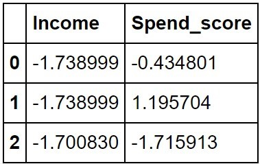
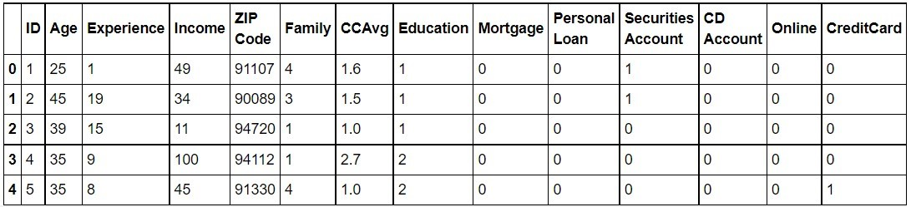

# Chapter 03: Unsupervised Learning and Customer Segmentation

## Mục tiêu học tập
Sau khi hoàn thành bài học này, học viên sẽ có thể:
- Hiểu rõ nhu cầu và tầm quan trọng của customer segmentation
- Nắm vững thuật toán K-means và ứng dụng trong phân khúc khách hàng
- Thực hiện phân tích thống kê mô tả và tổng hợp dữ liệu
- Sử dụng các công cụ Python để thực hiện segmentation
- Phân tích và diễn giải kết quả phân khúc khách hàng
- Áp dụng các kỹ thuật nâng cao trong customer segmentation

---

## Phần 1: Understanding the Need for Customer Segmentation

### 1.1 Customer Segmentation là gì?

Customer Segmentation (Phân khúc khách hàng) là quá trình chia nhóm khách hàng thành các phân khúc nhỏ hơn dựa trên các đặc điểm chung như:
- **Hành vi mua sắm** (frequency, monetary, recency)
- **Đặc điểm nhân khẩu học** (tuổi, giới tính, thu nhập)
- **Địa lý** (khu vực, thành phố)
- **Tâm lý** (sở thích, giá trị, thái độ)

### 1.2 Tại sao Customer Segmentation quan trọng?

**Lợi ích cho doanh nghiệp:**
1. **Cá nhân hóa marketing**: Tạo chiến dịch phù hợp với từng nhóm khách hàng
2. **Tối ưu hóa sản phẩm**: Phát triển sản phẩm đáp ứng nhu cầu cụ thể
3. **Tăng ROI**: Tập trung nguồn lực vào các khách hàng có giá trị cao
4. **Giảm churn rate**: Xác định khách hàng có nguy cơ rời bỏ
5. **Pricing strategy**: Định giá phù hợp cho từng phân khúc

**Ví dụ thực tế:**
- **Netflix**: Phân khúc người dùng dựa trên thể loại phim yêu thích
- **Amazon**: Gợi ý sản phẩm dựa trên lịch sử mua hàng
- **Spotify**: Tạo playlist cá nhân hóa

### 1.3 Các phương pháp Segmentation truyền thống vs Machine Learning

**Phương pháp truyền thống:**
- Dựa trên kinh nghiệm và trực giác
- Phân chia theo các tiêu chí đơn giản (tuổi, giới tính)
- Hạn chế về khả năng xử lý dữ liệu lớn

**Phương pháp Machine Learning:**
- Tự động phát hiện pattern trong dữ liệu
- Xử lý được nhiều chiều dữ liệu
- Khách quan và dựa trên dữ liệu
- Có thể cập nhật tự động khi có dữ liệu mới

---

## Phần 2: Machine Learning Approach to Segmentation

### 2.1 Unsupervised Learning trong Customer Segmentation

**Định nghĩa**: Unsupervised Learning là phương pháp machine learning không cần nhãn (label) để huấn luyện mô hình.

**Đặc điểm:**
- Không có "đáp án đúng" trước
- Mục tiêu: Tìm ra cấu trúc ẩn trong dữ liệu
- Các thuật toán chính: Clustering, Association Rules, Dimensionality Reduction

### 2.2 Clustering và ứng dụng

**Clustering** là quá trình nhóm các điểm dữ liệu tương tự nhau vào cùng một cụm (cluster).

**Các thuật toán Clustering phổ biến:**
1. **K-Means**: Phân chia dữ liệu thành K cụm
2. **Hierarchical Clustering**: Tạo cây phân cấp các cụm
3. **DBSCAN**: Phát hiện cụm có mật độ cao
4. **Gaussian Mixture Model**: Mô hình hỗn hợp Gaussian

### 2.3 Tại sao chọn K-Means cho Customer Segmentation?

**Ưu điểm:**
- Đơn giản, dễ hiểu và implement
- Hiệu quả với dữ liệu lớn
- Kết quả ổn định và có thể tái lập
- Phù hợp với dữ liệu khách hàng thường có dạng spherical clusters

**Nhược điểm:**
- Cần xác định trước số cụm K
- Nhạy cảm với outliers
- Chỉ tìm được cụm hình tròn

---

## Phần 3: K-Means Clustering Algorithm

### 3.1 Thuật toán K-Means

**Các bước thực hiện:**
1. **Khởi tạo**: Chọn K centroids ngẫu nhiên
2. **Assignment**: Gán mỗi điểm dữ liệu vào cụm có centroid gần nhất
3. **Update**: Cập nhật centroid = trung bình của các điểm trong cụm
4. **Repeat**: Lặp lại bước 2-3 cho đến khi hội tụ

### 3.2 Code Implementation cơ bản

```python
import numpy as np
import pandas as pd
import matplotlib.pyplot as plt
import seaborn as sns
from sklearn.cluster import KMeans
from sklearn.preprocessing import StandardScaler
from sklearn.metrics import silhouette_score
import warnings
warnings.filterwarnings('ignore')

# Thiết lập style cho plots
plt.style.use('seaborn-v0_8')
sns.set_palette("husl")

class CustomerSegmentation:
    def __init__(self, data):
        """
        Khởi tạo class CustomerSegmentation
        
        Parameters:
        data: DataFrame chứa dữ liệu khách hàng
        """
        self.data = data
        self.scaled_data = None
        self.kmeans = None
        self.labels = None
        
    def preprocess_data(self, features):
        """
        Tiền xử lý dữ liệu: standardization
        
        Parameters:
        features: list tên các cột để sử dụng cho clustering
        """
        # Chọn features
        self.features = features
        self.feature_data = self.data[features].copy()
        
        # Standardization
        self.scaler = StandardScaler()
        self.scaled_data = self.scaler.fit_transform(self.feature_data)
        
        print("Dữ liệu đã được chuẩn hóa!")
        print(f"Shape: {self.scaled_data.shape}")
        
    def find_optimal_k(self, k_range=range(2, 11)):
        """
        Tìm số cụm tối ưu bằng Elbow Method và Silhouette Score
        """
        inertias = []
        silhouette_scores = []
        
        for k in k_range:
            kmeans = KMeans(n_clusters=k, random_state=42, n_init=10)
            kmeans.fit(self.scaled_data)
            
            inertias.append(kmeans.inertia_)
            silhouette_scores.append(silhouette_score(self.scaled_data, kmeans.labels_))
        
        # Vẽ biểu đồ
        fig, (ax1, ax2) = plt.subplots(1, 2, figsize=(15, 5))
        
        # Elbow Method
        ax1.plot(k_range, inertias, marker='o', linewidth=2, markersize=8)
        ax1.set_title('Elbow Method', fontsize=14, fontweight='bold')
        ax1.set_xlabel('Số cụm (K)')
        ax1.set_ylabel('Inertia')
        ax1.grid(True, alpha=0.3)
        
        # Silhouette Score
        ax2.plot(k_range, silhouette_scores, marker='s', color='orange', linewidth=2, markersize=8)
        ax2.set_title('Silhouette Score', fontsize=14, fontweight='bold')
        ax2.set_xlabel('Số cụm (K)')
        ax2.set_ylabel('Silhouette Score')
        ax2.grid(True, alpha=0.3)
        
        plt.tight_layout()
        plt.show()
        
        # Tìm K tối ưu
        optimal_k_silhouette = k_range[np.argmax(silhouette_scores)]
        print(f"K tối ưu theo Silhouette Score: {optimal_k_silhouette}")
        
        return inertias, silhouette_scores
    
    def perform_clustering(self, n_clusters):
        """
        Thực hiện K-means clustering
        """
        self.kmeans = KMeans(n_clusters=n_clusters, random_state=42, n_init=10)
        self.labels = self.kmeans.fit_predict(self.scaled_data)
        
        # Thêm labels vào data gốc
        self.data['Cluster'] = self.labels
        
        print(f"Đã phân chia thành {n_clusters} cụm!")
        print(f"Silhouette Score: {silhouette_score(self.scaled_data, self.labels):.3f}")
```

### 3.3 Xác định số cụm tối ưu

**Phương pháp 1: Elbow Method**
```python
def elbow_method_explanation():
    """
    Giải thích Elbow Method
    """
    print("""
    ELBOW METHOD:
    
    1. Tính WCSS (Within-Cluster Sum of Squares) cho các giá trị K khác nhau
    2. Vẽ biểu đồ WCSS theo K
    3. Tìm điểm "gãy" (elbow) - nơi WCSS giảm chậm lại
    4. Điểm elbow chính là K tối ưu
    
    Công thức WCSS: Σ(distance từ điểm đến centroid)²
    """)
```

**Phương pháp 2: Silhouette Score**
```python
def silhouette_explanation():
    """
    Giải thích Silhouette Score
    """
    print("""
    SILHOUETTE SCORE:
    
    1. Đo lường độ tương tự của một điểm với cụm của nó
    2. So sánh với các cụm khác
    3. Giá trị từ -1 đến 1:
       - Gần 1: Phân cụm tốt
       - Gần 0: Điểm nằm trên biên giới
       - Âm: Có thể bị phân sai cụm
       
    Công thức: s = (b - a) / max(a, b)
    Trong đó:
    - a: Khoảng cách trung bình đến các điểm trong cùng cụm
    - b: Khoảng cách trung bình đến cụm gần nhất
    """)
```

---

## Phần 4: Summary and Descriptive Statistics

### 4.1 Các hàm thống kê cơ bản

```python
def explore_data(df):
    """
    Khám phá dữ liệu cơ bản
    """
    print("=" * 50)
    print("THÔNG TIN CƠ BẢN VỀ DỮ LIỆU")
    print("=" * 50)
    
    print(f"1. Kích thước dữ liệu: {df.shape}")
    print(f"2. Số lượng missing values:")
    print(df.isnull().sum())
    
    print(f"\n3. Kiểu dữ liệu:")
    print(df.dtypes)
    
    print(f"\n4. Thống kê mô tả:")
    print(df.describe())

def analyze_clusters(df, features):
    """
    Phân tích chi tiết các cụm
    """
    print("=" * 50)
    print("PHÂN TÍCH CÁC CỤM KHÁCH HÀNG")
    print("=" * 50)
    
    # 1. Kích thước các cụm
    cluster_sizes = df['Cluster'].value_counts().sort_index()
    print("1. Kích thước các cụm:")
    for cluster, size in cluster_sizes.items():
        percentage = (size / len(df)) * 100
        print(f"   Cụm {cluster}: {size} khách hàng ({percentage:.1f}%)")
    
    # 2. Thống kê theo cụm
    print("\n2. Thống kê trung bình theo cụm:")
    cluster_stats = df.groupby('Cluster')[features].mean()
    print(cluster_stats.round(2))
    
    # 3. Đặc điểm nổi bật của từng cụm
    print("\n3. Đặc điểm nổi bật:")
    for cluster in sorted(df['Cluster'].unique()):
        cluster_data = df[df['Cluster'] == cluster][features]
        print(f"\n   Cụm {cluster}:")
        for feature in features:
            mean_val = cluster_data[feature].mean()
            overall_mean = df[feature].mean()
            if mean_val > overall_mean * 1.2:
                print(f"     - {feature}: CAO ({mean_val:.2f} vs {overall_mean:.2f})")
            elif mean_val < overall_mean * 0.8:
                print(f"     - {feature}: THẤP ({mean_val:.2f} vs {overall_mean:.2f})")
            else:
                print(f"     - {feature}: TRUNG BÌNH ({mean_val:.2f})")

def advanced_statistics(df, features):
    """
    Thống kê nâng cao
    """
    print("=" * 50)
    print("THỐNG KÊ NÂNG CAO")
    print("=" * 50)
    
    # Correlation matrix
    print("1. Ma trận tương quan:")
    corr_matrix = df[features].corr()
    print(corr_matrix.round(3))
    
    # Phân phối dữ liệu
    print("\n2. Thông tin phân phối:")
    for feature in features:
        skewness = df[feature].skew()
        kurtosis = df[feature].kurtosis()
        print(f"   {feature}:")
        print(f"     - Skewness: {skewness:.3f}")
        print(f"     - Kurtosis: {kurtosis:.3f}")
```

### 4.2 Visualization Functions

```python
def plot_cluster_analysis(df, features):
    """
    Vẽ biểu đồ phân tích cụm
    """
    n_features = len(features)
    n_clusters = df['Cluster'].nunique()
    
    # 1. Distribution plots
    fig, axes = plt.subplots(2, 2, figsize=(15, 12))
    axes = axes.ravel()
    
    for i, feature in enumerate(features[:4]):  # Chỉ vẽ 4 features đầu
        for cluster in range(n_clusters):
            cluster_data = df[df['Cluster'] == cluster][feature]
            axes[i].hist(cluster_data, alpha=0.6, label=f'Cluster {cluster}', bins=20)
        
        axes[i].set_title(f'Phân phối {feature} theo cụm')
        axes[i].set_xlabel(feature)
        axes[i].set_ylabel('Tần suất')
        axes[i].legend()
        axes[i].grid(True, alpha=0.3)
    
    plt.tight_layout()
    plt.show()
    
    # 2. Box plots
    fig, axes = plt.subplots(1, len(features), figsize=(5*len(features), 6))
    if len(features) == 1:
        axes = [axes]
    
    for i, feature in enumerate(features):
        df.boxplot(column=feature, by='Cluster', ax=axes[i])
        axes[i].set_title(f'Box Plot: {feature}')
        axes[i].set_xlabel('Cluster')
        axes[i].set_ylabel(feature)
    
    plt.tight_layout()
    plt.show()
    
    # 3. Scatter plots (nếu có ít nhất 2 features)
    if len(features) >= 2:
        plt.figure(figsize=(12, 8))
        colors = ['red', 'blue', 'green', 'orange', 'purple', 'brown']
        
        for cluster in range(n_clusters):
            cluster_data = df[df['Cluster'] == cluster]
            plt.scatter(cluster_data[features[0]], cluster_data[features[1]], 
                       c=colors[cluster % len(colors)], label=f'Cluster {cluster}', alpha=0.7)
        
        plt.xlabel(features[0])
        plt.ylabel(features[1])
        plt.title(f'Scatter Plot: {features[0]} vs {features[1]}')
        plt.legend()
        plt.grid(True, alpha=0.3)
        plt.show()

def create_cluster_profiles(df, features):
    """
    Tạo hồ sơ chi tiết cho từng cụm
    """
    cluster_profiles = {}
    
    for cluster in sorted(df['Cluster'].unique()):
        cluster_data = df[df['Cluster'] == cluster]
        profile = {
            'size': len(cluster_data),
            'percentage': len(cluster_data) / len(df) * 100,
            'characteristics': {}
        }
        
        for feature in features:
            profile['characteristics'][feature] = {
                'mean': cluster_data[feature].mean(),
                'median': cluster_data[feature].median(),
                'std': cluster_data[feature].std(),
                'min': cluster_data[feature].min(),
                'max': cluster_data[feature].max()
            }
        
        cluster_profiles[f'Cluster_{cluster}'] = profile
    
    return cluster_profiles
```

---

## Phần 5: Thực hành với dữ liệu thực tế

### 5.1 Tạo dữ liệu mẫu

```python
def create_sample_data():
    """
    Tạo dữ liệu khách hàng mẫu
    """
    np.random.seed(42)
    n_customers = 1000
    
    # Tạo các nhóm khách hàng khác nhau
    data = []
    
    # Nhóm 1: Khách hàng VIP (20%)
    n_vip = int(n_customers * 0.2)
    vip_data = {
        'CustomerID': range(1, n_vip + 1),
        'Annual_Income': np.random.normal(80000, 15000, n_vip),
        'Spending_Score': np.random.normal(80, 10, n_vip),
        'Age': np.random.normal(40, 8, n_vip),
        'Purchase_Frequency': np.random.normal(15, 3, n_vip)
    }
    
    # Nhóm 2: Khách hàng trung bình (50%)
    n_avg = int(n_customers * 0.5)
    avg_data = {
        'CustomerID': range(n_vip + 1, n_vip + n_avg + 1),
        'Annual_Income': np.random.normal(50000, 12000, n_avg),
        'Spending_Score': np.random.normal(50, 15, n_avg),
        'Age': np.random.normal(35, 10, n_avg),
        'Purchase_Frequency': np.random.normal(8, 2, n_avg)
    }
    
    # Nhóm 3: Khách hàng ít mua sắm (30%)
    n_low = n_customers - n_vip - n_avg
    low_data = {
        'CustomerID': range(n_vip + n_avg + 1, n_customers + 1),
        'Annual_Income': np.random.normal(30000, 8000, n_low),
        'Spending_Score': np.random.normal(25, 8, n_low),
        'Age': np.random.normal(45, 12, n_low),
        'Purchase_Frequency': np.random.normal(3, 1, n_low)
    }
    
    # Kết hợp dữ liệu
    df = pd.DataFrame({
        'CustomerID': list(vip_data['CustomerID']) + list(avg_data['CustomerID']) + list(low_data['CustomerID']),
        'Annual_Income': np.concatenate([vip_data['Annual_Income'], avg_data['Annual_Income'], low_data['Annual_Income']]),
        'Spending_Score': np.concatenate([vip_data['Spending_Score'], avg_data['Spending_Score'], low_data['Spending_Score']]),
        'Age': np.concatenate([vip_data['Age'], avg_data['Age'], low_data['Age']]),
        'Purchase_Frequency': np.concatenate([vip_data['Purchase_Frequency'], avg_data['Purchase_Frequency'], low_data['Purchase_Frequency']])
    })
    
    # Đảm bảo giá trị dương
    df['Annual_Income'] = np.abs(df['Annual_Income'])
    df['Spending_Score'] = np.clip(df['Spending_Score'], 1, 100)
    df['Age'] = np.clip(df['Age'], 18, 80)
    df['Purchase_Frequency'] = np.abs(df['Purchase_Frequency'])
    
    return df

# Tạo và khám phá dữ liệu
df = create_sample_data()
print("Dữ liệu mẫu đã được tạo!")
explore_data(df)
```

### 5.2 Quy trình hoàn chỉnh

```python
def complete_segmentation_workflow():
    """
    Quy trình hoàn chỉnh cho Customer Segmentation
    """
    # Bước 1: Tạo dữ liệu
    print("BƯỚC 1: TẠO DỮ LIỆU")
    df = create_sample_data()
    
    # Bước 2: Khám phá dữ liệu
    print("\nBƯỚC 2: KHÁM PHÁ DỮ LIỆU")
    explore_data(df)
    
    # Bước 3: Chuẩn bị features cho clustering
    print("\nBƯỚC 3: CHUẨN BỊ FEATURES")
    features = ['Annual_Income', 'Spending_Score', 'Age', 'Purchase_Frequency']
    
    # Bước 4: Khởi tạo và tiền xử lý
    print("\nBƯỚC 4: TIỀN XỬ LÝ")
    segmentation = CustomerSegmentation(df)
    segmentation.preprocess_data(features)
    
    # Bước 5: Tìm số cụm tối ưu
    print("\nBƯỚC 5: TÌM SỐ CỤM TỐI ƯU")
    segmentation.find_optimal_k()
    
    # Bước 6: Thực hiện clustering
    print("\nBƯỚC 6: THỰC HIỆN CLUSTERING")
    optimal_k = 3  # Dựa trên kết quả từ bước 5
    segmentation.perform_clustering(optimal_k)
    
    # Bước 7: Phân tích kết quả
    print("\nBƯỚC 7: PHÂN TÍCH KẾT QUẢ")
    analyze_clusters(segmentation.data, features)
    
    # Bước 8: Visualization
    print("\nBƯỚC 8: VISUALIZATION")
    plot_cluster_analysis(segmentation.data, features)
    
    # Bước 9: Tạo cluster profiles
    print("\nBƯỚC 9: TẠO CLUSTER PROFILES")
    profiles = create_cluster_profiles(segmentation.data, features)
    
    return segmentation, profiles

# Chạy quy trình hoàn chỉnh
segmentation_result, cluster_profiles = complete_segmentation_workflow()
```

---

## Phần 6: Các vấn đề nâng cao

### 6.1 Feature Engineering cho Customer Segmentation

```python
def create_rfm_features(df):
    """
    Tạo RFM features (Recency, Frequency, Monetary)
    """
    # Giả sử có dữ liệu transaction
    print("Tạo RFM Features:")
    print("- Recency: Số ngày từ lần mua cuối")
    print("- Frequency: Tần suất mua hàng")  
    print("- Monetary: Giá trị mua hàng")
    
    # Ví dụ code tạo RFM
    rfm_code = """
    # Tính Recency
    df['Recency'] = (datetime.now() - df['Last_Purchase_Date']).dt.days
    
    # Tính Frequency
    df['Frequency'] = df.groupby('CustomerID')['TransactionID'].transform('count')
    
    # Tính Monetary
    df['Monetary'] = df.groupby('CustomerID')['Amount'].transform('sum')
    """
    print(rfm_code)

def handle_categorical_features():
    """
    Xử lý categorical features
    """
    categorical_code = """
    from sklearn.preprocessing import LabelEncoder, OneHotEncoder
    
    # One-hot encoding
    df_encoded = pd.get_dummies(df, columns=['Gender', 'City'], prefix=['Gender', 'City'])
    
    # Label encoding
    le = LabelEncoder()
    df['Category_Encoded'] = le.fit_transform(df['Category'])
    """
    print("Xử lý Categorical Features:")
    print(categorical_code)

def dimensionality_reduction():
    """
    Giảm chiều dữ liệu với PCA
    """
    pca_code = """
    from sklearn.decomposition import PCA
    
    # Áp dụng PCA
    pca = PCA(n_components=0.95)  # Giữ 95% variance
    reduced_data = pca.fit_transform(scaled_data)
    
    # Xem explained variance ratio
    print("Explained variance ratio:", pca.explained_variance_ratio_)
    """
    print("Dimensionality Reduction với PCA:")
    print(pca_code)
```

### 6.2 Xử lý Outliers

```python
def detect_and_handle_outliers(df, features):
    """
    Phát hiện và xử lý outliers
    """
    print("PHÁT HIỆN VÀ XỬ LÝ OUTLIERS")
    print("=" * 40)
    
    outlier_indices = []
    
    for feature in features:
        Q1 = df[feature].quantile(0.25)
        Q3 = df[feature].quantile(0.75)
        IQR = Q3 - Q1
        
        lower_bound = Q1 - 1.5 * IQR
        upper_bound = Q3 + 1.5 * IQR
        
        feature_outliers = df[(df[feature] < lower_bound) | (df[feature] > upper_bound)].index
        outlier_indices.extend(feature_outliers)
        
        print(f"{feature}:")
        print(f"  - Lower bound: {lower_bound:.2f}")
        print(f"  - Upper bound: {upper_bound:.2f}")
        print(f"  - Số outliers: {len(feature_outliers)}")
    
    # Unique outliers
    unique_outliers = list(set(outlier_indices))
    print(f"\nTổng số outliers duy nhất: {len(unique_outliers)}")
    
    # Các phương pháp xử lý
    print("\nCác phương pháp xử lý outliers:")
    print("1. Loại bỏ outliers")
    print("2. Cap outliers (winsorizing)")
    print("3. Log transformation")
    print("4. Robust scaling")
    
    return unique_outliers

def robust_scaling_example():
    """
    Ví dụ về Robust Scaling
    """
    robust_code = """
    from sklearn.preprocessing import RobustScaler
    
    # Robust Scaler ít bị ảnh hưởng bởi outliers
    robust_scaler = RobustScaler()
    robust_scaled_data = robust_scaler.fit_transform(df[features])
    
    # So sánh với StandardScaler
    from sklearn.preprocessing import StandardScaler
    standard_scaler = StandardScaler()
    standard_scaled_data = standard_scaler.fit_transform(df[features])
    """
    print("Robust Scaling Example:")
    print(robust_code)

### 6.3 Model Validation và Stability

```python
def validate_clustering_stability(df, features, n_runs=10):
    """
    Kiểm tra tính ổn định của clustering
    """
    from sklearn.metrics import adjusted_rand_score
    
    print("KIỂM TRA TÍNH ỔN ĐỊNH CỦA CLUSTERING")
    print("=" * 45)
    
    # Chuẩn hóa dữ liệu
    scaler = StandardScaler()
    scaled_data = scaler.fit_transform(df[features])
    
    # Chạy K-means nhiều lần với random seeds khác nhau
    results = []
    base_labels = None
    
    for i in range(n_runs):
        kmeans = KMeans(n_clusters=3, random_state=i, n_init=10)
        labels = kmeans.fit_predict(scaled_data)
        
        if base_labels is None:
            base_labels = labels
        else:
            # Tính ARI với kết quả đầu tiên
            ari_score = adjusted_rand_score(base_labels, labels)
            results.append(ari_score)
    
    avg_ari = np.mean(results)
    std_ari = np.std(results)
    
    print(f"Adjusted Rand Index trung bình: {avg_ari:.3f}")
    print(f"Độ lệch chuẩn: {std_ari:.3f}")
    
    if avg_ari > 0.8:
        print("✓ Clustering rất ổn định")
    elif avg_ari > 0.6:
        print("⚠ Clustering khá ổn định")
    else:
        print("✗ Clustering không ổn định - cần điều chỉnh")
    
    return results
```

---

## Bài Tập Ứng Dụng

### Bài tập cơ bản
#### **Exercise 301: Mall Customer Segmentation – Understanding the Data**
You are a data scientist at a leading consulting company and among their newest clients is a popular chain of malls spread across many countries. The mall wishes to gain a better understanding of its customers to re-design their existing offerings and marketing communications to improve sales in a geographical area. The data about the customers is available in the **Mall_Customers.csv** file. 

**Code:**

```python
# 1.	Import numpy, pandas, and pyplot from matplotlib and seaborn using the following code:
import numpy as np, pandas as pd
import matplotlib.pyplot as plt, seaborn as sns %matplotlib inline

# 2.	Using the read_csv method from pandas, import the  
#    Mall_Customers.csv file into a pandas DataFrame named data0 and print the first five rows:
data0 = pd.read_csv("Mall_Customers.csv") data0.head()

# 3. Use the info method of the DataFrame to print information about it:
data0.info()

# 4. For convenience, rename the Annual Income (k$) and  Spending Score (1-100) columns to
#    Income and Spend_score respectively, and print the top five records using the following code:
data0.rename({'Annual Income (k$)':'Income', 'Spending Score (1-100)':'Spend_score'}, axis=1, inplace=True)
data0.head()

# 5. To get a high-level understanding of the customer data, print out the descriptive summary of
#    the numerical fields in the data using the DataFrame's describe method:
data0.describe()

```
#### **Exercise 302: Traditional Segmentation of Mall Customers**
The mall wants to segment its customers and plans to use the derived segments to improve its marketing campaigns. The business team has a belief that segmenting based on income levels is relevant for their offerings. You are asked to use a traditional, rule-based approach to define customer segments. 

In this exercise, you will perform your first customer segmentation using the income of the customer, employing a traditional rule-based approach to define customer segments. You will plot the distribution for the Income variable and assign groups to customers based on where you see the values lying: 

**Code:**

```python
# 1. Plot a histogram of the Income column using the DataFrame's plot method using the following code:
data0.Income.plot.hist(color='gray')
plt.xlabel('Income') plt.show()

# 2.	Create a new column, Cluster, to have the Low Income,  
#    Moderate Income, and High earners values for customers with incomes in the ranges < 50, 50–90,
#    and >= 90 respectively using the following code:
data0['Cluster'] = np.where(data0.Income >= 90, 'High earners',
                            np.where(data0.Income < 50, 'Low Income', 'Moderate Income'))

# 3.	To check the number of customers in each cluster and confirm whether the values for
#    the Income column in the clusters are in the correct range, get a descriptive summary of
#    Income for these groups using the following command:
data0.groupby('Cluster')['Income'].describe()

```

#### **Exercise 303: Standardizing Customer Data**
In this exercise, you will further our segmentation exercise by performing the important step of ensuring that all the variables get similar importance in the exercise, just as the business requires. You will standardize the mall customer data using z-scoring, employing **StandardScaler** from scikit-learn. Continue in the same notebook used for the exercises so far. Note that this exercise works on the modified data from _Exercise 3.02, Traditional Segmentation of Mall Customers_. Make sure you complete all the previous exercises before beginning this exercise:

**Code:**

```python
# 1.	Import the StandardScaler method from sklearn and create an instance of
#    StandardScaler using the following code:
from sklearn.preprocessing import StandardScaler
scaler = StandardScaler()

# 2.	Create a list named cols_to_scale to hold the names of the columns you wish to scale,
#    namely, Age, Income, and Spend_score. Also, make a copy of the DataFrame
#    (to retain original values) and name it data_scaled. You will be scaling columns on the copied dataset:
cols_to_scale = ['Age', 'Income', 'Spend_score']
data_scaled = data0.copy()

# 3.	Using the fit_transform method of the scaler, apply the transformation to the chosen columns:
data_scaled[cols_to_scale] = scaler.fit_transform(data0[cols_to_scale])

# 4.	To verify that this worked, print a descriptive summary of these modified columns:
data_scaled[cols_to_scale].describe() 
 
```
#### **Exercise 304: Calculating the Distance between Customers**
In this exercise, you will calculate the Euclidean distance between three customers. The goal of the exercise is to be able to calculate the similarity between customers. A similarity calculation is a key step in customer segmentation. After standardizing the Income and Spend_score fields for the first three customers as in the following table (Figure 3.14), you will calculate the distance using the cdist method from scipy.



**Code:**

```python
# 1. From the dataset (data_scaled created in Exercise 3.03, Standardizing Customer Data),
#    extract the top three records with the Income and Spend_score fields into
#    a dataset named cust3 and print the dataset, using the following code:
sel_cols = ['Income', 'Spend_score']
cust3 = data_scaled[sel_cols].head(3)
cust3

# 2.	Next, import the cdist method from scipy.spatial.distance using the following code: 
from scipy.spatial.distance import cdist
 
# 3.	The cdist function can be used to calculate the distance between
#    each pair of the two collections of inputs. To calculate the distance between
#    the customers in cust3, provide the cust3 dataset as both data inputs to cdist,
#    specifying euclidean as the metric, using the following code snippet:
cdist(cust3, cust3, metric='euclidean')

# Verify that 1.6305 is indeed the Euclidean distance between customer 1 and customer 2,
#    by manually calculating it using the following code:
np.sqrt((-1.739+1.739)**2 + (-0.4348-1.1957)**2)

```
#### **Exercise 305: K-Means Clustering on Mall Customers**
In this exercise, you will use machine learning to discover natural groups in the mall customers. You will perform k-means clustering on the mall customer data that was standardized in the previous exercise. You will use only the Income and  Spend_score columns. Continue using the same Jupyter notebook from the previous exercises. Perform clustering using the scikit-learn package and visualize the clusters: 

**Code:**

```python
# 1. Create a list called cluster_cols containing the Income and  
#    Spend_score columns, which will be used for clustering.
#    Print the first three rows of the dataset, limited to these columns
#    to ensure that you are filtering the data correctly:
cluster_cols = ['Income', 'Spend_score']
data_scaled[cluster_cols].head(3)

#2. Visualize the data using a scatter plot with Income and
#    Spend_score on the x and y axes respectively with the following code:
data_scaled.plot.scatter(x='Income', y='Spend_score', color='gray')
plt.show()

# 3.	Import KMeans from sklearn.cluster. Create an instance of
#    the KMeans model specifying 5 clusters (n_clusters) and 42 for random_state:
from sklearn.cluster import KMeans
model = KMeans(n_clusters=5, random_state=42)

# 4.	Next, fit the model on the data using the columns in cluster_cols for the purpose.
#    Using the predict method of the k-means model, assign the cluster for
#    each customer to the 'Cluster' variable. Print the first three records of the data_scaled dataset:
model.fit(data_scaled[cluster_cols])
data_scaled['Cluster'] = model.predict(data_scaled[cluster_cols])
data_scaled.head(3)

# 5. Now you need to visualize it to see the points assigned to each cluster.
#    Plot each cluster with a marker using the following code.
#    You will subset the dataset for each cluster and use a dictionary to specify the marker for the cluster:
markers = ['x', '*', '.', '|', '_']
for clust in range(5):
     temp = data_scaled[data_scaled.Cluster == clust]
     plt.scatter(temp.Income, temp.Spend_score, marker=markers[clust], color = 'gray',
                label="Cluster "+str(clust))
plt.xlabel('Income')
plt.ylabel('Spend_score')
plt.legend()
plt.show()

```
#### **Activity 301: Bank Customer Segmentation for Loan Campaign**
Banks often have marketing campaigns for their individual products. Therabank is an established bank that offers personal loans as a product. Most of Therabank's customers have deposits, which is a liability for the bank and not profitable. Loans are profitable for the bank. Therefore, getting more customers to opt for a personal loan makes the equation more profitable. The task at hand is to create customer segments to maximize the effectiveness of their personal loan campaign. 
The bank has data for customers including demographics, some financial information, and how these customers responded to a previous campaign (see Figure 3.21). Some key columns are described here:
•	Experience: The work experience of the customer in years
•	Income: The estimated annual income of the customer (thousands of US dollars)
•	CCAvg: The average spending on credit cards per month (thousands of US dollars)
•	Mortgage: The value of the customer's house mortgage (if any)
•	Age: The age (in years) of the customer



Your goal is to create customer segments for the marketing campaign. You will also identify which of these segments have the highest propensity to respond to the campaign – information that will greatly help optimize future campaigns.
Note that while the previous campaign's response is available to you, if you use it as a criterion/feature for segmentation, you will not be able to segment other customers for whom the previous campaign was never run, thereby severely limiting the number of customers you can target. You will, therefore, exclude the feature (previous campaign response) for clustering, but you can use it to evaluate how your clusters overall would respond to the campaign. Execute the following steps in a fresh Jupyter notebook to complete the activity:

#### **Exercise 306: Dealing with High-Dimensional Data**
In this exercise, you will use machine learning to discover natural groups in the mall customers. You will perform k-means clustering on the mall customer data that was standardized in the previous exercise. You will use only the Income and  Spend_score columns. Continue using the same Jupyter notebook from the previous exercises. Perform clustering using the scikit-learn package and visualize the clusters: 

1.	Import the necessary libraries for data processing, visualization, and clustering.
2.	Load the data into a pandas DataFrame and display the top five rows. Using the info method, get an understanding of the columns and their types.
3.	Perform standard scaling on the Income and CCAvg columns to create new Income_scaled and CCAvg_scaled columns. You will be using these two variables for customer segmentation. Get a descriptive summary of the processed columns to verify that the scaling has been applied correctly.
4.	Perform k-means clustering, specifying 3 clusters using Income and CCAvg as the features. Specify random_state as 42 (an arbitrary choice) to ensure the consistency of the results. Create a new column, Cluster, containing the predicted cluster from the model.
5.	Visualize the clusters by using different markers for the clusters on a scatter plot between Income and CCAvg. The output should be as follows:


6.	To understand the clusters, print the average values of Income and CCAvg for the three clusters. 
7.	Perform a visual comparison of the clusters using the standardized values for Income and CCAvg. You should get the following plot:


8.	To understand the clusters better using other relevant features, print the average values against the clusters for the Age, Mortgage, Family, CreditCard, Online, and Personal Loan features. Check which cluster has the highest propensity for taking a personal loan.
9.	Based on your understanding of the clusters, assign descriptive labels to the clusters.

#### **Exercise 3.06: Dealing with High-Dimensional Data**
In this exercise, you will perform clustering on the mall customers dataset using the age, income, and spend score. The goal is to find natural clusters in the data based on these three criteria and analyze the customer segments to identify their differentiating characteristics, providing the business with some valuable insight into the nature of its customers. This time though, visualization will not be easy. You will need to use PCA to reduce the data to two dimensions to visualize the clusters: 

**Code:**

```python
# 1. Create a list, cluster_cols, containing the Age, Income, and Spend_score columns,
#    which will be used for clustering. Print the first three rows of the dataset for these columns:
cluster_cols = ['Age', 'Income', 'Spend_score']
data_scaled[cluster_cols].head(3)

# 2.	Perform k-means clustering, specifying 4 clusters using the scaled features. 
#    Specify random_state as 42. Assign the clusters to the Cluster column:
model = KMeans(n_clusters=4, random_state=42)
model.fit(data_scaled[cluster_cols])
data_scaled['Cluster'] = model.predict(data_scaled[cluster_cols])

# 3.	Using PCA on the scaled columns, create two new columns, pc1 and pc2,
#   containing the data for PC1 and PC2 respectively:
from sklearn import decomposition

pca = decomposition.PCA(n_components=2)
pca_res = pca.fit_transform(data_scaled[cluster_cols])

data_scaled['pc1'] = pca_res[:,0]
data_scaled['pc2'] = pca_res[:,1]

# 4.	Visualize the clusters by using different markers and colors for
#    the clusters on a scatter plot between pc1 and pc2 using the following code:
markers = ['x', '*', 'o','|']
for clust in range(4):
     temp = data_scaled[data_scaled.Cluster == clust]
     plt.scatter(temp.pc1, temp.pc2, marker=markers[clust], label="Cluster "+str(clust), color='gray')
 plt.xlabel('PC1')
plt.ylabel('PC2')
plt.show()

# 5. To understand the clusters, print the average values of
#    the original features used for clustering against the four clusters:
data0['Cluster'] = data_scaled.Cluster
data0.groupby('Cluster')[['Age', 'Income', 'Spend_score']].mean()

# 6. Next, visualize this information using bar plots.
#    Check which features are the most differentiated for the clusters using the following code:
data0.groupby('Cluster')[['Age', 'Income', 'Spend_score']].mean().plot.bar(
color=['lightgray', 'darkgray', 'black'])

plt.show()

# 7. Based on your understanding of the clusters, assign descriptive labels to the clusters.
#    One way to describe the clusters is as follows: 
#    Cluster 0: Middle-aged penny pinchers (high income, low spend)
#    Cluster 1: Young high rollers (younger age, high income, high spend)
#    Cluster 2: Young aspirers (low income, high spend)
#    Cluster 3: Old average Joes (average income, average spend)

```
#### **Activity 302: Bank Customer Segmentation with Multiple**
In this activity, you will be revisiting the Therabank problem statement. You'll need to create customer segments to maximize the effectiveness of their personal loan campaign. You will accomplish this by finding the natural customer types in the data and discovering the features that differentiate them. Then, you'll identify the customer segments that have the highest propensity to take a loan. 
In Activity 3.01, Bank Customer Segmentation for Loan Campaign, you employed just two features of the customer. In this activity, you will employ additional features, namely, Age, Experience, and Mortgage. As you are dealing with high-dimensional data, you will use PCA for visualizing the clusters. You will understand the customer segments obtained and provide them with business-friendly labels. As a part of your evaluation and understanding of the segments, you will also check the historical response rates for the obtained segments. 

_Execute the following steps to complete the activity:_
1.	Create a copy of the dataset named bank_scaled, and perform standard scaling of the Income, CCAvg, Age, Experience, and Mortgage columns.
2.	Get a descriptive summary of the processed columns to verify that the scaling has been applied correctly.
3.	Perform k-means clustering, specifying 3 clusters using the scaled features. Specify random_state as 42.
4.	Using PCA on the scaled columns, create two new columns, pc1 and pc2, containing the data for PC1 and PC2 respectively.
5.	Visualize the clusters by using different markers for the clusters on a scatter plot between pc1 and pc2. The plot should appear as in the following figure: 
 


6.	To understand the clusters, print the average values of the features used for clustering against the three clusters. Check which features are the most differentiated for the clusters.
7.	To understand the clusters better using other relevant features, print the average values against the clusters for the Age, Mortgage, Family, CreditCard, Online, and Personal Loan features and check which cluster has the highest propensity for taking a personal loan.
8.	Based on your understanding of the clusters, assign descriptive labels to the clusters.

---

## Hướng dẫn chấm điểm và đánh giá

### Rubric cho các bài tập:

**Bài Tập 1 (Cơ bản)**:
- Code functionality (40%)
- Data analysis quality (30%) 
- Business insights (20%)
- Presentation (10%)

**Bài Tập 2 (Trung bình)**:
- Technical implementation (35%)
- RFM analysis depth (25%)
- Method comparison (20%) 
- Strategic recommendations (20%)

**Bài Tập 3 (Nâng cao)**:
- Advanced techniques usage (30%)
- Feature engineering creativity (25%)
- Business impact analysis (25%)
- Innovation and insights (20%)

### Tiêu chí đánh giá chung:
- **Xuất sắc (90-100%)**: Vượt expectation, có insights độc đáo
- **Tốt (80-89%)**: Hoàn thành tốt tất cả requirements  
- **Khá (70-79%)**: Hoàn thành cơ bản với một số thiếu sót
- **Trung bình (60-69%)**: Hoàn thành một phần, thiếu insights
- **Yếu (<60%)**: Không hoàn thành được yêu cầu cơ bản

---

## Phần 7: Case Studies và Ứng dụng thực tế

### 7.1 Case Study: Netflix Customer Segmentation

```python
def netflix_case_study():
    """
    Case study: Netflix sử dụng clustering như thế nào
    """
    print("""
    NETFLIX CUSTOMER SEGMENTATION STRATEGY
    ====================================
    
    1. DATA SOURCES:
       - Viewing history và duration
       - Rating patterns
       - Search behavior
       - Device usage
       - Time-of-day preferences
       - Genre preferences
       
    2. SEGMENTATION APPROACH:
       - Collaborative filtering + K-means
       - Content-based clustering
       - Temporal pattern analysis
       - Demographic overlays
       
    3. BUSINESS APPLICATIONS:
       - Personalized recommendations
       - Content acquisition decisions
       - UI/UX personalization
       - Marketing campaign targeting
       
    4. RESULTS:
       - 80% of content watched comes from recommendations
       - Increased user engagement by 20%
       - Reduced churn rate by 15%
    """)

def implement_netflix_approach(df):
    """
    Mô phỏng approach của Netflix
    """
    # Tạo viewing patterns
    viewing_features = [
        'total_viewing_hours',
        'avg_session_duration', 
        'genre_diversity_score',
        'binge_watching_tendency',
        'prime_time_ratio',
        'weekend_viewing_ratio'
    ]
    
    clustering_code = """
    # Netflix-style clustering
    from sklearn.cluster import KMeans
    from sklearn.preprocessing import StandardScaler
    
    # Feature engineering for viewing patterns
    df['binge_score'] = df['avg_session_duration'] / df['content_length']
    df['diversity_score'] = df['unique_genres'] / df['total_content']
    df['loyalty_score'] = df['completion_rate'] * df['rating_frequency']
    
    # Multi-layer clustering
    # Layer 1: Behavioral segments
    behavioral_features = ['viewing_frequency', 'session_duration', 'content_diversity']
    behavioral_clusters = KMeans(n_clusters=5).fit_predict(df[behavioral_features])
    
    # Layer 2: Content preference segments  
    content_features = ['action_pref', 'comedy_pref', 'drama_pref', 'documentary_pref']
    content_clusters = KMeans(n_clusters=8).fit_predict(df[content_features])
    
    # Combine segments
    df['behavioral_segment'] = behavioral_clusters
    df['content_segment'] = content_clusters
    df['combined_segment'] = df['behavioral_segment'].astype(str) + '_' + df['content_segment'].astype(str)
    """
    
    print("Netflix-style Implementation:")
    print(clustering_code)
```

### 7.2 Case Study: Amazon Customer Segmentation

```python
def amazon_case_study():
    """
    Case study: Amazon's segmentation for personalization
    """
    print("""
    AMAZON CUSTOMER SEGMENTATION STRATEGY
    ===================================
    
    1. MULTI-DIMENSIONAL APPROACH:
       - Purchase history clustering
       - Browsing behavior analysis
       - Price sensitivity segments
       - Category affinity groups
       - Geographic preferences
       - Seasonal shopping patterns
    
    2. REAL-TIME SEGMENTATION:
       - Session-based clustering
       - Dynamic segment updates
       - Contextual recommendations
       - Cross-device tracking
    
    3. BUSINESS IMPACT:
       - "People who bought X also bought Y"
       - Dynamic pricing strategies
       - Inventory optimization
       - Supply chain efficiency
       
    4. ADVANCED TECHNIQUES:
       - Deep learning embeddings
       - Graph-based clustering
       - Multi-armed bandit algorithms
       - Reinforcement learning
    """)

def amazon_recommendation_system():
    """
    Mô phỏng Amazon recommendation approach
    """
    recommendation_code = """
    # Amazon-style recommendation clustering
    import numpy as np
    from sklearn.metrics.pairwise import cosine_similarity
    from sklearn.cluster import KMeans
    
    def create_user_item_matrix(df):
        '''Tạo user-item matrix từ purchase history'''
        user_item_matrix = df.pivot_table(
            index='CustomerID', 
            columns='ProductID', 
            values='Rating',
            fill_value=0
        )
        return user_item_matrix
    
    def collaborative_filtering_clusters(user_item_matrix, n_clusters=10):
        '''Clustering users dựa trên collaborative filtering'''
        # Tính user similarity
        user_similarity = cosine_similarity(user_item_matrix)
        
        # K-means trên similarity matrix
        kmeans = KMeans(n_clusters=n_clusters, random_state=42)
        user_clusters = kmeans.fit_predict(user_similarity)
        
        return user_clusters
    
    def content_based_clusters(df, n_clusters=15):
        '''Clustering sản phẩm dựa trên content'''
        product_features = ['category', 'price_range', 'brand', 'rating']
        # Feature encoding và clustering
        encoded_features = pd.get_dummies(df[product_features])
        
        kmeans = KMeans(n_clusters=n_clusters, random_state=42)
        product_clusters = kmeans.fit_predict(encoded_features)
        
        return product_clusters
    """
    print("Amazon Recommendation System:")
    print(recommendation_code)
```

### 7.3 Evaluation Metrics nâng cao

```python
def advanced_evaluation_metrics():
    """
    Các metrics nâng cao để đánh giá clustering
    """
    evaluation_code = """
    from sklearn.metrics import (
        silhouette_score, 
        calinski_harabasz_score,
        davies_bouldin_score,
        adjusted_rand_score,
        normalized_mutual_info_score
    )
    
    def comprehensive_evaluation(X, labels, true_labels=None):
        '''Đánh giá toàn diện clustering results'''
        
        results = {}
        
        # Internal validation metrics
        results['silhouette_score'] = silhouette_score(X, labels)
        results['calinski_harabasz'] = calinski_harabasz_score(X, labels)  
        results['davies_bouldin'] = davies_bouldin_score(X, labels)
        
        # External validation (nếu có true labels)
        if true_labels is not None:
            results['adjusted_rand_score'] = adjusted_rand_score(true_labels, labels)
            results['normalized_mutual_info'] = normalized_mutual_info_score(true_labels, labels)
        
        # Business metrics
        results['cluster_sizes'] = np.bincount(labels)
        results['cluster_balance'] = np.std(results['cluster_sizes']) / np.mean(results['cluster_sizes'])
        
        return results
    
    def stability_analysis(X, n_runs=20, n_clusters=5):
        '''Phân tích tính ổn định của clustering'''
        stability_scores = []
        base_labels = KMeans(n_clusters=n_clusters, random_state=0).fit_predict(X)
        
        for i in range(1, n_runs):
            labels = KMeans(n_clusters=n_clusters, random_state=i).fit_predict(X)
            stability = adjusted_rand_score(base_labels, labels)
            stability_scores.append(stability)
        
        return {
            'mean_stability': np.mean(stability_scores),
            'std_stability': np.std(stability_scores),
            'min_stability': np.min(stability_scores),
            'max_stability': np.max(stability_scores)
        }
    """
    print("Advanced Evaluation Metrics:")
    print(evaluation_code)
```

---

## Phần 8: Tools và Technologies

### 8.1 Production-Ready Implementation

```python
def production_clustering_pipeline():
    """
    Pipeline clustering cho production environment
    """
    pipeline_code = """
    from sklearn.pipeline import Pipeline
    from sklearn.preprocessing import StandardScaler
    from sklearn.cluster import KMeans
    from sklearn.model_selection import GridSearchCV
    import joblib
    import logging
    
    class ProductionClusteringPipeline:
        def __init__(self, config):
            self.config = config
            self.pipeline = None
            self.logger = self._setup_logging()
        
        def _setup_logging(self):
            logging.basicConfig(level=logging.INFO)
            return logging.getLogger(__name__)
        
        def create_pipeline(self):
            '''Tạo sklearn pipeline'''
            self.pipeline = Pipeline([
                ('scaler', StandardScaler()),
                ('clusterer', KMeans(random_state=42))
            ])
            return self.pipeline
        
        def hyperparameter_tuning(self, X, param_grid):
            '''Hyperparameter tuning với cross-validation'''
            grid_search = GridSearchCV(
                self.pipeline, 
                param_grid,
                cv=5,
                scoring='silhouette',
                n_jobs=-1
            )
            grid_search.fit(X)
            
            self.logger.info(f"Best parameters: {grid_search.best_params_}")
            self.logger.info(f"Best score: {grid_search.best_score_}")
            
            return grid_search.best_estimator_
        
        def fit_predict(self, X):
            '''Fit model và predict clusters'''
            try:
                labels = self.pipeline.fit_predict(X)
                self.logger.info(f"Clustering completed. Found {len(np.unique(labels))} clusters")
                return labels
            except Exception as e:
                self.logger.error(f"Clustering failed: {str(e)}")
                raise
        
        def save_model(self, filepath):
            '''Lưu model'''
            joblib.dump(self.pipeline, filepath)
            self.logger.info(f"Model saved to {filepath}")
        
        def load_model(self, filepath):
            '''Load model'''
            self.pipeline = joblib.load(filepath)
            self.logger.info(f"Model loaded from {filepath}")
            
        def predict_new_data(self, X_new):
            '''Predict clusters cho dữ liệu mới'''
            return self.pipeline.predict(X_new)
    
    # Usage example
    config = {'n_clusters': 5, 'random_state': 42}
    clustering_pipeline = ProductionClusteringPipeline(config)
    pipeline = clustering_pipeline.create_pipeline()
    
    param_grid = {
        'clusterer__n_clusters': [3, 4, 5, 6, 7],
        'clusterer__init': ['k-means++', 'random'],
        'clusterer__max_iter': [100, 300, 500]
    }
    """
    print("Production-Ready Clustering Pipeline:")
    print(pipeline_code)

def monitoring_and_alerting():
    """
    Monitoring system cho clustering models
    """
    monitoring_code = """
    import pandas as pd
    import numpy as np
    from datetime import datetime, timedelta
    import smtplib
    from email.mime.text import MIMEText
    
    class ClusteringMonitor:
        def __init__(self, model, baseline_metrics):
            self.model = model
            self.baseline_metrics = baseline_metrics
            self.alert_thresholds = {
                'silhouette_degradation': 0.1,
                'cluster_size_imbalance': 0.5,
                'data_drift': 0.2
            }
        
        def check_model_performance(self, X_new):
            '''Kiểm tra performance của model trên dữ liệu mới'''
            labels = self.model.predict(X_new)
            current_silhouette = silhouette_score(X_new, labels)
            
            performance_degradation = (
                self.baseline_metrics['silhouette_score'] - current_silhouette
            )
            
            if performance_degradation > self.alert_thresholds['silhouette_degradation']:
                self._send_alert(
                    f"Model performance degraded by {performance_degradation:.3f}"
                )
            
            return {
                'current_silhouette': current_silhouette,
                'performance_degradation': performance_degradation,
                'status': 'degraded' if performance_degradation > 0.1 else 'stable'
            }
        
        def detect_data_drift(self, X_baseline, X_new):
            '''Phát hiện data drift'''
            # Statistical tests for each feature
            from scipy.stats import ks_2samp
            
            drift_scores = []
            for i in range(X_baseline.shape[1]):
                statistic, p_value = ks_2samp(X_baseline[:, i], X_new[:, i])
                drift_scores.append(p_value)
            
            avg_drift = np.mean(drift_scores)
            
            if avg_drift < self.alert_thresholds['data_drift']:
                self._send_alert(f"Data drift detected. Average p-value: {avg_drift:.3f}")
            
            return {
                'drift_scores': drift_scores,
                'average_drift': avg_drift,
                'drift_detected': avg_drift < 0.2
            }
        
        def _send_alert(self, message):
            '''Gửi alert notification'''
            print(f"ALERT: {message}")
            # Implement email/Slack notification logic here
    """
    print("Monitoring and Alerting System:")
    print(monitoring_code)
```

### 8.2 Big Data Implementation

```python
def spark_clustering_example():
    """
    Clustering với Apache Spark cho big data
    """
    spark_code = """
    from pyspark.sql import SparkSession
    from pyspark.ml.clustering import KMeans
    from pyspark.ml.feature import VectorAssembler, StandardScaler
    from pyspark.ml import Pipeline
    from pyspark.ml.evaluation import ClusteringEvaluator
    
    # Initialize Spark
    spark = SparkSession.builder \
        .appName("CustomerSegmentation") \
        .config("spark.executor.memory", "4g") \
        .config("spark.driver.memory", "2g") \
        .getOrCreate()
    
    def spark_clustering_pipeline(df, feature_cols, k_range=[2, 3, 4, 5, 6]):
        '''Spark clustering pipeline'''
        
        # Feature preparation
        assembler = VectorAssembler(
            inputCols=feature_cols,
            outputCol="features_raw"
        )
        
        scaler = StandardScaler(
            inputCol="features_raw",
            outputCol="features",
            withStd=True,
            withMean=True
        )
        
        # Find optimal K
        evaluator = ClusteringEvaluator()
        best_k = 3
        best_score = -1
        
        for k in k_range:
            kmeans = KMeans(featuresCol="features", k=k, seed=42)
            
            pipeline = Pipeline(stages=[assembler, scaler, kmeans])
            model = pipeline.fit(df)
            
            predictions = model.transform(df)
            score = evaluator.evaluate(predictions)
            
            print(f"K={k}, Silhouette Score={score:.3f}")
            
            if score > best_score:
                best_score = score
                best_k = k
        
        # Final model with best K
        final_kmeans = KMeans(featuresCol="features", k=best_k, seed=42)
        final_pipeline = Pipeline(stages=[assembler, scaler, final_kmeans])
        final_model = final_pipeline.fit(df)
        
        return final_model, best_k, best_score
    
    # Usage
    # df_spark = spark.read.csv("customer_data.csv", header=True, inferSchema=True)
    # feature_columns = ["Annual_Income", "Spending_Score", "Age"]
    # model, best_k, score = spark_clustering_pipeline(df_spark, feature_columns)
    """
    print("Apache Spark Implementation:")
    print(spark_code)

def dask_clustering_example():
    """
    Clustering với Dask cho out-of-core processing
    """
    dask_code = """
    import dask.dataframe as dd
    from dask_ml.cluster import KMeans
    from dask_ml.preprocessing import StandardScaler
    from dask_ml.model_selection import train_test_split
    
    def dask_clustering_pipeline(filepath):
        '''Dask clustering cho large datasets'''
        
        # Load large dataset
        df = dd.read_csv(filepath)
        
        # Feature selection
        feature_cols = ['Annual_Income', 'Spending_Score', 'Age', 'Purchase_Amount']
        X = df[feature_cols]
        
        # Preprocessing
        scaler = StandardScaler()
        X_scaled = scaler.fit_transform(X)
        
        # Clustering
        kmeans = KMeans(n_clusters=5, random_state=42)
        labels = kmeans.fit_predict(X_scaled)
        
        # Add labels to dataframe
        df['Cluster'] = labels
        
        # Compute results (lazy evaluation until now)
        results = df.compute()
        
        return results, kmeans, scaler
    
    # Memory-efficient processing
    def incremental_clustering(filepath, chunk_size=10000):
        '''Incremental clustering cho very large datasets'''
        
        from sklearn.cluster import MiniBatchKMeans
        import pandas as pd
        
        # Initialize incremental model
        kmeans = MiniBatchKMeans(n_clusters=5, random_state=42, batch_size=1000)
        scaler = StandardScaler()
        
        # Process in chunks
        chunk_iter = pd.read_csv(filepath, chunksize=chunk_size)
        
        for i, chunk in enumerate(chunk_iter):
            print(f"Processing chunk {i+1}")
            
            # Preprocess chunk
            X_chunk = chunk[feature_cols].fillna(0)
            X_scaled = scaler.partial_fit(X_chunk).transform(X_chunk)
            
            # Incremental fit
            kmeans.partial_fit(X_scaled)
        
        return kmeans, scaler
    """
    print("Dask Implementation:")
    print(dask_code)
```

---

## Phần 9: Best Practices và Common Pitfalls

### 9.1 Best Practices

```python
def clustering_best_practices():
    """
    Best practices cho customer segmentation
    """
    practices = """
    CLUSTERING BEST PRACTICES
    ========================
    
    1. DATA PREPARATION:
       ✓ Handle missing values appropriately
       ✓ Remove or treat outliers carefully
       ✓ Scale features (StandardScaler vs RobustScaler)
       ✓ Feature selection based on business relevance
       ✓ Consider feature engineering (ratios, interactions)
    
    2. MODEL SELECTION:
       ✓ Try multiple algorithms (K-means, Hierarchical, DBSCAN)
       ✓ Use multiple validation methods (Elbow, Silhouette, Gap Statistic)
       ✓ Consider domain knowledge in choosing K
       ✓ Test stability across different random seeds
       ✓ Validate results with business stakeholders
    
    3. FEATURE ENGINEERING:
       ✓ Create meaningful derived features
       ✓ Consider temporal patterns
       ✓ Include interaction terms when relevant
       ✓ Use domain expertise for feature creation
       ✓ Balance between complexity and interpretability
    
    4. VALIDATION:
       ✓ Use holdout data for validation
       ✓ Test on different time periods
       ✓ A/B test segment-based strategies
       ✓ Monitor performance over time
       ✓ Get feedback from business users
    
    5. INTERPRETATION:
       ✓ Create clear, actionable segment profiles
       ✓ Use visualization effectively
       ✓ Translate technical results to business language
       ✓ Provide specific recommendations
       ✓ Document assumptions and limitations
    
    6. DEPLOYMENT:
       ✓ Build automated pipelines
       ✓ Implement monitoring and alerting
       ✓ Plan for model updates and retraining
       ✓ Ensure scalability for production use
       ✓ Maintain model documentation
    """
    print(practices)

def common_pitfalls():
    """
    Common pitfalls và cách tránh
    """
    pitfalls = """
    COMMON PITFALLS TO AVOID
    =======================
    
    1. DATA ISSUES:
       ❌ Using raw data without preprocessing
       ❌ Not handling missing values properly
       ❌ Ignoring outliers completely
       ❌ Using irrelevant or noisy features
       ❌ Not checking for data leakage
    
    2. ALGORITHM ISSUES:
       ❌ Choosing K arbitrarily without validation
       ❌ Using only one clustering algorithm
       ❌ Not checking for local optima
       ❌ Ignoring algorithm assumptions
       ❌ Over-fitting to current data
    
    3. BUSINESS ALIGNMENT ISSUES:
       ❌ Creating segments that aren't actionable
       ❌ Too many or too few segments
       ❌ Not involving business stakeholders
       ❌ Ignoring operational constraints
       ❌ Creating segments that change too frequently
    
    4. VALIDATION ISSUES:
       ❌ Only using internal validation metrics
       ❌ Not testing stability over time
       ❌ Cherry-picking results
       ❌ Not validating with business outcomes
       ❌ Ignoring segment interpretability
    
    5. DEPLOYMENT ISSUES:
       ❌ No plan for model maintenance
       ❌ Not monitoring model performance
       ❌ Hard-coding parameters
       ❌ No version control for models
       ❌ Not planning for data drift
    """
    print(pitfalls)
```

### 9.2 Troubleshooting Guide

```python
def troubleshooting_guide():
    """
    Troubleshooting guide cho clustering issues
    """
    guide = """
    TROUBLESHOOTING CLUSTERING ISSUES
    ================================
    
    PROBLEM: Poor Silhouette Scores
    CAUSES & SOLUTIONS:
    • Wrong number of clusters → Try different K values
    • Poor feature scaling → Apply StandardScaler or RobustScaler  
    • Irrelevant features → Perform feature selection
    • Natural clusters don't exist → Consider different approach
    • Wrong algorithm for data shape → Try different algorithms
    
    PROBLEM: Unstable Clusters
    CAUSES & SOLUTIONS:
    • K-means sensitivity → Use K-means++ initialization
    • Random seed variation → Set random_state parameter
    • Insufficient iterations → Increase max_iter
    • Poor convergence → Check convergence criteria
    • Outliers affecting centroids → Use robust clustering methods
    
    PROBLEM: Uninterpretable Results
    CAUSES & SOLUTIONS:
    • Too many features → Apply dimensionality reduction
    • Complex interactions → Simplify feature set
    • No clear business logic → Involve domain experts
    • Poor visualization → Improve plotting methods
    • Mixed data types → Handle categorical variables properly
    
    PROBLEM: Segments Not Actionable
    CAUSES & SOLUTIONS:
    • Too many segments → Reduce number of clusters
    • Overlapping segments → Improve feature engineering
    • No clear differentiation → Add discriminating features
    • Business constraints ignored → Involve stakeholders
    • Technical focus only → Add business perspective
    """
    print(guide)

def debugging_tools():
    """
    Tools và techniques để debug clustering
    """
    debug_code = """
    def debug_clustering_results(X, labels, feature_names):
        '''Comprehensive debugging của clustering results'''
        
        print("=== CLUSTERING DEBUG REPORT ===")
        
        # 1. Basic statistics
        n_clusters = len(np.unique(labels))
        n_samples = len(labels)
        
        print(f"Number of clusters: {n_clusters}")
        print(f"Number of samples: {n_samples}")
        print(f"Cluster sizes: {np.bincount(labels)}")
        
        # 2. Silhouette analysis per cluster
        from sklearn.metrics import silhouette_samples
        silhouette_scores = silhouette_samples(X, labels)
        
        print("\\nSilhouette scores per cluster:")
        for i in range(n_clusters):
            cluster_scores = silhouette_scores[labels == i]
            print(f"Cluster {i}: mean={cluster_scores.mean():.3f}, "
                  f"std={cluster_scores.std():.3f}, "
                  f"min={cluster_scores.min():.3f}")
        
        # 3. Feature importance analysis
        print("\\nFeature importance by cluster:")
        df_debug = pd.DataFrame(X, columns=feature_names)
        df_debug['Cluster'] = labels
        
        cluster_means = df_debug.groupby('Cluster').mean()
        overall_means = df_debug[feature_names].mean()
        
        for cluster in range(n_clusters):
            print(f"\\nCluster {cluster} distinctive features:")
            cluster_mean = cluster_means.loc[cluster]
            
            # Find most distinctive features
            deviations = (cluster_mean - overall_means) / overall_means
            top_features = deviations.abs().nlargest(3)
            
            for feature in top_features.index:
                direction = "higher" if deviations[feature] > 0 else "lower"
                print(f"  {feature}: {deviations[feature]:.2%} {direction} than average")
        
        # 4. Outlier analysis
        print("\\nOutlier analysis:")
        for cluster in range(n_clusters):
            cluster_data = X[labels == cluster]
            cluster_center = cluster_data.mean(axis=0)
            
            # Find points far from cluster center
            distances = np.linalg.norm(cluster_data - cluster_center, axis=1)
            outlier_threshold = np.percentile(distances, 95)
            n_outliers = np.sum(distances > outlier_threshold)
            
            print(f"Cluster {cluster}: {n_outliers} potential outliers "
                  f"({n_outliers/len(cluster_data)*100:.1f}%)")
        
        return {
            'silhouette_scores': silhouette_scores,
            'cluster_means': cluster_means,
            'feature_deviations': deviations
        }
    
    def visualize_debug_info(X, labels, debug_info):
        '''Visualization để debug clustering'''
        
        fig, axes = plt.subplots(2, 2, figsize=(15, 12))
        
        # 1. Silhouette plot
        from sklearn.metrics import silhouette_score
        silhouette_scores = debug_info['silhouette_scores']
        
        y_lower = 10
        for i in range(len(np.unique(labels))):
            cluster_silhouette_scores = silhouette_scores[labels == i]
            cluster_silhouette_scores.sort()
            
            size_cluster_i = cluster_silhouette_scores.shape[0]
            y_upper = y_lower + size_cluster_i
            
            axes[0,0].fill_betweenx(range(y_lower, y_upper),
                                   0, cluster_silhouette_scores,
                                   alpha=0.7, label=f'Cluster {i}')
            y_lower = y_upper + 10
        
        axes[0,0].axvline(x=silhouette_score(X, labels), color="red", linestyle="--")
        axes[0,0].set_title('Silhouette Plot')
        axes[0,0].set_xlabel('Silhouette Score')
        axes[0,0].set_ylabel('Cluster')
        
        # 2. Cluster size distribution
        cluster_sizes = np.bincount(labels)
        axes[0,1].bar(range(len(cluster_sizes)), cluster_sizes)
        axes[0,1].set_title('Cluster Size Distribution')
        axes[0,1].set_xlabel('Cluster')
        axes[0,1].set_ylabel('Number of Points')
        
        # 3. Feature heatmap (if 2D projection available)
        if X.shape[1] >= 2:
            scatter = axes[1,0].scatter(X[:, 0], X[:, 1], c=labels, cmap='viridis')
            axes[1,0].set_title('Cluster Visualization (First 2 Features)')
            plt.colorbar(scatter, ax=axes[1,0])
        
        # 4. Intra-cluster distances
        intra_distances = []
        for cluster in range(len(np.unique(labels))):
            cluster_data = X[labels == cluster]
            if len(cluster_data) > 1:
                center = cluster_data.mean(axis=0)
                distances = np.linalg.norm(cluster_data - center, axis=1)
                intra_distances.extend(distances)
        
        axes[1,1].hist(intra_distances, bins=30, alpha=0.7)
        axes[1,1].set_title('Intra-cluster Distance Distribution')
        axes[1,1].set_xlabel('Distance to Cluster Center')
        axes[1,1].set_ylabel('Frequency')
        
        plt.tight_layout()
        plt.show()
    """
    print("Debugging Tools:")
    print(debug_code)
```

---

## Tài liệu tham khảo và học tập thêm

### Recommended Reading:
1. **Sách**: "Hands-On Machine Learning" by Aurélien Géron - Chapter 9
2. **Paper**: "K-means++: The Advantages of Careful Seeding" by Arthur & Vassilvitskii
3. **Online Course**: Andrew Ng's Machine Learning Course (Coursera)
4. **Documentation**: Scikit-learn Clustering Documentation

### Datasets để thực hành:
1. **Mall Customer Segmentation** (Kaggle)
2. **Online Retail Dataset** (UCI ML Repository)
3. **Credit Card Customer Data** (Kaggle)
4. **Telco Customer Churn** (Kaggle)

### Tools và Libraries:
- **Python**: scikit-learn, pandas, numpy, matplotlib, seaborn
- **R**: cluster, factoextra, NbClust
- **Big Data**: Apache Spark MLlib, Dask-ML
- **Visualization**: Plotly, Bokeh, Tableau

---

## Tóm tắt bài học

Qua bài học này, học viên đã được trang bị:

1. **Kiến thức nền tảng** về Customer Segmentation và Unsupervised Learning
2. **Kỹ năng kỹ thuật** implement K-means và các thuật toán clustering khác  
3. **Khả năng phân tích** dữ liệu và diễn giải kết quả clustering
4. **Tư duy kinh doanh** để chuyển đổi insights thành strategies
5. **Kinh nghiệm thực tế** qua các
