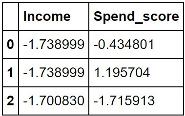
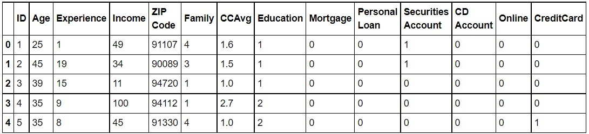
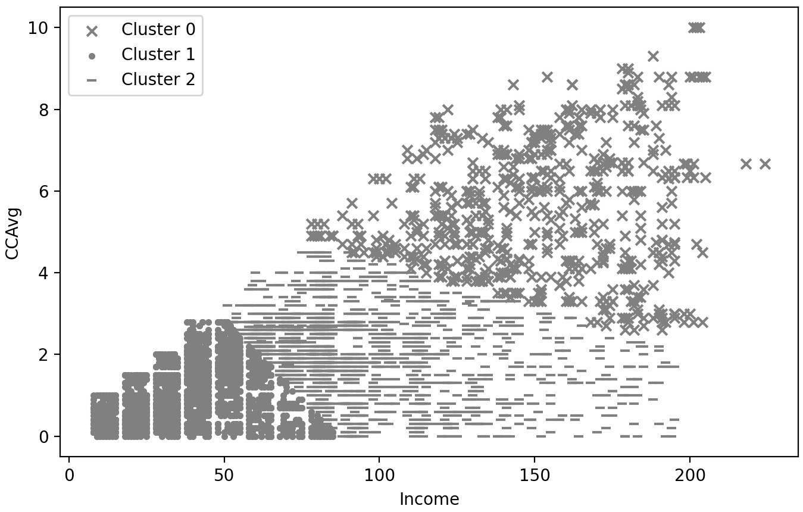
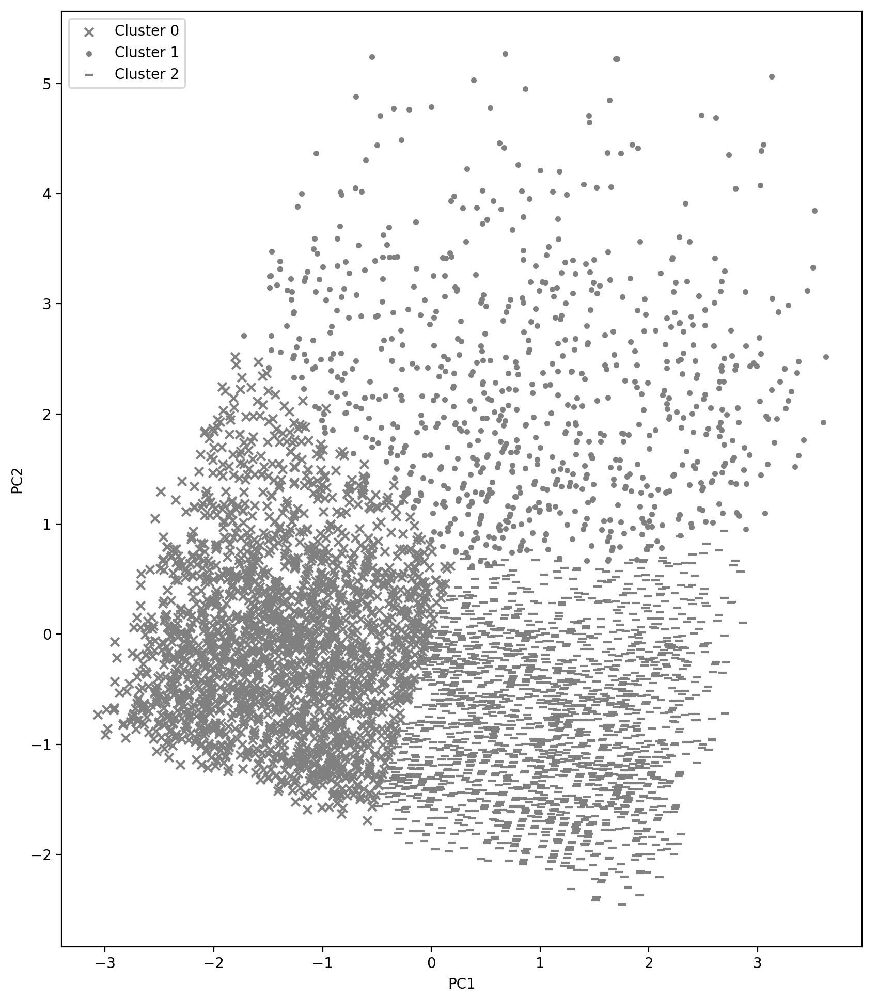

# Chapter04 Evaluating and Choosing the Best Segmentation Approach

## Mục tiêu học tập
---
# Bài Học: Unsupervised Learning và Customer Segmentation

## Mục tiêu bài học
- Nắm vững các kỹ thuật clustering tiên tiến cho customer segmentation
- Học cách lựa chọn số cluster tối ưu một cách khoa học
- Áp dụng các phương pháp đánh giá clustering cho các bài toán kinh doanh
- Thực hành với các thuật toán clustering phổ biến: Mean-Shift, K-modes, K-prototypes
- Phát triển kỹ năng data science trong lĩnh vực marketing

---

## Phần 1: Cải tiến phương pháp Customer Segmentation với các kỹ thuật Clustering tiên tiến

### 1.1. Giới thiệu về Customer Segmentation

Customer Segmentation là quá trình chia khách hàng thành các nhóm dựa trên đặc điểm tương tự. Điều này giúp doanh nghiệp:
- Tối ưu hóa chiến lược marketing
- Cá nhân hóa trải nghiệm khách hàng
- Tăng hiệu quả bán hàng và lợi nhuận

### 1.2. Các kỹ thuật Clustering cơ bản vs. Tiên tiến

**Kỹ thuật cơ bản:**
- K-Means: Phân cụm dựa trên khoảng cách Euclidean
- Hierarchical Clustering: Xây dựng cây phân cụm

**Kỹ thuật tiên tiến:**
- DBSCAN: Phát hiện cluster có mật độ cao
- Gaussian Mixture Models (GMM): Mô hình xác suất
- Spectral Clustering: Sử dụng eigenvalues của ma trận similarity

### 1.3. Ví dụ thực hành với DBSCAN

```python
import pandas as pd
import numpy as np
from sklearn.cluster import DBSCAN
from sklearn.preprocessing import StandardScaler
import matplotlib.pyplot as plt
import seaborn as sns

# Tạo dữ liệu mẫu khách hàng
np.random.seed(42)
n_customers = 1000

# Tạo các đặc trung khách hàng
data = {
    'annual_spending': np.random.normal(5000, 2000, n_customers),
    'frequency_purchases': np.random.poisson(12, n_customers),
    'avg_order_value': np.random.normal(150, 50, n_customers),
    'days_since_last_purchase': np.random.exponential(30, n_customers)
}

customer_df = pd.DataFrame(data)

# Chuẩn hóa dữ liệu
scaler = StandardScaler()
scaled_data = scaler.fit_transform(customer_df)

# Áp dụng DBSCAN
dbscan = DBSCAN(eps=0.5, min_samples=10)
clusters = dbscan.fit_predict(scaled_data)

customer_df['cluster'] = clusters

print(f"Số cluster được tìm thấy: {len(np.unique(clusters[clusters != -1]))}")
print(f"Số outlier: {np.sum(clusters == -1)}")

# Visualize kết quả
plt.figure(figsize=(12, 8))
scatter = plt.scatter(customer_df['annual_spending'], 
                     customer_df['frequency_purchases'], 
                     c=clusters, cmap='tab10', alpha=0.6)
plt.xlabel('Annual Spending')
plt.ylabel('Frequency of Purchases')
plt.title('Customer Segmentation with DBSCAN')
plt.colorbar(scatter)
plt.show()
```

### 1.4. So sánh với Gaussian Mixture Models

```python
from sklearn.mixture import GaussianMixture
from sklearn.metrics import silhouette_score

# GMM với số cluster tối ưu
best_n_components = 4
gmm = GaussianMixture(n_components=best_n_components, random_state=42)
gmm_clusters = gmm.fit_predict(scaled_data)

customer_df['gmm_cluster'] = gmm_clusters

# So sánh hiệu suất
dbscan_score = silhouette_score(scaled_data, clusters) if len(np.unique(clusters)) > 1 else -1
gmm_score = silhouette_score(scaled_data, gmm_clusters)

print(f"DBSCAN Silhouette Score: {dbscan_score:.3f}")
print(f"GMM Silhouette Score: {gmm_score:.3f}")
```

---

## Phần 2: Phương pháp khoa học để lựa chọn số cluster tối ưu

### 2.1. Các phương pháp đánh giá số cluster

#### 2.1.1. Elbow Method
```python
from sklearn.cluster import KMeans
import matplotlib.pyplot as plt

def elbow_method(data, max_clusters=15):
    """
    Tìm số cluster tối ưu bằng Elbow Method
    """
    inertias = []
    K_range = range(1, max_clusters + 1)
    
    for k in K_range:
        kmeans = KMeans(n_clusters=k, random_state=42, n_init=10)
        kmeans.fit(data)
        inertias.append(kmeans.inertia_)
    
    # Vẽ biểu đồ Elbow
    plt.figure(figsize=(10, 6))
    plt.plot(K_range, inertias, 'bo-')
    plt.xlabel('Số Clusters (k)')
    plt.ylabel('Inertia')
    plt.title('Elbow Method cho việc tìm k tối ưu')
    plt.grid(True)
    plt.show()
    
    return inertias

inertias = elbow_method(scaled_data)
```

#### 2.1.2. Silhouette Analysis
```python
from sklearn.metrics import silhouette_score, silhouette_samples

def silhouette_analysis(data, max_clusters=15):
    """
    Phân tích Silhouette để tìm số cluster tối ưu
    """
    silhouette_scores = []
    K_range = range(2, max_clusters + 1)
    
    for k in K_range:
        kmeans = KMeans(n_clusters=k, random_state=42, n_init=10)
        cluster_labels = kmeans.fit_predict(data)
        silhouette_avg = silhouette_score(data, cluster_labels)
        silhouette_scores.append(silhouette_avg)
    
    # Vẽ biểu đồ Silhouette Score
    plt.figure(figsize=(10, 6))
    plt.plot(K_range, silhouette_scores, 'ro-')
    plt.xlabel('Số Clusters (k)')
    plt.ylabel('Silhouette Score')
    plt.title('Silhouette Analysis cho việc tìm k tối ưu')
    plt.grid(True)
    plt.show()
    
    # Tìm k tối ưu
    optimal_k = K_range[np.argmax(silhouette_scores)]
    print(f"Số cluster tối ưu: {optimal_k}")
    print(f"Silhouette Score tối ưu: {max(silhouette_scores):.3f}")
    
    return silhouette_scores, optimal_k

silhouette_scores, optimal_k = silhouette_analysis(scaled_data)
```

#### 2.1.3. Gap Statistic Method
```python
def gap_statistic(data, max_clusters=15, n_refs=10):
    """
    Tính Gap Statistic để tìm số cluster tối ưu
    """
    gaps = []
    s_k = []
    K_range = range(1, max_clusters + 1)
    
    for k in K_range:
        # Tính Wk cho dữ liệu gốc
        kmeans = KMeans(n_clusters=k, random_state=42, n_init=10)
        kmeans.fit(data)
        
        # Tính within-cluster sum of squares
        wk = kmeans.inertia_
        
        # Tạo dữ liệu reference và tính Wk*
        ref_wks = []
        for _ in range(n_refs):
            # Tạo dữ liệu ngẫu nhiên có cùng kích thước và phân phối
            ref_data = np.random.uniform(data.min(axis=0), data.max(axis=0), 
                                       size=data.shape)
            ref_kmeans = KMeans(n_clusters=k, random_state=42, n_init=10)
            ref_kmeans.fit(ref_data)
            ref_wks.append(ref_kmeans.inertia_)
        
        # Tính Gap
        gap = np.log(np.mean(ref_wks)) - np.log(wk)
        gaps.append(gap)
        
        # Tính standard error
        s_k.append(np.sqrt(np.var(np.log(ref_wks)) * (1 + 1/n_refs)))
    
    # Vẽ biểu đồ Gap Statistic
    plt.figure(figsize=(10, 6))
    plt.errorbar(K_range, gaps, yerr=s_k, fmt='o-', capsize=5)
    plt.xlabel('Số Clusters (k)')
    plt.ylabel('Gap Statistic')
    plt.title('Gap Statistic cho việc tìm k tối ưu')
    plt.grid(True)
    plt.show()
    
    return gaps, s_k

gaps, s_k = gap_statistic(scaled_data)
```

### 2.2. Kết hợp các phương pháp để ra quyết định cuối cùng

```python
def comprehensive_cluster_evaluation(data, max_clusters=15):
    """
    Đánh giá tổng hợp để tìm số cluster tối ưu
    """
    results = {
        'k': [],
        'inertia': [],
        'silhouette': [],
        'calinski_harabasz': [],
        'davies_bouldin': []
    }
    
    from sklearn.metrics import calinski_harabasz_score, davies_bouldin_score
    
    for k in range(2, max_clusters + 1):
        kmeans = KMeans(n_clusters=k, random_state=42, n_init=10)
        labels = kmeans.fit_predict(data)
        
        results['k'].append(k)
        results['inertia'].append(kmeans.inertia_)
        results['silhouette'].append(silhouette_score(data, labels))
        results['calinski_harabasz'].append(calinski_harabasz_score(data, labels))
        results['davies_bouldin'].append(davies_bouldin_score(data, labels))
    
    # Chuẩn hóa các chỉ số để so sánh
    results_df = pd.DataFrame(results)
    
    # Chuẩn hóa (cao hơn = tốt hơn cho tất cả)
    results_df['inertia_norm'] = 1 - (results_df['inertia'] - results_df['inertia'].min()) / \
                                (results_df['inertia'].max() - results_df['inertia'].min())
    results_df['silhouette_norm'] = (results_df['silhouette'] - results_df['silhouette'].min()) / \
                                   (results_df['silhouette'].max() - results_df['silhouette'].min())
    results_df['calinski_harabasz_norm'] = (results_df['calinski_harabasz'] - results_df['calinski_harabasz'].min()) / \
                                          (results_df['calinski_harabasz'].max() - results_df['calinski_harabasz'].min())
    results_df['davies_bouldin_norm'] = 1 - (results_df['davies_bouldin'] - results_df['davies_bouldin'].min()) / \
                                       (results_df['davies_bouldin'].max() - results_df['davies_bouldin'].min())
    
    # Tính composite score
    results_df['composite_score'] = (results_df['silhouette_norm'] * 0.4 + 
                                   results_df['calinski_harabasz_norm'] * 0.3 +
                                   results_df['davies_bouldin_norm'] * 0.2 +
                                   results_df['inertia_norm'] * 0.1)
    
    optimal_k = results_df.loc[results_df['composite_score'].idxmax(), 'k']
    
    print("Kết quả đánh giá tổng hợp:")
    print(results_df[['k', 'silhouette', 'calinski_harabasz', 'davies_bouldin', 'composite_score']])
    print(f"\nSố cluster tối ưu được khuyến nghị: {optimal_k}")
    
    return results_df, optimal_k

results_df, recommended_k = comprehensive_cluster_evaluation(scaled_data)
```

---

## Phần 3: Áp dụng các phương pháp đánh giá cho nhiều bài toán kinh doanh

### 3.1. Case Study 1: Phân khúc khách hàng E-commerce

```python
def ecommerce_segmentation_case():
    """
    Case study: Phân khúc khách hàng cho trang thương mại điện tử
    """
    # Tạo dữ liệu mô phỏng e-commerce
    np.random.seed(123)
    n_customers = 2000
    
    ecommerce_data = pd.DataFrame({
        'recency': np.random.exponential(30, n_customers),  # Ngày từ lần mua cuối
        'frequency': np.random.poisson(8, n_customers),     # Số lần mua
        'monetary': np.random.lognormal(6, 1, n_customers), # Tổng tiền đã chi
        'avg_session_duration': np.random.normal(15, 8, n_customers),  # Phút
        'page_views_per_session': np.random.poisson(12, n_customers),
        'cart_abandonment_rate': np.random.beta(2, 8, n_customers),
    })
    
    # Loại bỏ outliers
    ecommerce_data = ecommerce_data[ecommerce_data['avg_session_duration'] > 0]
    
    print("Thống kê mô tả dữ liệu E-commerce:")
    print(ecommerce_data.describe())
    
    # Chuẩn hóa dữ liệu
    scaler = StandardScaler()
    ecommerce_scaled = scaler.fit_transform(ecommerce_data)
    
    # Tìm số cluster tối ưu
    _, optimal_k = comprehensive_cluster_evaluation(ecommerce_scaled, max_clusters=12)
    
    # Thực hiện clustering với k tối ưu
    final_kmeans = KMeans(n_clusters=optimal_k, random_state=42, n_init=10)
    ecommerce_data['cluster'] = final_kmeans.fit_predict(ecommerce_scaled)
    
    # Phân tích từng segment
    segment_analysis = ecommerce_data.groupby('cluster').agg({
        'recency': ['mean', 'median'],
        'frequency': ['mean', 'median'], 
        'monetary': ['mean', 'median'],
        'avg_session_duration': ['mean', 'median'],
        'page_views_per_session': ['mean', 'median'],
        'cart_abandonment_rate': ['mean', 'median']
    }).round(2)
    
    print("\nPhân tích các segment khách hàng:")
    print(segment_analysis)
    
    # Đặt tên cho các segment
    segment_names = []
    for cluster_id in range(optimal_k):
        cluster_data = ecommerce_data[ecommerce_data['cluster'] == cluster_id]
        
        avg_recency = cluster_data['recency'].mean()
        avg_frequency = cluster_data['frequency'].mean()
        avg_monetary = cluster_data['monetary'].mean()
        
        if avg_recency < 20 and avg_frequency > 10 and avg_monetary > 1000:
            segment_names.append("Champions")
        elif avg_recency < 30 and avg_frequency > 6:
            segment_names.append("Loyal Customers")
        elif avg_monetary > 800:
            segment_names.append("Big Spenders") 
        elif avg_recency > 60:
            segment_names.append("At Risk")
        else:
            segment_names.append(f"Segment {cluster_id + 1}")
    
    print(f"\nTên các segment: {segment_names}")
    
    # Visualization
    fig, axes = plt.subplots(2, 2, figsize=(15, 12))
    
    # RFM Analysis
    scatter1 = axes[0,0].scatter(ecommerce_data['recency'], ecommerce_data['frequency'], 
                                c=ecommerce_data['cluster'], cmap='tab10', alpha=0.6)
    axes[0,0].set_xlabel('Recency (days)')
    axes[0,0].set_ylabel('Frequency')
    axes[0,0].set_title('Recency vs Frequency')
    
    scatter2 = axes[0,1].scatter(ecommerce_data['frequency'], ecommerce_data['monetary'],
                                c=ecommerce_data['cluster'], cmap='tab10', alpha=0.6)
    axes[0,1].set_xlabel('Frequency')
    axes[0,1].set_ylabel('Monetary')
    axes[0,1].set_title('Frequency vs Monetary')
    
    scatter3 = axes[1,0].scatter(ecommerce_data['avg_session_duration'], 
                                ecommerce_data['page_views_per_session'],
                                c=ecommerce_data['cluster'], cmap='tab10', alpha=0.6)
    axes[1,0].set_xlabel('Avg Session Duration (min)')
    axes[1,0].set_ylabel('Page Views per Session')
    axes[1,0].set_title('Engagement Metrics')
    
    # Distribution của các cluster
    cluster_counts = ecommerce_data['cluster'].value_counts().sort_index()
    axes[1,1].bar(range(len(cluster_counts)), cluster_counts.values)
    axes[1,1].set_xlabel('Cluster')
    axes[1,1].set_ylabel('Number of Customers')
    axes[1,1].set_title('Customer Distribution by Cluster')
    axes[1,1].set_xticks(range(len(cluster_counts)))
    axes[1,1].set_xticklabels([f'C{i}' for i in cluster_counts.index])
    
    plt.tight_layout()
    plt.show()
    
    return ecommerce_data, segment_names

ecommerce_results, segment_names = ecommerce_segmentation_case()
```

### 3.2. Case Study 2: Phân khúc khách hàng Ngân hàng

```python
def banking_segmentation_case():
    """
    Case study: Phân khúc khách hàng ngân hàng
    """
    np.random.seed(456)
    n_customers = 1500
    
    banking_data = pd.DataFrame({
        'account_balance': np.random.lognormal(8, 1.5, n_customers),
        'credit_score': np.random.normal(650, 100, n_customers),
        'loan_amount': np.random.lognormal(9, 1, n_customers) * np.random.binomial(1, 0.3, n_customers),
        'num_products': np.random.poisson(2.5, n_customers),
        'transaction_frequency': np.random.poisson(25, n_customers),
        'age': np.random.normal(45, 15, n_customers),
        'income': np.random.lognormal(10, 0.5, n_customers)
    })
    
    # Xử lý dữ liệu
    banking_data['credit_score'] = np.clip(banking_data['credit_score'], 300, 850)
    banking_data['age'] = np.clip(banking_data['age'], 18, 80)
    
    print("Banking Customer Data Overview:")
    print(banking_data.describe())
    
    # Feature engineering
    banking_data['loan_to_income_ratio'] = banking_data['loan_amount'] / banking_data['income']
    banking_data['balance_to_income_ratio'] = banking_data['account_balance'] / banking_data['income']
    
    # Chuẩn hóa
    features_for_clustering = ['account_balance', 'credit_score', 'loan_amount', 
                             'num_products', 'transaction_frequency', 'age', 'income',
                             'loan_to_income_ratio', 'balance_to_income_ratio']
    
    scaler = StandardScaler()
    banking_scaled = scaler.fit_transform(banking_data[features_for_clustering])
    
    # Clustering
    _, optimal_k = comprehensive_cluster_evaluation(banking_scaled, max_clusters=10)
    
    kmeans = KMeans(n_clusters=optimal_k, random_state=42, n_init=10)
    banking_data['cluster'] = kmeans.fit_predict(banking_scaled)
    
    # Phân tích segments
    print(f"\nBanking Segments Analysis (k={optimal_k}):")
    segment_analysis = banking_data.groupby('cluster')[features_for_clustering].mean().round(2)
    print(segment_analysis)
    
    # Business insights
    print("\nBusiness Insights:")
    for cluster_id in range(optimal_k):
        cluster_data = banking_data[banking_data['cluster'] == cluster_id]
        size = len(cluster_data)
        avg_balance = cluster_data['account_balance'].mean()
        avg_credit = cluster_data['credit_score'].mean()
        avg_products = cluster_data['num_products'].mean()
        
        print(f"Cluster {cluster_id}: {size} customers")
        print(f"  - Avg Balance: ${avg_balance:,.0f}")
        print(f"  - Avg Credit Score: {avg_credit:.0f}")
        print(f"  - Avg Products: {avg_products:.1f}")
        
        # Characterization
        if avg_balance > 100000 and avg_credit > 700:
            print("  - Profile: Premium/Private Banking Customers")
        elif avg_products > 3 and avg_balance > 50000:
            print("  - Profile: High-Value Multi-Product Customers")  
        elif avg_credit < 600:
            print("  - Profile: High-Risk/Subprime Customers")
        else:
            print("  - Profile: Standard Banking Customers")
        print()
    
    return banking_data

banking_results = banking_segmentation_case()
```

### 3.3. Đánh giá và So sánh Hiệu quả

```python
def evaluate_segmentation_quality(data, labels, feature_names):
    """
    Đánh giá chất lượng segmentation từ góc độ business
    """
    from sklearn.metrics import calinski_harabasz_score, davies_bouldin_score
    
    # Các chỉ số kỹ thuật
    silhouette_avg = silhouette_score(data, labels)
    calinski_harabasz = calinski_harabasz_score(data, labels)
    davies_bouldin = davies_bouldin_score(data, labels)
    
    print("=== ĐÁNH GIÁ CHẤT LƯỢNG SEGMENTATION ===")
    print(f"Silhouette Score: {silhouette_avg:.3f} (Càng gần 1 càng tốt)")
    print(f"Calinski-Harabasz Index: {calinski_harabasz:.2f} (Càng cao càng tốt)")
    print(f"Davies-Bouldin Index: {davies_bouldin:.3f} (Càng thấp càng tốt)")
    
    # Phân tích business metrics
    df_with_clusters = pd.DataFrame(data, columns=feature_names)
    df_with_clusters['cluster'] = labels
    
    print("\n=== PHÂN TÍCH BUSINESS METRICS ===")
    
    # Tính coefficient of variation cho mỗi feature trong mỗi cluster
    cluster_stability = {}
    for cluster_id in np.unique(labels):
        if cluster_id == -1:  # Skip outliers for DBSCAN
            continue
        cluster_data = df_with_clusters[df_with_clusters['cluster'] == cluster_id]
        
        stability_scores = []
        for feature in feature_names:
            cv = cluster_data[feature].std() / abs(cluster_data[feature].mean()) if cluster_data[feature].mean() != 0 else float('inf')
            stability_scores.append(cv)
        
        cluster_stability[cluster_id] = np.mean(stability_scores)
    
    avg_stability = np.mean(list(cluster_stability.values()))
    print(f"Độ ổn định trung bình của clusters (CV): {avg_stability:.3f} (Càng thấp càng tốt)")
    
    # Tính separability - khoảng cách giữa các cluster centers
    cluster_centers = []
    for cluster_id in np.unique(labels):
        if cluster_id == -1:
            continue
        cluster_data = df_with_clusters[df_with_clusters['cluster'] == cluster_id]
        center = cluster_data[feature_names].mean().values
        cluster_centers.append(center)
    
    if len(cluster_centers) > 1:
        from scipy.spatial.distance import pdist
        center_distances = pdist(cluster_centers)
        avg_separation = np.mean(center_distances)
        print(f"Độ tách biệt trung bình giữa clusters: {avg_separation:.3f} (Càng cao càng tốt)")
    
    # Actionability - đánh giá tính khả thi của segments
    print("\n=== ĐÁNH GIÁ TÍNH KHẢ THI (ACTIONABILITY) ===")
    
    cluster_sizes = pd.Series(labels).value_counts()
    min_segment_size = cluster_sizes.min()
    max_segment_size = cluster_sizes.max()
    size_ratio = max_segment_size / min_segment_size if min_segment_size > 0 else float('inf')
    
    print(f"Kích thước segment nhỏ nhất: {min_segment_size}")
    print(f"Kích thước segment lớn nhất: {max_segment_size}")
    print(f"Tỷ lệ kích thước (max/min): {size_ratio:.2f}")
    
    if size_ratio > 10:
        print("⚠️  Cảnh báo: Chênh lệch kích thước segments quá lớn - có thể khó triển khai")
    elif 3 <= len(np.unique(labels)) <= 7:
        print("✅ Số lượng segments phù hợp cho triển khai business (3-7 segments)")
    else:
        print("⚠️  Số lượng segments có thể không tối ưu cho triển khai")
    
    return {
        'silhouette_score': silhouette_avg,
        'calinski_harabasz_score': calinski_harabasz,
        'davies_bouldin_score': davies_bouldin,
        'stability_score': avg_stability,
        'separation_score': avg_separation if len(cluster_centers) > 1 else 0,
        'size_ratio': size_ratio
    }

# Đánh giá cho case study e-commerce
ecommerce_features = ['recency', 'frequency', 'monetary', 'avg_session_duration', 
                     'page_views_per_session', 'cart_abandonment_rate']
ecommerce_scaled_for_eval = StandardScaler().fit_transform(ecommerce_results[ecommerce_features])

print("ĐÁNH GIÁ E-COMMERCE SEGMENTATION:")
ecommerce_eval = evaluate_segmentation_quality(
    ecommerce_scaled_for_eval, 
    ecommerce_results['cluster'].values,
    ecommerce_features
)
```

---

## Phần 4: Các thuật toán Clustering khác: Mean-Shift, K-modes, K-prototypes

### 4.1. Mean-Shift Clustering

Mean-Shift là thuật toán clustering không cần định trước số cluster, tự động tìm các mode (peak) trong phân phối dữ liệu.

#### 4.1.1. Lý thuyết Mean-Shift

```python
from sklearn.cluster import MeanShift, estimate_bandwidth

def explain_mean_shift():
    """
    Giải thích cách hoạt động của Mean-Shift
    """
    print("=== MEAN-SHIFT CLUSTERING ===")
    print("""
    Mean-Shift hoạt động theo nguyên tắc:
    1. Đặt một 'cửa sổ' (kernel) tại mỗi điểm dữ liệu
    2. Tính trọng tâm (centroid) của các điểm trong cửa sổ
    3. Di chuyển cửa sổ đến trọng tâm mới
    4. Lặp lại cho đến khi hội tụ
    5. Các điểm hội tụ về cùng một vị trí được gộp thành 1 cluster
    
    Ưu điểm:
    - Không cần định trước số cluster
    - Có thể tìm cluster với hình dạng bất kỳ
    - Tự động loại bỏ outliers
    
    Nhược điểm:
    - Tốc độ chậm với
```

## Phần 5: Nâng cao kỹ năng Data Science trong Marketing

### 5.1. Feature Engineering cho Customer Segmentation

```python
def advanced_feature_engineering(data):
    """
    Kỹ thuật feature engineering nâng cao cho customer segmentation
    """
    print("=== ADVANCED FEATURE ENGINEERING ===")
    
    # 1. RFM Features (Recency, Frequency, Monetary)
    # Giả sử chúng ta có transaction data
    np.random.seed(999)
    n_customers = len(data)
    
    # Tạo synthetic transaction data
    transaction_data = []
    for customer_id in range(n_customers):
        n_transactions = np.random.poisson(5) + 1
        for _ in range(n_transactions):
            days_ago = np.random.exponential(30)
            amount = np.random.lognormal(4, 1)
            transaction_data.append({
                'customer_id': customer_id,
                'days_ago': days_ago,
                'amount': amount,
                'transaction_date': pd.Timestamp.now() - pd.Timedelta(days=days_ago)
            })
    
    transactions_df = pd.DataFrame(transaction_data)
    
    # Tính RFM metrics
    rfm_data = transactions_df.groupby('customer_id').agg({
        'days_ago': 'min',  # Recency
        'customer_id': 'count',  # Frequency  
        'amount': 'sum'  # Monetary
    }).rename(columns={
        'days_ago': 'recency',
        'customer_id': 'frequency',
        'amount': 'monetary'
    })
    
    # 2. Behavioral Features
    enhanced_data = data.copy()
    enhanced_data['customer_id'] = range(len(data))
    enhanced_data = enhanced_data.merge(rfm_data, left_on='customer_id', right_index=True, how='left')
    
    # 3. Derived Features
    enhanced_data['avg_transaction_value'] = enhanced_data['monetary'] / enhanced_data['frequency']
    enhanced_data['spending_velocity'] = enhanced_data['monetary'] / enhanced_data['recency']
    enhanced_data['purchase_intensity'] = enhanced_data['frequency'] / enhanced_data['recency']
    
    # 4. Percentile-based Features
    enhanced_data['recency_percentile'] = enhanced_data['recency'].rank(pct=True)
    enhanced_data['frequency_percentile'] = enhanced_data['frequency'].rank(pct=True)
    enhanced_data['monetary_percentile'] = enhanced_data['monetary'].rank(pct=True)
    
    # 5. Composite Scores
    enhanced_data['rfm_score'] = (
        enhanced_data['recency_percentile'] * 0.15 +  # Lower recency is better
        enhanced_data['frequency_percentile'] * 0.35 +
        enhanced_data['monetary_percentile'] * 0.5
    )
    
    # 6. Customer Lifecycle Stage
    def assign_lifecycle_stage(row):
        if row['recency'] <= 30 and row['frequency'] >= 3:
            return 'Active'
        elif row['recency'] <= 60:
            return 'Regular'
        elif row['recency'] <= 180:
            return 'At Risk'
        else:
            return 'Churned'
    
    enhanced_data['lifecycle_stage'] = enhanced_data.apply(assign_lifecycle_stage, axis=1)
    
    # 7. Interaction Features
    enhanced_data['age_income_interaction'] = enhanced_data['age'] * enhanced_data['income'] / 100000
    enhanced_data['spending_vs_income_ratio'] = enhanced_data['spending_score'] / (enhanced_data['income'] / 10000)
    
    print("Enhanced features created:")
    new_features = [col for col in enhanced_data.columns if col not in data.columns and col != 'customer_id']
    for feature
#### 4.2.4. So sánh hiệu quả các phương pháp

```python
def compare_clustering_methods(data, numerical_features, categorical_features):
    """
    So sánh hiệu quả của các phương pháp clustering khác nhau
    """
    print("=== SO SÁNH CÁC PHƯƠNG PHÁP CLUSTERING ===")
    
    results_comparison = {}
    
    # 1. K-means (chỉ với numerical data)
    numerical_data = data[numerical_features]
    scaler = StandardScaler()
    numerical_scaled = scaler.fit_transform(numerical_data)
    
    kmeans = KMeans(n_clusters=4, random_state=42, n_init=10)
    kmeans_labels = kmeans.fit_predict(numerical_scaled)
    
    results_comparison['K-means'] = {
        'labels': kmeans_labels,
        'silhouette': silhouette_score(numerical_scaled, kmeans_labels),
        'features_used': 'Numerical only',
        'data_size': numerical_scaled.shape
    }
    
    # 2. K-modes (chỉ với categorical data)
    categorical_data = data[categorical_features].values
    kmodes = KModes(n_clusters=4, init='Huang', n_init=5, verbose=0, random_state=42)
    kmodes_labels = kmodes.fit_predict(categorical_data)
    
    results_comparison['K-modes'] = {
        'labels': kmodes_labels,
        'cost': kmodes.cost_,
        'features_used': 'Categorical only',
        'data_size': categorical_data.shape
    }
    
    # 3. K-prototypes (mixed data)
    mixed_array = np.column_stack([numerical_scaled, categorical_data])
    categorical_indices = list(range(len(numerical_features), len(numerical_features) + len(categorical_features)))
    
    kproto = KPrototypes(n_clusters=4, init='Huang', gamma=optimal_gamma, n_init=5, verbose=0, random_state=42)
    kproto_labels = kproto.fit_predict(mixed_array, categorical=categorical_indices)
    
    results_comparison['K-prototypes'] = {
        'labels': kproto_labels,
        'cost': kproto.cost_,
        'features_used': 'Numerical + Categorical',
        'data_size': mixed_array.shape,
        'gamma': optimal_gamma
    }
    
    # 4. DBSCAN (chỉ numerical)
    from sklearn.cluster import DBSCAN
    dbscan = DBSCAN(eps=0.5, min_samples=10)
    dbscan_labels = dbscan.fit_predict(numerical_scaled)
    n_clusters_dbscan = len(set(dbscan_labels)) - (1 if -1 in dbscan_labels else 0)
    n_noise = list(dbscan_labels).count(-1)
    
    results_comparison['DBSCAN'] = {
        'labels': dbscan_labels,
        'n_clusters': n_clusters_dbscan,
        'n_noise': n_noise,
        'features_used': 'Numerical only',
        'silhouette': silhouette_score(numerical_scaled, dbscan_labels) if n_clusters_dbscan > 1 else -1
    }
    
    # Tạo visualization so sánh
    fig, axes = plt.subplots(2, 2, figsize=(15, 12))
    methods = ['K-means', 'K-modes', 'K-prototypes', 'DBSCAN']
    
    for idx, method in enumerate(methods):
        row = idx // 2
        col = idx % 2
        ax = axes[row, col]
        
        labels = results_comparison[method]['labels']
        
        if method in ['K-means', 'DBSCAN']:
            # Sử dụng 2 numerical features đầu tiên để visualize
            scatter = ax.scatter(data[numerical_features[0]], data[numerical_features[1]], 
                               c=labels, cmap='tab10', alpha=0.6)
            ax.set_xlabel(numerical_features[0])
            ax.set_ylabel(numerical_features[1])
        else:
            # Cho K-modes và K-prototypes, tạo một biểu đồ phân phối cluster
            unique_labels, counts = np.unique(labels, return_counts=True)
            ax.bar(range(len(counts)), counts, color=plt.cm.tab10(range(len(counts))))
            ax.set_xlabel('Cluster ID')
            ax.set_ylabel('Number of Customers')
            ax.set_xticks(range(len(counts)))
            ax.set_xticklabels([f'C{i}' for i in unique_labels])
        
        ax.set_title(f'{method}')
        ax.grid(True, alpha=0.3)
    
    plt.tight_layout()
    plt.show()
    
    # Tạo bảng so sánh
    comparison_table = []
    for method, results in results_comparison.items():
        n_clusters = len(np.unique(results['labels']))
        if method == 'DBSCAN':
            n_clusters = results['n_clusters']
        
        row = {
            'Method': method,
            'N_Clusters': n_clusters,
            'Features_Used': results['features_used'],
            'Data_Shape': f"{results['data_size'][0]} × {results['data_size'][1]}",
        }
        
        if 'silhouette' in results:
            row['Silhouette_Score'] = f"{results['silhouette']:.3f}"
        else:
            row['Silhouette_Score'] = 'N/A'
        
        if 'cost' in results:
            row['Cost'] = f"{results['cost']:.2f}"
        else:
            row['Cost'] = 'N/A'
        
        comparison_table.append(row)
    
    comparison_df = pd.DataFrame(comparison_table)
    print("\nBảng so sánh các phương pháp:")
    print(comparison_df.to_string(index=False))
    
    # Business recommendations
    print("\n=== KHUYẾN NGHỊ SỬ DỤNG ===")
    print("""
    1. K-means: Tốt cho dữ liệu numerical, nhanh, dễ hiểu
       → Phù hợp: RFM analysis, behavioral segmentation
    
    2. K-modes: Chuyên cho dữ liệu categorical
       → Phù hợp: Demographic segmentation, product preference
    
    3. K-prototypes: Tốt nhất cho mixed data
       → Phù hợp: Comprehensive customer profiling
    
    4. DBSCAN: Tự động tìm clusters, phát hiện outliers
       → Phù hợp: Fraud detection, anomaly detection
       
    5. Mean-Shift: Không cần định số clusters trước
       → Phù hợp: Exploratory analysis, unknown market structure
    """)
    
    return results_comparison

comparison_results = compare_clustering_methods(
    mixed_customer_data, numerical_features, categorical_features
)

#### 4.2.3. Áp dụng K-prototypes cho dữ liệu Mixed

```python
def kprototypes_segmentation(data, numerical_features, categorical_features, n_clusters_range=range(2, 8)):
    """
    Phân khúc khách hàng sử dụng K-prototypes cho mixed data
    """
    # Chuẩn bị dữ liệu
    # K-prototypes cần numerical data được chuẩn hóa
    scaler = StandardScaler()
    numerical_data_scaled = scaler.fit_transform(data[numerical_features])
    
    # Tạo mixed data array
    mixed_array = np.column_stack([
        numerical_data_scaled,
        data[categorical_features].values
    ])
    
    # Xác định chỉ số của categorical features
    categorical_indices = list(range(len(numerical_features), len(numerical_features) + len(categorical_features)))
    
    # Tìm số cluster và gamma tối ưu
    costs = []
    gammas = [0.5, 1.0, 1.5, 2.0]  # Thử nghiệm với các giá trị gamma khác nhau
    best_gamma = 1.0
    
    print("Tìm kiếm gamma tối ưu...")
    for gamma in gammas:
        gamma_costs = []
        for k in n_clusters_range:
            kproto = KPrototypes(n_clusters=k, init='Huang', gamma=gamma, n_init=5, verbose=0, random_state=42)
            kproto.fit(mixed_array, categorical=categorical_indices)
            gamma_costs.append(kproto.cost_)
        
        avg_cost = np.mean(gamma_costs)
        print(f"Gamma {gamma}: Average cost = {avg_cost:.2f}")
        costs.append(gamma_costs)
    
    # Chọn gamma với cost thấp nhất (có thể tùy chỉnh logic này)
    best_gamma_idx = np.argmin([np.mean(cost_list) for cost_list in costs])
    best_gamma = gammas[best_gamma_idx]
    best_costs = costs[best_gamma_idx]
    
    print(f"Gamma tối ưu: {best_gamma}")
    
    # Vẽ elbow curve với gamma tối ưu
    plt.figure(figsize=(12, 5))
    
    plt.subplot(1, 2, 1)
    plt.plot(n_clusters_range, best_costs, 'ro-')
    plt.xlabel('Số Clusters')
    plt.ylabel('Cost')
    plt.title(f'Elbow Method for K-prototypes (γ={best_gamma})')
    plt.grid(True)
    
    # So sánh các gamma
    plt.subplot(1, 2, 2)
    for i, gamma in enumerate(gammas):
        plt.plot(n_clusters_range, costs[i], 'o-', label=f'γ={gamma}')
    plt.xlabel('Số Clusters')
    plt.ylabel('Cost')
    plt.title('Cost comparison for different γ values')
    plt.legend()
    plt.grid(True)
    
    plt.tight_layout()
    plt.show()
    
    # Chọn k tối ưu
    optimal_k = 4  # Có thể điều chỉnh dựa trên elbow curve
    
    # Fit final model
    final_kproto = KPrototypes(n_clusters=optimal_k, init='Huang', gamma=best_gamma, n_init=10, verbose=1, random_state=42)
    clusters = final_kproto.fit_predict(mixed_array, categorical=categorical_indices)
    
    # Thêm vào data
    data_with_clusters = data.copy()
    data_with_clusters['kprototypes_cluster'] = clusters
    
    # Phân tích chi tiết từng cluster
    print(f"\nPhân tích K-prototypes clusters (k={optimal_k}, γ={best_gamma}):")
    
    for cluster_id in range(optimal_k):
        cluster_data = data_with_clusters[data_with_clusters['kprototypes_cluster'] == cluster_id]
        print(f"\n{'='*50}")
        print(f"CLUSTER {cluster_id}: {len(cluster_data)} khách hàng ({len(cluster_data)/len(data)*100:.1f}%)")
        print(f"{'='*50}")
        
        # Phân tích numerical features
        print("Numerical Features:")
        for feature in numerical_features:
            mean_val = cluster_data[feature].mean()
            median_val = cluster_data[feature].median()
            std_val = cluster_data[feature].std()
            print(f"  {feature}: Mean={mean_val:.2f}, Median={median_val:.2f}, Std={std_val:.2f}")
        
        # Phân tích categorical features
        print("\nCategorical Features:")
        for feature in categorical_features:
            value_counts = cluster_data[feature].value_counts()
            mode_value = value_counts.index[0]
            mode_percentage = (value_counts.iloc[0] / len(cluster_data)) * 100
            print(f"  {feature}:")
            for val, count in value_counts.head(3).items():
                percentage = (count / len(cluster_data)) * 100
                print(f"    {val}: {count} ({percentage:.1f}%)")
        
        # Business interpretation
        print("\nBusiness Profile:")
        avg_age = cluster_data['age'].mean()
        avg_income = cluster_data['income'].mean()
        avg_spending = cluster_data['spending_score'].mean()
        
        if avg_income > 80000 and avg_spending > 60:
            profile = "High-Value Customers"
        elif avg_age < 30 and avg_spending > 50:
            profile = "Young Active Spenders"
        elif avg_income < 50000:
            profile = "Budget-Conscious Customers"
        elif avg_age > 50:
            profile = "Mature/Senior Customers"
        else:
            profile = "Standard Customers"
        
        print(f"  Suggested Profile: {profile}")
    
    return data_with_clusters, final_kproto, best_gamma

# Áp dụng K-prototypes
numerical_features = ['age', 'income', 'spending_score']
categorical_features = ['gender', 'education', 'occupation', 'city_tier']

mixed_data_kproto, kproto_model, optimal_gamma = kprototypes_segmentation(
    mixed_customer_data, numerical_features, categorical_features
)

#### 4.2.2. Áp dụng K-modes cho dữ liệu Categorical

```python
def kmodes_segmentation(data, categorical_features, n_clusters_range=range(2, 10)):
    """
    Phân khúc khách hàng sử dụng K-modes cho categorical data
    """
    # Lấy dữ liệu categorical
    categorical_data = data[categorical_features].values
    
    # Tìm số cluster tối ưu cho K-modes
    costs = []
    for k in n_clusters_range:
        kmodes_model = KModes(n_clusters=k, init='Huang', n_init=5, verbose=0, random_state=42)
        kmodes_model.fit(categorical_data)
        costs.append(kmodes_model.cost_)
    
    # Vẽ biểu đồ elbow
    plt.figure(figsize=(10, 6))
    plt.plot(n_clusters_range, costs, 'bo-')
    plt.xlabel('Số Clusters')
    plt.ylabel('Cost')
    plt.title('Elbow Method for K-modes')
    plt.grid(True)
    plt.show()
    
    # Chọn k tối ưu (có thể dựa vào elbow hoặc business logic)
    optimal_k = 4  # Có thể điều chỉnh dựa trên biểu đồ
    
    # Fit model với k tối ưu
    final_kmodes = KModes(n_clusters=optimal_k, init='Huang', n_init=10, verbose=1, random_state=42)
    clusters = final_kmodes.fit_predict(categorical_data)
    
    # Thêm clusters vào data
    data_with_clusters = data.copy()
    data_with_clusters['kmodes_cluster'] = clusters
    
    # Phân tích clusters
    print(f"\nPhân tích K-modes clusters (k={optimal_k}):")
    for cluster_id in range(optimal_k):
        cluster_data = data_with_clusters[data_with_clusters['kmodes_cluster'] == cluster_id]
        print(f"\nCluster {cluster_id}: {len(cluster_data)} khách hàng ({len(cluster_data)/len(data)*100:.1f}%)")
        
        for feature in categorical_features:
            mode_value = cluster_data[feature].mode().values[0]
            percentage = (cluster_data[feature] == mode_value).mean() * 100
            print(f"  {feature}: {mode_value} ({percentage:.1f}%)")
    
    # Cluster centers (modes)
    print("\nCluster Centers (Modes):")
    for i, center in enumerate(final_kmodes.cluster_centroids_):
        print(f"Cluster {i}:", center)
    
    return data_with_clusters, final_kmodes

# Áp dụng K-modes
categorical_features = ['gender', 'education', 'occupation', 'city_tier']
mixed_data_kmodes, kmodes_model = kmodes_segmentation(mixed_customer_data, categorical_features)

### 4.2. K-modes và K-prototypes cho dữ liệu Categorical

#### 4.2.1. Lý thuyết K-modes và K-prototypes

K-modes và K-prototypes được thiết kế để xử lý dữ liệu categorical và mixed data.

```python
# Cài đặt thư viện kmodes
# pip install kmodes

from kmodes.kmodes import KModes
from kmodes.kprototypes import KPrototypes

def explain_kmodes_kprototypes():
    """
    Giải thích K-modes và K-prototypes
    """
    print("=== K-MODES VÀ K-PROTOTYPES ===")
    print("""
    K-modes (cho dữ liệu categorical):
    - Sử dụng mode thay vì mean để tính trung tâm cluster
    - Dùng Hamming distance thay vì Euclidean distance
    - Mode = giá trị xuất hiện nhiều nhất trong cluster
    
    K-prototypes (cho dữ liệu mixed):
    - Kết hợp K-means (cho numerical) và K-modes (cho categorical)
    - Distance = numerical_distance + γ × categorical_distance
    - γ là trọng số cân bằng giữa 2 loại dữ liệu
    """)

explain_kmodes_kprototypes()

def create_mixed_customer_data():
    """
    Tạo dữ liệu khách hàng mixed (numerical + categorical)
    """
    np.random.seed(789)
    n_customers = 1000
    
    # Dữ liệu numerical
    numerical_data = {
        'age': np.random.normal(35, 12, n_customers),
        'income': np.random.lognormal(10, 0.5, n_customers),
        'spending_score': np.random.normal(50, 20, n_customers)
    }
    
    # Dữ liệu categorical
    genders = np.random.choice(['Male', 'Female', 'Other'], n_customers, p=[0.45, 0.5, 0.05])
    education = np.random.choice(['High School', 'Bachelor', 'Master', 'PhD'], 
                               n_customers, p=[0.3, 0.4, 0.25, 0.05])
    occupation = np.random.choice(['Student', 'Professional', 'Manager', 'Executive', 'Retired'],
                                n_customers, p=[0.15, 0.35, 0.25, 0.15, 0.1])
    city_tier = np.random.choice(['Tier 1', 'Tier 2', 'Tier 3'], 
                               n_customers, p=[0.4, 0.35, 0.25])
    
    mixed_data = pd.DataFrame({
        'age': np.clip(numerical_data['age'], 18, 70),
        'income': numerical_data['income'],
        'spending_score': np.clip(numerical_data['spending_score'], 0, 100),
        'gender': genders,
        'education': education,
        'occupation': occupation,
        'city_tier': city_tier
    })
    
    return mixed_data

mixed_customer_data = create_mixed_customer_data()
print("Mixed Customer Data Sample:")
print(mixed_customer_data.head(10))
print("\nData Types:")
print(mixed_customer_data.dtypes)
# Bài Học: Unsupervised Learning và Customer Segmentation

## Mục tiêu bài học
- Nắm vững các kỹ thuật clustering tiên tiến cho customer segmentation
- Học cách lựa chọn số cluster tối ưu một cách khoa học
- Áp dụng các phương pháp đánh giá clustering cho các bài toán kinh doanh
- Thực hành với các thuật toán clustering phổ biến: Mean-Shift, K-modes, K-prototypes
- Phát triển kỹ năng data science trong lĩnh vực marketing

---

## Phần 1: Cải tiến phương pháp Customer Segmentation với các kỹ thuật Clustering tiên tiến

### 1.1. Giới thiệu về Customer Segmentation

Customer Segmentation là quá trình chia khách hàng thành các nhóm dựa trên đặc điểm tương tự. Điều này giúp doanh nghiệp:
- Tối ưu hóa chiến lược marketing
- Cá nhân hóa trải nghiệm khách hàng
- Tăng hiệu quả bán hàng và lợi nhuận

### 1.2. Các kỹ thuật Clustering cơ bản vs. Tiên tiến

**Kỹ thuật cơ bản:**
- K-Means: Phân cụm dựa trên khoảng cách Euclidean
- Hierarchical Clustering: Xây dựng cây phân cụm

**Kỹ thuật tiên tiến:**
- DBSCAN: Phát hiện cluster có mật độ cao
- Gaussian Mixture Models (GMM): Mô hình xác suất
- Spectral Clustering: Sử dụng eigenvalues của ma trận similarity

### 1.3. Ví dụ thực hành với DBSCAN

```python
import pandas as pd
import numpy as np
from sklearn.cluster import DBSCAN
from sklearn.preprocessing import StandardScaler
import matplotlib.pyplot as plt
import seaborn as sns

# Tạo dữ liệu mẫu khách hàng
np.random.seed(42)
n_customers = 1000

# Tạo các đặc trung khách hàng
data = {
    'annual_spending': np.random.normal(5000, 2000, n_customers),
    'frequency_purchases': np.random.poisson(12, n_customers),
    'avg_order_value': np.random.normal(150, 50, n_customers),
    'days_since_last_purchase': np.random.exponential(30, n_customers)
}

customer_df = pd.DataFrame(data)

# Chuẩn hóa dữ liệu
scaler = StandardScaler()
scaled_data = scaler.fit_transform(customer_df)

# Áp dụng DBSCAN
dbscan = DBSCAN(eps=0.5, min_samples=10)
clusters = dbscan.fit_predict(scaled_data)

customer_df['cluster'] = clusters

print(f"Số cluster được tìm thấy: {len(np.unique(clusters[clusters != -1]))}")
print(f"Số outlier: {np.sum(clusters == -1)}")

# Visualize kết quả
plt.figure(figsize=(12, 8))
scatter = plt.scatter(customer_df['annual_spending'], 
                     customer_df['frequency_purchases'], 
                     c=clusters, cmap='tab10', alpha=0.6)
plt.xlabel('Annual Spending')
plt.ylabel('Frequency of Purchases')
plt.title('Customer Segmentation with DBSCAN')
plt.colorbar(scatter)
plt.show()
```

### 1.4. So sánh với Gaussian Mixture Models

```python
from sklearn.mixture import GaussianMixture
from sklearn.metrics import silhouette_score

# GMM với số cluster tối ưu
best_n_components = 4
gmm = GaussianMixture(n_components=best_n_components, random_state=42)
gmm_clusters = gmm.fit_predict(scaled_data)

customer_df['gmm_cluster'] = gmm_clusters

# So sánh hiệu suất
dbscan_score = silhouette_score(scaled_data, clusters) if len(np.unique(clusters)) > 1 else -1
gmm_score = silhouette_score(scaled_data, gmm_clusters)

print(f"DBSCAN Silhouette Score: {dbscan_score:.3f}")
print(f"GMM Silhouette Score: {gmm_score:.3f}")
```

---

## Phần 2: Phương pháp khoa học để lựa chọn số cluster tối ưu

### 2.1. Các phương pháp đánh giá số cluster

#### 2.1.1. Elbow Method
```python
from sklearn.cluster import KMeans
import matplotlib.pyplot as plt

def elbow_method(data, max_clusters=15):
    """
    Tìm số cluster tối ưu bằng Elbow Method
    """
    inertias = []
    K_range = range(1, max_clusters + 1)
    
    for k in K_range:
        kmeans = KMeans(n_clusters=k, random_state=42, n_init=10)
        kmeans.fit(data)
        inertias.append(kmeans.inertia_)
    
    # Vẽ biểu đồ Elbow
    plt.figure(figsize=(10, 6))
    plt.plot(K_range, inertias, 'bo-')
    plt.xlabel('Số Clusters (k)')
    plt.ylabel('Inertia')
    plt.title('Elbow Method cho việc tìm k tối ưu')
    plt.grid(True)
    plt.show()
    
    return inertias

inertias = elbow_method(scaled_data)
```

#### 2.1.2. Silhouette Analysis
```python
from sklearn.metrics import silhouette_score, silhouette_samples

def silhouette_analysis(data, max_clusters=15):
    """
    Phân tích Silhouette để tìm số cluster tối ưu
    """
    silhouette_scores = []
    K_range = range(2, max_clusters + 1)
    
    for k in K_range:
        kmeans = KMeans(n_clusters=k, random_state=42, n_init=10)
        cluster_labels = kmeans.fit_predict(data)
        silhouette_avg = silhouette_score(data, cluster_labels)
        silhouette_scores.append(silhouette_avg)
    
    # Vẽ biểu đồ Silhouette Score
    plt.figure(figsize=(10, 6))
    plt.plot(K_range, silhouette_scores, 'ro-')
    plt.xlabel('Số Clusters (k)')
    plt.ylabel('Silhouette Score')
    plt.title('Silhouette Analysis cho việc tìm k tối ưu')
    plt.grid(True)
    plt.show()
    
    # Tìm k tối ưu
    optimal_k = K_range[np.argmax(silhouette_scores)]
    print(f"Số cluster tối ưu: {optimal_k}")
    print(f"Silhouette Score tối ưu: {max(silhouette_scores):.3f}")
    
    return silhouette_scores, optimal_k

silhouette_scores, optimal_k = silhouette_analysis(scaled_data)
```

#### 2.1.3. Gap Statistic Method
```python
def gap_statistic(data, max_clusters=15, n_refs=10):
    """
    Tính Gap Statistic để tìm số cluster tối ưu
    """
    gaps = []
    s_k = []
    K_range = range(1, max_clusters + 1)
    
    for k in K_range:
        # Tính Wk cho dữ liệu gốc
        kmeans = KMeans(n_clusters=k, random_state=42, n_init=10)
        kmeans.fit(data)
        
        # Tính within-cluster sum of squares
        wk = kmeans.inertia_
        
        # Tạo dữ liệu reference và tính Wk*
        ref_wks = []
        for _ in range(n_refs):
            # Tạo dữ liệu ngẫu nhiên có cùng kích thước và phân phối
            ref_data = np.random.uniform(data.min(axis=0), data.max(axis=0), 
                                       size=data.shape)
            ref_kmeans = KMeans(n_clusters=k, random_state=42, n_init=10)
            ref_kmeans.fit(ref_data)
            ref_wks.append(ref_kmeans.inertia_)
        
        # Tính Gap
        gap = np.log(np.mean(ref_wks)) - np.log(wk)
        gaps.append(gap)
        
        # Tính standard error
        s_k.append(np.sqrt(np.var(np.log(ref_wks)) * (1 + 1/n_refs)))
    
    # Vẽ biểu đồ Gap Statistic
    plt.figure(figsize=(10, 6))
    plt.errorbar(K_range, gaps, yerr=s_k, fmt='o-', capsize=5)
    plt.xlabel('Số Clusters (k)')
    plt.ylabel('Gap Statistic')
    plt.title('Gap Statistic cho việc tìm k tối ưu')
    plt.grid(True)
    plt.show()
    
    return gaps, s_k

gaps, s_k = gap_statistic(scaled_data)
```

### 2.2. Kết hợp các phương pháp để ra quyết định cuối cùng

```python
def comprehensive_cluster_evaluation(data, max_clusters=15):
    """
    Đánh giá tổng hợp để tìm số cluster tối ưu
    """
    results = {
        'k': [],
        'inertia': [],
        'silhouette': [],
        'calinski_harabasz': [],
        'davies_bouldin': []
    }
    
    from sklearn.metrics import calinski_harabasz_score, davies_bouldin_score
    
    for k in range(2, max_clusters + 1):
        kmeans = KMeans(n_clusters=k, random_state=42, n_init=10)
        labels = kmeans.fit_predict(data)
        
        results['k'].append(k)
        results['inertia'].append(kmeans.inertia_)
        results['silhouette'].append(silhouette_score(data, labels))
        results['calinski_harabasz'].append(calinski_harabasz_score(data, labels))
        results['davies_bouldin'].append(davies_bouldin_score(data, labels))
    
    # Chuẩn hóa các chỉ số để so sánh
    results_df = pd.DataFrame(results)
    
    # Chuẩn hóa (cao hơn = tốt hơn cho tất cả)
    results_df['inertia_norm'] = 1 - (results_df['inertia'] - results_df['inertia'].min()) / \
                                (results_df['inertia'].max() - results_df['inertia'].min())
    results_df['silhouette_norm'] = (results_df['silhouette'] - results_df['silhouette'].min()) / \
                                   (results_df['silhouette'].max() - results_df['silhouette'].min())
    results_df['calinski_harabasz_norm'] = (results_df['calinski_harabasz'] - results_df['calinski_harabasz'].min()) / \
                                          (results_df['calinski_harabasz'].max() - results_df['calinski_harabasz'].min())
    results_df['davies_bouldin_norm'] = 1 - (results_df['davies_bouldin'] - results_df['davies_bouldin'].min()) / \
                                       (results_df['davies_bouldin'].max() - results_df['davies_bouldin'].min())
    
    # Tính composite score
    results_df['composite_score'] = (results_df['silhouette_norm'] * 0.4 + 
                                   results_df['calinski_harabasz_norm'] * 0.3 +
                                   results_df['davies_bouldin_norm'] * 0.2 +
                                   results_df['inertia_norm'] * 0.1)
    
    optimal_k = results_df.loc[results_df['composite_score'].idxmax(), 'k']
    
    print("Kết quả đánh giá tổng hợp:")
    print(results_df[['k', 'silhouette', 'calinski_harabasz', 'davies_bouldin', 'composite_score']])
    print(f"\nSố cluster tối ưu được khuyến nghị: {optimal_k}")
    
    return results_df, optimal_k

results_df, recommended_k = comprehensive_cluster_evaluation(scaled_data)
```

---

## Phần 3: Áp dụng các phương pháp đánh giá cho nhiều bài toán kinh doanh

### 3.1. Case Study 1: Phân khúc khách hàng E-commerce

```python
def ecommerce_segmentation_case():
    """
    Case study: Phân khúc khách hàng cho trang thương mại điện tử
    """
    # Tạo dữ liệu mô phỏng e-commerce
    np.random.seed(123)
    n_customers = 2000
    
    ecommerce_data = pd.DataFrame({
        'recency': np.random.exponential(30, n_customers),  # Ngày từ lần mua cuối
        'frequency': np.random.poisson(8, n_customers),     # Số lần mua
        'monetary': np.random.lognormal(6, 1, n_customers), # Tổng tiền đã chi
        'avg_session_duration': np.random.normal(15, 8, n_customers),  # Phút
        'page_views_per_session': np.random.poisson(12, n_customers),
        'cart_abandonment_rate': np.random.beta(2, 8, n_customers),
    })
    
    # Loại bỏ outliers
    ecommerce_data = ecommerce_data[ecommerce_data['avg_session_duration'] > 0]
    
    print("Thống kê mô tả dữ liệu E-commerce:")
    print(ecommerce_data.describe())
    
    # Chuẩn hóa dữ liệu
    scaler = StandardScaler()
    ecommerce_scaled = scaler.fit_transform(ecommerce_data)
    
    # Tìm số cluster tối ưu
    _, optimal_k = comprehensive_cluster_evaluation(ecommerce_scaled, max_clusters=12)
    
    # Thực hiện clustering với k tối ưu
    final_kmeans = KMeans(n_clusters=optimal_k, random_state=42, n_init=10)
    ecommerce_data['cluster'] = final_kmeans.fit_predict(ecommerce_scaled)
    
    # Phân tích từng segment
    segment_analysis = ecommerce_data.groupby('cluster').agg({
        'recency': ['mean', 'median'],
        'frequency': ['mean', 'median'], 
        'monetary': ['mean', 'median'],
        'avg_session_duration': ['mean', 'median'],
        'page_views_per_session': ['mean', 'median'],
        'cart_abandonment_rate': ['mean', 'median']
    }).round(2)
    
    print("\nPhân tích các segment khách hàng:")
    print(segment_analysis)
    
    # Đặt tên cho các segment
    segment_names = []
    for cluster_id in range(optimal_k):
        cluster_data = ecommerce_data[ecommerce_data['cluster'] == cluster_id]
        
        avg_recency = cluster_data['recency'].mean()
        avg_frequency = cluster_data['frequency'].mean()
        avg_monetary = cluster_data['monetary'].mean()
        
        if avg_recency < 20 and avg_frequency > 10 and avg_monetary > 1000:
            segment_names.append("Champions")
        elif avg_recency < 30 and avg_frequency > 6:
            segment_names.append("Loyal Customers")
        elif avg_monetary > 800:
            segment_names.append("Big Spenders") 
        elif avg_recency > 60:
            segment_names.append("At Risk")
        else:
            segment_names.append(f"Segment {cluster_id + 1}")
    
    print(f"\nTên các segment: {segment_names}")
    
    # Visualization
    fig, axes = plt.subplots(2, 2, figsize=(15, 12))
    
    # RFM Analysis
    scatter1 = axes[0,0].scatter(ecommerce_data['recency'], ecommerce_data['frequency'], 
                                c=ecommerce_data['cluster'], cmap='tab10', alpha=0.6)
    axes[0,0].set_xlabel('Recency (days)')
    axes[0,0].set_ylabel('Frequency')
    axes[0,0].set_title('Recency vs Frequency')
    
    scatter2 = axes[0,1].scatter(ecommerce_data['frequency'], ecommerce_data['monetary'],
                                c=ecommerce_data['cluster'], cmap='tab10', alpha=0.6)
    axes[0,1].set_xlabel('Frequency')
    axes[0,1].set_ylabel('Monetary')
    axes[0,1].set_title('Frequency vs Monetary')
    
    scatter3 = axes[1,0].scatter(ecommerce_data['avg_session_duration'], 
                                ecommerce_data['page_views_per_session'],
                                c=ecommerce_data['cluster'], cmap='tab10', alpha=0.6)
    axes[1,0].set_xlabel('Avg Session Duration (min)')
    axes[1,0].set_ylabel('Page Views per Session')
    axes[1,0].set_title('Engagement Metrics')
    
    # Distribution của các cluster
    cluster_counts = ecommerce_data['cluster'].value_counts().sort_index()
    axes[1,1].bar(range(len(cluster_counts)), cluster_counts.values)
    axes[1,1].set_xlabel('Cluster')
    axes[1,1].set_ylabel('Number of Customers')
    axes[1,1].set_title('Customer Distribution by Cluster')
    axes[1,1].set_xticks(range(len(cluster_counts)))
    axes[1,1].set_xticklabels([f'C{i}' for i in cluster_counts.index])
    
    plt.tight_layout()
    plt.show()
    
    return ecommerce_data, segment_names

ecommerce_results, segment_names = ecommerce_segmentation_case()
```

### 3.2. Case Study 2: Phân khúc khách hàng Ngân hàng

```python
def banking_segmentation_case():
    """
    Case study: Phân khúc khách hàng ngân hàng
    """
    np.random.seed(456)
    n_customers = 1500
    
    banking_data = pd.DataFrame({
        'account_balance': np.random.lognormal(8, 1.5, n_customers),
        'credit_score': np.random.normal(650, 100, n_customers),
        'loan_amount': np.random.lognormal(9, 1, n_customers) * np.random.binomial(1, 0.3, n_customers),
        'num_products': np.random.poisson(2.5, n_customers),
        'transaction_frequency': np.random.poisson(25, n_customers),
        'age': np.random.normal(45, 15, n_customers),
        'income': np.random.lognormal(10, 0.5, n_customers)
    })
    
    # Xử lý dữ liệu
    banking_data['credit_score'] = np.clip(banking_data['credit_score'], 300, 850)
    banking_data['age'] = np.clip(banking_data['age'], 18, 80)
    
    print("Banking Customer Data Overview:")
    print(banking_data.describe())
    
    # Feature engineering
    banking_data['loan_to_income_ratio'] = banking_data['loan_amount'] / banking_data['income']
    banking_data['balance_to_income_ratio'] = banking_data['account_balance'] / banking_data['income']
    
    # Chuẩn hóa
    features_for_clustering = ['account_balance', 'credit_score', 'loan_amount', 
                             'num_products', 'transaction_frequency', 'age', 'income',
                             'loan_to_income_ratio', 'balance_to_income_ratio']
    
    scaler = StandardScaler()
    banking_scaled = scaler.fit_transform(banking_data[features_for_clustering])
    
    # Clustering
    _, optimal_k = comprehensive_cluster_evaluation(banking_scaled, max_clusters=10)
    
    kmeans = KMeans(n_clusters=optimal_k, random_state=42, n_init=10)
    banking_data['cluster'] = kmeans.fit_predict(banking_scaled)
    
    # Phân tích segments
    print(f"\nBanking Segments Analysis (k={optimal_k}):")
    segment_analysis = banking_data.groupby('cluster')[features_for_clustering].mean().round(2)
    print(segment_analysis)
    
    # Business insights
    print("\nBusiness Insights:")
    for cluster_id in range(optimal_k):
        cluster_data = banking_data[banking_data['cluster'] == cluster_id]
        size = len(cluster_data)
        avg_balance = cluster_data['account_balance'].mean()
        avg_credit = cluster_data['credit_score'].mean()
        avg_products = cluster_data['num_products'].mean()
        
        print(f"Cluster {cluster_id}: {size} customers")
        print(f"  - Avg Balance: ${avg_balance:,.0f}")
        print(f"  - Avg Credit Score: {avg_credit:.0f}")
        print(f"  - Avg Products: {avg_products:.1f}")
        
        # Characterization
        if avg_balance > 100000 and avg_credit > 700:
            print("  - Profile: Premium/Private Banking Customers")
        elif avg_products > 3 and avg_balance > 50000:
            print("  - Profile: High-Value Multi-Product Customers")  
        elif avg_credit < 600:
            print("  - Profile: High-Risk/Subprime Customers")
        else:
            print("  - Profile: Standard Banking Customers")
        print()
    
    return banking_data

banking_results = banking_segmentation_case()
```

### 3.3. Đánh giá và So sánh Hiệu quả

```python
def evaluate_segmentation_quality(data, labels, feature_names):
    """
    Đánh giá chất lượng segmentation từ góc độ business
    """
    from sklearn.metrics import calinski_harabasz_score, davies_bouldin_score
    
    # Các chỉ số kỹ thuật
    silhouette_avg = silhouette_score(data, labels)
    calinski_harabasz = calinski_harabasz_score(data, labels)
    davies_bouldin = davies_bouldin_score(data, labels)
    
    print("=== ĐÁNH GIÁ CHẤT LƯỢNG SEGMENTATION ===")
    print(f"Silhouette Score: {silhouette_avg:.3f} (Càng gần 1 càng tốt)")
    print(f"Calinski-Harabasz Index: {calinski_harabasz:.2f} (Càng cao càng tốt)")
    print(f"Davies-Bouldin Index: {davies_bouldin:.3f} (Càng thấp càng tốt)")
    
    # Phân tích business metrics
    df_with_clusters = pd.DataFrame(data, columns=feature_names)
    df_with_clusters['cluster'] = labels
    
    print("\n=== PHÂN TÍCH BUSINESS METRICS ===")
    
    # Tính coefficient of variation cho mỗi feature trong mỗi cluster
    cluster_stability = {}
    for cluster_id in np.unique(labels):
        if cluster_id == -1:  # Skip outliers for DBSCAN
            continue
        cluster_data = df_with_clusters[df_with_clusters['cluster'] == cluster_id]
        
        stability_scores = []
        for feature in feature_names:
            cv = cluster_data[feature].std() / abs(cluster_data[feature].mean()) if cluster_data[feature].mean() != 0 else float('inf')
            stability_scores.append(cv)
        
        cluster_stability[cluster_id] = np.mean(stability_scores)
    
    avg_stability = np.mean(list(cluster_stability.values()))
    print(f"Độ ổn định trung bình của clusters (CV): {avg_stability:.3f} (Càng thấp càng tốt)")
    
    # Tính separability - khoảng cách giữa các cluster centers
    cluster_centers = []
    for cluster_id in np.unique(labels):
        if cluster_id == -1:
            continue
        cluster_data = df_with_clusters[df_with_clusters['cluster'] == cluster_id]
        center = cluster_data[feature_names].mean().values
        cluster_centers.append(center)
    
    if len(cluster_centers) > 1:
        from scipy.spatial.distance import pdist
        center_distances = pdist(cluster_centers)
        avg_separation = np.mean(center_distances)
        print(f"Độ tách biệt trung bình giữa clusters: {avg_separation:.3f} (Càng cao càng tốt)")
    
    # Actionability - đánh giá tính khả thi của segments
    print("\n=== ĐÁNH GIÁ TÍNH KHẢ THI (ACTIONABILITY) ===")
    
    cluster_sizes = pd.Series(labels).value_counts()
    min_segment_size = cluster_sizes.min()
    max_segment_size = cluster_sizes.max()
    size_ratio = max_segment_size / min_segment_size if min_segment_size > 0 else float('inf')
    
    print(f"Kích thước segment nhỏ nhất: {min_segment_size}")
    print(f"Kích thước segment lớn nhất: {max_segment_size}")
    print(f"Tỷ lệ kích thước (max/min): {size_ratio:.2f}")
    
    if size_ratio > 10:
        print("⚠️  Cảnh báo: Chênh lệch kích thước segments quá lớn - có thể khó triển khai")
    elif 3 <= len(np.unique(labels)) <= 7:
        print("✅ Số lượng segments phù hợp cho triển khai business (3-7 segments)")
    else:
        print("⚠️  Số lượng segments có thể không tối ưu cho triển khai")
    
    return {
        'silhouette_score': silhouette_avg,
        'calinski_harabasz_score': calinski_harabasz,
        'davies_bouldin_score': davies_bouldin,
        'stability_score': avg_stability,
        'separation_score': avg_separation if len(cluster_centers) > 1 else 0,
        'size_ratio': size_ratio
    }

# Đánh giá cho case study e-commerce
ecommerce_features = ['recency', 'frequency', 'monetary', 'avg_session_duration', 
                     'page_views_per_session', 'cart_abandonment_rate']
ecommerce_scaled_for_eval = StandardScaler().fit_transform(ecommerce_results[ecommerce_features])

print("ĐÁNH GIÁ E-COMMERCE SEGMENTATION:")
ecommerce_eval = evaluate_segmentation_quality(
    ecommerce_scaled_for_eval, 
    ecommerce_results['cluster'].values,
    ecommerce_features
)
```

---

## Phần 4: Các thuật toán Clustering khác: Mean-Shift, K-modes, K-prototypes

### 4.1. Mean-Shift Clustering

Mean-Shift là thuật toán clustering không cần định trước số cluster, tự động tìm các mode (peak) trong phân phối dữ liệu.

#### 4.1.1. Lý thuyết Mean-Shift

```python
from sklearn.cluster import MeanShift, estimate_bandwidth

def explain_mean_shift():
    """
    Giải thích cách hoạt động của Mean-Shift
    """
    print("=== MEAN-SHIFT CLUSTERING ===")
    print("""
    Mean-Shift hoạt động theo nguyên tắc:
    1. Đặt một 'cửa sổ' (kernel) tại mỗi điểm dữ liệu
    2. Tính trọng tâm (centroid) của các điểm trong cửa sổ
    3. Di chuyển cửa sổ đến trọng tâm mới
    4. Lặp lại cho đến khi hội tụ
    5. Các điểm hội tụ về cùng một vị trí được gộp thành 1 cluster
    
    Ưu điểm:
    - Không cần định trước số cluster
    - Có thể tìm cluster với hình dạng bất kỳ
    - Tự động loại bỏ outliers
    
    Nhược điểm:
    - Tốc độ chậm với dữ liệu lớn
    - Nhạy cảm với tham số bandwidth
    - Khó áp dụng với dữ liệu có nhiều chiều
    """)

explain_mean_shift()

def meanshift_customer_segmentation(data, features):
    """
    Áp dụng Mean-Shift cho customer segmentation
    """
    # Chuẩn hóa dữ liệu
    scaler = StandardScaler()
    data_scaled = scaler.fit_transform(data[features])
    
    # Ước tính bandwidth tối ưu
    bandwidth = estimate_bandwidth(data_scaled, quantile=0.2, n_samples=500)
    
    print(f"Bandwidth được ước tính: {bandwidth:.3f}")
    
    # Áp dụng Mean-Shift
    ms = MeanShift(bandwidth=bandwidth, bin_seeding=True)
    ms.fit(data_scaled)
    
    labels = ms.labels_
    cluster_centers = ms.cluster_centers_
    n_clusters = len(np.unique(labels))
    
    print(f"Số clusters được tìm thấy: {n_clusters}")
    print(f"Số điểm được phân loại: {len(labels[labels != -1])}")
    
    # Thêm labels vào data
    data_with_clusters = data.copy()
    data_with_clusters['meanshift_cluster'] = labels
    
    # Phân tích clusters
    print("\nPhân tích clusters:")
    for cluster_id in np.unique(labels):
        cluster_data = data_with_clusters[data_with_clusters['meanshift_cluster'] == cluster_id]
        print(f"Cluster {cluster_id}: {len(cluster_data)} khách hàng")
        
        for feature in features:
            mean_val = cluster_data[feature].mean()
            print(f"  {feature}: {mean_val:.2f}")
        print()
    
    # Visualization
    if len(features) >= 2:
        plt.figure(figsize=(12, 5))
        
        plt.subplot(1, 2, 1)
        scatter = plt.scatter(data[features[0]], data[features[1]], 
                            c=labels, cmap='tab10', alpha=0.6)
        plt.scatter(cluster_centers[:, 0], cluster_centers[:, 1], 
                   c='red', marker='x', s=200, linewidths=3)
        plt.xlabel(features[0])
        plt.ylabel(features[1])
        plt.title('Mean-Shift Clustering Results')
        plt.colorbar(scatter)
        
        # So sánh với K-Means
        plt.subplot(1, 2, 2)
        kmeans = KMeans(n_clusters=n_clusters, random_state=42)
        kmeans_labels = kmeans.fit_predict(data_scaled)
        
        scatter2 = plt.scatter(data[features[0]], data[features[1]], 
                             c=kmeans_labels, cmap='tab10', alpha=0.6)
        plt.scatter(kmeans.cluster_centers_[:, 0], kmeans.cluster_centers_[:, 1],
                   c='red', marker='x', s=200, linewidths=3)
        plt.xlabel(features[0])
        plt.ylabel(features[1])
        plt.title('K-Means Clustering (for comparison)')
        plt.colorbar(scatter2)
        
        plt.tight_layout()
        plt.show()
    
    return data_with_clusters, ms

# Áp dụng Mean-Shift cho dữ liệu e-commerce
ecommerce_meanshift, ms_model = meanshift_customer_segmentation(
    ecommerce_results, 
    ['recency', 'frequency', 'monetary', 'avg_session_duration']
)
```

### 6.3. Clustering Validation và Interpretation

```python
def advanced_clustering_validation():
    """
    Phương pháp validation và interpretation nâng cao
    """
    print("=== ADVANCED CLUSTERING VALIDATION ===")
    
    # Sử dụng dữ liệu từ ensemble clustering
    data_for_validation = enhanced_customer_data
    features = ['age', 'income', 'spending_score', 'recency', 'frequency', 'monetary']
    
    scaler = StandardScaler()
    data_scaled = scaler.fit_transform(data_for_validation[features])
    
    # Perform clustering
    kmeans = KMeans(n_clusters=4, random_state=42)
    cluster_labels = kmeans.fit_predict(data_scaled)
    
    # 1. Internal Validation Metrics
    print("1. Internal Validation Metrics:")
    
    from sklearn.metrics import calinski_harabasz_score, davies_bouldin_score
    
    internal_metrics = {
        'Silhouette Score': silhouette_score(data_scaled, cluster_labels),
        'Calinski-Harabasz Index': calinski_harabasz_score(data_scaled, cluster_labels),
        'Davies-Bouldin Index': davies_bouldin_score(data_scaled, cluster_labels)
    }
    
    for metric, value in internal_metrics.items():
        print(f"   {metric}: {value:.3f}")
    
    # 2. Stability Validation (Bootstrap)
    print("\n2. Stability Validation:")
    
    def bootstrap_stability(data, n_bootstrap=100, sample_ratio=0.8):
        """
        Bootstrap stability analysis
        """
        n_samples = len(data)
        sample_size = int(n_samples * sample_ratio)
        
        stability_scores = []
        
        for i in range(n_bootstrap):
            # Create bootstrap sample
            indices = np.random.choice(n_samples, sample_size, replace=True)
            bootstrap_data = data[indices]
            
            # Cluster bootstrap sample
            kmeans_boot = KMeans(n_clusters=4, random_state=i)
            labels_boot = kmeans_boot.fit_predict(bootstrap_data)
            
            # Find corresponding labels in original clustering
            original_labels_subset = cluster_labels[indices]
            
            # Calculate ARI between bootstrap and original
            ari = adjusted_rand_score(original_labels_subset, labels_boot)
            stability_scores.append(ari)
        
        return stability_scores
    
    stability_scores = bootstrap_stability(data_scaled)
    
    print(f"   Bootstrap Stability (ARI):")
    print(f"   Mean: {np.mean(stability_scores):.3f}")
    print(f"   Std: {np.std(stability_scores):.3f}")
    print(f"   95% CI: [{np.percentile(stability_scores, 2.5):.3f}, {np.percentile(stability_scores, 97.5):.3f}]")
    
    # 3. Feature Importance trong Clustering
    print("\n3. Feature Importance Analysis:")
    
    def calculate_feature_importance(data, labels, feature_names):
        """
        Calculate feature importance for clustering
        """
        importances = []
        
        for i, feature_name in enumerate(feature_names):
            # Calculate between-cluster variance for this feature
            feature_data = data[:, i]
            
            between_var = 0
            total_var = np.var(feature_data)
            overall_mean = np.mean(feature_data)
            
            for cluster_id in np.unique(labels):
                cluster_mask = labels == cluster_id
                cluster_data = feature_data[cluster_mask]
                cluster_mean = np.mean(cluster_data)
                cluster_size = len(cluster_data)
                
                between_var +=
### 6.2. Clustering cho High-Dimensional Data

```python
def high_dimensional_clustering():
    """
    Xử lý clustering với dữ liệu nhiều chiều
    """
    print("=== HIGH-DIMENSIONAL CLUSTERING ===")
    
    # 1. Curse of Dimensionality Demo
    print("1. Curse of Dimensionality:")
    
    def distance_concentration_demo():
        dimensions = [2, 10, 50, 100, 500]
        n_points = 1000
        
        concentration_scores = []
        
        for dim in dimensions:
            # Generate random points
            points = np.random.randn(n_points, dim)
            
            # Calculate all pairwise distances
            from scipy.spatial.distance import pdist
            distances = pdist(points)
            
            # Measure concentration: ratio of max to min distance
            concentration = distances.std() / distances.mean()
            concentration_scores.append(concentration)
            
            print(f"   Dimension {dim}: Distance concentration = {concentration:.3f}")
        
        plt.figure(figsize=(10, 6))
        plt.plot(dimensions, concentration_scores, 'bo-', linewidth=2, markersize=8)
        plt.xlabel('Number of Dimensions')
        plt.ylabel('Distance Concentration (std/mean)')
        plt.title('Distance Concentration vs Dimensionality')
        plt.grid(True, alpha=0.3)
        plt.show()
    
    distance_concentration_demo()
    
    # 2. Dimensionality Reduction trước Clustering
    print("\n2. Dimensionality Reduction + Clustering:")
    
    # Tạo high-dimensional synthetic data
    np.random.seed(42)
    n_samples = 1000
    n_features = 100
    
    # Create data with some structure
    true_clusters = 3
    cluster_centers = np.random.randn(true_clusters, n_features) * 3
    
    high_dim_data = []
    true_labels = []
    
    for i in range(n_samples):
        cluster_id = np.random.randint(0, true_clusters)
        point = cluster_centers[cluster_id] + np.random.randn(n_features) * 0.5
        high_dim_data.append(point)
        true_labels.append(cluster_id)
    
    high_dim_data = np.array(high_dim_data)
    true_labels = np.array(true_labels)
    
    print(f"   Original data shape: {high_dim_data.shape}")
    
    # Method 1: PCA + Clustering
    from sklearn.decomposition import PCA
    
    pca = PCA(n_components=10)
    data_pca = pca.fit_transform(high_dim_data)
    
    kmeans_pca = KMeans(n_clusters=true_clusters, random_state=42)
    labels_pca = kmeans_pca.fit_predict(data_pca)
    
    # Method 2: t-SNE + Clustering
    from sklearn.manifold import TSNE
    
    tsne = TSNE(n_components=2, random_state=42, perplexity=30)
    data_tsne = tsne.fit_transform(high_dim_data)
    
    kmeans_tsne = KMeans(n_clusters=true_clusters, random_state=42)
    labels_tsne = kmeans_tsne.fit_predict(data_tsne)
    
    # Method 3: UMAP + Clustering (if available)
    try:
        import umap
        umap_model = umap.UMAP(n_components=2, random_state=42)
        data_umap = umap_model.fit_transform(high_dim_data)
        
        kmeans_umap = KMeans(n_clusters=true_clusters, random_state=42)
        labels_umap = kmeans_umap.fit_predict(data_umap)
        
        umap_available = True
    except ImportError:
        print("   UMAP not available, skipping...")
        umap_available = False
    
    # Method 4: Direct clustering on high-dim data
    kmeans_direct = KMeans(n_clusters=true_clusters, random_state=42)
    labels_direct = kmeans_direct.fit_predict(high_dim_data)
    
    # Evaluate clustering quality
    from sklearn.metrics import adjusted_rand_score, silhouette_score
    
    results = {
        'Direct (high-dim)': {
            'labels': labels_direct,
            'data': high_dim_data,
            'ari': adjusted_rand_score(true_labels, labels_direct)
        },
        'PCA + K-means': {
            'labels': labels_pca,
            'data': data_pca,
            'ari': adjusted_rand_score(true_labels, labels_pca)
        },
        't-SNE + K-means': {
            'labels': labels_tsne,
            'data': data_tsne,
            'ari': adjusted_rand_score(true_labels, labels_tsne)
        }
    }
    
    if umap_available:
        results['UMAP + K-means'] = {
            'labels': labels_umap,
            'data': data_umap,
            'ari': adjusted_rand_score(true_labels, labels_umap)
        }
    
    print("\n   Clustering Performance (Adjusted Rand Index):")
    for method, result in results.items():
        if result['data'].shape[1] <= 100:  # Only calculate silhouette for reasonable dimensions
            sil = silhouette_score(result['data'], result['labels'])
            print(f"   {method}: ARI = {result['ari']:.3f}, Silhouette = {sil:.3f}")
        else:
            print(f"   {method}: ARI = {result['ari']:.3f}")
    
    # Visualization
    n_methods = len([r for r in results.values() if r['data'].shape[1] == 2])
    if n_methods > 0:
        fig, axes = plt.subplots(1, n_methods, figsize=(5*n_methods, 5))
        if n_methods == 1:
            axes = [axes]
        
        plot_idx = 0
        for method_name, result in results.items():
            if result['data'].shape[1] == 2:  # Only plot 2D data
                ax = axes[plot_idx]
                scatter = ax.scatter(result['data'][:, 0], result['data'][:, 1], 
                                   c=result['labels'], cmap='tab10', alpha=0.6)
                ax.set_title(f'{method_name}\nARI: {result["ari"]:.3f}')
                ax.grid(True, alpha=0.3)
                plot_idx += 1
        
        plt.tight_layout()
        plt.show()

high_dimensional_clustering()


---

## Phần 6: Các vấn đề nâng cao

### 6.1. Xử lý dữ liệu lớn và Streaming Data

```python
def scalable_clustering_techniques():
    """
    Kỹ thuật clustering cho dữ liệu lớn
    """
    print("=== SCALABLE CLUSTERING TECHNIQUES ===")
    
    # 1. Mini-batch K-means
    from sklearn.cluster import MiniBatchKMeans
    
    print("1. Mini-batch K-means:")
    print("   - Sử dụng random subsets của dữ liệu")
    print("   - Tốc độ nhanh hơn K-means truyền thống")
    print("   - Phù hợp với dữ liệu lớn")
    
    # Simulation với dữ liệu lớn
    np.random.seed(123)
    large_dataset = np.random.randn(10000, 5)
    
    # So sánh thời gian
    import time
    
    # Standard K-means
    start_time = time.time()
    kmeans_standard = KMeans(n_clusters=5, random_state=42, n_init=1)
    kmeans_standard.fit(large_dataset)
    standard_time = time.time() - start_time
    
    # Mini-batch K-means
    start_time = time.time()
    kmeans_mini = MiniBatchKMeans(n_clusters=5, random_state=42, batch_size=1000)
    kmeans_mini.fit(large_dataset)
    mini_time = time.time() - start_time
    
    print(f"   Standard K-means: {standard_time:.3f} seconds")
    print(f"   Mini-batch K-means: {mini_time:.3f} seconds")
    print(f"   Speed improvement: {standard_time/mini_time:.1f}x")
    
    # 2. Online/Incremental Learning
    print("\n2. Online Learning với streaming data:")
    
    def simulate_streaming_clustering(n_batches=10, batch_size=1000):
        """
        Simulate streaming data clustering
        """
        # Initialize model
        online_kmeans = MiniBatchKMeans(n_clusters=4, random_state=42, batch_size=100)
        
        cluster_evolution = []
        
        for batch_i in range(n_batches):
            # Simulate new batch of data
            if batch_i < 5:
                # First half: data from distribution A
                batch_data = np.random.multivariate_normal([2, 2], [[1, 0.5], [0.5, 1]], batch_size)
            else:
                # Second half: data shifts to distribution B
                batch_data = np.random.multivariate_normal([5, 1], [[1, -0.3], [-0.3, 1]], batch_size)
            
            # Partial fit (online learning)
            online_kmeans.partial_fit(batch_data)
            
            # Store cluster centers for analysis
            cluster_evolution.append(online_kmeans.cluster_centers_.copy())
            
            print(f"   Batch {batch_i + 1}: Processed {batch_size} points")
        
        return cluster_evolution, online_kmeans
    
    cluster_evolution, final_model = simulate_streaming_clustering()
    
    # Visualize cluster evolution
    plt.figure(figsize=(15, 5))
    for i, centers in enumerate([cluster_evolution[0], cluster_evolution[4], cluster_evolution[-1]]):
        plt.subplot(1, 3, i + 1)
        plt.scatter(centers[:, 0], centers[:, 1], c='red', s=200, marker='x', linewidth=3)
        plt.title(f'Cluster Centers - Batch {[1, 5, 10][i]}')
        plt.xlabel('Feature 1')
        plt.ylabel('Feature 2')
        plt.grid(True, alpha=0.3)
    plt.tight_layout()
    plt.show()
    
    print("   → Cluster centers adapt to changing data distribution")

scalable_clustering_techniques()

### 5.3. Customer Lifetime Value (CLV) Integration

```python
def clv_based_segmentation(data):
    """
    Tích hợp Customer Lifetime Value vào segmentation
    """
    print("=== CLV-BASED SEGMENTATION ===")
    
    # Tính toán CLV components
    data_clv = data.copy()
    
    # 1. Average Order Value (AOV)
    data_clv['aov'] = data_clv['monetary'] / data_clv['frequency']
    
    # 2. Purchase Frequency (PF) - transactions per time period
    data_clv['purchase_frequency'] = data_clv['frequency'] / (data_clv['recency'] / 30)  # per month
    
    # 3. Customer Lifespan (CL) - predicted based on recency
    data_clv['predicted_lifespan'] = np.where(
        data_clv['recency'] < 30, 24,  # Active customers: 24 months
        np.where(data_clv['recency'] < 90, 18,  # Regular: 18 months
                np.where(data_clv['recency'] < 180, 12, 6))  # At risk: 12, Churned: 6
    )
    
    # 4. Simple CLV calculation
    data_clv['clv_simple'] = data_clv['aov'] * data_clv['purchase_frequency'] * data_clv['predicted_lifespan']
    
    # 5. Probabilistic CLV using BG/NBD-like approach
    def calculate_probability_alive(recency, frequency, T):
        """
        Simplified probability that customer is still active
        """
        if frequency == 0:
            return 0.1
        
        # Simple heuristic based on recency vs frequency
        expected_gap = T / frequency if frequency > 0 else T
        prob_alive = np.exp(-recency / expected_gap)
        return np.clip(prob_alive, 0.05, 0.95)
    
    # Total time period (assume 2 years of data)
    T = 730  # days
    
    data_clv['prob_alive'] = data_clv.apply(
        lambda row: calculate_probability_alive(row['recency'], row['frequency'], T), axis=1
    )
    
    # 6. Expected CLV với probability
    data_clv['clv_expected'] = data_clv['clv_simple'] * data_clv['prob_alive']
    
    # 7. CLV segments
    clv_percentiles = data_clv['clv_expected'].quantile([0.25, 0.5, 0.75, 0.9])
    
    def assign_clv_segment(clv_value):
        if clv_value >= clv_percentiles[0.9]:
            return 'Champions'
        elif clv_value >= clv_percentiles[0.75]:
            return 'High Value'
        elif clv_value >= clv_percentiles[0.5]:
            return 'Medium Value'
        elif clv_value >= clv_percentiles[0.25]:
            return 'Low Value'
        else:
            return 'At Risk'
    
    data_clv['clv_segment'] = data_clv['clv_expected'].apply(assign_clv_segment)
    
    # Analysis
    print("CLV Segment Distribution:")
    print(data_clv['clv_segment'].value_counts())
    
    print("\nCLV Statistics by Segment:")
    clv_stats = data_clv.groupby('clv_segment').agg({
        'clv_expected': ['count', 'mean', 'median', 'std'],
        'recency': 'mean',
        'frequency': 'mean',
        'monetary': 'mean',
        'prob_alive': 'mean'
    }).round(2)
    print(clv_stats)
    
    # Visualization
    fig, axes = plt.subplots(2, 2, figsize=(15, 12))
    
    # CLV distribution
    axes[0,0].hist(data_clv['clv_expected'], bins=50, alpha=0.7, color='skyblue')
    axes[0,0].axvline(data_clv['clv_expected'].mean(), color='red', linestyle='--', label=f"Mean: ${data_clv['clv_expected'].mean():.0f}")
    axes[0,0].axvline(data_clv['clv_expected'].median(), color='orange', linestyle='--', label=f"Median: ${data_clv['clv_expected'].median():.0f}")
    axes[0,0].set_xlabel('Expected CLV ($)')
    axes[0,0].set_ylabel('Frequency')
    axes[0,0].set_title('CLV Distribution')
    axes[0,0].legend()
    axes[0,0].grid(True, alpha=0.3)
    
    # CLV vs RFM components
    scatter = axes[0,1].scatter(data_clv['monetary'], data_clv['clv_expected'], 
                               c=data_clv['prob_alive'], cmap='viridis', alpha=0.6)
    axes[0,1].set_xlabel('Historical Monetary Value')
    axes[0,1].set_ylabel('Expected CLV')
    axes[0,1].set_title('CLV vs Monetary (colored by Prob. Alive)')
    plt.colorbar(scatter, ax=axes[0,1])
    axes[0,1].grid(True, alpha=0.3)
    
    # Segment comparison
    segment_means = data_clv.groupby('clv_segment')['clv_expected'].mean().sort_values(ascending=True)
    axes[1,0].barh(range(len(segment_means)), segment_means.values, color='lightcoral')
    axes[1,0].set_yticks(range(len(segment_means)))
    axes[1,0].set_yticklabels(segment_means.index)
    axes[1,0].set_xlabel('Average Expected CLV ($)')
    axes[1,0].set_title('Average CLV by Segment')
    axes[1,0].grid(True, alpha=0.3)
    
    # Probability alive distribution
    data_clv.boxplot(column='prob_alive', by='clv_segment', ax=axes[1,1])
    axes[1,1].set_xlabel('CLV Segment')
    axes[1,1].set_ylabel('Probability Alive')
    axes[1,1].set_title('Probability of Being Active by Segment')
    axes[1,1].grid(True, alpha=0.3)
    
    plt.tight_layout()
    plt.show()
    
    return data_clv

clv_data = clv_based_segmentation(enhanced_customer_data)

### 5.2. Ensemble Clustering Methods

```python
def ensemble_clustering(data, features, n_clusters=4):
    """
    Kết hợp nhiều phương pháp clustering để tăng độ tin cậy
    """
    print("=== ENSEMBLE CLUSTERING METHODS ===")
    
    # Chuẩn bị dữ liệu
    scaler = StandardScaler()
    data_scaled = scaler.fit_transform(data[features])
    
    # Các phương pháp clustering khác nhau
    methods = {
        'kmeans': KMeans(n_clusters=n_clusters, random_state=42, n_init=10),
        'gmm': GaussianMixture(n_components=n_clusters, random_state=42),
        'spectral': SpectralClustering(n_clusters=n_clusters, random_state=42),
        'agglomerative': AgglomerativeClustering(n_clusters=n_clusters)
    }
    
    # Fit các model và collect results
    clustering_results = {}
    for name, model in methods.items():
        print(f"Fitting {name}...")
        labels = model.fit_predict(data_scaled)
        clustering_results[name] = labels
        
        # Tính silhouette score
        sil_score = silhouette_score(data_scaled, labels)
        print(f"  Silhouette Score: {sil_score:.3f}")
    
    # Consensus clustering
    print("\nCreating consensus clustering...")
    
    # Method 1: Majority voting
    def majority_vote_consensus(results_dict, n_samples):
        consensus_labels = np.zeros(n_samples)
        
        for i in range(n_samples):
            # Lấy votes từ tất cả methods
            votes = [results_dict[method][i] for method in results_dict.keys()]
            # Chọn label xuất hiện nhiều nhất
            consensus_labels[i] = max(set(votes), key=votes.count)
        
        return consensus_labels.astype(int)
    
    consensus_labels = majority_vote_consensus(clustering_results, len(data))
    
    # Method 2: Co-association matrix
    def co_association_clustering(results_dict, n_samples, n_clusters):
        # Tạo co-association matrix
        co_assoc_matrix = np.zeros((n_samples, n_samples))
        
        for method_labels in results_dict.values():
            for i in range(n_samples):
                for j in range(n_samples):
                    if method_labels[i] == method_labels[j]:
                        co_assoc_matrix[i, j] += 1
        
        # Normalize
        co_assoc_matrix = co_assoc_matrix / len(results_dict)
        
        # Convert to distance matrix
        distance_matrix = 1 - co_assoc_matrix
        
        # Apply hierarchical clustering
        from scipy.cluster.hierarchy import linkage, fcluster
        from scipy.spatial.distance import squareform
        
        condensed_distances = squareform(distance_matrix)
        linkage_matrix = linkage(condensed_distances, method='average')
        final_labels = fcluster(linkage_matrix, n_clusters, criterion='maxclust') - 1
        
        return final_labels, co_assoc_matrix
    
    coassoc_labels, coassoc_matrix = co_association_clustering(clustering_results, len(data), n_clusters)
    
    # So sánh các phương pháp consensus
    consensus_methods = {
        'majority_vote': consensus_labels,
        'co_association': coassoc_labels
    }
    
    print("\nConsensus clustering results:")
    for method_name, labels in consensus_methods.items():
        sil_score = silhouette_score(data_scaled, labels)
        print(f"{method_name}: Silhouette = {sil_score:.3f}")
    
    # Visualization
    fig, axes = plt.subplots(2, 3, figsize=(18, 12))
    axes = axes.flatten()
    
    # Plot individual methods
    for idx, (method_name, labels) in enumerate(clustering_results.items()):
        ax = axes[idx]
        if len(features) >= 2:
            scatter = ax.scatter(data[features[0]], data[features[1]], 
                               c=labels, cmap='tab10', alpha=0.6)
            ax.set_xlabel(features[0])
            ax.set_ylabel(features[1])
        ax.set_title(f'{method_name.upper()}')
        ax.grid(True, alpha=0.3)
    
    # Plot consensus methods
    for idx, (method_name, labels) in enumerate(consensus_methods.items()):
        ax = axes[4 + idx]
        if len(features) >= 2:
            scatter = ax.scatter(data[features[0]], data[features[1]], 
                               c=labels, cmap='tab10', alpha=0.6)
            ax.set_xlabel(features[0])
            ax.set_ylabel(features[1])
        ax.set_title(f'CONSENSUS: {method_name.upper()}')
        ax.grid(True, alpha=0.3)
    
    plt.tight_layout()
    plt.show()
    
    # Stability analysis
    print("\nStability Analysis:")
    from sklearn.metrics import adjusted_rand_score
    
    stability_matrix = np.zeros((len(methods), len(methods)))
    method_names = list(methods.keys())
    
    for i, method1 in enumerate(method_names):
        for j, method2 in enumerate(method_names):
            if i <= j:
                ari = adjusted_rand_score(clustering_results[method1], clustering_results[method2])
                stability_matrix[i, j] = ari
                stability_matrix[j, i] = ari
    
    # Plot stability heatmap
    plt.figure(figsize=(8, 6))
    sns.heatmap(stability_matrix, 
                xticklabels=method_names, 
                yticklabels=method_names,
                annot=True, 
                cmap='viridis',
                vmin=0, vmax=1)
    plt.title('Clustering Method Stability (Adjusted Rand Index)')
    plt.tight_layout()
    plt.show()
    
    avg_stability = np.mean(stability_matrix[np.triu_indices_from(stability_matrix, k=1)])
    print(f"Average stability across methods: {avg_stability:.3f}")
    
    return consensus_methods, clustering_results, coassoc_matrix

# Áp dụng ensemble clustering
numerical_features_enhanced = ['age', 'income', 'spending_score', 'recency', 'frequency', 'monetary']
ensemble_results, individual_results, coassoc_matrix = ensemble_clustering(
    enhanced_customer_data, numerical_features_enhanced
)


---

## Phần 5: Nâng cao kỹ năng Data Science trong Marketing

### 5.1. Feature Engineering cho Customer Segmentation

```python
def advanced_feature_engineering(data):
    """
    Kỹ thuật feature engineering nâng cao cho customer segmentation
    """
    print("=== ADVANCED FEATURE ENGINEERING ===")
    
    # 1. RFM Features (Recency, Frequency, Monetary)
    # Giả sử chúng ta có transaction data
    np.random.seed(999)
    n_customers = len(data)
    
    # Tạo synthetic transaction data
    transaction_data = []
    for customer_id in range(n_customers):
        n_transactions = np.random.poisson(5) + 1
        for _ in range(n_transactions):
            days_ago = np.random.exponential(30)
            amount = np.random.lognormal(4, 1)
            transaction_data.append({
                'customer_id': customer_id,
                'days_ago': days_ago,
                'amount': amount,
                'transaction_date': pd.Timestamp.now() - pd.Timedelta(days=days_ago)
            })
    
    transactions_df = pd.DataFrame(transaction_data)
    
    # Tính RFM metrics
    rfm_data = transactions_df.groupby('customer_id').agg({
        'days_ago': 'min',  # Recency
        'customer_id': 'count',  # Frequency  
        'amount': 'sum'  # Monetary
    }).rename(columns={
        'days_ago': 'recency',
        'customer_id': 'frequency',
        'amount': 'monetary'
    })
    
    # 2. Behavioral Features
    enhanced_data = data.copy()
    enhanced_data['customer_id'] = range(len(data))
    enhanced_data = enhanced_data.merge(rfm_data, left_on='customer_id', right_index=True, how='left')
    
    # 3. Derived Features
    enhanced_data['avg_transaction_value'] = enhanced_data['monetary'] / enhanced_data['frequency']
    enhanced_data['spending_velocity'] = enhanced_data['monetary'] / enhanced_data['recency']
    enhanced_data['purchase_intensity'] = enhanced_data['frequency'] / enhanced_data['recency']
    
    # 4. Percentile-based Features
    enhanced_data['recency_percentile'] = enhanced_data['recency'].rank(pct=True)
    enhanced_data['frequency_percentile'] = enhanced_data['frequency'].rank(pct=True)
    enhanced_data['monetary_percentile'] = enhanced_data['monetary'].rank(pct=True)
    
    # 5. Composite Scores
    enhanced_data['rfm_score'] = (
        enhanced_data['recency_percentile'] * 0.15 +  # Lower recency is better
        enhanced_data['frequency_percentile'] * 0.35 +
        enhanced_data['monetary_percentile'] * 0.5
    )
    
    # 6. Customer Lifecycle Stage
    def assign_lifecycle_stage(row):
        if row['recency'] <= 30 and row['frequency'] >= 3:
            return 'Active'
        elif row['recency'] <= 60:
            return 'Regular'
        elif row['recency'] <= 180:
            return 'At Risk'
        else:
            return 'Churned'
    
    enhanced_data['lifecycle_stage'] = enhanced_data.apply(assign_lifecycle_stage, axis=1)
    
    # 7. Interaction Features
    enhanced_data['age_income_interaction'] = enhanced_data['age'] * enhanced_data['income'] / 100000
    enhanced_data['spending_vs_income_ratio'] = enhanced_data['spending_score'] / (enhanced_data['income'] / 10000)
    
    print("Enhanced features created:")
    new_features = [col for col in enhanced_data.columns if col not in data.columns and col != 'customer_id']
    for feature in new_features:
        print(f"  - {feature}")
    
    return enhanced_data, new_features

enhanced_customer_data, new_features = advanced_feature_engineering(mixed_customer_data)

#### 4.2.4. So sánh hiệu quả các phương pháp

```python
def compare_clustering_methods(data, numerical_features, categorical_features):
    """
    So sánh hiệu quả của các phương pháp clustering khác nhau
    """
    print("=== SO SÁNH CÁC PHƯƠNG PHÁP CLUSTERING ===")
    
    results_comparison = {}
    
    # 1. K-means (chỉ với numerical data)
    numerical_data = data[numerical_features]
    scaler = StandardScaler()
    numerical_scaled = scaler.fit_transform(numerical_data)
    
    kmeans = KMeans(n_clusters=4, random_state=42, n_init=10)
    kmeans_labels = kmeans.fit_predict(numerical_scaled)
    
    results_comparison['K-means'] = {
        'labels': kmeans_labels,
        'silhouette': silhouette_score(numerical_scaled, kmeans_labels),
        'features_used': 'Numerical only',
        'data_size': numerical_scaled.shape
    }
    
    # 2. K-modes (chỉ với categorical data)
    categorical_data = data[categorical_features].values
    kmodes = KModes(n_clusters=4, init='Huang', n_init=5, verbose=0, random_state=42)
    kmodes_labels = kmodes.fit_predict(categorical_data)
    
    results_comparison['K-modes'] = {
        'labels': kmodes_labels,
        'cost': kmodes.cost_,
        'features_used': 'Categorical only',
        'data_size': categorical_data.shape
    }
    
    # 3. K-prototypes (mixed data)
    mixed_array = np.column_stack([numerical_scaled, categorical_data])
    categorical_indices = list(range(len(numerical_features), len(numerical_features) + len(categorical_features)))
    
    kproto = KPrototypes(n_clusters=4, init='Huang', gamma=optimal_gamma, n_init=5, verbose=0, random_state=42)
    kproto_labels = kproto.fit_predict(mixed_array, categorical=categorical_indices)
    
    results_comparison['K-prototypes'] = {
        'labels': kproto_labels,
        'cost': kproto.cost_,
        'features_used': 'Numerical + Categorical',
        'data_size': mixed_array.shape,
        'gamma': optimal_gamma
    }
    
    # 4. DBSCAN (chỉ numerical)
    from sklearn.cluster import DBSCAN
    dbscan = DBSCAN(eps=0.5, min_samples=10)
    dbscan_labels = dbscan.fit_predict(numerical_scaled)
    n_clusters_dbscan = len(set(dbscan_labels)) - (1 if -1 in dbscan_labels else 0)
    n_noise = list(dbscan_labels).count(-1)
    
    results_comparison['DBSCAN'] = {
        'labels': dbscan_labels,
        'n_clusters': n_clusters_dbscan,
        'n_noise': n_noise,
        'features_used': 'Numerical only',
        'silhouette': silhouette_score(numerical_scaled, dbscan_labels) if n_clusters_dbscan > 1 else -1
    }
    
    # Tạo visualization so sánh
    fig, axes = plt.subplots(2, 2, figsize=(15, 12))
    methods = ['K-means', 'K-modes', 'K-prototypes', 'DBSCAN']
    
    for idx, method in enumerate(methods):
        row = idx // 2
        col = idx % 2
        ax = axes[row, col]
        
        labels = results_comparison[method]['labels']
        
        if method in ['K-means', 'DBSCAN']:
            # Sử dụng 2 numerical features đầu tiên để visualize
            scatter = ax.scatter(data[numerical_features[0]], data[numerical_features[1]], 
                               c=labels, cmap='tab10', alpha=0.6)
            ax.set_xlabel(numerical_features[0])
            ax.set_ylabel(numerical_features[1])
        else:
            # Cho K-modes và K-prototypes, tạo một biểu đồ phân phối cluster
            unique_labels, counts = np.unique(labels, return_counts=True)
            ax.bar(range(len(counts)), counts, color=plt.cm.tab10(range(len(counts))))
            ax.set_xlabel('Cluster ID')
            ax.set_ylabel('Number of Customers')
            ax.set_xticks(range(len(counts)))
            ax.set_xticklabels([f'C{i}' for i in unique_labels])
        
        ax.set_title(f'{method}')
        ax.grid(True, alpha=0.3)
    
    plt.tight_layout()
    plt.show()
    
    # Tạo bảng so sánh
    comparison_table = []
    for method, results in results_comparison.items():
        n_clusters = len(np.unique(results['labels']))
        if method == 'DBSCAN':
            n_clusters = results['n_clusters']
        
        row = {
            'Method': method,
            'N_Clusters': n_clusters,
            'Features_Used': results['features_used'],
            'Data_Shape': f"{results['data_size'][0]} × {results['data_size'][1]}",
        }
        
        if 'silhouette' in results:
            row['Silhouette_Score'] = f"{results['silhouette']:.3f}"
        else:
            row['Silhouette_Score'] = 'N/A'
        
        if 'cost' in results:
            row['Cost'] = f"{results['cost']:.2f}"
        else:
            row['Cost'] = 'N/A'
        
        comparison_table.append(row)
    
    comparison_df = pd.DataFrame(comparison_table)
    print("\nBảng so sánh các phương pháp:")
    print(comparison_df.to_string(index=False))
    
    # Business recommendations
    print("\n=== KHUYẾN NGHỊ SỬ DỤNG ===")
    print("""
    1. K-means: Tốt cho dữ liệu numerical, nhanh, dễ hiểu
       → Phù hợp: RFM analysis, behavioral segmentation
    
    2. K-modes: Chuyên cho dữ liệu categorical
       → Phù hợp: Demographic segmentation, product preference
    
    3. K-prototypes: Tốt nhất cho mixed data
       → Phù hợp: Comprehensive customer profiling
    
    4. DBSCAN: Tự động tìm clusters, phát hiện outliers
       → Phù hợp: Fraud detection, anomaly detection
       
    5. Mean-Shift: Không cần định số clusters trước
       → Phù hợp: Exploratory analysis, unknown market structure
    """)
    
    return results_comparison

comparison_results = compare_clustering_methods(
    mixed_customer_data, numerical_features, categorical_features
)

#### 4.2.3. Áp dụng K-prototypes cho dữ liệu Mixed

```python
def kprototypes_segmentation(data, numerical_features, categorical_features, n_clusters_range=range(2, 8)):
    """
    Phân khúc khách hàng sử dụng K-prototypes cho mixed data
    """
    # Chuẩn bị dữ liệu
    # K-prototypes cần numerical data được chuẩn hóa
    scaler = StandardScaler()
    numerical_data_scaled = scaler.fit_transform(data[numerical_features])
    
    # Tạo mixed data array
    mixed_array = np.column_stack([
        numerical_data_scaled,
        data[categorical_features].values
    ])
    
    # Xác định chỉ số của categorical features
    categorical_indices = list(range(len(numerical_features), len(numerical_features) + len(categorical_features)))
    
    # Tìm số cluster và gamma tối ưu
    costs = []
    gammas = [0.5, 1.0, 1.5, 2.0]  # Thử nghiệm với các giá trị gamma khác nhau
    best_gamma = 1.0
    
    print("Tìm kiếm gamma tối ưu...")
    for gamma in gammas:
        gamma_costs = []
        for k in n_clusters_range:
            kproto = KPrototypes(n_clusters=k, init='Huang', gamma=gamma, n_init=5, verbose=0, random_state=42)
            kproto.fit(mixed_array, categorical=categorical_indices)
            gamma_costs.append(kproto.cost_)
        
        avg_cost = np.mean(gamma_costs)
        print(f"Gamma {gamma}: Average cost = {avg_cost:.2f}")
        costs.append(gamma_costs)
    
    # Chọn gamma với cost thấp nhất (có thể tùy chỉnh logic này)
    best_gamma_idx = np.argmin([np.mean(cost_list) for cost_list in costs])
    best_gamma = gammas[best_gamma_idx]
    best_costs = costs[best_gamma_idx]
    
    print(f"Gamma tối ưu: {best_gamma}")
    
    # Vẽ elbow curve với gamma tối ưu
    plt.figure(figsize=(12, 5))
    
    plt.subplot(1, 2, 1)
    plt.plot(n_clusters_range, best_costs, 'ro-')
    plt.xlabel('Số Clusters')
    plt.ylabel('Cost')
    plt.title(f'Elbow Method for K-prototypes (γ={best_gamma})')
    plt.grid(True)
    
    # So sánh các gamma
    plt.subplot(1, 2, 2)
    for i, gamma in enumerate(gammas):
        plt.plot(n_clusters_range, costs[i], 'o-', label=f'γ={gamma}')
    plt.xlabel('Số Clusters')
    plt.ylabel('Cost')
    plt.title('Cost comparison for different γ values')
    plt.legend()
    plt.grid(True)
    
    plt.tight_layout()
    plt.show()
    
    # Chọn k tối ưu
    optimal_k = 4  # Có thể điều chỉnh dựa trên elbow curve
    
    # Fit final model
    final_kproto = KPrototypes(n_clusters=optimal_k, init='Huang', gamma=best_gamma, n_init=10, verbose=1, random_state=42)
    clusters = final_kproto.fit_predict(mixed_array, categorical=categorical_indices)
    
    # Thêm vào data
    data_with_clusters = data.copy()
    data_with_clusters['kprototypes_cluster'] = clusters
    
    # Phân tích chi tiết từng cluster
    print(f"\nPhân tích K-prototypes clusters (k={optimal_k}, γ={best_gamma}):")
    
    for cluster_id in range(optimal_k):
        cluster_data = data_with_clusters[data_with_clusters['kprototypes_cluster'] == cluster_id]
        print(f"\n{'='*50}")
        print(f"CLUSTER {cluster_id}: {len(cluster_data)} khách hàng ({len(cluster_data)/len(data)*100:.1f}%)")
        print(f"{'='*50}")
        
        # Phân tích numerical features
        print("Numerical Features:")
        for feature in numerical_features:
            mean_val = cluster_data[feature].mean()
            median_val = cluster_data[feature].median()
            std_val = cluster_data[feature].std()
            print(f"  {feature}: Mean={mean_val:.2f}, Median={median_val:.2f}, Std={std_val:.2f}")
        
        # Phân tích categorical features
        print("\nCategorical Features:")
        for feature in categorical_features:
            value_counts = cluster_data[feature].value_counts()
            mode_value = value_counts.index[0]
            mode_percentage = (value_counts.iloc[0] / len(cluster_data)) * 100
            print(f"  {feature}:")
            for val, count in value_counts.head(3).items():
                percentage = (count / len(cluster_data)) * 100
                print(f"    {val}: {count} ({percentage:.1f}%)")
        
        # Business interpretation
        print("\nBusiness Profile:")
        avg_age = cluster_data['age'].mean()
        avg_income = cluster_data['income'].mean()
        avg_spending = cluster_data['spending_score'].mean()
        
        if avg_income > 80000 and avg_spending > 60:
            profile = "High-Value Customers"
        elif avg_age < 30 and avg_spending > 50:
            profile = "Young Active Spenders"
        elif avg_income < 50000:
            profile = "Budget-Conscious Customers"
        elif avg_age > 50:
            profile = "Mature/Senior Customers"
        else:
            profile = "Standard Customers"
        
        print(f"  Suggested Profile: {profile}")
    
    return data_with_clusters, final_kproto, best_gamma

# Áp dụng K-prototypes
numerical_features = ['age', 'income', 'spending_score']
categorical_features = ['gender', 'education', 'occupation', 'city_tier']

mixed_data_kproto, kproto_model, optimal_gamma = kprototypes_segmentation(
    mixed_customer_data, numerical_features, categorical_features
)

#### 4.2.2. Áp dụng K-modes cho dữ liệu Categorical

```python
def kmodes_segmentation(data, categorical_features, n_clusters_range=range(2, 10)):
    """
    Phân khúc khách hàng sử dụng K-modes cho categorical data
    """
    # Lấy dữ liệu categorical
    categorical_data = data[categorical_features].values
    
    # Tìm số cluster tối ưu cho K-modes
    costs = []
    for k in n_clusters_range:
        kmodes_model = KModes(n_clusters=k, init='Huang', n_init=5, verbose=0, random_state=42)
        kmodes_model.fit(categorical_data)
        costs.append(kmodes_model.cost_)
    
    # Vẽ biểu đồ elbow
    plt.figure(figsize=(10, 6))
    plt.plot(n_clusters_range, costs, 'bo-')
    plt.xlabel('Số Clusters')
    plt.ylabel('Cost')
    plt.title('Elbow Method for K-modes')
    plt.grid(True)
    plt.show()
    
    # Chọn k tối ưu (có thể dựa vào elbow hoặc business logic)
    optimal_k = 4  # Có thể điều chỉnh dựa trên biểu đồ
    
    # Fit model với k tối ưu
    final_kmodes = KModes(n_clusters=optimal_k, init='Huang', n_init=10, verbose=1, random_state=42)
    clusters = final_kmodes.fit_predict(categorical_data)
    
    # Thêm clusters vào data
    data_with_clusters = data.copy()
    data_with_clusters['kmodes_cluster'] = clusters
    
    # Phân tích clusters
    print(f"\nPhân tích K-modes clusters (k={optimal_k}):")
    for cluster_id in range(optimal_k):
        cluster_data = data_with_clusters[data_with_clusters['kmodes_cluster'] == cluster_id]
        print(f"\nCluster {cluster_id}: {len(cluster_data)} khách hàng ({len(cluster_data)/len(data)*100:.1f}%)")
        
        for feature in categorical_features:
            mode_value = cluster_data[feature].mode().values[0]
            percentage = (cluster_data[feature] == mode_value).mean() * 100
            print(f"  {feature}: {mode_value} ({percentage:.1f}%)")
    
    # Cluster centers (modes)
    print("\nCluster Centers (Modes):")
    for i, center in enumerate(final_kmodes.cluster_centroids_):
        print(f"Cluster {i}:", center)
    
    return data_with_clusters, final_kmodes

# Áp dụng K-modes
categorical_features = ['gender', 'education', 'occupation', 'city_tier']
mixed_data_kmodes, kmodes_model = kmodes_segmentation(mixed_customer_data, categorical_features)

### 4.2. K-modes và K-prototypes cho dữ liệu Categorical

#### 4.2.1. Lý thuyết K-modes và K-prototypes

K-modes và K-prototypes được thiết kế để xử lý dữ liệu categorical và mixed data.

```python
# Cài đặt thư viện kmodes
# pip install kmodes

from kmodes.kmodes import KModes
from kmodes.kprototypes import KPrototypes

def explain_kmodes_kprototypes():
    """
    Giải thích K-modes và K-prototypes
    """
    print("=== K-MODES VÀ K-PROTOTYPES ===")
    print("""
    K-modes (cho dữ liệu categorical):
    - Sử dụng mode thay vì mean để tính trung tâm cluster
    - Dùng Hamming distance thay vì Euclidean distance
    - Mode = giá trị xuất hiện nhiều nhất trong cluster
    
    K-prototypes (cho dữ liệu mixed):
    - Kết hợp K-means (cho numerical) và K-modes (cho categorical)
    - Distance = numerical_distance + γ × categorical_distance
    - γ là trọng số cân bằng giữa 2 loại dữ liệu
    """)

explain_kmodes_kprototypes()

def create_mixed_customer_data():
    """
    Tạo dữ liệu khách hàng mixed (numerical + categorical)
    """
    np.random.seed(789)
    n_customers = 1000
    
    # Dữ liệu numerical
    numerical_data = {
        'age': np.random.normal(35, 12, n_customers),
        'income': np.random.lognormal(10, 0.5, n_customers),
        'spending_score': np.random.normal(50, 20, n_customers)
    }
    
    # Dữ liệu categorical
    genders = np.random.choice(['Male', 'Female', 'Other'], n_customers, p=[0.45, 0.5, 0.05])
    education = np.random.choice(['High School', 'Bachelor', 'Master', 'PhD'], 
                               n_customers, p=[0.3, 0.4, 0.25, 0.05])
    occupation = np.random.choice(['Student', 'Professional', 'Manager', 'Executive', 'Retired'],
                                n_customers, p=[0.15, 0.35, 0.25, 0.15, 0.1])
    city_tier = np.random.choice(['Tier 1', 'Tier 2', 'Tier 3'], 
                               n_customers, p=[0.4, 0.35, 0.25])
    
    mixed_data = pd.DataFrame({
        'age': np.clip(numerical_data['age'], 18, 70),
        'income': numerical_data['income'],
        'spending_score': np.clip(numerical_data['spending_score'], 0, 100),
        'gender': genders,
        'education': education,
        'occupation': occupation,
        'city_tier': city_tier
    })
    
    return mixed_data

mixed_customer_data = create_mixed_customer_data()
print("Mixed Customer Data Sample:")
print(mixed_customer_data.head(10))
print("\nData Types:")
print(mixed_customer_data.dtypes)
# Bài Học: Unsupervised Learning và Customer Segmentation

## Mục tiêu bài học
- Nắm vững các kỹ thuật clustering tiên tiến cho customer segmentation
- Học cách lựa chọn số cluster tối ưu một cách khoa học
- Áp dụng các phương pháp đánh giá clustering cho các bài toán kinh doanh
- Thực hành với các thuật toán clustering phổ biến: Mean-Shift, K-modes, K-prototypes
- Phát triển kỹ năng data science trong lĩnh vực marketing

---

## Phần 1: Cải tiến phương pháp Customer Segmentation với các kỹ thuật Clustering tiên tiến

### 1.1. Giới thiệu về Customer Segmentation

Customer Segmentation là quá trình chia khách hàng thành các nhóm dựa trên đặc điểm tương tự. Điều này giúp doanh nghiệp:
- Tối ưu hóa chiến lược marketing
- Cá nhân hóa trải nghiệm khách hàng
- Tăng hiệu quả bán hàng và lợi nhuận

### 1.2. Các kỹ thuật Clustering cơ bản vs. Tiên tiến

**Kỹ thuật cơ bản:**
- K-Means: Phân cụm dựa trên khoảng cách Euclidean
- Hierarchical Clustering: Xây dựng cây phân cụm

**Kỹ thuật tiên tiến:**
- DBSCAN: Phát hiện cluster có mật độ cao
- Gaussian Mixture Models (GMM): Mô hình xác suất
- Spectral Clustering: Sử dụng eigenvalues của ma trận similarity

### 1.3. Ví dụ thực hành với DBSCAN

```python
import pandas as pd
import numpy as np
from sklearn.cluster import DBSCAN
from sklearn.preprocessing import StandardScaler
import matplotlib.pyplot as plt
import seaborn as sns

# Tạo dữ liệu mẫu khách hàng
np.random.seed(42)
n_customers = 1000

# Tạo các đặc trung khách hàng
data = {
    'annual_spending': np.random.normal(5000, 2000, n_customers),
    'frequency_purchases': np.random.poisson(12, n_customers),
    'avg_order_value': np.random.normal(150, 50, n_customers),
    'days_since_last_purchase': np.random.exponential(30, n_customers)
}

customer_df = pd.DataFrame(data)

# Chuẩn hóa dữ liệu
scaler = StandardScaler()
scaled_data = scaler.fit_transform(customer_df)

# Áp dụng DBSCAN
dbscan = DBSCAN(eps=0.5, min_samples=10)
clusters = dbscan.fit_predict(scaled_data)

customer_df['cluster'] = clusters

print(f"Số cluster được tìm thấy: {len(np.unique(clusters[clusters != -1]))}")
print(f"Số outlier: {np.sum(clusters == -1)}")

# Visualize kết quả
plt.figure(figsize=(12, 8))
scatter = plt.scatter(customer_df['annual_spending'], 
                     customer_df['frequency_purchases'], 
                     c=clusters, cmap='tab10', alpha=0.6)
plt.xlabel('Annual Spending')
plt.ylabel('Frequency of Purchases')
plt.title('Customer Segmentation with DBSCAN')
plt.colorbar(scatter)
plt.show()
```

### 1.4. So sánh với Gaussian Mixture Models

```python
from sklearn.mixture import GaussianMixture
from sklearn.metrics import silhouette_score

# GMM với số cluster tối ưu
best_n_components = 4
gmm = GaussianMixture(n_components=best_n_components, random_state=42)
gmm_clusters = gmm.fit_predict(scaled_data)

customer_df['gmm_cluster'] = gmm_clusters

# So sánh hiệu suất
dbscan_score = silhouette_score(scaled_data, clusters) if len(np.unique(clusters)) > 1 else -1
gmm_score = silhouette_score(scaled_data, gmm_clusters)

print(f"DBSCAN Silhouette Score: {dbscan_score:.3f}")
print(f"GMM Silhouette Score: {gmm_score:.3f}")
```

---

## Phần 2: Phương pháp khoa học để lựa chọn số cluster tối ưu

### 2.1. Các phương pháp đánh giá số cluster

#### 2.1.1. Elbow Method
```python
from sklearn.cluster import KMeans
import matplotlib.pyplot as plt

def elbow_method(data, max_clusters=15):
    """
    Tìm số cluster tối ưu bằng Elbow Method
    """
    inertias = []
    K_range = range(1, max_clusters + 1)
    
    for k in K_range:
        kmeans = KMeans(n_clusters=k, random_state=42, n_init=10)
        kmeans.fit(data)
        inertias.append(kmeans.inertia_)
    
    # Vẽ biểu đồ Elbow
    plt.figure(figsize=(10, 6))
    plt.plot(K_range, inertias, 'bo-')
    plt.xlabel('Số Clusters (k)')
    plt.ylabel('Inertia')
    plt.title('Elbow Method cho việc tìm k tối ưu')
    plt.grid(True)
    plt.show()
    
    return inertias

inertias = elbow_method(scaled_data)
```

#### 2.1.2. Silhouette Analysis
```python
from sklearn.metrics import silhouette_score, silhouette_samples

def silhouette_analysis(data, max_clusters=15):
    """
    Phân tích Silhouette để tìm số cluster tối ưu
    """
    silhouette_scores = []
    K_range = range(2, max_clusters + 1)
    
    for k in K_range:
        kmeans = KMeans(n_clusters=k, random_state=42, n_init=10)
        cluster_labels = kmeans.fit_predict(data)
        silhouette_avg = silhouette_score(data, cluster_labels)
        silhouette_scores.append(silhouette_avg)
    
    # Vẽ biểu đồ Silhouette Score
    plt.figure(figsize=(10, 6))
    plt.plot(K_range, silhouette_scores, 'ro-')
    plt.xlabel('Số Clusters (k)')
    plt.ylabel('Silhouette Score')
    plt.title('Silhouette Analysis cho việc tìm k tối ưu')
    plt.grid(True)
    plt.show()
    
    # Tìm k tối ưu
    optimal_k = K_range[np.argmax(silhouette_scores)]
    print(f"Số cluster tối ưu: {optimal_k}")
    print(f"Silhouette Score tối ưu: {max(silhouette_scores):.3f}")
    
    return silhouette_scores, optimal_k

silhouette_scores, optimal_k = silhouette_analysis(scaled_data)
```

#### 2.1.3. Gap Statistic Method
```python
def gap_statistic(data, max_clusters=15, n_refs=10):
    """
    Tính Gap Statistic để tìm số cluster tối ưu
    """
    gaps = []
    s_k = []
    K_range = range(1, max_clusters + 1)
    
    for k in K_range:
        # Tính Wk cho dữ liệu gốc
        kmeans = KMeans(n_clusters=k, random_state=42, n_init=10)
        kmeans.fit(data)
        
        # Tính within-cluster sum of squares
        wk = kmeans.inertia_
        
        # Tạo dữ liệu reference và tính Wk*
        ref_wks = []
        for _ in range(n_refs):
            # Tạo dữ liệu ngẫu nhiên có cùng kích thước và phân phối
            ref_data = np.random.uniform(data.min(axis=0), data.max(axis=0), 
                                       size=data.shape)
            ref_kmeans = KMeans(n_clusters=k, random_state=42, n_init=10)
            ref_kmeans.fit(ref_data)
            ref_wks.append(ref_kmeans.inertia_)
        
        # Tính Gap
        gap = np.log(np.mean(ref_wks)) - np.log(wk)
        gaps.append(gap)
        
        # Tính standard error
        s_k.append(np.sqrt(np.var(np.log(ref_wks)) * (1 + 1/n_refs)))
    
    # Vẽ biểu đồ Gap Statistic
    plt.figure(figsize=(10, 6))
    plt.errorbar(K_range, gaps, yerr=s_k, fmt='o-', capsize=5)
    plt.xlabel('Số Clusters (k)')
    plt.ylabel('Gap Statistic')
    plt.title('Gap Statistic cho việc tìm k tối ưu')
    plt.grid(True)
    plt.show()
    
    return gaps, s_k

gaps, s_k = gap_statistic(scaled_data)
```

### 2.2. Kết hợp các phương pháp để ra quyết định cuối cùng

```python
def comprehensive_cluster_evaluation(data, max_clusters=15):
    """
    Đánh giá tổng hợp để tìm số cluster tối ưu
    """
    results = {
        'k': [],
        'inertia': [],
        'silhouette': [],
        'calinski_harabasz': [],
        'davies_bouldin': []
    }
    
    from sklearn.metrics import calinski_harabasz_score, davies_bouldin_score
    
    for k in range(2, max_clusters + 1):
        kmeans = KMeans(n_clusters=k, random_state=42, n_init=10)
        labels = kmeans.fit_predict(data)
        
        results['k'].append(k)
        results['inertia'].append(kmeans.inertia_)
        results['silhouette'].append(silhouette_score(data, labels))
        results['calinski_harabasz'].append(calinski_harabasz_score(data, labels))
        results['davies_bouldin'].append(davies_bouldin_score(data, labels))
    
    # Chuẩn hóa các chỉ số để so sánh
    results_df = pd.DataFrame(results)
    
    # Chuẩn hóa (cao hơn = tốt hơn cho tất cả)
    results_df['inertia_norm'] = 1 - (results_df['inertia'] - results_df['inertia'].min()) / \
                                (results_df['inertia'].max() - results_df['inertia'].min())
    results_df['silhouette_norm'] = (results_df['silhouette'] - results_df['silhouette'].min()) / \
                                   (results_df['silhouette'].max() - results_df['silhouette'].min())
    results_df['calinski_harabasz_norm'] = (results_df['calinski_harabasz'] - results_df['calinski_harabasz'].min()) / \
                                          (results_df['calinski_harabasz'].max() - results_df['calinski_harabasz'].min())
    results_df['davies_bouldin_norm'] = 1 - (results_df['davies_bouldin'] - results_df['davies_bouldin'].min()) / \
                                       (results_df['davies_bouldin'].max() - results_df['davies_bouldin'].min())
    
    # Tính composite score
    results_df['composite_score'] = (results_df['silhouette_norm'] * 0.4 + 
                                   results_df['calinski_harabasz_norm'] * 0.3 +
                                   results_df['davies_bouldin_norm'] * 0.2 +
                                   results_df['inertia_norm'] * 0.1)
    
    optimal_k = results_df.loc[results_df['composite_score'].idxmax(), 'k']
    
    print("Kết quả đánh giá tổng hợp:")
    print(results_df[['k', 'silhouette', 'calinski_harabasz', 'davies_bouldin', 'composite_score']])
    print(f"\nSố cluster tối ưu được khuyến nghị: {optimal_k}")
    
    return results_df, optimal_k

results_df, recommended_k = comprehensive_cluster_evaluation(scaled_data)
```

---

## Phần 3: Áp dụng các phương pháp đánh giá cho nhiều bài toán kinh doanh

### 3.1. Case Study 1: Phân khúc khách hàng E-commerce

```python
def ecommerce_segmentation_case():
    """
    Case study: Phân khúc khách hàng cho trang thương mại điện tử
    """
    # Tạo dữ liệu mô phỏng e-commerce
    np.random.seed(123)
    n_customers = 2000
    
    ecommerce_data = pd.DataFrame({
        'recency': np.random.exponential(30, n_customers),  # Ngày từ lần mua cuối
        'frequency': np.random.poisson(8, n_customers),     # Số lần mua
        'monetary': np.random.lognormal(6, 1, n_customers), # Tổng tiền đã chi
        'avg_session_duration': np.random.normal(15, 8, n_customers),  # Phút
        'page_views_per_session': np.random.poisson(12, n_customers),
        'cart_abandonment_rate': np.random.beta(2, 8, n_customers),
    })
    
    # Loại bỏ outliers
    ecommerce_data = ecommerce_data[ecommerce_data['avg_session_duration'] > 0]
    
    print("Thống kê mô tả dữ liệu E-commerce:")
    print(ecommerce_data.describe())
    
    # Chuẩn hóa dữ liệu
    scaler = StandardScaler()
    ecommerce_scaled = scaler.fit_transform(ecommerce_data)
    
    # Tìm số cluster tối ưu
    _, optimal_k = comprehensive_cluster_evaluation(ecommerce_scaled, max_clusters=12)
    
    # Thực hiện clustering với k tối ưu
    final_kmeans = KMeans(n_clusters=optimal_k, random_state=42, n_init=10)
    ecommerce_data['cluster'] = final_kmeans.fit_predict(ecommerce_scaled)
    
    # Phân tích từng segment
    segment_analysis = ecommerce_data.groupby('cluster').agg({
        'recency': ['mean', 'median'],
        'frequency': ['mean', 'median'], 
        'monetary': ['mean', 'median'],
        'avg_session_duration': ['mean', 'median'],
        'page_views_per_session': ['mean', 'median'],
        'cart_abandonment_rate': ['mean', 'median']
    }).round(2)
    
    print("\nPhân tích các segment khách hàng:")
    print(segment_analysis)
    
    # Đặt tên cho các segment
    segment_names = []
    for cluster_id in range(optimal_k):
        cluster_data = ecommerce_data[ecommerce_data['cluster'] == cluster_id]
        
        avg_recency = cluster_data['recency'].mean()
        avg_frequency = cluster_data['frequency'].mean()
        avg_monetary = cluster_data['monetary'].mean()
        
        if avg_recency < 20 and avg_frequency > 10 and avg_monetary > 1000:
            segment_names.append("Champions")
        elif avg_recency < 30 and avg_frequency > 6:
            segment_names.append("Loyal Customers")
        elif avg_monetary > 800:
            segment_names.append("Big Spenders") 
        elif avg_recency > 60:
            segment_names.append("At Risk")
        else:
            segment_names.append(f"Segment {cluster_id + 1}")
    
    print(f"\nTên các segment: {segment_names}")
    
    # Visualization
    fig, axes = plt.subplots(2, 2, figsize=(15, 12))
    
    # RFM Analysis
    scatter1 = axes[0,0].scatter(ecommerce_data['recency'], ecommerce_data['frequency'], 
                                c=ecommerce_data['cluster'], cmap='tab10', alpha=0.6)
    axes[0,0].set_xlabel('Recency (days)')
    axes[0,0].set_ylabel('Frequency')
    axes[0,0].set_title('Recency vs Frequency')
    
    scatter2 = axes[0,1].scatter(ecommerce_data['frequency'], ecommerce_data['monetary'],
                                c=ecommerce_data['cluster'], cmap='tab10', alpha=0.6)
    axes[0,1].set_xlabel('Frequency')
    axes[0,1].set_ylabel('Monetary')
    axes[0,1].set_title('Frequency vs Monetary')
    
    scatter3 = axes[1,0].scatter(ecommerce_data['avg_session_duration'], 
                                ecommerce_data['page_views_per_session'],
                                c=ecommerce_data['cluster'], cmap='tab10', alpha=0.6)
    axes[1,0].set_xlabel('Avg Session Duration (min)')
    axes[1,0].set_ylabel('Page Views per Session')
    axes[1,0].set_title('Engagement Metrics')
    
    # Distribution của các cluster
    cluster_counts = ecommerce_data['cluster'].value_counts().sort_index()
    axes[1,1].bar(range(len(cluster_counts)), cluster_counts.values)
    axes[1,1].set_xlabel('Cluster')
    axes[1,1].set_ylabel('Number of Customers')
    axes[1,1].set_title('Customer Distribution by Cluster')
    axes[1,1].set_xticks(range(len(cluster_counts)))
    axes[1,1].set_xticklabels([f'C{i}' for i in cluster_counts.index])
    
    plt.tight_layout()
    plt.show()
    
    return ecommerce_data, segment_names

ecommerce_results, segment_names = ecommerce_segmentation_case()
```

### 3.2. Case Study 2: Phân khúc khách hàng Ngân hàng

```python
def banking_segmentation_case():
    """
    Case study: Phân khúc khách hàng ngân hàng
    """
    np.random.seed(456)
    n_customers = 1500
    
    banking_data = pd.DataFrame({
        'account_balance': np.random.lognormal(8, 1.5, n_customers),
        'credit_score': np.random.normal(650, 100, n_customers),
        'loan_amount': np.random.lognormal(9, 1, n_customers) * np.random.binomial(1, 0.3, n_customers),
        'num_products': np.random.poisson(2.5, n_customers),
        'transaction_frequency': np.random.poisson(25, n_customers),
        'age': np.random.normal(45, 15, n_customers),
        'income': np.random.lognormal(10, 0.5, n_customers)
    })
    
    # Xử lý dữ liệu
    banking_data['credit_score'] = np.clip(banking_data['credit_score'], 300, 850)
    banking_data['age'] = np.clip(banking_data['age'], 18, 80)
    
    print("Banking Customer Data Overview:")
    print(banking_data.describe())
    
    # Feature engineering
    banking_data['loan_to_income_ratio'] = banking_data['loan_amount'] / banking_data['income']
    banking_data['balance_to_income_ratio'] = banking_data['account_balance'] / banking_data['income']
    
    # Chuẩn hóa
    features_for_clustering = ['account_balance', 'credit_score', 'loan_amount', 
                             'num_products', 'transaction_frequency', 'age', 'income',
                             'loan_to_income_ratio', 'balance_to_income_ratio']
    
    scaler = StandardScaler()
    banking_scaled = scaler.fit_transform(banking_data[features_for_clustering])
    
    # Clustering
    _, optimal_k = comprehensive_cluster_evaluation(banking_scaled, max_clusters=10)
    
    kmeans = KMeans(n_clusters=optimal_k, random_state=42, n_init=10)
    banking_data['cluster'] = kmeans.fit_predict(banking_scaled)
    
    # Phân tích segments
    print(f"\nBanking Segments Analysis (k={optimal_k}):")
    segment_analysis = banking_data.groupby('cluster')[features_for_clustering].mean().round(2)
    print(segment_analysis)
    
    # Business insights
    print("\nBusiness Insights:")
    for cluster_id in range(optimal_k):
        cluster_data = banking_data[banking_data['cluster'] == cluster_id]
        size = len(cluster_data)
        avg_balance = cluster_data['account_balance'].mean()
        avg_credit = cluster_data['credit_score'].mean()
        avg_products = cluster_data['num_products'].mean()
        
        print(f"Cluster {cluster_id}: {size} customers")
        print(f"  - Avg Balance: ${avg_balance:,.0f}")
        print(f"  - Avg Credit Score: {avg_credit:.0f}")
        print(f"  - Avg Products: {avg_products:.1f}")
        
        # Characterization
        if avg_balance > 100000 and avg_credit > 700:
            print("  - Profile: Premium/Private Banking Customers")
        elif avg_products > 3 and avg_balance > 50000:
            print("  - Profile: High-Value Multi-Product Customers")  
        elif avg_credit < 600:
            print("  - Profile: High-Risk/Subprime Customers")
        else:
            print("  - Profile: Standard Banking Customers")
        print()
    
    return banking_data

banking_results = banking_segmentation_case()
```

### 3.3. Đánh giá và So sánh Hiệu quả

```python
def evaluate_segmentation_quality(data, labels, feature_names):
    """
    Đánh giá chất lượng segmentation từ góc độ business
    """
    from sklearn.metrics import calinski_harabasz_score, davies_bouldin_score
    
    # Các chỉ số kỹ thuật
    silhouette_avg = silhouette_score(data, labels)
    calinski_harabasz = calinski_harabasz_score(data, labels)
    davies_bouldin = davies_bouldin_score(data, labels)
    
    print("=== ĐÁNH GIÁ CHẤT LƯỢNG SEGMENTATION ===")
    print(f"Silhouette Score: {silhouette_avg:.3f} (Càng gần 1 càng tốt)")
    print(f"Calinski-Harabasz Index: {calinski_harabasz:.2f} (Càng cao càng tốt)")
    print(f"Davies-Bouldin Index: {davies_bouldin:.3f} (Càng thấp càng tốt)")
    
    # Phân tích business metrics
    df_with_clusters = pd.DataFrame(data, columns=feature_names)
    df_with_clusters['cluster'] = labels
    
    print("\n=== PHÂN TÍCH BUSINESS METRICS ===")
    
    # Tính coefficient of variation cho mỗi feature trong mỗi cluster
    cluster_stability = {}
    for cluster_id in np.unique(labels):
        if cluster_id == -1:  # Skip outliers for DBSCAN
            continue
        cluster_data = df_with_clusters[df_with_clusters['cluster'] == cluster_id]
        
        stability_scores = []
        for feature in feature_names:
            cv = cluster_data[feature].std() / abs(cluster_data[feature].mean()) if cluster_data[feature].mean() != 0 else float('inf')
            stability_scores.append(cv)
        
        cluster_stability[cluster_id] = np.mean(stability_scores)
    
    avg_stability = np.mean(list(cluster_stability.values()))
    print(f"Độ ổn định trung bình của clusters (CV): {avg_stability:.3f} (Càng thấp càng tốt)")
    
    # Tính separability - khoảng cách giữa các cluster centers
    cluster_centers = []
    for cluster_id in np.unique(labels):
        if cluster_id == -1:
            continue
        cluster_data = df_with_clusters[df_with_clusters['cluster'] == cluster_id]
        center = cluster_data[feature_names].mean().values
        cluster_centers.append(center)
    
    if len(cluster_centers) > 1:
        from scipy.spatial.distance import pdist
        center_distances = pdist(cluster_centers)
        avg_separation = np.mean(center_distances)
        print(f"Độ tách biệt trung bình giữa clusters: {avg_separation:.3f} (Càng cao càng tốt)")
    
    # Actionability - đánh giá tính khả thi của segments
    print("\n=== ĐÁNH GIÁ TÍNH KHẢ THI (ACTIONABILITY) ===")
    
    cluster_sizes = pd.Series(labels).value_counts()
    min_segment_size = cluster_sizes.min()
    max_segment_size = cluster_sizes.max()
    size_ratio = max_segment_size / min_segment_size if min_segment_size > 0 else float('inf')
    
    print(f"Kích thước segment nhỏ nhất: {min_segment_size}")
    print(f"Kích thước segment lớn nhất: {max_segment_size}")
    print(f"Tỷ lệ kích thước (max/min): {size_ratio:.2f}")
    
    if size_ratio > 10:
        print("⚠️  Cảnh báo: Chênh lệch kích thước segments quá lớn - có thể khó triển khai")
    elif 3 <= len(np.unique(labels)) <= 7:
        print("✅ Số lượng segments phù hợp cho triển khai business (3-7 segments)")
    else:
        print("⚠️  Số lượng segments có thể không tối ưu cho triển khai")
    
    return {
        'silhouette_score': silhouette_avg,
        'calinski_harabasz_score': calinski_harabasz,
        'davies_bouldin_score': davies_bouldin,
        'stability_score': avg_stability,
        'separation_score': avg_separation if len(cluster_centers) > 1 else 0,
        'size_ratio': size_ratio
    }

# Đánh giá cho case study e-commerce
ecommerce_features = ['recency', 'frequency', 'monetary', 'avg_session_duration', 
                     'page_views_per_session', 'cart_abandonment_rate']
ecommerce_scaled_for_eval = StandardScaler().fit_transform(ecommerce_results[ecommerce_features])

print("ĐÁNH GIÁ E-COMMERCE SEGMENTATION:")
ecommerce_eval = evaluate_segmentation_quality(
    ecommerce_scaled_for_eval, 
    ecommerce_results['cluster'].values,
    ecommerce_features
)
```

---

## Phần 4: Các thuật toán Clustering khác: Mean-Shift, K-modes, K-prototypes

### 4.1. Mean-Shift Clustering

Mean-Shift là thuật toán clustering không cần định trước số cluster, tự động tìm các mode (peak) trong phân phối dữ liệu.

#### 4.1.1. Lý thuyết Mean-Shift

```python
from sklearn.cluster import MeanShift, estimate_bandwidth

def explain_mean_shift():
    """
    Giải thích cách hoạt động của Mean-Shift
    """
    print("=== MEAN-SHIFT CLUSTERING ===")
    print("""
    Mean-Shift hoạt động theo nguyên tắc:
    1. Đặt một 'cửa sổ' (kernel) tại mỗi điểm dữ liệu
    2. Tính trọng tâm (centroid) của các điểm trong cửa sổ
    3. Di chuyển cửa sổ đến trọng tâm mới
    4. Lặp lại cho đến khi hội tụ
    5. Các điểm hội tụ về cùng một vị trí được gộp thành 1 cluster
    
    Ưu điểm:
    - Không cần định trước số cluster
    - Có thể tìm cluster với hình dạng bất kỳ
    - Tự động loại bỏ outliers
    
    Nhược điểm:
    - Tốc độ chậm với dữ liệu lớn
    - Nhạy cảm với tham số bandwidth
    - Khó áp dụng với dữ liệu có nhiều chiều
    """)

explain_mean_shift()

def meanshift_customer_segmentation(data, features):
    """
    Áp dụng Mean-Shift cho customer segmentation
    """
    # Chuẩn hóa dữ liệu
    scaler = StandardScaler()
    data_scaled = scaler.fit_transform(data[features])
    
    # Ước tính bandwidth tối ưu
    bandwidth = estimate_bandwidth(data_scaled, quantile=0.2, n_samples=500)
    
    print(f"Bandwidth được ước tính: {bandwidth:.3f}")
    
    # Áp dụng Mean-Shift
    ms = MeanShift(bandwidth=bandwidth, bin_seeding=True)
    ms.fit(data_scaled)
    
    labels = ms.labels_
    cluster_centers = ms.cluster_centers_
    n_clusters = len(np.unique(labels))
    
    print(f"Số clusters được tìm thấy: {n_clusters}")
    print(f"Số điểm được phân loại: {len(labels[labels != -1])}")
    
    # Thêm labels vào data
    data_with_clusters = data.copy()
    data_with_clusters['meanshift_cluster'] = labels
    
    # Phân tích clusters
    print("\nPhân tích clusters:")
    for cluster_id in np.unique(labels):
        cluster_data = data_with_clusters[data_with_clusters['meanshift_cluster'] == cluster_id]
        print(f"Cluster {cluster_id}: {len(cluster_data)} khách hàng")
        
        for feature in features:
            mean_val = cluster_data[feature].mean()
            print(f"  {feature}: {mean_val:.2f}")
        print()
    
    # Visualization
    if len(features) >= 2:
        plt.figure(figsize=(12, 5))
        
        plt.subplot(1, 2, 1)
        scatter = plt.scatter(data[features[0]], data[features[1]], 
                            c=labels, cmap='tab10', alpha=0.6)
        plt.scatter(cluster_centers[:, 0], cluster_centers[:, 1], 
                   c='red', marker='x', s=200, linewidths=3)
        plt.xlabel(features[0])
        plt.ylabel(features[1])
        plt.title('Mean-Shift Clustering Results')
        plt.colorbar(scatter)
        
        # So sánh với K-Means
        plt.subplot(1, 2, 2)
        kmeans = KMeans(n_clusters=n_clusters, random_state=42)
        kmeans_labels = kmeans.fit_predict(data_scaled)
        
        scatter2 = plt.scatter(data[features[0]], data[features[1]], 
                             c=kmeans_labels, cmap='tab10', alpha=0.6)
        plt.scatter(kmeans.cluster_centers_[:, 0], kmeans.cluster_centers_[:, 1],
                   c='red', marker='x', s=200, linewidths=3)
        plt.xlabel(features[0])
        plt.ylabel(features[1])
        plt.title('K-Means Clustering (for comparison)')
        plt.colorbar(scatter2)
        
        plt.tight_layout()
        plt.show()
    
    return data_with_clusters, ms

# Áp dụng Mean-Shift cho dữ liệu e-commerce
ecommerce_meanshift, ms_model = meanshift_customer_segmentation(
    ecommerce_results, 
    ['recency', 'frequency', 'monetary', 'avg_session_duration']
)
```
---

## Bài Tập Ứng Dụng

### Bài tập cơ bản
#### **Exercise 301: Mall Customer Segmentation – Understanding the Data**
You are a data scientist at a leading consulting company and among their newest clients is a popular chain of malls spread across many countries. The mall wishes to gain a better understanding of its customers to re-design their existing offerings and marketing communications to improve sales in a geographical area. The data about the customers is available in the **Mall_Customers.csv** file. 

**Code:**

```python
# 1.	Import numpy, pandas, and pyplot from matplotlib and seaborn using the following code:
import numpy as np, pandas as pd
import matplotlib.pyplot as plt, seaborn as sns %matplotlib inline

# 2.	Using the read_csv method from pandas, import the  
#    Mall_Customers.csv file into a pandas DataFrame named data0 and print the first five rows:
data0 = pd.read_csv("Mall_Customers.csv") data0.head()

# 3. Use the info method of the DataFrame to print information about it:
data0.info()

# 4. For convenience, rename the Annual Income (k$) and  Spending Score (1-100) columns to
#    Income and Spend_score respectively, and print the top five records using the following code:
data0.rename({'Annual Income (k$)':'Income', 'Spending Score (1-100)':'Spend_score'}, axis=1, inplace=True)
data0.head()

# 5. To get a high-level understanding of the customer data, print out the descriptive summary of
#    the numerical fields in the data using the DataFrame's describe method:
data0.describe()

```
#### **Exercise 302: Traditional Segmentation of Mall Customers**
The mall wants to segment its customers and plans to use the derived segments to improve its marketing campaigns. The business team has a belief that segmenting based on income levels is relevant for their offerings. You are asked to use a traditional, rule-based approach to define customer segments. 

In this exercise, you will perform your first customer segmentation using the income of the customer, employing a traditional rule-based approach to define customer segments. You will plot the distribution for the Income variable and assign groups to customers based on where you see the values lying: 

**Code:**

```python
# 1. Plot a histogram of the Income column using the DataFrame's plot method using the following code:
data0.Income.plot.hist(color='gray')
plt.xlabel('Income') plt.show()

# 2.	Create a new column, Cluster, to have the Low Income,  
#    Moderate Income, and High earners values for customers with incomes in the ranges < 50, 50–90,
#    and >= 90 respectively using the following code:
data0['Cluster'] = np.where(data0.Income >= 90, 'High earners',
                            np.where(data0.Income < 50, 'Low Income', 'Moderate Income'))

# 3.	To check the number of customers in each cluster and confirm whether the values for
#    the Income column in the clusters are in the correct range, get a descriptive summary of
#    Income for these groups using the following command:
data0.groupby('Cluster')['Income'].describe()

```

#### **Exercise 303: Standardizing Customer Data**
In this exercise, you will further our segmentation exercise by performing the important step of ensuring that all the variables get similar importance in the exercise, just as the business requires. You will standardize the mall customer data using z-scoring, employing **StandardScaler** from scikit-learn. Continue in the same notebook used for the exercises so far. Note that this exercise works on the modified data from _Exercise 3.02, Traditional Segmentation of Mall Customers_. Make sure you complete all the previous exercises before beginning this exercise:

**Code:**

```python
# 1.	Import the StandardScaler method from sklearn and create an instance of
#    StandardScaler using the following code:
from sklearn.preprocessing import StandardScaler
scaler = StandardScaler()

# 2.	Create a list named cols_to_scale to hold the names of the columns you wish to scale,
#    namely, Age, Income, and Spend_score. Also, make a copy of the DataFrame
#    (to retain original values) and name it data_scaled. You will be scaling columns on the copied dataset:
cols_to_scale = ['Age', 'Income', 'Spend_score']
data_scaled = data0.copy()

# 3.	Using the fit_transform method of the scaler, apply the transformation to the chosen columns:
data_scaled[cols_to_scale] = scaler.fit_transform(data0[cols_to_scale])

# 4.	To verify that this worked, print a descriptive summary of these modified columns:
data_scaled[cols_to_scale].describe() 
 
```
#### **Exercise 304: Calculating the Distance between Customers**
In this exercise, you will calculate the Euclidean distance between three customers. The goal of the exercise is to be able to calculate the similarity between customers. A similarity calculation is a key step in customer segmentation. After standardizing the Income and Spend_score fields for the first three customers as in the following table (Figure 3.14), you will calculate the distance using the cdist method from scipy.



**Code:**

```python
# 1. From the dataset (data_scaled created in Exercise 3.03, Standardizing Customer Data),
#    extract the top three records with the Income and Spend_score fields into
#    a dataset named cust3 and print the dataset, using the following code:
sel_cols = ['Income', 'Spend_score']
cust3 = data_scaled[sel_cols].head(3)
cust3

# 2.	Next, import the cdist method from scipy.spatial.distance using the following code: 
from scipy.spatial.distance import cdist
 
# 3.	The cdist function can be used to calculate the distance between
#    each pair of the two collections of inputs. To calculate the distance between
#    the customers in cust3, provide the cust3 dataset as both data inputs to cdist,
#    specifying euclidean as the metric, using the following code snippet:
cdist(cust3, cust3, metric='euclidean')

# Verify that 1.6305 is indeed the Euclidean distance between customer 1 and customer 2,
#    by manually calculating it using the following code:
np.sqrt((-1.739+1.739)**2 + (-0.4348-1.1957)**2)

```
#### **Exercise 305: K-Means Clustering on Mall Customers**
In this exercise, you will use machine learning to discover natural groups in the mall customers. You will perform k-means clustering on the mall customer data that was standardized in the previous exercise. You will use only the Income and  Spend_score columns. Continue using the same Jupyter notebook from the previous exercises. Perform clustering using the scikit-learn package and visualize the clusters: 

**Code:**

```python
# 1. Create a list called cluster_cols containing the Income and  
#    Spend_score columns, which will be used for clustering.
#    Print the first three rows of the dataset, limited to these columns
#    to ensure that you are filtering the data correctly:
cluster_cols = ['Income', 'Spend_score']
data_scaled[cluster_cols].head(3)

#2. Visualize the data using a scatter plot with Income and
#    Spend_score on the x and y axes respectively with the following code:
data_scaled.plot.scatter(x='Income', y='Spend_score', color='gray')
plt.show()

# 3.	Import KMeans from sklearn.cluster. Create an instance of
#    the KMeans model specifying 5 clusters (n_clusters) and 42 for random_state:
from sklearn.cluster import KMeans
model = KMeans(n_clusters=5, random_state=42)

# 4.	Next, fit the model on the data using the columns in cluster_cols for the purpose.
#    Using the predict method of the k-means model, assign the cluster for
#    each customer to the 'Cluster' variable. Print the first three records of the data_scaled dataset:
model.fit(data_scaled[cluster_cols])
data_scaled['Cluster'] = model.predict(data_scaled[cluster_cols])
data_scaled.head(3)

# 5. Now you need to visualize it to see the points assigned to each cluster.
#    Plot each cluster with a marker using the following code.
#    You will subset the dataset for each cluster and use a dictionary to specify the marker for the cluster:
markers = ['x', '*', '.', '|', '_']
for clust in range(5):
     temp = data_scaled[data_scaled.Cluster == clust]
     plt.scatter(temp.Income, temp.Spend_score, marker=markers[clust], color = 'gray',
                label="Cluster "+str(clust))
plt.xlabel('Income')
plt.ylabel('Spend_score')
plt.legend()
plt.show()

```
#### **Activity 301: Bank Customer Segmentation for Loan Campaign**
Banks often have marketing campaigns for their individual products. Therabank is an established bank that offers personal loans as a product. Most of Therabank's customers have deposits, which is a liability for the bank and not profitable. Loans are profitable for the bank. Therefore, getting more customers to opt for a personal loan makes the equation more profitable. The task at hand is to create customer segments to maximize the effectiveness of their personal loan campaign. 
The bank has data for customers including demographics, some financial information, and how these customers responded to a previous campaign (see Figure 3.21). Some key columns are described here:
•	Experience: The work experience of the customer in years
•	Income: The estimated annual income of the customer (thousands of US dollars)
•	CCAvg: The average spending on credit cards per month (thousands of US dollars)
•	Mortgage: The value of the customer's house mortgage (if any)
•	Age: The age (in years) of the customer



Your goal is to create customer segments for the marketing campaign. You will also identify which of these segments have the highest propensity to respond to the campaign – information that will greatly help optimize future campaigns.
Note that while the previous campaign's response is available to you, if you use it as a criterion/feature for segmentation, you will not be able to segment other customers for whom the previous campaign was never run, thereby severely limiting the number of customers you can target. You will, therefore, exclude the feature (previous campaign response) for clustering, but you can use it to evaluate how your clusters overall would respond to the campaign. Execute the following steps in a fresh Jupyter notebook to complete the activity:

#### **Exercise 306: Dealing with High-Dimensional Data**
In this exercise, you will use machine learning to discover natural groups in the mall customers. You will perform k-means clustering on the mall customer data that was standardized in the previous exercise. You will use only the Income and  Spend_score columns. Continue using the same Jupyter notebook from the previous exercises. Perform clustering using the scikit-learn package and visualize the clusters: 

1.	Import the necessary libraries for data processing, visualization, and clustering.
2.	Load the data into a pandas DataFrame and display the top five rows. Using the info method, get an understanding of the columns and their types.
3.	Perform standard scaling on the Income and CCAvg columns to create new Income_scaled and CCAvg_scaled columns. You will be using these two variables for customer segmentation. Get a descriptive summary of the processed columns to verify that the scaling has been applied correctly.
4.	Perform k-means clustering, specifying 3 clusters using Income and CCAvg as the features. Specify random_state as 42 (an arbitrary choice) to ensure the consistency of the results. Create a new column, Cluster, containing the predicted cluster from the model.
5.	Visualize the clusters by using different markers for the clusters on a scatter plot between Income and CCAvg. The output should be as follows:



6.	To understand the clusters, print the average values of Income and CCAvg for the three clusters. 
7.	Perform a visual comparison of the clusters using the standardized values for Income and CCAvg. You should get the following plot:


8.	To understand the clusters better using other relevant features, print the average values against the clusters for the Age, Mortgage, Family, CreditCard, Online, and Personal Loan features. Check which cluster has the highest propensity for taking a personal loan.
9.	Based on your understanding of the clusters, assign descriptive labels to the clusters.

#### **Exercise 3.06: Dealing with High-Dimensional Data**
In this exercise, you will perform clustering on the mall customers dataset using the age, income, and spend score. The goal is to find natural clusters in the data based on these three criteria and analyze the customer segments to identify their differentiating characteristics, providing the business with some valuable insight into the nature of its customers. This time though, visualization will not be easy. You will need to use PCA to reduce the data to two dimensions to visualize the clusters: 

**Code:**

```python
# 1. Create a list, cluster_cols, containing the Age, Income, and Spend_score columns,
#    which will be used for clustering. Print the first three rows of the dataset for these columns:
cluster_cols = ['Age', 'Income', 'Spend_score']
data_scaled[cluster_cols].head(3)

# 2.	Perform k-means clustering, specifying 4 clusters using the scaled features. 
#    Specify random_state as 42. Assign the clusters to the Cluster column:
model = KMeans(n_clusters=4, random_state=42)
model.fit(data_scaled[cluster_cols])
data_scaled['Cluster'] = model.predict(data_scaled[cluster_cols])

# 3.	Using PCA on the scaled columns, create two new columns, pc1 and pc2,
#   containing the data for PC1 and PC2 respectively:
from sklearn import decomposition

pca = decomposition.PCA(n_components=2)
pca_res = pca.fit_transform(data_scaled[cluster_cols])

data_scaled['pc1'] = pca_res[:,0]
data_scaled['pc2'] = pca_res[:,1]

# 4.	Visualize the clusters by using different markers and colors for
#    the clusters on a scatter plot between pc1 and pc2 using the following code:
markers = ['x', '*', 'o','|']
for clust in range(4):
     temp = data_scaled[data_scaled.Cluster == clust]
     plt.scatter(temp.pc1, temp.pc2, marker=markers[clust], label="Cluster "+str(clust), color='gray')
 plt.xlabel('PC1')
plt.ylabel('PC2')
plt.show()

# 5. To understand the clusters, print the average values of
#    the original features used for clustering against the four clusters:
data0['Cluster'] = data_scaled.Cluster
data0.groupby('Cluster')[['Age', 'Income', 'Spend_score']].mean()

# 6. Next, visualize this information using bar plots.
#    Check which features are the most differentiated for the clusters using the following code:
data0.groupby('Cluster')[['Age', 'Income', 'Spend_score']].mean().plot.bar(
color=['lightgray', 'darkgray', 'black'])

plt.show()

# 7. Based on your understanding of the clusters, assign descriptive labels to the clusters.
#    One way to describe the clusters is as follows: 
#    Cluster 0: Middle-aged penny pinchers (high income, low spend)
#    Cluster 1: Young high rollers (younger age, high income, high spend)
#    Cluster 2: Young aspirers (low income, high spend)
#    Cluster 3: Old average Joes (average income, average spend)

```
#### **Activity 302: Bank Customer Segmentation with Multiple**
In this activity, you will be revisiting the Therabank problem statement. You'll need to create customer segments to maximize the effectiveness of their personal loan campaign. You will accomplish this by finding the natural customer types in the data and discovering the features that differentiate them. Then, you'll identify the customer segments that have the highest propensity to take a loan. 
In Activity 3.01, Bank Customer Segmentation for Loan Campaign, you employed just two features of the customer. In this activity, you will employ additional features, namely, Age, Experience, and Mortgage. As you are dealing with high-dimensional data, you will use PCA for visualizing the clusters. You will understand the customer segments obtained and provide them with business-friendly labels. As a part of your evaluation and understanding of the segments, you will also check the historical response rates for the obtained segments. 

_Execute the following steps to complete the activity:_
1.	Create a copy of the dataset named bank_scaled, and perform standard scaling of the Income, CCAvg, Age, Experience, and Mortgage columns.
2.	Get a descriptive summary of the processed columns to verify that the scaling has been applied correctly.
3.	Perform k-means clustering, specifying 3 clusters using the scaled features. Specify random_state as 42.
4.	Using PCA on the scaled columns, create two new columns, pc1 and pc2, containing the data for PC1 and PC2 respectively.
5.	Visualize the clusters by using different markers for the clusters on a scatter plot between pc1 and pc2. The plot should appear as in the following figure: 
 


6.	To understand the clusters, print the average values of the features used for clustering against the three clusters. Check which features are the most differentiated for the clusters.
7.	To understand the clusters better using other relevant features, print the average values against the clusters for the Age, Mortgage, Family, CreditCard, Online, and Personal Loan features and check which cluster has the highest propensity for taking a personal loan.
8.	Based on your understanding of the clusters, assign descriptive labels to the clusters.

---

## Hướng dẫn chấm điểm và đánh giá

### Rubric cho các bài tập:

**Bài Tập 1 (Cơ bản)**:
- Code functionality (40%)
- Data analysis quality (30%) 
- Business insights (20%)
- Presentation (10%)

**Bài Tập 2 (Trung bình)**:
- Technical implementation (35%)
- RFM analysis depth (25%)
- Method comparison (20%) 
- Strategic recommendations (20%)

**Bài Tập 3 (Nâng cao)**:
- Advanced techniques usage (30%)
- Feature engineering creativity (25%)
- Business impact analysis (25%)
- Innovation and insights (20%)

### Tiêu chí đánh giá chung:
- **Xuất sắc (90-100%)**: Vượt expectation, có insights độc đáo
- **Tốt (80-89%)**: Hoàn thành tốt tất cả requirements  
- **Khá (70-79%)**: Hoàn thành cơ bản với một số thiếu sót
- **Trung bình (60-69%)**: Hoàn thành một phần, thiếu insights
- **Yếu (<60%)**: Không hoàn thành được yêu cầu cơ bản

---

## Phần 7: Case Studies và Ứng dụng thực tế

### 7.1 Case Study: Netflix Customer Segmentation

```python
def netflix_case_study():
    """
    Case study: Netflix sử dụng clustering như thế nào
    """
    print("""
    NETFLIX CUSTOMER SEGMENTATION STRATEGY
    ====================================
    
    1. DATA SOURCES:
       - Viewing history và duration
       - Rating patterns
       - Search behavior
       - Device usage
       - Time-of-day preferences
       - Genre preferences
       
    2. SEGMENTATION APPROACH:
       - Collaborative filtering + K-means
       - Content-based clustering
       - Temporal pattern analysis
       - Demographic overlays
       
    3. BUSINESS APPLICATIONS:
       - Personalized recommendations
       - Content acquisition decisions
       - UI/UX personalization
       - Marketing campaign targeting
       
    4. RESULTS:
       - 80% of content watched comes from recommendations
       - Increased user engagement by 20%
       - Reduced churn rate by 15%
    """)

def implement_netflix_approach(df):
    """
    Mô phỏng approach của Netflix
    """
    # Tạo viewing patterns
    viewing_features = [
        'total_viewing_hours',
        'avg_session_duration', 
        'genre_diversity_score',
        'binge_watching_tendency',
        'prime_time_ratio',
        'weekend_viewing_ratio'
    ]
    
    clustering_code = """
    # Netflix-style clustering
    from sklearn.cluster import KMeans
    from sklearn.preprocessing import StandardScaler
    
    # Feature engineering for viewing patterns
    df['binge_score'] = df['avg_session_duration'] / df['content_length']
    df['diversity_score'] = df['unique_genres'] / df['total_content']
    df['loyalty_score'] = df['completion_rate'] * df['rating_frequency']
    
    # Multi-layer clustering
    # Layer 1: Behavioral segments
    behavioral_features = ['viewing_frequency', 'session_duration', 'content_diversity']
    behavioral_clusters = KMeans(n_clusters=5).fit_predict(df[behavioral_features])
    
    # Layer 2: Content preference segments  
    content_features = ['action_pref', 'comedy_pref', 'drama_pref', 'documentary_pref']
    content_clusters = KMeans(n_clusters=8).fit_predict(df[content_features])
    
    # Combine segments
    df['behavioral_segment'] = behavioral_clusters
    df['content_segment'] = content_clusters
    df['combined_segment'] = df['behavioral_segment'].astype(str) + '_' + df['content_segment'].astype(str)
    """
    
    print("Netflix-style Implementation:")
    print(clustering_code)
```

### 7.2 Case Study: Amazon Customer Segmentation

```python
def amazon_case_study():
    """
    Case study: Amazon's segmentation for personalization
    """
    print("""
    AMAZON CUSTOMER SEGMENTATION STRATEGY
    ===================================
    
    1. MULTI-DIMENSIONAL APPROACH:
       - Purchase history clustering
       - Browsing behavior analysis
       - Price sensitivity segments
       - Category affinity groups
       - Geographic preferences
       - Seasonal shopping patterns
    
    2. REAL-TIME SEGMENTATION:
       - Session-based clustering
       - Dynamic segment updates
       - Contextual recommendations
       - Cross-device tracking
    
    3. BUSINESS IMPACT:
       - "People who bought X also bought Y"
       - Dynamic pricing strategies
       - Inventory optimization
       - Supply chain efficiency
       
    4. ADVANCED TECHNIQUES:
       - Deep learning embeddings
       - Graph-based clustering
       - Multi-armed bandit algorithms
       - Reinforcement learning
    """)

def amazon_recommendation_system():
    """
    Mô phỏng Amazon recommendation approach
    """
    recommendation_code = """
    # Amazon-style recommendation clustering
    import numpy as np
    from sklearn.metrics.pairwise import cosine_similarity
    from sklearn.cluster import KMeans
    
    def create_user_item_matrix(df):
        '''Tạo user-item matrix từ purchase history'''
        user_item_matrix = df.pivot_table(
            index='CustomerID', 
            columns='ProductID', 
            values='Rating',
            fill_value=0
        )
        return user_item_matrix
    
    def collaborative_filtering_clusters(user_item_matrix, n_clusters=10):
        '''Clustering users dựa trên collaborative filtering'''
        # Tính user similarity
        user_similarity = cosine_similarity(user_item_matrix)
        
        # K-means trên similarity matrix
        kmeans = KMeans(n_clusters=n_clusters, random_state=42)
        user_clusters = kmeans.fit_predict(user_similarity)
        
        return user_clusters
    
    def content_based_clusters(df, n_clusters=15):
        '''Clustering sản phẩm dựa trên content'''
        product_features = ['category', 'price_range', 'brand', 'rating']
        # Feature encoding và clustering
        encoded_features = pd.get_dummies(df[product_features])
        
        kmeans = KMeans(n_clusters=n_clusters, random_state=42)
        product_clusters = kmeans.fit_predict(encoded_features)
        
        return product_clusters
    """
    print("Amazon Recommendation System:")
    print(recommendation_code)
```

### 7.3 Evaluation Metrics nâng cao

```python
def advanced_evaluation_metrics():
    """
    Các metrics nâng cao để đánh giá clustering
    """
    evaluation_code = """
    from sklearn.metrics import (
        silhouette_score, 
        calinski_harabasz_score,
        davies_bouldin_score,
        adjusted_rand_score,
        normalized_mutual_info_score
    )
    
    def comprehensive_evaluation(X, labels, true_labels=None):
        '''Đánh giá toàn diện clustering results'''
        
        results = {}
        
        # Internal validation metrics
        results['silhouette_score'] = silhouette_score(X, labels)
        results['calinski_harabasz'] = calinski_harabasz_score(X, labels)  
        results['davies_bouldin'] = davies_bouldin_score(X, labels)
        
        # External validation (nếu có true labels)
        if true_labels is not None:
            results['adjusted_rand_score'] = adjusted_rand_score(true_labels, labels)
            results['normalized_mutual_info'] = normalized_mutual_info_score(true_labels, labels)
        
        # Business metrics
        results['cluster_sizes'] = np.bincount(labels)
        results['cluster_balance'] = np.std(results['cluster_sizes']) / np.mean(results['cluster_sizes'])
        
        return results
    
    def stability_analysis(X, n_runs=20, n_clusters=5):
        '''Phân tích tính ổn định của clustering'''
        stability_scores = []
        base_labels = KMeans(n_clusters=n_clusters, random_state=0).fit_predict(X)
        
        for i in range(1, n_runs):
            labels = KMeans(n_clusters=n_clusters, random_state=i).fit_predict(X)
            stability = adjusted_rand_score(base_labels, labels)
            stability_scores.append(stability)
        
        return {
            'mean_stability': np.mean(stability_scores),
            'std_stability': np.std(stability_scores),
            'min_stability': np.min(stability_scores),
            'max_stability': np.max(stability_scores)
        }
    """
    print("Advanced Evaluation Metrics:")
    print(evaluation_code)
```

---

## Phần 8: Tools và Technologies

### 8.1 Production-Ready Implementation

```python
def production_clustering_pipeline():
    """
    Pipeline clustering cho production environment
    """
    pipeline_code = """
    from sklearn.pipeline import Pipeline
    from sklearn.preprocessing import StandardScaler
    from sklearn.cluster import KMeans
    from sklearn.model_selection import GridSearchCV
    import joblib
    import logging
    
    class ProductionClusteringPipeline:
        def __init__(self, config):
            self.config = config
            self.pipeline = None
            self.logger = self._setup_logging()
        
        def _setup_logging(self):
            logging.basicConfig(level=logging.INFO)
            return logging.getLogger(__name__)
        
        def create_pipeline(self):
            '''Tạo sklearn pipeline'''
            self.pipeline = Pipeline([
                ('scaler', StandardScaler()),
                ('clusterer', KMeans(random_state=42))
            ])
            return self.pipeline
        
        def hyperparameter_tuning(self, X, param_grid):
            '''Hyperparameter tuning với cross-validation'''
            grid_search = GridSearchCV(
                self.pipeline, 
                param_grid,
                cv=5,
                scoring='silhouette',
                n_jobs=-1
            )
            grid_search.fit(X)
            
            self.logger.info(f"Best parameters: {grid_search.best_params_}")
            self.logger.info(f"Best score: {grid_search.best_score_}")
            
            return grid_search.best_estimator_
        
        def fit_predict(self, X):
            '''Fit model và predict clusters'''
            try:
                labels = self.pipeline.fit_predict(X)
                self.logger.info(f"Clustering completed. Found {len(np.unique(labels))} clusters")
                return labels
            except Exception as e:
                self.logger.error(f"Clustering failed: {str(e)}")
                raise
        
        def save_model(self, filepath):
            '''Lưu model'''
            joblib.dump(self.pipeline, filepath)
            self.logger.info(f"Model saved to {filepath}")
        
        def load_model(self, filepath):
            '''Load model'''
            self.pipeline = joblib.load(filepath)
            self.logger.info(f"Model loaded from {filepath}")
            
        def predict_new_data(self, X_new):
            '''Predict clusters cho dữ liệu mới'''
            return self.pipeline.predict(X_new)
    
    # Usage example
    config = {'n_clusters': 5, 'random_state': 42}
    clustering_pipeline = ProductionClusteringPipeline(config)
    pipeline = clustering_pipeline.create_pipeline()
    
    param_grid = {
        'clusterer__n_clusters': [3, 4, 5, 6, 7],
        'clusterer__init': ['k-means++', 'random'],
        'clusterer__max_iter': [100, 300, 500]
    }
    """
    print("Production-Ready Clustering Pipeline:")
    print(pipeline_code)

def monitoring_and_alerting():
    """
    Monitoring system cho clustering models
    """
    monitoring_code = """
    import pandas as pd
    import numpy as np
    from datetime import datetime, timedelta
    import smtplib
    from email.mime.text import MIMEText
    
    class ClusteringMonitor:
        def __init__(self, model, baseline_metrics):
            self.model = model
            self.baseline_metrics = baseline_metrics
            self.alert_thresholds = {
                'silhouette_degradation': 0.1,
                'cluster_size_imbalance': 0.5,
                'data_drift': 0.2
            }
        
        def check_model_performance(self, X_new):
            '''Kiểm tra performance của model trên dữ liệu mới'''
            labels = self.model.predict(X_new)
            current_silhouette = silhouette_score(X_new, labels)
            
            performance_degradation = (
                self.baseline_metrics['silhouette_score'] - current_silhouette
            )
            
            if performance_degradation > self.alert_thresholds['silhouette_degradation']:
                self._send_alert(
                    f"Model performance degraded by {performance_degradation:.3f}"
                )
            
            return {
                'current_silhouette': current_silhouette,
                'performance_degradation': performance_degradation,
                'status': 'degraded' if performance_degradation > 0.1 else 'stable'
            }
        
        def detect_data_drift(self, X_baseline, X_new):
            '''Phát hiện data drift'''
            # Statistical tests for each feature
            from scipy.stats import ks_2samp
            
            drift_scores = []
            for i in range(X_baseline.shape[1]):
                statistic, p_value = ks_2samp(X_baseline[:, i], X_new[:, i])
                drift_scores.append(p_value)
            
            avg_drift = np.mean(drift_scores)
            
            if avg_drift < self.alert_thresholds['data_drift']:
                self._send_alert(f"Data drift detected. Average p-value: {avg_drift:.3f}")
            
            return {
                'drift_scores': drift_scores,
                'average_drift': avg_drift,
                'drift_detected': avg_drift < 0.2
            }
        
        def _send_alert(self, message):
            '''Gửi alert notification'''
            print(f"ALERT: {message}")
            # Implement email/Slack notification logic here
    """
    print("Monitoring and Alerting System:")
    print(monitoring_code)
```

### 8.2 Big Data Implementation

```python
def spark_clustering_example():
    """
    Clustering với Apache Spark cho big data
    """
    spark_code = """
    from pyspark.sql import SparkSession
    from pyspark.ml.clustering import KMeans
    from pyspark.ml.feature import VectorAssembler, StandardScaler
    from pyspark.ml import Pipeline
    from pyspark.ml.evaluation import ClusteringEvaluator
    
    # Initialize Spark
    spark = SparkSession.builder \
        .appName("CustomerSegmentation") \
        .config("spark.executor.memory", "4g") \
        .config("spark.driver.memory", "2g") \
        .getOrCreate()
    
    def spark_clustering_pipeline(df, feature_cols, k_range=[2, 3, 4, 5, 6]):
        '''Spark clustering pipeline'''
        
        # Feature preparation
        assembler = VectorAssembler(
            inputCols=feature_cols,
            outputCol="features_raw"
        )
        
        scaler = StandardScaler(
            inputCol="features_raw",
            outputCol="features",
            withStd=True,
            withMean=True
        )
        
        # Find optimal K
        evaluator = ClusteringEvaluator()
        best_k = 3
        best_score = -1
        
        for k in k_range:
            kmeans = KMeans(featuresCol="features", k=k, seed=42)
            
            pipeline = Pipeline(stages=[assembler, scaler, kmeans])
            model = pipeline.fit(df)
            
            predictions = model.transform(df)
            score = evaluator.evaluate(predictions)
            
            print(f"K={k}, Silhouette Score={score:.3f}")
            
            if score > best_score:
                best_score = score
                best_k = k
        
        # Final model with best K
        final_kmeans = KMeans(featuresCol="features", k=best_k, seed=42)
        final_pipeline = Pipeline(stages=[assembler, scaler, final_kmeans])
        final_model = final_pipeline.fit(df)
        
        return final_model, best_k, best_score
    
    # Usage
    # df_spark = spark.read.csv("customer_data.csv", header=True, inferSchema=True)
    # feature_columns = ["Annual_Income", "Spending_Score", "Age"]
    # model, best_k, score = spark_clustering_pipeline(df_spark, feature_columns)
    """
    print("Apache Spark Implementation:")
    print(spark_code)

def dask_clustering_example():
    """
    Clustering với Dask cho out-of-core processing
    """
    dask_code = """
    import dask.dataframe as dd
    from dask_ml.cluster import KMeans
    from dask_ml.preprocessing import StandardScaler
    from dask_ml.model_selection import train_test_split
    
    def dask_clustering_pipeline(filepath):
        '''Dask clustering cho large datasets'''
        
        # Load large dataset
        df = dd.read_csv(filepath)
        
        # Feature selection
        feature_cols = ['Annual_Income', 'Spending_Score', 'Age', 'Purchase_Amount']
        X = df[feature_cols]
        
        # Preprocessing
        scaler = StandardScaler()
        X_scaled = scaler.fit_transform(X)
        
        # Clustering
        kmeans = KMeans(n_clusters=5, random_state=42)
        labels = kmeans.fit_predict(X_scaled)
        
        # Add labels to dataframe
        df['Cluster'] = labels
        
        # Compute results (lazy evaluation until now)
        results = df.compute()
        
        return results, kmeans, scaler
    
    # Memory-efficient processing
    def incremental_clustering(filepath, chunk_size=10000):
        '''Incremental clustering cho very large datasets'''
        
        from sklearn.cluster import MiniBatchKMeans
        import pandas as pd
        
        # Initialize incremental model
        kmeans = MiniBatchKMeans(n_clusters=5, random_state=42, batch_size=1000)
        scaler = StandardScaler()
        
        # Process in chunks
        chunk_iter = pd.read_csv(filepath, chunksize=chunk_size)
        
        for i, chunk in enumerate(chunk_iter):
            print(f"Processing chunk {i+1}")
            
            # Preprocess chunk
            X_chunk = chunk[feature_cols].fillna(0)
            X_scaled = scaler.partial_fit(X_chunk).transform(X_chunk)
            
            # Incremental fit
            kmeans.partial_fit(X_scaled)
        
        return kmeans, scaler
    """
    print("Dask Implementation:")
    print(dask_code)
```

---

## Phần 9: Best Practices và Common Pitfalls

### 9.1 Best Practices

```python
def clustering_best_practices():
    """
    Best practices cho customer segmentation
    """
    practices = """
    CLUSTERING BEST PRACTICES
    ========================
    
    1. DATA PREPARATION:
       ✓ Handle missing values appropriately
       ✓ Remove or treat outliers carefully
       ✓ Scale features (StandardScaler vs RobustScaler)
       ✓ Feature selection based on business relevance
       ✓ Consider feature engineering (ratios, interactions)
    
    2. MODEL SELECTION:
       ✓ Try multiple algorithms (K-means, Hierarchical, DBSCAN)
       ✓ Use multiple validation methods (Elbow, Silhouette, Gap Statistic)
       ✓ Consider domain knowledge in choosing K
       ✓ Test stability across different random seeds
       ✓ Validate results with business stakeholders
    
    3. FEATURE ENGINEERING:
       ✓ Create meaningful derived features
       ✓ Consider temporal patterns
       ✓ Include interaction terms when relevant
       ✓ Use domain expertise for feature creation
       ✓ Balance between complexity and interpretability
    
    4. VALIDATION:
       ✓ Use holdout data for validation
       ✓ Test on different time periods
       ✓ A/B test segment-based strategies
       ✓ Monitor performance over time
       ✓ Get feedback from business users
    
    5. INTERPRETATION:
       ✓ Create clear, actionable segment profiles
       ✓ Use visualization effectively
       ✓ Translate technical results to business language
       ✓ Provide specific recommendations
       ✓ Document assumptions and limitations
    
    6. DEPLOYMENT:
       ✓ Build automated pipelines
       ✓ Implement monitoring and alerting
       ✓ Plan for model updates and retraining
       ✓ Ensure scalability for production use
       ✓ Maintain model documentation
    """
    print(practices)

def common_pitfalls():
    """
    Common pitfalls và cách tránh
    """
    pitfalls = """
    COMMON PITFALLS TO AVOID
    =======================
    
    1. DATA ISSUES:
       ❌ Using raw data without preprocessing
       ❌ Not handling missing values properly
       ❌ Ignoring outliers completely
       ❌ Using irrelevant or noisy features
       ❌ Not checking for data leakage
    
    2. ALGORITHM ISSUES:
       ❌ Choosing K arbitrarily without validation
       ❌ Using only one clustering algorithm
       ❌ Not checking for local optima
       ❌ Ignoring algorithm assumptions
       ❌ Over-fitting to current data
    
    3. BUSINESS ALIGNMENT ISSUES:
       ❌ Creating segments that aren't actionable
       ❌ Too many or too few segments
       ❌ Not involving business stakeholders
       ❌ Ignoring operational constraints
       ❌ Creating segments that change too frequently
    
    4. VALIDATION ISSUES:
       ❌ Only using internal validation metrics
       ❌ Not testing stability over time
       ❌ Cherry-picking results
       ❌ Not validating with business outcomes
       ❌ Ignoring segment interpretability
    
    5. DEPLOYMENT ISSUES:
       ❌ No plan for model maintenance
       ❌ Not monitoring model performance
       ❌ Hard-coding parameters
       ❌ No version control for models
       ❌ Not planning for data drift
    """
    print(pitfalls)
```

### 9.2 Troubleshooting Guide

```python
def troubleshooting_guide():
    """
    Troubleshooting guide cho clustering issues
    """
    guide = """
    TROUBLESHOOTING CLUSTERING ISSUES
    ================================
    
    PROBLEM: Poor Silhouette Scores
    CAUSES & SOLUTIONS:
    • Wrong number of clusters → Try different K values
    • Poor feature scaling → Apply StandardScaler or RobustScaler  
    • Irrelevant features → Perform feature selection
    • Natural clusters don't exist → Consider different approach
    • Wrong algorithm for data shape → Try different algorithms
    
    PROBLEM: Unstable Clusters
    CAUSES & SOLUTIONS:
    • K-means sensitivity → Use K-means++ initialization
    • Random seed variation → Set random_state parameter
    • Insufficient iterations → Increase max_iter
    • Poor convergence → Check convergence criteria
    • Outliers affecting centroids → Use robust clustering methods
    
    PROBLEM: Uninterpretable Results
    CAUSES & SOLUTIONS:
    • Too many features → Apply dimensionality reduction
    • Complex interactions → Simplify feature set
    • No clear business logic → Involve domain experts
    • Poor visualization → Improve plotting methods
    • Mixed data types → Handle categorical variables properly
    
    PROBLEM: Segments Not Actionable
    CAUSES & SOLUTIONS:
    • Too many segments → Reduce number of clusters
    • Overlapping segments → Improve feature engineering
    • No clear differentiation → Add discriminating features
    • Business constraints ignored → Involve stakeholders
    • Technical focus only → Add business perspective
    """
    print(guide)

def debugging_tools():
    """
    Tools và techniques để debug clustering
    """
    debug_code = """
    def debug_clustering_results(X, labels, feature_names):
        '''Comprehensive debugging của clustering results'''
        
        print("=== CLUSTERING DEBUG REPORT ===")
        
        # 1. Basic statistics
        n_clusters = len(np.unique(labels))
        n_samples = len(labels)
        
        print(f"Number of clusters: {n_clusters}")
        print(f"Number of samples: {n_samples}")
        print(f"Cluster sizes: {np.bincount(labels)}")
        
        # 2. Silhouette analysis per cluster
        from sklearn.metrics import silhouette_samples
        silhouette_scores = silhouette_samples(X, labels)
        
        print("\\nSilhouette scores per cluster:")
        for i in range(n_clusters):
            cluster_scores = silhouette_scores[labels == i]
            print(f"Cluster {i}: mean={cluster_scores.mean():.3f}, "
                  f"std={cluster_scores.std():.3f}, "
                  f"min={cluster_scores.min():.3f}")
        
        # 3. Feature importance analysis
        print("\\nFeature importance by cluster:")
        df_debug = pd.DataFrame(X, columns=feature_names)
        df_debug['Cluster'] = labels
        
        cluster_means = df_debug.groupby('Cluster').mean()
        overall_means = df_debug[feature_names].mean()
        
        for cluster in range(n_clusters):
            print(f"\\nCluster {cluster} distinctive features:")
            cluster_mean = cluster_means.loc[cluster]
            
            # Find most distinctive features
            deviations = (cluster_mean - overall_means) / overall_means
            top_features = deviations.abs().nlargest(3)
            
            for feature in top_features.index:
                direction = "higher" if deviations[feature] > 0 else "lower"
                print(f"  {feature}: {deviations[feature]:.2%} {direction} than average")
        
        # 4. Outlier analysis
        print("\\nOutlier analysis:")
        for cluster in range(n_clusters):
            cluster_data = X[labels == cluster]
            cluster_center = cluster_data.mean(axis=0)
            
            # Find points far from cluster center
            distances = np.linalg.norm(cluster_data - cluster_center, axis=1)
            outlier_threshold = np.percentile(distances, 95)
            n_outliers = np.sum(distances > outlier_threshold)
            
            print(f"Cluster {cluster}: {n_outliers} potential outliers "
                  f"({n_outliers/len(cluster_data)*100:.1f}%)")
        
        return {
            'silhouette_scores': silhouette_scores,
            'cluster_means': cluster_means,
            'feature_deviations': deviations
        }
    
    def visualize_debug_info(X, labels, debug_info):
        '''Visualization để debug clustering'''
        
        fig, axes = plt.subplots(2, 2, figsize=(15, 12))
        
        # 1. Silhouette plot
        from sklearn.metrics import silhouette_score
        silhouette_scores = debug_info['silhouette_scores']
        
        y_lower = 10
        for i in range(len(np.unique(labels))):
            cluster_silhouette_scores = silhouette_scores[labels == i]
            cluster_silhouette_scores.sort()
            
            size_cluster_i = cluster_silhouette_scores.shape[0]
            y_upper = y_lower + size_cluster_i
            
            axes[0,0].fill_betweenx(range(y_lower, y_upper),
                                   0, cluster_silhouette_scores,
                                   alpha=0.7, label=f'Cluster {i}')
            y_lower = y_upper + 10
        
        axes[0,0].axvline(x=silhouette_score(X, labels), color="red", linestyle="--")
        axes[0,0].set_title('Silhouette Plot')
        axes[0,0].set_xlabel('Silhouette Score')
        axes[0,0].set_ylabel('Cluster')
        
        # 2. Cluster size distribution
        cluster_sizes = np.bincount(labels)
        axes[0,1].bar(range(len(cluster_sizes)), cluster_sizes)
        axes[0,1].set_title('Cluster Size Distribution')
        axes[0,1].set_xlabel('Cluster')
        axes[0,1].set_ylabel('Number of Points')
        
        # 3. Feature heatmap (if 2D projection available)
        if X.shape[1] >= 2:
            scatter = axes[1,0].scatter(X[:, 0], X[:, 1], c=labels, cmap='viridis')
            axes[1,0].set_title('Cluster Visualization (First 2 Features)')
            plt.colorbar(scatter, ax=axes[1,0])
        
        # 4. Intra-cluster distances
        intra_distances = []
        for cluster in range(len(np.unique(labels))):
            cluster_data = X[labels == cluster]
            if len(cluster_data) > 1:
                center = cluster_data.mean(axis=0)
                distances = np.linalg.norm(cluster_data - center, axis=1)
                intra_distances.extend(distances)
        
        axes[1,1].hist(intra_distances, bins=30, alpha=0.7)
        axes[1,1].set_title('Intra-cluster Distance Distribution')
        axes[1,1].set_xlabel('Distance to Cluster Center')
        axes[1,1].set_ylabel('Frequency')
        
        plt.tight_layout()
        plt.show()
    """
    print("Debugging Tools:")
    print(debug_code)
```

---

## Tài liệu tham khảo và học tập thêm

### Recommended Reading:
1. **Sách**: "Hands-On Machine Learning" by Aurélien Géron - Chapter 9
2. **Paper**: "K-means++: The Advantages of Careful Seeding" by Arthur & Vassilvitskii
3. **Online Course**: Andrew Ng's Machine Learning Course (Coursera)
4. **Documentation**: Scikit-learn Clustering Documentation

### Datasets để thực hành:
1. **Mall Customer Segmentation** (Kaggle)
2. **Online Retail Dataset** (UCI ML Repository)
3. **Credit Card Customer Data** (Kaggle)
4. **Telco Customer Churn** (Kaggle)

### Tools và Libraries:
- **Python**: scikit-learn, pandas, numpy, matplotlib, seaborn
- **R**: cluster, factoextra, NbClust
- **Big Data**: Apache Spark MLlib, Dask-ML
- **Visualization**: Plotly, Bokeh, Tableau

---

## Tóm tắt bài học

Qua bài học này, học viên đã được trang bị:

1. **Kiến thức nền tảng** về Customer Segmentation và Unsupervised Learning
2. **Kỹ năng kỹ thuật** implement K-means và các thuật toán clustering khác  
3. **Khả năng phân tích** dữ liệu và diễn giải kết quả clustering
4. **Tư duy kinh doanh** để chuyển đổi insights thành strategies
5. **Kinh nghiệm thực tế** qua các
