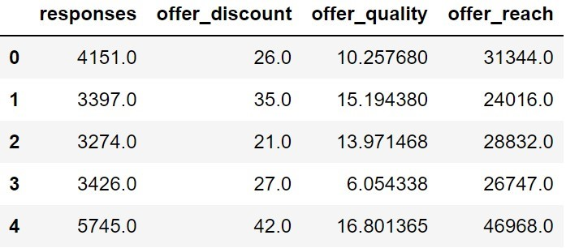
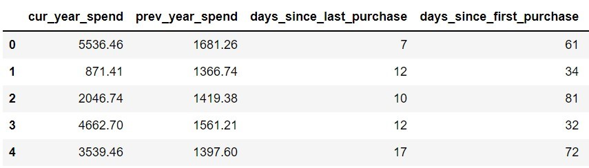
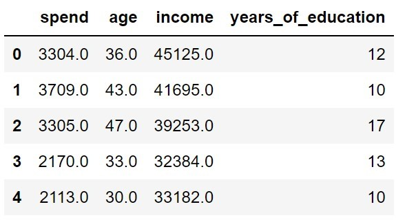
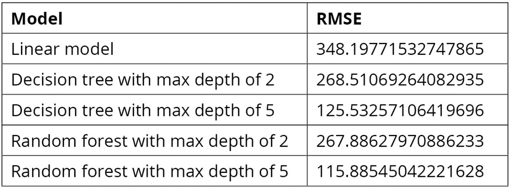

# Lab 07 More Tools and Techniques for Evaluating Regression Models

## **Mục tiêu học tập**
Sau khi hoàn thành bài học này, học viên sẽ có thể:
- Hiểu rõ nhu cầu và tầm quan trọng của customer segmentation
- Nắm vững thuật toán K-means và ứng dụng trong phân khúc khách hàng
- Thực hiện phân tích thống kê mô tả và tổng hợp dữ liệu
- Sử dụng các công cụ Python để thực hiện segmentation
- Phân tích và diễn giải kết quả phân khúc khách hàng
- Áp dụng các kỹ thuật nâng cao trong customer segmentation

---

## **Bài tập Thực hành**
### Bài tập cơ bản

#### **Exercise 6.01: Evaluating Regression Models of Location Revenue Using the MAE and RMSE**
A chain store has narrowed down five predictors it thinks will have an impact on the revenue of one of its store outlets. Those are the number of competitors, the median income in the region, the number of loyalty scheme members, the population density in the area, and the age of the store. The marketing team has had the intuition that the number of competitors may not be a significant contributing factor to the revenue. Your task is to find out if this intuition is correct.
In this exercise, you will calculate both the MAE and RMSE for models built using the store location revenue data used in Chapter 5, Predicting Customer Revenue Using Linear Regression. You will compare models built using all the predictors to a model built excluding one of the predictors. This will help in understanding the importance of the predictor in explaining the data. If removing a specific predictor results in a high drop in performance, this means that the predictor was important for the model, and should not be dropped.

_Perform the following steps to achieve the aim of the exercise:_

**Code:**

```python
# 1. Import pandas and use it to create a DataFrame from the data in  location_rev.csv.
#    Call this DataFrame df, and view the first five rows using the head function:
import pandas as pd
df = pd.read_csv('location_rev.csv')
df.head()

# 2. Import train_test_split from sklearn. Define the y variable as revenue, and X as num_competitors,
#    median_income,  num_loyalty_members, population_density, and location_age:
from sklearn.model_selection import train_test_split
X = df[['num_competitors','median_income', 'num_loyalty_members',
        'population_density','location_age']]
y = df['revenue']

# 3. Perform a train-test split on the data, using random_state=15,
#    and save the results in X_train, X_test, y_train, and y_test:
X_train, X_test, y_train, y_test = train_test_split\
                                   (X, y, random_state = 15)

# 4. Import LinearRegression from sklearn, and use it to fit
#    a linear regression model to the training data:
from sklearn.linear_model import LinearRegression
model = LinearRegression() model.fit(X_train,y_train)

# 5.	Get the model's predictions for the X_test data, and
#     store the result in a variable called predictions:
predictions = model.predict(X_test)

# 6.	Instead of calculating the RMSE and the MAE yourselves, you can import
#     functions from sklearn to do this for you. Note that sklearn only contains
#     a function to calculate the MSE, so we need to take the root of this value to get the RMSE
#     (that's where the 0.5 comes in). Use the following code to calculate the RMSE and MAE:
from sklearn.metrics import mean_squared_error, mean_absolute_error
print('RMSE: ' + str(mean_squared_error(predictions, y_test)**0.5))
print('MAE: ' + str(mean_absolute_error(predictions, y_test)))

# 7.	Now, rebuild the model after dropping num_competitors from the predictors
#     and evaluate the new model. Create X_train2 and X_test2 variables by dropping
#     num_competitors from X_train and X_test. Train a model using X_train2 and
#     generate new predictions from this model using  X_test2:
X_train2 = X_train.drop('num_competitors', axis=1)
X_test2 = X_test.drop('num_competitors', axis=1)
model.fit(X_train2, y_train)
predictions2 = model.predict(X_test2)

# 8.	Calculate the RMSE and MAE for the new model's predictions
#     and print them out, as follows:
print('RMSE: ' +  str(mean_squared_error(predictions2, y_test)**0.5))
print('MAE: ' + str(mean_absolute_error(predictions2, y_test)))

```

---

#### **Activity 6.01: Finding Important Variables for Predicting Responses to a Marketing Offer**
You have been given some data regarding a company's marketing campaign, wherein discounts were offered for various products. You are interested in building a model that predicts the number of responses to an offer. It should also provide information about how much of a discount the offer included (offer_discount), how many customers the offer reached (offer_reach), and a value representing the offer quality that the marketing team assigned to that offer (offer_quality). You want to build a model that is accurate but does not contain unnecessary variables. Use the RMSE to evaluate how the model performs when all variables are included and compare this to what happens when each variable is dropped from the model. This will then help in finding the most important variables for predicting the number of responses to a marketing offer. Follow the steps given here:
1. Import pandas, read in the data from offer_responses.csv, and use the head function to view the first five rows of the data. Your output should appear as follows:



2.	Import train_test_split from sklearn and use it to split the data into training and test sets, using responses as the y variable and all others as the predictor (X) variables. Use random_state=10 for the train-test split.

3.	Import LinearRegression and mean_squared_error from sklearn. Fit the model to the training data (using all the predictors), get predictions from the model on the test data, and print out the calculated RMSE on the test data. The RMSE with all variables should be approximately 966.2461828577945.

4.	Create X_train2 and X_test2 by dropping offer_quality from X_train and X_test. Train and evaluate the RMSE of the model using X_train2 and X_test2. The RMSE without offer_quality should be approximately 965.5346123758474.

5.	Perform the same sequence of steps from step 4, but this time dropping offer_ discount instead of offer_quality. The RMSE without offer_discount should be approximately 1231.6766556327284.

6.	Perform the same sequence of steps, but this time dropping offer_ reach. The RMSE without offer_reach should be approximately 1185.8456831644114.

**Code:**

```python
```

---

#### **Exercise 6.02: Using RFE for Feature Selection**
For this exercise, you've been given data of the revenue of stores at different locations, and a series of 20 scores based on internal metrics in the **20scores.csv** file. You aren't told what the scores mean, but are asked to build a predictive model that uses as few of these scores as possible without sacrificing the ability to predict the location revenue.

**Code:**

```python
# 1. Import pandas, read the data from 20scores.csv into a DataFrame called df,
#     and display the first five rows of data using the head function:
import pandas as pd
df = pd.read_csv('20scores.csv')
df.head()

# 2.	Extract the target variable (y) and the predictor variable (X) from the data:
x_cols = df.columns[1:] X = df[x_cols]
y = df['revenue']

# 3.	Import train_test_split and perform a train-test split on the data with random_state=10,
#     storing revenue in the y variable and all other features in the X variable:
from sklearn.model_selection import train_test_split
X_train, X_test, y_train, y_test = train_test_split(X, y, random_state = 10)

# 4.	Import LinearRegression from sklearn and fit a linear regression model on the training data:
from sklearn.linear_model import LinearRegression
model = LinearRegression() model.fit(X_train,y_train)

# 5.	Look at the model's coefficients using the following code:
model.coef_

# 6.	Now import RFE from sklearn. Use a LinearRegression model as 
#     the estimator, which RFE will use in every iteration.
#     Moreover, you will need to specify the number of features you want to select.
#     For now, keep only five features:
from sklearn.feature_selection import RFE
rfe = RFE(estimator=LinearRegression(), n_features_to_select=5)

# 7.	Train the RFE model you just created in the previous step on
#     the training data using the following command:
rfe.fit(X_train,y_train)

#     This will provide the following output:
#     RFE(estimator=LinearRegression(copy_X=True, fit_intercept=True, n_jobs=None,
#     normalize=False), n_features_to_select=5, step=1, verbose=0)

 # 8.	Print the columns that were selected by RFE along with their ranks:
for featureNum in range(X_train.shape[1]):   # If feature was selected   if rfe.support_[featureNum] == True:
    # Print feature name and rank
    print("Feature: {}, Rank: {}".format(X_train.columns[featureNum], rfe.ranking_[featureNum]))

# 9.	Using the preceding information, now create a reduced dataset having only the columns selected by RFE:
X_train_reduced = X_train[X_train.columns[rfe.support_]]
X_test_reduced = X_test[X_train.columns[rfe.support_]]

# 10.	Next, use the reduced training dataset to fit a new linear regression model:
rfe_model = LinearRegression() rfe_model.fit(X_train_reduced,y_train)

# 11.	Import mean_squared_error from sklearn and use it
#     to calculate the RMSE of the linear regression model on the test data:
from sklearn.metrics import mean_squared_error
predictions = model.predict(X_test)
print(mean_squared_error(predictions, y_test)**0.5)

#     The output should be similar to 491.78833768572633. 

# 12.	Similarly, calculate the RMSE of the model generated in step 9 on the test data:
rfe_predictions = rfe_model.predict(X_test_reduced)
print(mean_squared_error(rfe_predictions, y_test)**0.5)

```

---

#### **Activity 6.02: Using RFE to Choose Features for Predicting Customer Spend**
You've been given the following information (features) regarding various customers: prev_year_spend: How much they spent in the previous year days_since_last_purchase: The number of days since their last purchase days_since_first_purchase: The number of days since their first purchase total_transactions: The total number of transactions age: The customer's age income: The customer's income
engagement_score: A customer engagement score, which is a score created based on customers' engagement with previous marketing offers. 
You are asked to investigate which of these is related to the customer spend in the current year (cur_year_spend). You'll also need to create a simple linear model to describe these relationships. 
Follow the steps given here:
1. Import pandas, use it to read in the data in customer_spend.csv, and use the head function to view the first five rows of data. The output should appear as follows:



2.	Use train_test_split from sklearn to split the data into training and test sets, with random_state=100 and cur_year_spend as the y variable:
3.	Use RFE to obtain the three most important features and obtain the reduced versions of the training and test datasets by using only the selected columns.
4.	Train a linear regression model on the reduced training dataset and calculate the RMSE value on the test dataset. 
The RMSE value should be approximately 1075.9083016269915.

   
**Code:**

```python

```

---

#### **Exercise 6.03: Using Tree-Based Regression Models to Capture Non-Linear Trends**
In this exercise, you'll look at a very simple dataset where you have data on customers' spend and their ages. You want to figure out how spending habits change with age in your customers, and how well different models can capture this relationship. Having a model like this can help in building age-specific website patterns for your customers since you will be able to recommend products that suit the customers' spend levels.
Perform the following steps to achieve the aim of this exercise:

**Code:**

```python
# 1. Import pandas and use it to read in the data in age_spend.csv.
#     Use the head function to view the first five rows of the data:
import pandas as pd
df = pd.read_csv('age_spend.csv')
df.head()

# 2.	Extract the target variable (y) and the predictor variable (X) from the data:
X = df[['age']]
y = df['spend']

# 3.	Import train_test_split from sklearn and use it to perform
#     a train-test split of the data, with random_state=10 and y
#     being the spend and X being the age:
from sklearn.model_selection import train_test_split
X_train, X_test, y_train, y_test = train_test_split(X, y, random_state = 10)

# 4.	Import DecisionTreeRegressor from sklearn and fit two decision trees
#     to the training data, one with max_depth=2 and one with max_depth=5:
from sklearn.tree import DecisionTreeRegressor

max2_tree_model = DecisionTreeRegressor(max_depth=2)
max2_tree_model.fit(X_train,y_train)

max5_tree_model = DecisionTreeRegressor(max_depth=5)
max5_tree_model.fit(X_train,y_train)

# 5.	Import LinearRegression from sklearn and fit
#     a linear regression model to the training data, as shown:
from sklearn.linear_model import LinearRegression
model = LinearRegression()
model.fit(X_train,y_train)

#     You will get the following output:
#     LinearRegression(copy_X=True, fit_intercept=True, n_jobs=None, normalize=False)

# 6.	Import mean_squared_error from sklearn. For the linear model and
#     the two regression tree models, get predictions from the model for
#     the test set and use these to calculate the RMSE. Use the following code:
from sklearn.metrics import mean_squared_error

linear_predictions = model.predict(X_test)
print('Linear model RMSE: ' + str(mean_squared_error(linear_predictions, y_test)**0.5))

max2_tree_predictions = max2_tree_model.predict(X_test)
print('Tree with max depth of 2 RMSE: ' + str(mean_squared_error(max2_tree_predictions, y_test)**0.5))

max5_tree_predictions = max5_tree_model.predict(X_test)
print('tree with max depth of 5 RMSE: ' + 
      str(mean_squared_error(max5_tree_predictions, y_test)**0.5))

# 7.	Import matplotlib. Create a variable called ages to store
#     a DataFrame with a single column containing ages from 18 to 70,
#     so that we can have our models give us their predictions for all these ages:
import matplotlib.pyplot as plt
%matplotlib inline

ages = pd.DataFrame({'age':range(18,70)})

# 8.	Create a scatter plot with the test data and, on top of it,
#     plot the predictions from the linear regression model for the range of ages.
#     Plot with color='k' and linewidth=5 to make it easier to see:
plt.scatter(X_test.age.tolist(), y_test.tolist(), color='gray')
plt.plot(ages,model.predict(ages), color='k', linewidth=5, label="Linear Regression")
plt.xlabel("age") plt.ylabel("spend")
plt.show()

# 9. Create another scatter plot with the test data, this time plotting the predictions of
#     the max2_tree model on top with color='k' and linewidth=5:
plt.scatter(X_test.age.tolist(), y_test.tolist(), color='gray')
plt.plot(ages,max2_tree_model.predict(ages),
         color='k',linewidth=5,label="Tree with max depth 2")
plt.xlabel("age")
plt.ylabel("spend")
plt.show()

# 10. Create one more scatter plot with the test data, this time plotting
#     the predictions of the max5_tree model on top with color='k' and linewidth=5:
plt.scatter(X_test.age.tolist(), y_test.tolist(), color='gray')
plt.plot(ages,max5_tree_model.predict(ages), color='k',
          linewidth=5, label="Tree with max depth 5")
plt.xlabel("age")
plt.ylabel("spend")
plt.show()

# 11.	Let's now perform random forest regression on the same data.
#     Import RandomForestRegressor from sklearn.
#     Fit two random forest models with random_state=10, one with max_depth=2 and
#     the other with  max_depth=5, and save these as
#     max2_forest_model and  max5_forest_model, respectively:
from sklearn.ensemble import RandomForestRegressor
max2_forest_model = RandomForestRegressor(max_depth=2, random_state=10)
max2_forest_model.fit(X_train,y_train)

max5_forest_model = RandomForestRegressor(max_depth=5, random_state=10)
max5_forest_model.fit(X_train,y_train)

#     You will get the following output:
#     RandomForestRegressor(max_depth=5, random_state=10)

# 12.	Calculate and print the RMSE for the two random forest models using the following code:
max2_forest_predictions = max2_forest_model.predict(X_test)
print('Max depth of 2 RMSE: ' +
      str(mean_squared_error(max2_forest_predictions,  y_test)**0.5))

max5_forest_predictions = max5_forest_model.predict(X_test)
print('Max depth of 5 RMSE: ' + 
      str(mean_squared_error(max5_forest_predictions, y_test)**0.5))

# 12. To further examine the relationship, you can use correlation.
#     Use the corrcoef method from NumPy to calculate the correlation between
#     the predicted and the actual values of revenue_2020 for the test data:
np.corrcoef(model.predict(X_test), y_test)

# 13. Create another scatter plot with the test data, this time plotting the predictions of
#     the max2_forest_model model on top with color='k' and linewidth=5:
plt.scatter(X_test.age.tolist(), y_test.tolist(),color='gray')
plt.plot(ages,max2_forest_model.predict(ages), color='k',
         linewidth=5, label="Forest with max depth 2")
plt.xlabel("age")
plt.ylabel("spend")
plt.show()

# 14. Create another scatter plot with the test data, this time plotting
#     the predictions of the max2_forest_model model on top with color='k' and linewidth=5:
plt.scatter(X_test.age.tolist(), y_test.tolist(), color='gray')
plt.plot(ages,max5_forest_model.predict(ages), color='k',
         linewidth=5, label="Forest with max depth 5")
plt.xlabel("age")
plt.ylabel("spend")
plt.show()

# Again, in the model, the greater maximum depth does an even better job of capturing the relationship, properly capturing the sharp decline in the oldest and youngest population groups.
The preceding results can easily be clubbed together to create the plot shown here, which presents a nice comparison of using different max_depth attributes while training the random forest model. The code used to generate the plot is given here:
plt.figure(figsize=(12,8)) plt.scatter(X_test.age.tolist(), y_test.tolist()) plt.plot(ages,model.predict(ages), color='r', linewidth=5, \          label="Linear Regression") plt.plot(ages,max2_tree_model.predict(ages), color='g',\          linewidth=5,label="Tree with max depth 2") plt.plot(ages,max5_tree_model.predict(ages), color='k',\          linewidth=5, label="Tree with max depth 5") plt.plot(ages,max2_forest_model.predict(ages), color='c',\          linewidth=5, label="Forest with max depth 2") plt.plot(ages,max5_forest_model.predict(ages), color='m',\          linewidth=5, label="Forest with max depth 5") plt.legend() plt.xlabel("age") plt.ylabel("spend") plt.show()


```

---

#### **Activity 6.03: Building the Best Regression Model for Customer Spend Based on Demographic Data**
You are given data of customers' spend at your business and some basic demographic data regarding each customer (age, income, and years of education). You are asked to build the best predictive model possible that can predict, based on these demographic factors, how much a given customer will spend at your business. The following are these high-level steps to solve this activity:
1. Import pandas, read the data in spend_age_income_ed.csv into a DataFrame, and use the head function to view the first five rows of the data. The output should be as follows:



2.	Perform a train-test split with random_state=10.
3.	Fit a linear regression model to the training data.
4.	Fit two regression tree models to the data, one with max_depth=2 and one with max_depth=5.
5.	Fit two random forest models to the data, one with max_depth=2, one with max_depth=5, and random_state=10 for both.
6.	Calculate and print out the RMSE on the test data for all five models.
The following table summarizes the expected output for all the models. The values you get may not be an exact match with these expected values. You may get a deviation of within 5% of these values.




---
## Bài tập tổng hợp

## Bài tập thực hành

### Bài tập 1: Dự đoán giá nhà
```python
"""
Bài tập 1: Sử dụng Boston Housing dataset
1. Load và khám phá dữ liệu
2. Tính MAE và RMSE cho Linear Regression
3. Áp dụng RFE để lựa chọn 5 đặc trưng tốt nhất
4. So sánh Decision Tree và Random Forest
5. Chọn mô hình tốt nhất và giải thích lý do
"""

from sklearn.datasets import load_boston
import warnings
warnings.filterwarnings('ignore')

# Load dữ liệu
boston = load_boston()
X_boston = pd.DataFrame(boston.data, columns=boston.feature_names)
y_boston = boston.target

print("Bài tập 1: Hoàn thành các bước sau")
print("1. Khám phá dữ liệu Boston Housing")
print("2. Chia train/test (80/20)")
print("3. Áp dụng các kỹ thuật đã học")
print("4. So sánh và lựa chọn mô hình tối ưu")
```

### Bài tập 2: Feature Engineering và Model Comparison
```python
"""
Bài tập 2: Tạo dữ liệu tùy chỉnh
1. Tạo dataset với 1000 mẫu, 10 features (5 relevant, 5 noise)
2. Sử dụng RFE với các mô hình khác nhau làm estimator
3. So sánh hiệu quả của RFE với Linear Regression và Random Forest
4. Phân tích feature importance và ranking
"""

print("Bài tập 2: Feature Engineering Challenge")
print("Tạo một pipeline hoàn chỉnh từ raw data đến model selection")
```

### Bài tập 3: Real-world Application
```python
"""
Bài tập 3: Ứng dụng thực tế
Scenario: Bạn là data scientist tại một công ty e-commerce
Nhiệm vụ: Dự đoán giá trị đơn hàng của khách hàng

Features có sẵn:
- Tuổi khách hàng
- Số lượng sản phẩm đã xem
- Thời gian trên website
- Lịch sử mua hàng
- Loại membership

Yêu cầu:
1. Thiết kế pipeline đánh giá mô hình
2. Sử dụng tất cả kỹ thuật đã học
3. Đưa ra khuyến nghị business
4. Tạo visualization cho stakeholders
"""

print("Bài tập 3: E-commerce Order Value Prediction")
print("Áp dụng tất cả kiến thức vào bài toán thực tế")
```

---

## Hướng dẫn chấm điểm và đánh giá

### Rubric cho các bài tập:

**Bài Tập 1 (Cơ bản)**:
- Code functionality (40%)
- Data analysis quality (30%) 
- Business insights (20%)
- Presentation (10%)

**Bài Tập 2 (Trung bình)**:
- Technical implementation (35%)
- RFM analysis depth (25%)
- Method comparison (20%) 
- Strategic recommendations (20%)

**Bài Tập 3 (Nâng cao)**:
- Advanced techniques usage (30%)
- Feature engineering creativity (25%)
- Business impact analysis (25%)
- Innovation and insights (20%)

### Tiêu chí đánh giá chung:
- **Xuất sắc (90-100%)**: Vượt expectation, có insights độc đáo
- **Tốt (80-89%)**: Hoàn thành tốt tất cả requirements  
- **Khá (70-79%)**: Hoàn thành cơ bản với một số thiếu sót
- **Trung bình (60-69%)**: Hoàn thành một phần, thiếu insights
- **Yếu (<60%)
