# Lab 10 Multiclass Classification Algorithms


## **Mục tiêu học tập**
Sau khi hoàn thành bài học này, học viên sẽ:
1. Hiểu và triển khai các thuật toán giải quyết bài toán phân loại đa lớp trong marketing analytics
2. Thành thạo các loại classifier khác nhau sử dụng thư viện scikit-learn
3. Diễn giải các chỉ số đánh giá micro và macro performance cho bài toán multiclass
4. Áp dụng các kỹ thuật sampling để giải quyết vấn đề dữ liệu không cân bằng
5. Vận dụng thuật toán và metric phù hợp cho bài toán thực tế
---

## **Bài tập Thực hành**
### Bài tập cơ bản

#### **Exercise 9.01: Implementing a Multiclass Classification Algorithm on a Dataset**

Consider the **Segmentation.csv** dataset. This dataset contains the transactions of customers for a UK-based online store from 2010 to 2011. **Segmentation.csv** contains several features describing customer transactions as well as the customers' relations with the store. You will read about these features in detail shortly. 

The manager of this store has reached out to you to help increase their sales by properly segmenting the customers into different categories, for example, loyal customer, potential customer, fence sitter, and more. The store will use this knowledge to give segment-specific discounts to their customers, which would help in increasing their sales and shifting more customers to the loyal customer category.

Since there are more than two classes, the given problem falls under the category of multiclass classification. You will have access to the following features of the dataset:
•	**Frequency**: The number of purchases made by the customer.
•	**Recency**: How recently the customer bought from the online retailer (in days).
•	**MonetaryValue**: The total amount spent by the customer between 2010 and 2011.
•	**Tenure**: How long the customer has been associated with the retailer (in days).
•	**Segment**: Which segment the customer belongs to; that is, are they a loyal customer or a potential customer? With the help of segment details, marketing campaigns can be targeted effectively.
Given the segment details of the customer, you need to classify which segment a sample customer belongs to. You need to implement a multiclass classification algorithm to classify the customers into the three different classes using **OneVsRestClassifier** and **OneVsOneClassifier**. For both the classifiers, you will be using **LinearSVC** as the base classifier.

_Perform the following steps to achieve the goal of this exercise:_

**Code:**

```python
# 1.	Import OneVsRestClassifier, OneVsOneClassifier, and LinearSVC and create a new pandas 
# 	DataFrame named segmentation.	Also, import the numpy module for any computations that you will be doing 
# 		on the DataFrame. Read the Segmentation.csv file into it:
import pandas as pd
import numpy as np
from sklearn.multiclass import OneVsRestClassifier, OneVsOneClassifier
from sklearn.svm import LinearSVC

segmentation = pd.read_csv('Segmentation.csv')

# 2.	Load all the features and the target to variables X and y, respectively.
# 		You will also have to drop CustomerID since it is going to be different for each customer and won't add any  
# 		value to the model.	Also, you will have to remove the Segment column, which is the target variable,
# 		from the features variable (X):

# Putting feature variable to X
X = segmentation.drop(['CustomerID','Segment'],axis=1) # Putting response variable to y y = segmentation['Segment']

# 3.	Fit and predict using the one-versus-all classifier. Use the following code:
OneVsRestClassifier(LinearSVC(random_state=0)).fit(X, y).predict(X)

# 4. Fit and predict using the one-versus-one classifier. Use the following code:
OneVsOneClassifier(LinearSVC(random_state=0)).fit(X, y).predict(X)

```

---

#### **Exercise 9.02: Evaluating Performance Using Multiclass Performance Metrics**

In this exercise, you will continue with the same case study as in _Exercise 9.01, Implementing a Multiclass Classification Algorithm on a Dataset_. This time, you will train a decision tree classifier and evaluate the model using the micro- and macro-averages of the performance metrics discussed in the previous section. For evaluating the model performance, divide (with stratification) the dataset using an 80:20 ratio (train:test) and set random_state to 123. You should be able to achieve a classification report like the following (a variation of up to 5% from the values we got is acceptable):

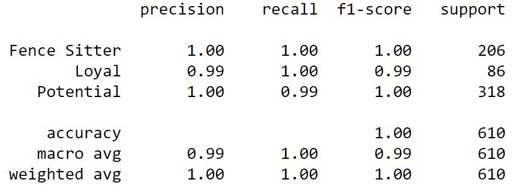

_Perform the following steps to achieve the goal of this exercise:_

**Code:**

```python
# 1.	Import numpy, DecisionTreeClassifier, train_test_split, precision_recall_fscore_support,
# 		classification_report, confusion_matrix, and accuracy_score:
import numpy as np
import pandas as pd

# Importing decision tree classifier from sklearn library
from sklearn.tree import DecisionTreeClassifier
from sklearn.model_selection import train_test_split
"""
Importing classification report and confusion matrix from sklearn metrics
"""
from sklearn.metrics import classification_report, confusion_matrix, accuracy_score
from sklearn.metrics import precision_recall_fscore_support

# 2.	Load the Segmentation.csv dataset into a variable called segmentation:
segmentation = pd.read_csv('Segmentation.csv')

# 3.	Check the first five rows of the DataFrame using the head() function:
segmentation.head()

# 4. Print the summary of the DataFrame using the info() command and check whether there are any missing values:
segmentation.info()

# 5. Use the value_counts() function to find the number of customers in each segment:
segmentation['Segment'].value_counts()

# 6.	Split the data into training and testing sets and store it in the X_train,  X_test, y_train,
# 		and y_test variables, as follows:

# Putting feature variable to X
X = segmentation.drop(['CustomerID','Segment'],axis=1)

# Putting response variable to y
y = segmentation['Segment']
X_train, X_test, y_train, y_test = train_test_split(X,y,test_size=0.20, random_state=123, stratify=y)

# 7.	Store the DecisionTreeClassifier model in the model variable and fit the classifier to the training set.
# 		Store the fitted model in the clf variable:
model = DecisionTreeClassifier() clf = model.fit(X_train,y_train)

# 8.	Use the predict function of the classifier to predict on the test data and store the results in y_pred:
y_pred=clf.predict(X_test)

# 9.	Fit the macro-averaging and the micro-averaging using the  precision_recall_fscore_support function.
# 		The  precision_recall_fscore_support function can directly calculate the metrics for
# 		the micro-average and macro-average, as follows:
precision_recall_fscore_support(y_test, y_pred, average='macro')
precision_recall_fscore_support(y_test, y_pred, average='micro')

# 10.	You can also calculate more detailed metrics statistics using the classification_report function.
# 		Generate the classification report using the y_test and y_pred variables:
print(classification_report(y_test, y_pred))

```

---

#### **Activity 9.01: Performing Multiclass Classification and Evaluating Performance**

You have been provided with data on the annual spend amount of each of the 20,000 customers of a major retail company. The marketing team of the company used different channels to sell their goods and has segregated customers based on the purchases made using different channels, which are as follows: 
•	**0**: Retail
•	**1**: Roadshow
•	**2**: Social media
•	**3**: Television

As a marketing analyst, you are tasked with building a machine learning model that will be able to predict the most effective channel that can be used to target a customer based on the annual spend on the following seven products (features) sold by the company: fresh produce, milk, groceries, frozen products, detergent, paper, and delicatessen.
To complete this task, you will have to train a random forest classifier and evaluate it using a confusion matrix and classification report. 


_Perform the following steps to complete this activity:_

1.	Import the required libraries. You will need the **pandas, numpy, sklearn, matplotlib, and seaborn** libraries in this activity.

2.	Load the marketing data into a DataFrame named data and look at the first five rows of the DataFrame. It should appear as follows:

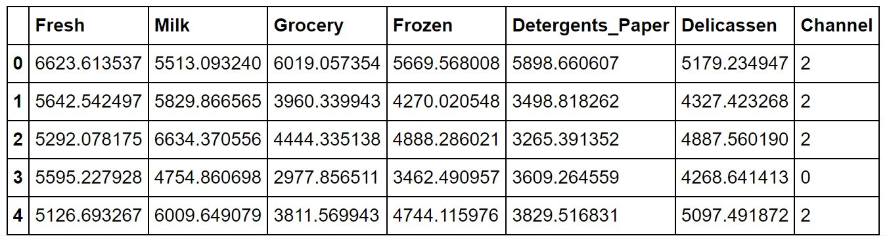

3. Check the shape and the missing values and show a summary report of the data.
The shape should be (20000,7), and there should be no null values in the data. The summary of the data should be as follows:
 
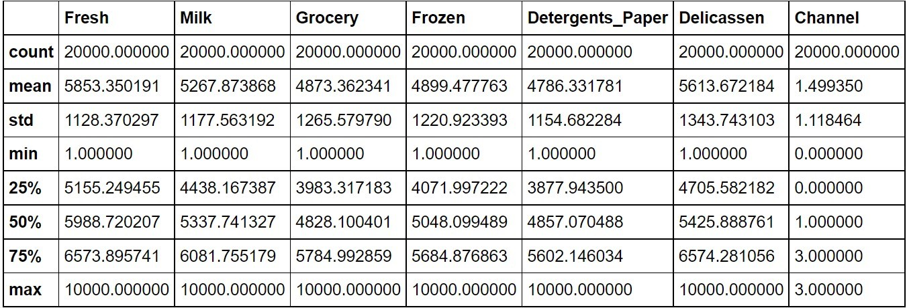

4. Check the target variable, Channel, for the number of transactions for each of the channels. You should get the following output:
 
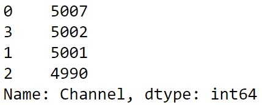

5.	Split the data into training and testing sets using the ratio 80:20 (train:test).

6.	Fit a random forest classifier and store the model in a clf_random variable. Set the number of estimators to 20, the maximum depth to None, and the number of samples to 7 and use random_state=0.

7.	Predict on the test data and store the predictions in y_pred.

8.	Find the micro- and macro-average reports using the  precision_recall_fscore_support function.

9.	Print the classification report. It should look as follows:
 
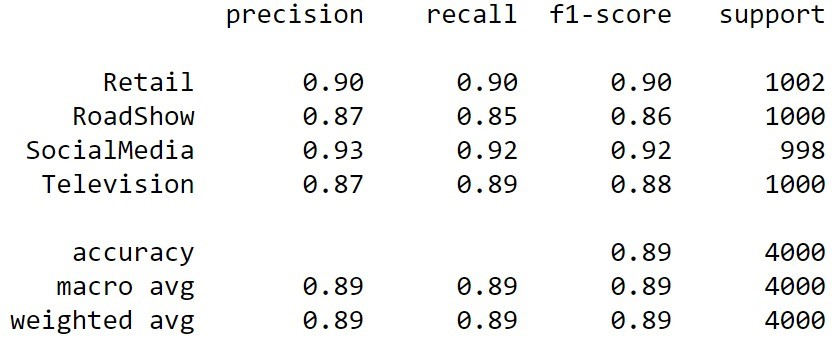

10.	Plot the confusion matrix. It should appear as follows:

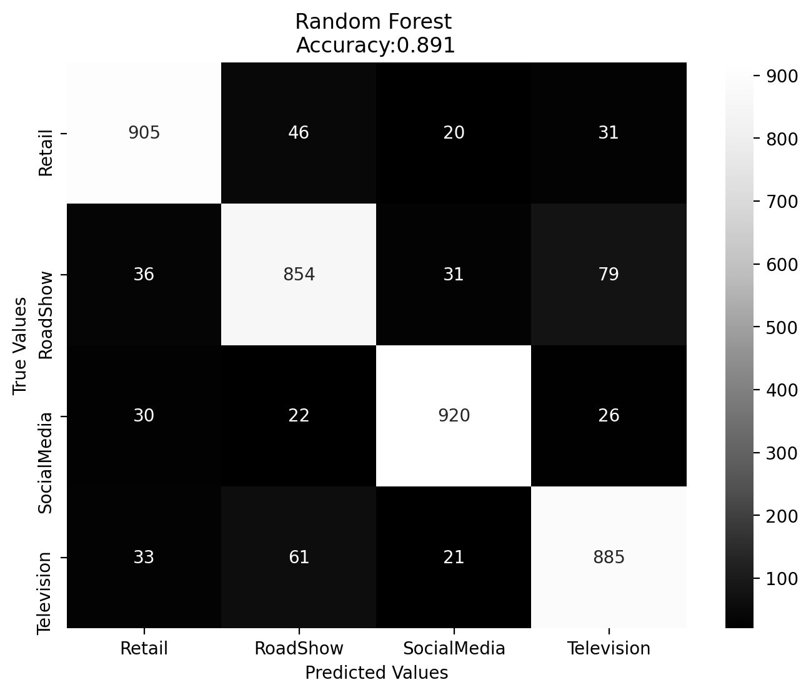

**Code:**

```python

```

---

#### **Exercise 9.03: Performing Classification on Imbalanced Data**

For this exercise, you will be working with an online store company to help classify their customers based on their annual income, specifically, whether it exceeds 50,000 USD or not. The dataset used for this purpose is the Adult Census dataset from UCI.

However, there is a big issue with the dataset. Around 74% of the dataset has people earning less than 50,000 USD; hence, it is a highly imbalanced dataset. In this exercise, you will observe how imbalanced data affects the performance of a model, and why it is so important to modify your process while working on an imbalanced dataset. You will also have to drop the missing values that are stored in the dataset as ? before you start using it for the model training step:

**Code:**

```python
# 1.	Import pandas, RandomForestClassifier, train_test_split, classification_report,
# 		confusion_matrix, accuracy_score, metrics, seaborn, and svm using the following code:
import pandas as pd
import numpy as np

from sklearn.ensemble import RandomForestClassifier
from sklearn.model_selection import train_test_split
from sklearn.metrics import classification_report, confusion_matrix, accuracy_score
from sklearn import metrics

import matplotlib.pyplot as plt
import seaborn as sns

# 2.	Create a DataFrame named data and load adult.csv into it: 
data = pd.read_csv('adult.csv')

# 3.	Check the first five rows of the data DataFrame using the following code:
data.head()

# 4.	As you can see from the output of Step 3, the dataset has some values filled with ?.
# 		Replace them with np.nan:
data.replace('?',np.nan,inplace=True)

# 5.	Drop the rows that contains null values:
data.dropna(inplace=True)

# 6.	Check the number of people earning less than or equal to 50,000 USD and
# 		more than 50,000 USD using the following code:
data['income'].value_counts()

# 7.	You can see in the data.head() output that there are a lot of categorical values in the DataFrame.
# 		To perform classification, you need to convert the categorical values (workclass, education, marital-status,
# 		occupation, relationship, race, gender, native country, and income) into numerical values.
# 		You can use a label encoder for this conversion. 
# 		Label encoders convert categorical values into numerical values:

# Encoding the Categorical values to Numericals using LabelEncoder
from sklearn.preprocessing import LabelEncoder

Labelenc_workclass = LabelEncoder()
data['workclass'] = Labelenc_workclass.fit_transform(data['workclass'])

Labelenc_education = LabelEncoder()
data['education'] = Labelenc_education.fit_transform(data['education'])

Labelenc_marital_status = LabelEncoder()
data['marital-status'] = Labelenc_marital_status.fit_transform(data['marital-status'])

Labelenc_occupation = LabelEncoder()
data['occupation'] = Labelenc_occupation.fit_transform(data['occupation'])

Labelenc_relationship = LabelEncoder()
data['relationship'] = Labelenc_relationship.fit_transform(data['relationship'])

Labelenc_race = LabelEncoder()
data['race'] = Labelenc_race.fit_transform(data['race'])

Labelenc_gender = LabelEncoder()
data['gender'] = Labelenc_gender.fit_transform(data['gender'])

Labelenc_native_country = LabelEncoder()
data['native-country'] = Labelenc_native_country.fit_transform(data['native-country'])

Labelenc_income = LabelEncoder()
data['income'] = Labelenc_income.fit_transform(data['income'])

# 8.	Look at the encoded DataFrame using the following command:
data.head()

# 9.	Put all the independent variables in the variable X and the dependent variable in y:

# Putting feature variable to X
X = data.drop(['income'],axis=1) # Putting response variable to y y = data['income']

# 10.	Split the data into training and testing sets, as shown here:
X_train, X_test, y_train, y_test = train_test_split(X,y, test_size=0.20, random_state=123)

# 11.	Now, fit a random forest classifier using the following code and save the model to a clf_random variable:
clf_random = RandomForestClassifier(random_state=0)
clf_random.fit(X_train,y_train)

# 12.	Predict on the test data and save the predictions to the y_pred variable:
y_pred=clf_random.predict(X_test)

# 13.	Generate the classification report using the following code:
print(classification_report(y_test, y_pred))

# 14. Finally, plot the confusion matrix:
cm = confusion_matrix(y_test, y_pred) 
cm_df = pd.DataFrame(cm, index = ['<=50K', '>50K'], columns = ['<=50K', '>50K'])

plt.figure(figsize=(8,6))

sns.heatmap(cm_df, annot=True,fmt='g',cmap='Greys_r')

plt.title('Random Forest \nAccuracy:{0:.3f}'.format(accuracy_score(y_test, y_pred)))
plt.ylabel('True Values')
plt.xlabel('Predicted Values')
plt.show()

```
---

#### **Exercise 9.04: Fixing the Imbalance of a Dataset Using SMOTE**

In Exercise 9.03, Performing Classification on Imbalanced Data, you noticed that your model was not able to generalize because of imbalanced data and your precision and recall scores were low. In this exercise, you will first resample your dataset using the SMOTE technique to obtain a balanced dataset. Then, you will use the same balanced dataset to fit a random forest classifier (which was initialized in the previous exercise). 

By the end of the exercise, you should be able to see an improvement in model performance for the annual income of more than 50,000 USD class. This should happen since by using SMOTE technique, the number of samples in the minority class (greater than 50,000) would increase, which would fix the issue of overfitting that you saw in the previous exercise. This in turn should increase the number of correctly classified samples for this class (greater than 50,000). You will be able to see this information with the help of the confusion matrix.

_The detailed steps to follow for completing this exercise are as follows:_


**Code:**

```python
# 1.	First, import the imblearn library and the SMOTE function,
# 		which you will be using exclusively in this exercise:
import imblearn
from imblearn.over_sampling import SMOTE

# 2.	Enter the following code to use SMOTE for sampling X_train and y_train data to build your classifier:
X_resampled, y_resampled = SMOTE().fit_resample(X_train,y_train)

# 3.	Fit the random forest classifier on the sampled data using the following code:
clf_random.fit(X_resampled,y_resampled)

# 4.	Predict on the test data:
y_pred=clf_random.predict(X_test)

# 5.	Generate the classification report, as follows:
print(classification_report(y_test, y_pred))

# 6.	Plot the confusion matrix using the following code:
cm = confusion_matrix(y_test, y_pred) 
cm_df = pd.DataFrame(cm, index = ['<=50K', '>50K'], columns = ['<=50K', '>50K'])

plt.figure(figsize=(8,6))

sns.heatmap(cm_df, annot=True,fmt='g',cmap='Greys_r')

plt.title('Random Forest \nAccuracy:{0:.3f}'.format(accuracy_score(y_test, y_pred)))
plt.ylabel('True Values')
plt.xlabel('Predicted Values')
plt.show()

```

---


#### **Activity 9.02: Dealing with Imbalanced Data Using scikit-learn**

A lot of times, banks organize marketing campaigns to inform people about their deposit plans and increase their subscribers of these plans. These campaigns typically involve telephone calls to a large number of people, and based on their dataset, they are then approached one by one to get them on board with their deposit plan. 
In this activity, you will be working on a similar scenario where you will have a dataset collected from a marketing campaign from a Portuguese bank. 

Similar to most campaigns, the same client was approached more than once to check whether they would be interested in a bank term deposit or not. The dataset contains some customer information (such as age, job, and so on) and campaign-related information (such as contact or communication type, day, month, and duration of the contact).
For the next marketing campaign, your company wants to use this data and only contact potential customers who will subscribe to the term deposit, thereby reducing the effort needed to contact those customers who are not interested. For this, you need to create a model that will be able to predict whether customers will subscribe to the term deposit (variable y). 

_To complete this activity, please follow the steps given here:_

1.	Import all the necessary libraries. You will primarily be working with the sklearn, numpy, pandas, matplotlib, and seaborn modules.

2.	Read the dataset into a pandas DataFrame named bank and look at the first five rows of the data. Your output should be as follows:

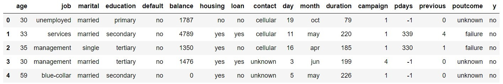

3.	Rename the y column Target. This will add readability to the dataset.

4.	Replace the no values with 0 and yes with 1. This will help in converting the string-based classes to numerical classes, which would make further processing easier.

5.	Check the shape and missing values in the data. The shape should be (4334,17) and there should be no missing values.

6.	Use the describe function to check the continuous and categorical values. You should get the following output for continuous variables:
 
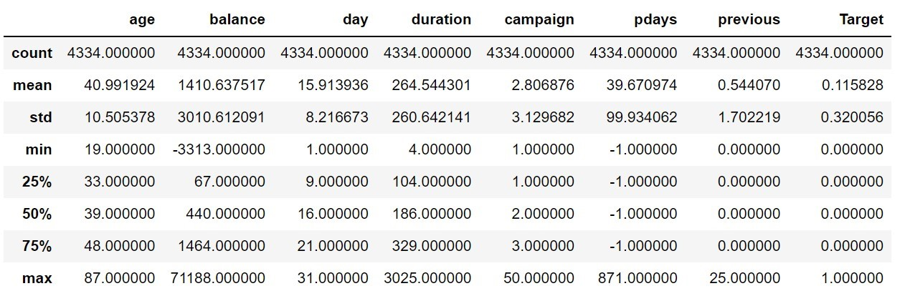

You will get the following output for categorical variables:
 
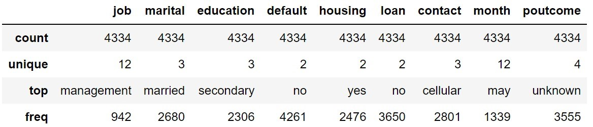

7. Check the count of the class labels present in the target variable. You should get the following output:
 
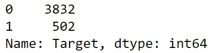

8.	Use the cat.codes function to encode the job, marital, default, housing, loan, contact, and poutcome columns. Since education and month are ordinal columns, convert them as follows:

a)	Replace primary education with 0, secondary education with 1, and tertiary education with 2.

b)	Replace the months January to December with their corresponding month number, 1 to 12.

9.	Check the first five rows of the bank data after the conversion. You will get the following output:
 
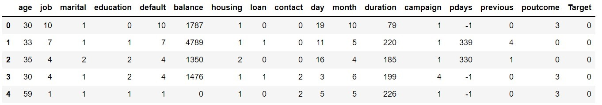

10.	Split the data into training and testing sets using the train_test_split function. Use a ratio of 85:15 (train:test) for splitting the dataset.

11.	Check the number of items in each class in y_train and y_test using the value_counts method. You should get the following output for the number of entries in each class in y_train:
 
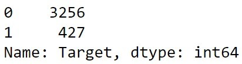

You should get the following output for the number of entries in each class  in y_test:
 
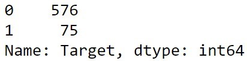

12.	Use the standard_scalar function to scale the X_train and X_test data. Assign it to the X_train_sc and X_test_sc variables.

13.	Call the random forest classifier with the n_estimators=20,  max_depth=None, min_samples_split=7, and  random_state=0 parameters.

14.	Fit the random forest model on the training dataset.

15.	Predict on the test data using the random forest model.

16.	Use the predictions and the ground-truth classes for test data to get the classification report. You should get the following output:
 
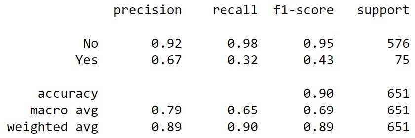

17. Get the confusion matrix for the trained random forest model. You should get the output similar to the following (a variation of up to 5% is acceptable):
 
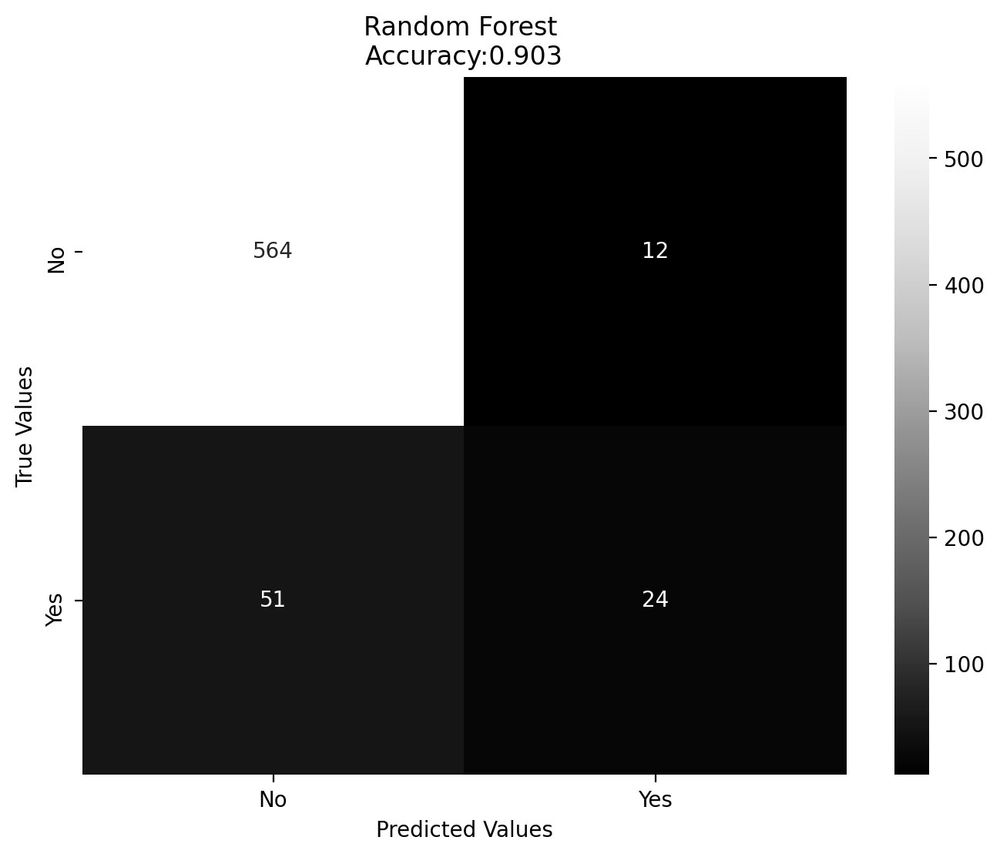

18.	Use the smote() function on x_train and y_train to convert the imbalanced dataset into a balanced dataset. Assign it to the x_resampled and y_resampled variables, respectively.

19.	Use standard_scalar to fit on x_resampled and x_test. Assign it to the X_train_sc_resampled and X_test_sc variables.

20.	Fit the random forest classifier on X_train_sc_resampled and  y_resampled.

21.	Predict on X_test_sc and use the predictions and ground-truth classes to generate the classification report. It should look as follows (variation of up to 5% is acceptable):
 
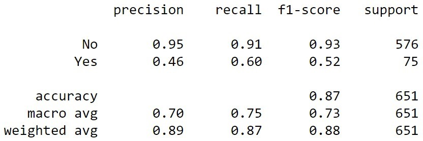

22. Plot the confusion matrix for the new trained random forest model. It should appear as follows (a variation of up to 5% is acceptable):
 


---

### Bài tập tổng hợp

#### Bài tập 1: Customer Segmentation cho E-commerce

**Mô tả:** Bạn là Data Analyst cho một công ty e-commerce. Công ty muốn phân loại khách hàng thành 4 nhóm dựa trên hành vi mua hàng để thiết kế chiến lược marketing phù hợp.

**Dữ liệu:** 
```python
# Tạo dữ liệu thực hành
np.random.seed(123)
n_customers = 2000

# Features
data = {
    'age': np.random.normal(35, 12, n_customers),
    'annual_income': np.random.normal(50000, 15000, n_customers),
    'spending_score': np.random.normal(50, 20, n_customers),
    'online_hours_per_week': np.random.normal(10, 5, n_customers),
    'num_purchases_last_year': np.random.poisson(15, n_customers),
    'avg_order_value': np.random.normal(75, 25, n_customers)
}

# Tạo target variable (4 segments)
# Logic: kết hợp thu nhập và spending score
segments = []
for i in range(n_customers):
    income_norm = (data['annual_income'][i] - 35000) / 15000
    spending_norm = (data['spending_score'][i] - 30) / 20
    
    score = income_norm + spending_norm
    if score < -0.5:
        segments.append(0)  # Low Value
    elif score < 0:
        segments.append(1)  # Medium Value
    elif score < 0.5:
        segments.append(2)  # High Value
    else:
        segments.append(3)  # Premium

df_exercise = pd.DataFrame(data)
df_exercise['customer_segment'] = segments

# Tạo một số nhiễu để làm dữ liệu thực tế hơn
noise_indices = np.random.choice(n_customers, size=int(0.1 * n_customers), replace=False)
df_exercise.loc[noise_indices, 'customer_segment'] = np.random.choice(4, len(noise_indices))

print("Dataset Customer Segmentation:")
print(df_exercise.head())
print(f"\nShape: {df_exercise.shape}")
print(f"Phân phối segments: \n{df_exercise['customer_segment'].value_counts().sort_index()}")
```

**Yêu cầu:**
1. **Khám phá dữ liệu (EDA):**
   - Visualize phân phối các features và target
   - Tìm correlation giữa các features
   - Phát hiện outliers

```python
# Code template cho học viên
import matplotlib.pyplot as plt
import seaborn as sns

def explore_customer_data(df):
    """
    TODO: Viết hàm khám phá dữ liệu
    - Plot histogram cho từng feature
    - Tạo correlation heatmap
    - Scatter plot matrix colored by segment
    - Box plots để phát hiện outliers
    """
    pass

# Gọi hàm
explore_customer_data(df_exercise)
```

2. **Preprocessing và Feature Engineering:**
```python
def preprocess_data(df):
    """
    TODO: Tiền xử lý dữ liệu
    - Xử lý outliers (IQR method)
    - Tạo feature mới: spending_ratio = avg_order_value / annual_income
    - Standardize features
    - Split train/test với stratification
    """
    pass

X_processed, y_processed = preprocess_data(df_exercise)
```

3. **Model Development và Comparison:**
```python
def compare_algorithms(X, y):
    """
    TODO: So sánh ít nhất 4 thuật toán:
    - Logistic Regression (OvR và Multinomial)
    - Random Forest
    - SVM (Linear và RBF)
    - Gradient Boosting
    
    Sử dung GridSearchCV để tìm hyperparameters tốt nhất
    Đánh giá bằng 5-fold cross-validation
    """
    pass

best_models = compare_algorithms(X_processed, y_processed)
```

4. **Imbalanced Data Handling:**
```python
# Tạo phiên bản imbalanced của dataset
df_imbalanced = create_imbalanced_version(df_exercise)

def handle_imbalanced_data(X, y):
    """
    TODO: Áp dụng và so sánh các kỹ thuật:
    - SMOTE
    - ADASYN  
    - Random Over/Under Sampling
    - SMOTE + Tomek Links
    
    Đánh giá hiệu quả bằng macro F1-score
    """
    pass
```

#### Bài tập 2: Marketing Campaign Response Prediction

**Scenario:** Công ty muốn dự đoán phản hồi của khách hàng đối với các loại campaign marketing khác nhau.

```python
# Tạo dữ liệu marketing campaign
np.random.seed(456)
n_samples = 3000

marketing_data = {
    'customer_age': np.random.normal(40, 15, n_samples),
    'income': np.random.normal(55000, 20000, n_samples),
    'education_years': np.random.normal(14, 3, n_samples),
    'family_size': np.random.poisson(3, n_samples),
    'days_since_last_purchase': np.random.exponential(30, n_samples),
    'total_spent_last_year': np.random.gamma(2, 500, n_samples),
    'num_web_visits_last_month': np.random.poisson(8, n_samples),
    'complaint_last_year': np.random.binomial(1, 0.1, n_samples)
}

# Target: 5 loại phản hồi
# 0: No Response, 1: Email Interest, 2: Phone Inquiry, 
# 3: Store Visit, 4: Purchase
campaign_responses = np.random.choice(5, n_samples, 
                                    p=[0.4, 0.25, 0.15, 0.12, 0.08])

df_marketing = pd.DataFrame(marketing_data)
df_marketing['campaign_response'] = campaign_responses

print("Marketing Campaign Dataset:")
print(df_marketing['campaign_response'].value_counts().sort_index())
```

**Nhiệm vụ:**

1. **Advanced EDA với Focus on Business:**
```python
def marketing_eda(df):
    """
    TODO: Phân tích chuyên sâu cho marketing:
    - Customer journey analysis (từ No Response đến Purchase)
    - ROI analysis cho từng response type
    - Feature importance analysis
    - Cohort analysis nếu có thể
    """
    pass
```

2. **Feature Engineering for Marketing:**
```python
def create_marketing_features(df):
    """
    TODO: Tạo các features marketing-specific:
    - customer_lifetime_value = total_spent / days_since_first_purchase
    - engagement_score = web_visits * (1 - complaint_rate) 
    - purchase_frequency = total_spent / avg_order_value
    - recency_score = 1 / (1 + days_since_last_purchase)
    """
    pass
```

3. **Cost-Sensitive Learning:**
```python
# Define business costs
response_costs = {
    0: 0,    # No Response - no cost
    1: -2,   # Email Interest - small cost
    2: -5,   # Phone Inquiry - medium cost
    3: -10,  # Store Visit - high cost
    4: 50    # Purchase - high value
}

def cost_sensitive_evaluation(y_true, y_pred, costs):
    """
    TODO: Implement cost-sensitive evaluation
    Tính toán business value thay vì chỉ accuracy
    """
    pass
```

#### Bài tập 3: Advanced Challenge - Multi-Channel Attribution

**Bối cảnh:** Phân tích attribution cho marketing multi-channel để hiểu customer journey.

```python
# Tạo dữ liệu phức tạp hơn
def generate_attribution_data():
    """
    Tạo dữ liệu mô phỏng customer journey qua nhiều touchpoint
    """
    np.random.seed(789)
    n_customers = 5000
    
    # Simulate customer journey
    data = []
    
    for customer_id in range(n_customers):
        # Customer characteristics
        age = np.random.normal(35, 12)
        income = np.random.normal(50000, 15000)
        
        # Journey simulation
        touchpoints = []
        channels = ['social', 'email', 'search', 'display', 'direct']
        
        # Number of touchpoints (1-10)
        n_touchpoints = np.random.poisson(3) + 1
        
        for _ in range(min(n_touchpoints, 10)):
            channel = np.random.choice(channels)
            touchpoints.append(channel)
        
        # Final outcome (5 categories)
        # 0: No conversion, 1: Newsletter signup, 2: Trial, 3: Purchase, 4: Premium
        outcome_prob = min(len(touchpoints) * 0.1 + income/100000, 0.9)
        if np.random.random() < outcome_prob:
            outcome = np.random.choice([1,2,3,4], p=[0.4, 0.3, 0.2, 0.1])
        else:
            outcome = 0
            
        data.append({
            'customer_id': customer_id,
            'age': age,
            'income': income,
            'touchpoints': '|'.join(touchpoints),
            'journey_length': len(touchpoints),
            'outcome': outcome
        })
    
    return pd.DataFrame(data)

df_attribution = generate_attribution_data()
print("Attribution Dataset Sample:")
print(df_attribution.head())
```

**Challenges:**
1. **Sequence Feature Engineering:** Trích xuất features từ customer journey sequence
2. **Imbalanced Multi-class:** Xử lý severe class imbalance
3. **Business Metric Optimization:** Optimize cho business KPIs thay vì accuracy

---

## Hướng dẫn chấm điểm và đánh giá

### Rubric cho các bài tập:

**Bài Tập 1 (Cơ bản)**:
- Code functionality (40%)
- Data analysis quality (30%) 
- Business insights (20%)
- Presentation (10%)

**Bài Tập 2 (Trung bình)**:
- Technical implementation (35%)
- RFM analysis depth (25%)
- Method comparison (20%) 
- Strategic recommendations (20%)

**Bài Tập 3 (Nâng cao)**:
- Advanced techniques usage (30%)
- Feature engineering creativity (25%)
- Business impact analysis (25%)
- Innovation and insights (20%)

### Tiêu chí đánh giá chung:
- **Xuất sắc (90-100%)**: Vượt expectation, có insights độc đáo
- **Tốt (80-89%)**: Hoàn thành tốt tất cả requirements  
- **Khá (70-79%)**: Hoàn thành cơ bản với một số thiếu sót
- **Trung bình (60-69%)**: Hoàn thành một phần, thiếu insights
- **Yếu (<60%)
