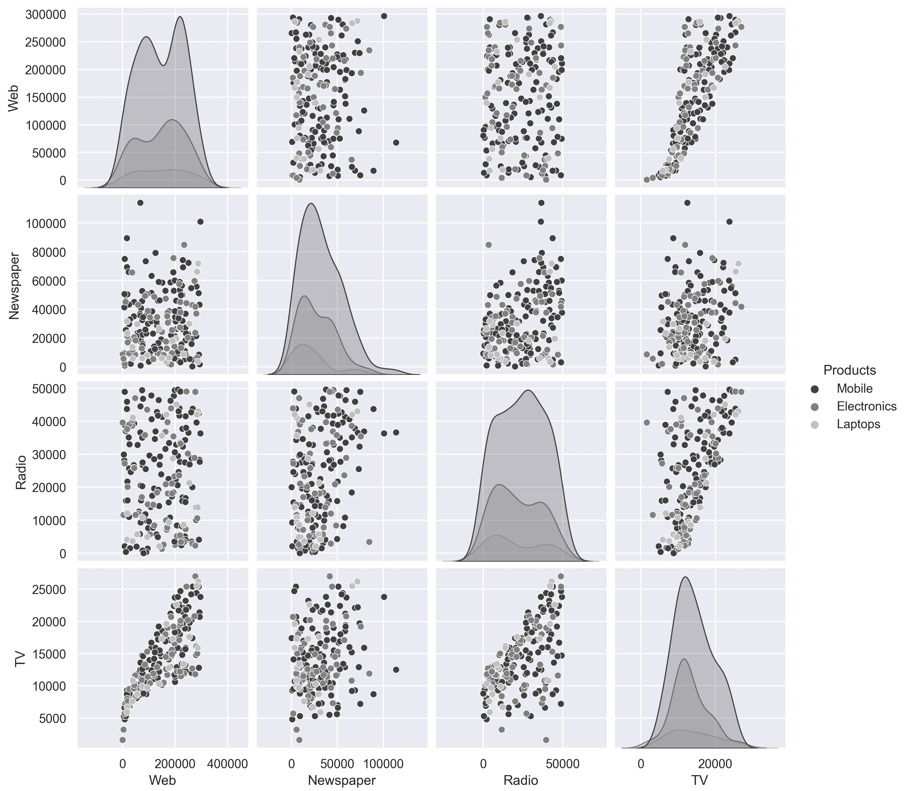

# Lab02 - **Data Exploration and Visualization**

## **Mục tiêu học tập**
Sau khi hoàn thành bài học này, học viên sẽ có khả năng:
- Đọc và import dữ liệu từ các định dạng file khác nhau (CSV, JSON) vào DataFrame
- Thực hiện các thao tác slicing, aggregation và filtering trên DataFrame
- Kết hợp các DataFrame, xử lý dữ liệu thiếu và làm sạch dữ liệu từ nhiều nguồn khác nhau
## **Lý thuyết**
### Phần 1: Đọc và Import Dữ liệu
1. **Cài đặt và Import thư viện**
```python
import pandas as pd
import numpy as np
import json
```
2. **Đọc dữ liệu từ file CSV**
```python
# Đọc file CSV cơ bản
df_csv = pd.read_csv('data.csv')

# Đọc CSV với các tùy chọn nâng cao
df_csv = pd.read_csv('data.csv', 
                     sep=',',           # Ký tự phân cách
                     encoding='utf-8',  # Encoding
                     index_col=0,       # Cột làm index
                     na_values=['N/A', 'NULL', ''])  # Giá trị coi là NaN
```
3. **Đọc dữ liệu từ file JSON**
```python
# Đọc JSON đơn giản
df_json = pd.read_json('data.json')

# Đọc JSON với cấu trúc phức tạp
with open('complex_data.json', 'r', encoding='utf-8') as file:
    json_data = json.load(file)
    df_json = pd.json_normalize(json_data)

# Đọc JSON từ API
df_api = pd.read_json('https://api.example.com/data')
```
4. **Khám phá dữ liệu ban đầu**
```python
# Xem thông tin cơ bản về DataFrame
print(df.info())
print(df.head())
print(df.describe())
print(df.shape)
print(df.columns.tolist())
```
### Phần 2: Slicing, Aggregation và Filtering
1. **Slicing (Cắt lát dữ liệu)**
```python
# Chọn cột
df['column_name']                    # Một cột
df[['col1', 'col2']]                # Nhiều cột

# Chọn hàng
df.loc[0]                           # Hàng theo label
df.iloc[0]                          # Hàng theo vị trí
df.loc[0:5]                         # Slice theo label
df.iloc[0:5]                        # Slice theo vị trí

# Chọn cả hàng và cột
df.loc[0:5, 'col1':'col3']          # Slice hàng và cột
df.iloc[0:5, 0:3]                   # Slice theo vị trí
```
2. **Filtering (Lọc dữ liệu)**
```python
# Filtering cơ bản
df[df['age'] > 25]                  # Điều kiện đơn
df[df['name'].str.contains('John')] # Chứa chuỗi
df[df['date'] > '2023-01-01']       # Điều kiện ngày

# Filtering với nhiều điều kiện
df[(df['age'] > 25) & (df['salary'] > 50000)]  # AND
df[(df['city'] == 'Hanoi') | (df['city'] == 'HCMC')]  # OR

# Filtering với isin()
df[df['category'].isin(['A', 'B', 'C'])]

# Filtering null values
df[df['column'].notna()]            # Không null
df[df['column'].isna()]             # Là null
```
3. **Aggregation (Tổng hợp dữ liệu)**
```python
# Aggregation cơ bản
df['salary'].sum()                  # Tổng
df['age'].mean()                    # Trung bình
df['score'].max()                   # Giá trị lớn nhất
df['score'].min()                   # Giá trị nhỏ nhất
df['category'].count()              # Đếm

# Group by và aggregation
df.groupby('department')['salary'].mean()
df.groupby(['department', 'level']).agg({
    'salary': ['mean', 'sum'],
    'age': 'mean',
    'score': ['min', 'max']
})

# Pivot table
df.pivot_table(values='salary', 
               index='department', 
               columns='level', 
               aggfunc='mean')
```
### **Phần 3: Làm sạch và Kết hợp Dữ liệu**
1. **Xử lý Missing Values (Dữ liệu thiếu)**
```python
# Kiểm tra missing values
df.isnull().sum()                   # Đếm null theo cột
df.isnull().sum().sum()             # Tổng số null
df.info()                           # Thông tin tổng quan

# Xử lý missing values
df.dropna()                         # Xóa hàng có null
df.dropna(axis=1)                   # Xóa cột có null
df.dropna(subset=['important_col']) # Xóa null ở cột cụ thể

# Điền missing values
df.fillna(0)                        # Điền bằng 0
df.fillna(df.mean())               # Điền bằng mean
df.fillna(method='ffill')          # Forward fill
df.fillna(method='bfill')          # Backward fill

# Điền theo nhóm
df['salary'].fillna(df.groupby('department')['salary'].transform('mean'))
```
2. **Xử lý Duplicate Values (Dữ liệu trùng lặp)**
```python
# Kiểm tra và xử lý duplicate
df.duplicated().sum()               # Đếm số hàng trùng
df.drop_duplicates()                # Xóa trùng lặp
df.drop_duplicates(subset=['name', 'email'])  # Xóa trùng theo cột
```
3. **Data Type Conversion (Chuyển đổi kiểu dữ liệu)**
```python
# Chuyển đổi kiểu dữ liệu
df['date'] = pd.to_datetime(df['date'])
df['category'] = df['category'].astype('category')
df['price'] = pd.to_numeric(df['price'], errors='coerce')
```
4. **String Cleaning (Làm sạch chuỗi)**
```python
# Làm sạch text data
df['name'] = df['name'].str.strip()           # Xóa khoảng trắng
df['name'] = df['name'].str.upper()           # Chuyển hoa
df['name'] = df['name'].str.lower()           # Chuyển thường
df['phone'] = df['phone'].str.replace('-', '') # Thay thế ký tự
```
5. **Joining DataFrames (Kết hợp DataFrame)**
```python
# Merge DataFrames
df_merged = pd.merge(df1, df2, on='id', how='inner')  # Inner join
df_merged = pd.merge(df1, df2, on='id', how='left')   # Left join
df_merged = pd.merge(df1, df2, on='id', how='right')  # Right join
df_merged = pd.merge(df1, df2, on='id', how='outer')  # Outer join

# Merge với key khác nhau
df_merged = pd.merge(df1, df2, left_on='customer_id', right_on='id')

# Concatenate DataFrames
df_concat = pd.concat([df1, df2], axis=0)     # Theo hàng
df_concat = pd.concat([df1, df2], axis=1)     # Theo cột
```
## **Bài tập Thực hành**
### Bài tập cơ bản
#### **Exercise 2.01: Exploring the Attributes in Sales Data**
You and your team are creating a marketing campaign for a client. All they've handed you is a file called sales.csv, which as they explained, contains the company's historical sales records. Apart from that, you know nothing about this dataset. 
Using this data, you'll need to derive insights that will be used to create a comprehensive marketing campaign. Not all insights may be useful to the business, but since you will be presenting your findings to various teams first, an insight that's useful for one team may not matter much for the other team. So, your approach would be to gather as many actionable insights as possible and present those to the stakeholders. 


```python
# 1.	Open a new Jupyter Notebook to implement this exercise. Save the file as Exercise2-01.ipnyb.
#     In a new Jupyter Notebook cell, import the pandas library as follows
import pandas as pd

2.	Create a new pandas DataFrame named sales and read the sales.csv file into it.
#     Examine if your data is properly loaded by checking the first few values in
#     the DataFrame by using the head() command:
sales = pd.read_csv('sales.csv') sales.head()

#     Examine the columns of the DataFrame using the following code:
sales.columns

# 4. Use the info function to print the datatypes of columns of sales DataFrame using the following code:
sales.info()

# 5.	To check the time frame of the data, use the unique function on the Year column:
sales['Year'].unique()

# 6.	Use the unique function again to find out the types of products that the company is selling:
sales['Product line'].unique()

# 7.	Now, check the Product type column:
sales['Product type'].unique()

# 8.	Check the Product column to find the unique categories present in it:
sales['Product'].unique()

# 9.	Now, check the Order method type column to find out the ways through which the customer can place an order:
sales['Order method type'].unique()

# 10. Use the same function again on the Retailer country column to find out
#     the countries where the client has a presence:
sales['Retailer country'].unique()

# 11. Now that you have analyzed the categorical values, get a quick summary of
#     the numerical fields using the describe function:
sales.describe()

# 12. Analyze the spread of the categorical columns in the data using the  value_counts() function.
#     This would shed light on how the data is distributed. Start with the Year column:
sales['Year'].value_counts()

# 13. Use the same function on the Product line column:
sales['Product line'].value_counts()

# 14. Now, check for the Product type column:
sales['Product type'].value_counts()

# 15. Now, find out the most popular order method using the following code:
sales['Order method type'].value_counts()

# 16. Finally, check for the Retailer country column along with their respective counts:
sales['Retailer country'].value_counts()

# 17. Get insights into country-wide statistics now. Group attributes such as Revenue,
#     Planned revenue, Product cost, Quantity, and Gross profit by their countries,
#     and sum their corresponding values. Use the following code:
sales.groupby('Retailer country')[['Revenue','Planned revenue', 'Product cost', 'Quantity', 'Gross profit']].sum()

# 18. Now find out the country whose product performance was affected the worst when sales dipped.
#     Use the following code to group data by Retailer country:
sales.dropna().groupby('Retailer country')[['Revenue', 'Planned revenue', Product cost', 'Quantity',
                        'Unit cost', 'Unit price', 'Gross profit', 'Unit sale price']].min()

# 19. Similarly, generate statistics for other categorical variables, such as Year,
#     Product line, Product type, and Product. Use the following code for the Year variable:
sales.groupby('Year')[['Revenue', 'Planned revenue', 'Product cost', Quantity', 'Unit cost',
                       'Unit price', 'Gross profit', 'Unit sale price']].sum()

# 20. Use the following code for the Product line variable:
sales.groupby('Product line')[['Revenue', 'Planned revenue', 'Product cost', 'Quantity', 'Unit cost', 
                               'Unit price', 'Gross profit', 'Unit sale price']].sum()

# 21. Now, find out which order method contributes to the maximum revenue:
sales.groupby('Order method type')[['Revenue', 'Planned revenue', 'Product cost', 'Quantity',
                                    'Gross profit']].sum()

```
#### **Exercise 2.02: Calculating Conversion Ratios for Website Ads.**
You are the owner of a website that randomly shows advertisements A or B to users each time a page is loaded. The performance of these advertisements is captured in a simple file called conversion_rates.csv. The file contains two columns: converted and group. If an advertisement succeeds in getting a user to click on it, the converted field gets the value 1, otherwise, it gets 0 by default; the group field denotes which ad was clicked – A or B. 
As you can see, comparing the performance of these two ads is not that easy when the data is stored in this format. Use the skills you've learned so far, store this data in a data frame and modify it to show, in one table, information about:
1.	The number of views ads in each group got.
2.	The number of ads converted in each group.
3.	The conversion ratio for each group.

Code:

```python
# 1.	Import the pandas library using the import command, as follows:
import pandas as pd

# 2.	Create a new pandas DataFrame named data and read the  conversion_rates.csv file into it.
#     Examine if your data is properly loaded by checking the first few values in the DataFrame
#     by using the head() command:
data = pd.read_csv('conversion_rates.csv')
data.head()

# 3. Group the data by the group column and count the number of conversions. 
#    Store the result in a DataFrame named converted_df:
converted_df = data.groupby('group').sum() converted_df

# 4. We would like to find out how many people have viewed the advertisement.
#    For that use the groupby function to group the data and the count() function
#    to count the number of times each advertisement was displayed.
#    Store the result in a DataFrame viewed_df. Also, make sure you change the column name from
#     converted to viewed:
viewed_df = data.groupby('group').count().rename({'converted':'viewed'},axis = 'columns')
viewed_df

# 5. Combine the converted_df and viewed_df datasets in a new DataFrame, named stats using the following commands:
stats = converted_df.merge(viewed_df, on = 'group') stats

# 6. Create a new column called conversion_ratio that displays the ratio of converted ads to
#     the number of views the ads received:
stats['conversion_ratio'] = stats['converted'] / stats['viewed']
stats

# 7. Create a DataFrame df where group A's conversion ratio is accessed as df['A'] ['conversion_ratio'].
#    Use the stack function for this operation:
df = stats.stack()
df

# 8.	Check the conversion ratio of group A using the following code:
df['A']['conversion_ratio']

# 9.	To bring back the data to its original form we can reverse the rows with the columns in
#    the stats DataFrame with the unstack() function twice:
stats.unstack().unstack()

```

To use the header parameter to make sure that the entries in the first row are read as column names. 
The header = 1 parameter reads the first row as the header:

```python
campaign_data = pd.read_csv("data.csv", header = 1)

 campaign_data.head()
```

Examine the last five rows using the tail() function

```python
campaign_data.tail()
Loading Data from sales.csv
```

Create a new DataFrame called sales.

 ```python
sales = pd.read_csv("sales.csv")
```

Look at the first five rows of the sales DataFrame

```python
sales.head()
```

To check for null values and examine the data types of the columns

```python
sales.info()
```

#### **Exercise 2.03: Visualizing Data With pandas**
In this exercise, you'll be revisiting the sales.csv file you worked on in _Exercise 2.01, Exploring the Attributes in Sales Data_. This time, you'll need to visualize the sales data to answer the following two questions:
1.	Which mode of order generates the most revenue?
2.	How have the following parameters varied over four years: Revenue, Planned revenue, and Gross profit?
You will make use of bar plots and box plots to explore the distribution of the Revenue column.
 
_Perform the following steps to achieve the aim of this exercise:_

Code:

```python
# 1.	Import the pandas library using the import command as follows:
import pandas as pd

# 2.	Create a new panda DataFrame named sales and load the sales.csv file into it.
#     Examine if your data is properly loaded by checking the first few values in the DataFrame by using the head() command:
sales = pd.read_csv("sales.csv")
sales.head()

# 3.	Group the Revenue by Order method type and create a bar plot:
sales.groupby('Order method type').sum().plot(kind = 'bar', y = 'Revenue', color='gray')

# 4.	Now group the columns by year and create boxplots to get an idea on a relative scale:
sales.groupby('Year')[['Revenue', 'Planned revenue', 'Gross profit']].plot(kind= 'box', color='gray')

```
#### **Activity 201: Analyzing Advertisements **
Your company has collated data on the advertisement views through various mediums in a file called Advertising.csv. 
The advert campaign ran through radio, TV, web, and newspaper and you need to mine the data to answer the following questions:
1.	What are the unique values present in the Products column? 
2.	How many data points belong to each category in the Products column?
3.	What are the total views across each category in the Products column?
4.	Which product has the highest viewership on TV?
5.	Which product has the lowest viewership on the web?
Follow the following steps to achieve the aim of this activity:
1.	Open a new Jupyter Notebook and load pandas and the visualization libraries that you will need.
2.	Load the data into a pandas DataFrame named ads and look at the first few rows. Your DataFrame should look as follows:
 
3.	Understand the distribution of numerical variables in the dataset using the describe function. 
4.	Plot the relationship between the variables in the dataset with the help of pair plots. You can use the hue parameter as Products. The hue parameter determines which column can be used for color encoding. Using Products as a hue parameter will show the different products in various shades of gray.
 

### Bài tập tổng hợp
#### **Bài tập 1: Làm sạch dữ liệu khách hàng**
Cho file customers.csv với cấu trúc sau:

- *customer_id, name, email, phone, age, city, registration_date*

Yêu cầu:

Đọc dữ liệu từ file CSV
- Kiểm tra và xử lý missing values
- Chuẩn hóa định dạng email và phone
- Xóa các bản ghi trùng lặp
- Chuyển đổi registration_date sang datetime

```python
# Template giải
import pandas as pd

# 1. Đọc dữ liệu
df = pd.read_csv('customers.csv')

# 2. Kiểm tra missing values
print(df.isnull().sum())

# 3. Xử lý missing values
# Điền age bằng median
df['age'].fillna(df['age'].median(), inplace=True)
# Xóa hàng thiếu email (quan trọng)
df.dropna(subset=['email'], inplace=True)

# 4. Chuẩn hóa dữ liệu
df['email'] = df['email'].str.lower().str.strip()
df['phone'] = df['phone'].str.replace(r'[^0-9]', '', regex=True)
df['name'] = df['name'].str.title().str.strip()

# 5. Xóa trùng lặp
df.drop_duplicates(subset=['email'], inplace=True)

# 6. Chuyển đổi kiểu dữ liệu
df['registration_date'] = pd.to_datetime(df['registration_date'])

print("Dữ liệu sau khi làm sạch:")
print(df.info())
```
#### **Bài tập 2: Phân tích dữ liệu bán hàng**
Cho 2 file:

- *sales.csv: order_id, customer_id, product_id, quantity, order_date*
- *products.json: product_id, product_name, category, price*

Yêu cầu:

- Đọc dữ liệu từ cả 2 file
- Kết hợp dữ liệu từ 2 nguồn
- Tính tổng doanh thu theo category
- Tìm top 5 sản phẩm bán chạy nhất
- Phân tích xu hướng bán hàng theo tháng

```python
# Template giải
import pandas as pd
import json

# 1. Đọc dữ liệu
sales_df = pd.read_csv('sales.csv')
with open('products.json', 'r') as f:
    products_data = json.load(f)
products_df = pd.DataFrame(products_data)

# 2. Kết hợp dữ liệu
merged_df = pd.merge(sales_df, products_df, on='product_id', how='inner')

# Tính revenue
merged_df['revenue'] = merged_df['quantity'] * merged_df['price']

# 3. Tổng doanh thu theo category
revenue_by_category = merged_df.groupby('category')['revenue'].sum().sort_values(ascending=False)
print("Doanh thu theo category:")
print(revenue_by_category)

# 4. Top 5 sản phẩm bán chạy
top_products = merged_df.groupby('product_name')['quantity'].sum().sort_values(ascending=False).head(5)
print("\nTop 5 sản phẩm bán chạy:")
print(top_products)

# 5. Xu hướng theo tháng
merged_df['order_date'] = pd.to_datetime(merged_df['order_date'])
merged_df['month'] = merged_df['order_date'].dt.to_period('M')
monthly_trend = merged_df.groupby('month')['revenue'].sum()
print("\nXu hướng doanh thu theo tháng:")
print(monthly_trend)
```
#### **Bài tập 3: Xử lý dữ liệu từ nhiều nguồn**
Scenario: Bạn có dữ liệu nhân viên từ 3 nguồn:

- *employees_hr.csv: employee_id, name, department, hire_date*
- *salaries.json: employee_id, base_salary, bonus*
- *performance.csv: employee_id, performance_score, last_review_date*

Yêu cầu:

- Đọc và làm sạch dữ liệu từ cả 3 nguồn
- Kết hợp tất cả dữ liệu thành một DataFrame duy nhất
- Xử lý missing values một cách phù hợp
- Tính tổng lương (base + bonus) cho mỗi nhân viên
- Phân tích mức lương trung bình theo department
- Tìm nhân viên có performance cao nhất trong mỗi department
  ướng dẫn:
```python
# Template giải (học viên tự hoàn thành)
# Gợi ý:
# - Sử dụng pd.merge() để kết hợp multiple DataFrames
# - Chú ý xử lý missing values phù hợp với từng trường
# - Sử dụng groupby() cho các phân tích theo nhóm
```
## Tổng kết và Best Practices
1. Quy trình làm sạch dữ liệu chuẩn:

- Khám phá dữ liệu: Sử dụng .info(), .describe(), .head()
- Kiểm tra chất lượng: Missing values, duplicates, outliers
- Chuẩn hóa: Data types, string formatting, date parsing
- Xử lý missing data: Drop, fill, interpolate
- Kết hợp dữ liệu: Merge, join, concatenate
- Validation: Kiểm tra logic và consistency

2. Lưu ý quan trọng:

- Luôn backup dữ liệu gốc trước khi làm sạch
- Ghi chép lại các bước xử lý để có thể reproduce
- Ghi chép lại các bước xử lý để có thể reproduce
- Kiểm tra kết quả sau mỗi bước xử lý
- Hiểu domain knowledge để xử lý missing values đúng cách
- Sử dụng .copy() khi cần tạo bản sao DataFrame


