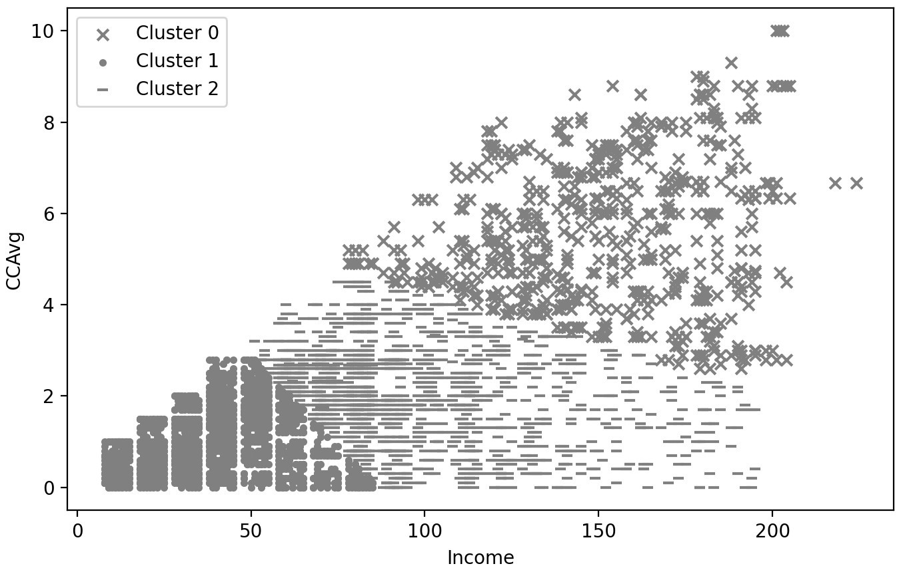
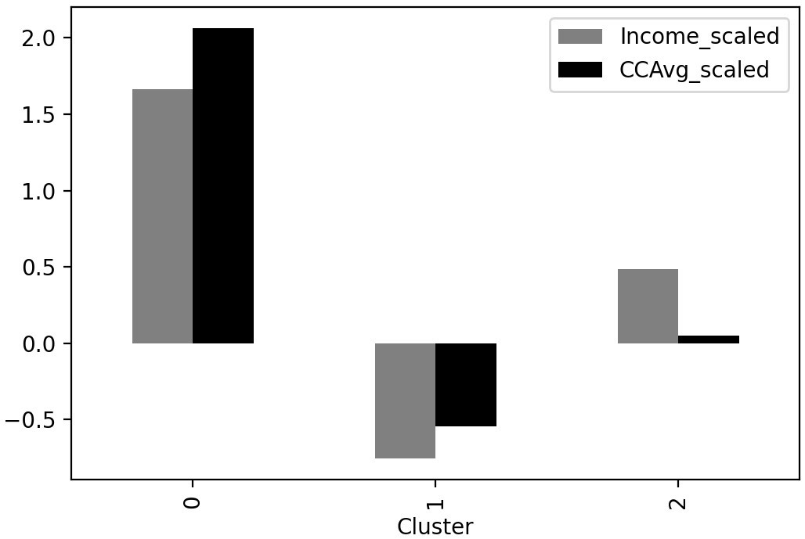

# Lab 03 Unsupervised Learning and Customer Segmentation

## **Mục tiêu học tập**
Sau khi hoàn thành bài học này, học viên sẽ có khả năng:
- Đọc và import dữ liệu từ các định dạng file khác nhau (CSV, JSON) vào DataFrame
- Thực hiện các thao tác slicing, aggregation và filtering trên DataFrame
- Kết hợp các DataFrame, xử lý dữ liệu thiếu và làm sạch dữ liệu từ nhiều nguồn khác nhau
## **Bài tập Thực hành**
### Bài tập cơ bản
#### **Exercise 301: Mall Customer Segmentation – Understanding the Data**
You are a data scientist at a leading consulting company and among their newest clients is a popular chain of malls spread across many countries. The mall wishes to gain a better understanding of its customers to re-design their existing offerings and marketing communications to improve sales in a geographical area. The data about the customers is available in the **Mall_Customers.csv** file. 

**Code:**

```python
# 1.	Import numpy, pandas, and pyplot from matplotlib and seaborn using the following code:
import numpy as np, pandas as pd
import matplotlib.pyplot as plt, seaborn as sns %matplotlib inline
# 2.	Using the read_csv method from pandas, import the  
Mall_Customers.csv file into a pandas DataFrame named data0 and print the first five rows:
data0 = pd.read_csv("Mall_Customers.csv") data0.head()

# 3. Use the info method of the DataFrame to print information about it:
data0.info()

# 4. For convenience, rename the Annual Income (k$) and  Spending Score (1-100) columns to
#    Income and Spend_score respectively, and print the top five records using the following code:
data0.rename({'Annual Income (k$)':'Income', 'Spending Score (1-100)':'Spend_score'}, axis=1, inplace=True)
data0.head()

# 5. To get a high-level understanding of the customer data, print out the descriptive summary of
#    the numerical fields in the data using the DataFrame's describe method:
data0.describe()

```
#### **Exercise 302: Traditional Segmentation of Mall Customers**
The mall wants to segment its customers and plans to use the derived segments to improve its marketing campaigns. The business team has a belief that segmenting based on income levels is relevant for their offerings. You are asked to use a traditional, rule-based approach to define customer segments. 

In this exercise, you will perform your first customer segmentation using the income of the customer, employing a traditional rule-based approach to define customer segments. You will plot the distribution for the Income variable and assign groups to customers based on where you see the values lying: 

**Code:**

```python
# 1. Plot a histogram of the Income column using the DataFrame's plot method using the following code:
data0.Income.plot.hist(color='gray') plt.xlabel('Income') plt.show()

# 2.	Create a new column, Cluster, to have the Low Income,  
#    Moderate Income, and High earners values for customers with incomes in the ranges < 50, 50–90,
#    and >= 90 respectively using the following code:
data0['Cluster'] = np.where(data0.Income >= 90, 'High earners',
np.where(data0.Income < 50, 'Low Income', 'Moderate Income'))

# 3.	To check the number of customers in each cluster and confirm whether the values for
#    the Income column in the clusters are in the correct range, get a descriptive summary of
#    Income for these groups using the following command:
data0.groupby('Cluster')['Income'].describe()

```

#### **Exercise 303: Standardizing Customer Data**
In this exercise, you will further our segmentation exercise by performing the important step of ensuring that all the variables get similar importance in the exercise, just as the business requires. You will standardize the mall customer data using z-scoring, employing **StandardScaler** from scikit-learn. Continue in the same notebook used for the exercises so far. Note that this exercise works on the modified data from _Exercise 3.02, Traditional Segmentation of Mall Customers_. Make sure you complete all the previous exercises before beginning this exercise:

**Code:**

```python
# 1.	Import the StandardScaler method from sklearn and create an instance of
#    StandardScaler using the following code:
from sklearn.preprocessing import StandardScaler
scaler = StandardScaler()

# 2.	Create a list named cols_to_scale to hold the names of the columns you wish to scale,
#    namely, Age, Income, and Spend_score. Also, make a copy of the DataFrame
#    (to retain original values) and name it data_scaled. You will be scaling columns on the copied dataset:
cols_to_scale = ['Age', 'Income', 'Spend_score']
data_scaled = data0.copy()

# 3.	Using the fit_transform method of the scaler, apply the transformation to the chosen columns:
data_scaled[cols_to_scale] = scaler.fit_transform(data0[cols_to_scale])

# 4.	To verify that this worked, print a descriptive summary of these modified columns:
data_scaled[cols_to_scale].describe() 
 
```
#### **Exercise 304: Calculating the Distance between Customers**
In this exercise, you will calculate the Euclidean distance between three customers. The goal of the exercise is to be able to calculate the similarity between customers. A similarity calculation is a key step in customer segmentation. After standardizing the Income and Spend_score fields for the first three customers as in the following table (Figure 3.14), you will calculate the distance using the cdist method from scipy.


**Code:**

```python
# 1. From the dataset (data_scaled created in Exercise 3.03, Standardizing Customer Data),
#    extract the top three records with the Income and Spend_score fields into
#    a dataset named cust3 and print the dataset, using the following code:
sel_cols = ['Income', 'Spend_score']
cust3 = data_scaled[sel_cols].head(3)
cust3

# 2.	Next, import the cdist method from scipy.spatial.distance using the following code: 
from scipy.spatial.distance import cdist
 
# 3.	The cdist function can be used to calculate the distance between
#    each pair of the two collections of inputs. To calculate the distance between
#    the customers in cust3, provide the cust3 dataset as both data inputs to cdist,
#    specifying euclidean as the metric, using the following code snippet:
cdist(cust3, cust3, metric='euclidean')

# Verify that 1.6305 is indeed the Euclidean distance between customer 1 and customer 2,
#    by manually calculating it using the following code:
np.sqrt((-1.739+1.739)**2 + (-0.4348-1.1957)**2)

```
#### **Exercise 305: K-Means Clustering on Mall Customers**
In this exercise, you will use machine learning to discover natural groups in the mall customers. You will perform k-means clustering on the mall customer data that was standardized in the previous exercise. You will use only the Income and  Spend_score columns. Continue using the same Jupyter notebook from the previous exercises. Perform clustering using the scikit-learn package and visualize the clusters: 

**Code:**

```python
# 1. Create a list called cluster_cols containing the Income and  
#    Spend_score columns, which will be used for clustering.
#    Print the first three rows of the dataset, limited to these columns
#    to ensure that you are filtering the data correctly:
cluster_cols = ['Income', 'Spend_score']
data_scaled[cluster_cols].head(3)

#2. Visualize the data using a scatter plot with Income and
#    Spend_score on the x and y axes respectively with the following code:
data_scaled.plot.scatter(x='Income', y='Spend_score', color='gray')
plt.show()

# 3.	Import KMeans from sklearn.cluster. Create an instance of
#    the KMeans model specifying 5 clusters (n_clusters) and 42 for random_state:
from sklearn.cluster import KMeans
model = KMeans(n_clusters=5, random_state=42)

# 4.	Next, fit the model on the data using the columns in cluster_cols for the purpose.
#    Using the predict method of the k-means model, assign the cluster for
#    each customer to the 'Cluster' variable. Print the first three records of the data_scaled dataset:
model.fit(data_scaled[cluster_cols])
data_scaled['Cluster'] = model.predict(data_scaled[cluster_cols])
data_scaled.head(3)

# 5. Now you need to visualize it to see the points assigned to each cluster.
#    Plot each cluster with a marker using the following code.
#    You will subset the dataset for each cluster and use a dictionary to specify the marker for the cluster:
markers = ['x', '*', '.', '|', '_']
for clust in range(5):
     temp = data_scaled[data_scaled.Cluster == clust]
     plt.scatter(temp.Income, temp.Spend_score, marker=markers[clust], color = 'gray',
                label="Cluster "+str(clust))
plt.xlabel('Income')
plt.ylabel('Spend_score')
plt.legend()
plt.show()

```
#### **Activity 301: Bank Customer Segmentation for Loan Campaign**
Banks often have marketing campaigns for their individual products. Therabank is an established bank that offers personal loans as a product. Most of Therabank's customers have deposits, which is a liability for the bank and not profitable. Loans are profitable for the bank. Therefore, getting more customers to opt for a personal loan makes the equation more profitable. The task at hand is to create customer segments to maximize the effectiveness of their personal loan campaign. 
The bank has data for customers including demographics, some financial information, and how these customers responded to a previous campaign (see Figure 3.21). Some key columns are described here:
•	Experience: The work experience of the customer in years
•	Income: The estimated annual income of the customer (thousands of US dollars)
•	CCAvg: The average spending on credit cards per month (thousands of US dollars)
•	Mortgage: The value of the customer's house mortgage (if any)
•	Age: The age (in years) of the customer


Your goal is to create customer segments for the marketing campaign. You will also identify which of these segments have the highest propensity to respond to the campaign – information that will greatly help optimize future campaigns.
Note that while the previous campaign's response is available to you, if you use it as a criterion/feature for segmentation, you will not be able to segment other customers for whom the previous campaign was never run, thereby severely limiting the number of customers you can target. You will, therefore, exclude the feature (previous campaign response) for clustering, but you can use it to evaluate how your clusters overall would respond to the campaign. Execute the following steps in a fresh Jupyter notebook to complete the activity:

#### **Exercise 306: Dealing with High-Dimensional Data**
In this exercise, you will use machine learning to discover natural groups in the mall customers. You will perform k-means clustering on the mall customer data that was standardized in the previous exercise. You will use only the Income and  Spend_score columns. Continue using the same Jupyter notebook from the previous exercises. Perform clustering using the scikit-learn package and visualize the clusters: 

1.	Import the necessary libraries for data processing, visualization, and clustering.
2.	Load the data into a pandas DataFrame and display the top five rows. Using the info method, get an understanding of the columns and their types.
3.	Perform standard scaling on the Income and CCAvg columns to create new Income_scaled and CCAvg_scaled columns. You will be using these two variables for customer segmentation. Get a descriptive summary of the processed columns to verify that the scaling has been applied correctly.
4.	Perform k-means clustering, specifying 3 clusters using Income and CCAvg as the features. Specify random_state as 42 (an arbitrary choice) to ensure the consistency of the results. Create a new column, Cluster, containing the predicted cluster from the model.
5.	Visualize the clusters by using different markers for the clusters on a scatter plot between Income and CCAvg. The output should be as follows:



6.	To understand the clusters, print the average values of Income and CCAvg for the three clusters. 
7.	Perform a visual comparison of the clusters using the standardized values for Income and CCAvg. You should get the following plot:



8.	To understand the clusters better using other relevant features, print the average values against the clusters for the Age, Mortgage, Family, CreditCard, Online, and Personal Loan features. Check which cluster has the highest propensity for taking a personal loan.
9.	Based on your understanding of the clusters, assign descriptive labels to the clusters.

#### **Exercise 3.06: Dealing with High-Dimensional Data**
In this exercise, you will perform clustering on the mall customers dataset using the age, income, and spend score. The goal is to find natural clusters in the data based on these three criteria and analyze the customer segments to identify their differentiating characteristics, providing the business with some valuable insight into the nature of its customers. This time though, visualization will not be easy. You will need to use PCA to reduce the data to two dimensions to visualize the clusters: 

**Code:**

```python
# 1. Create a list, cluster_cols, containing the Age, Income, and Spend_score columns,
#    which will be used for clustering. Print the first three rows of the dataset for these columns:
cluster_cols = ['Age', 'Income', 'Spend_score']
data_scaled[cluster_cols].head(3)

# 2.	Perform k-means clustering, specifying 4 clusters using the scaled features. 
#    Specify random_state as 42. Assign the clusters to the Cluster column:
model = KMeans(n_clusters=4, random_state=42)
model.fit(data_scaled[cluster_cols])
data_scaled['Cluster'] = model.predict(data_scaled[cluster_cols])

# 3.	Using PCA on the scaled columns, create two new columns, pc1 and pc2,
#   containing the data for PC1 and PC2 respectively:
from sklearn import decomposition

pca = decomposition.PCA(n_components=2)
pca_res = pca.fit_transform(data_scaled[cluster_cols])

data_scaled['pc1'] = pca_res[:,0]
data_scaled['pc2'] = pca_res[:,1]

# 4.	Visualize the clusters by using different markers and colors for
#    the clusters on a scatter plot between pc1 and pc2 using the following code:
markers = ['x', '*', 'o','|']
for clust in range(4):
     temp = data_scaled[data_scaled.Cluster == clust]
     plt.scatter(temp.pc1, temp.pc2, marker=markers[clust], label="Cluster "+str(clust), color='gray')
 plt.xlabel('PC1')
plt.ylabel('PC2')
plt.show()

# 5. To understand the clusters, print the average values of
#    the original features used for clustering against the four clusters:
data0['Cluster'] = data_scaled.Cluster
data0.groupby('Cluster')[['Age', 'Income', 'Spend_score']].mean()

# 6. Next, visualize this information using bar plots.
#    Check which features are the most differentiated for the clusters using the following code:
data0.groupby('Cluster')[['Age', 'Income', 'Spend_score']].mean().plot.bar(
color=['lightgray', 'darkgray', 'black'])

plt.show()

# 7. Based on your understanding of the clusters, assign descriptive labels to the clusters.
One way to describe the clusters is as follows: 
Cluster 0: Middle-aged penny pinchers (high income, low spend)
Cluster 1: Young high rollers (younger age, high income, high spend)
Cluster 2: Young aspirers (low income, high spend)
Cluster 3: Old average Joes (average income, average spend)

```
#### **Activity 302: Bank Customer Segmentation with Multiple**
In this activity, you will be revisiting the Therabank problem statement. You'll need to create customer segments to maximize the effectiveness of their personal loan campaign. You will accomplish this by finding the natural customer types in the data and discovering the features that differentiate them. Then, you'll identify the customer segments that have the highest propensity to take a loan. 
In Activity 3.01, Bank Customer Segmentation for Loan Campaign, you employed just two features of the customer. In this activity, you will employ additional features, namely, Age, Experience, and Mortgage. As you are dealing with high-dimensional data, you will use PCA for visualizing the clusters. You will understand the customer segments obtained and provide them with business-friendly labels. As a part of your evaluation and understanding of the segments, you will also check the historical response rates for the obtained segments. 

_Execute the following steps to complete the activity:_
1.	Create a copy of the dataset named bank_scaled, and perform standard scaling of the Income, CCAvg, Age, Experience, and Mortgage columns.
2.	Get a descriptive summary of the processed columns to verify that the scaling has been applied correctly.
3.	Perform k-means clustering, specifying 3 clusters using the scaled features. Specify random_state as 42.
4.	Using PCA on the scaled columns, create two new columns, pc1 and pc2, containing the data for PC1 and PC2 respectively.
5.	Visualize the clusters by using different markers for the clusters on a scatter plot between pc1 and pc2. The plot should appear as in the following figure: 
 


6.	To understand the clusters, print the average values of the features used for clustering against the three clusters. Check which features are the most differentiated for the clusters.
7.	To understand the clusters better using other relevant features, print the average values against the clusters for the Age, Mortgage, Family, CreditCard, Online, and Personal Loan features and check which cluster has the highest propensity for taking a personal loan.
8.	Based on your understanding of the clusters, assign descriptive labels to the clusters.

## Bài tập tổng hợp
### **Bài tập 1: Làm sạch dữ liệu khách hàng**
Cho file customers.csv với cấu trúc sau:

- *customer_id, name, email, phone, age, city, registration_date*

Yêu cầu:

Đọc dữ liệu từ file CSV
- Kiểm tra và xử lý missing values
- Chuẩn hóa định dạng email và phone
- Xóa các bản ghi trùng lặp
- Chuyển đổi registration_date sang datetime

```python
# Template giải
import pandas as pd

# 1. Đọc dữ liệu
df = pd.read_csv('customers.csv')

# 2. Kiểm tra missing values
print(df.isnull().sum())

# 3. Xử lý missing values
# Điền age bằng median
df['age'].fillna(df['age'].median(), inplace=True)
# Xóa hàng thiếu email (quan trọng)
df.dropna(subset=['email'], inplace=True)

# 4. Chuẩn hóa dữ liệu
df['email'] = df['email'].str.lower().str.strip()
df['phone'] = df['phone'].str.replace(r'[^0-9]', '', regex=True)
df['name'] = df['name'].str.title().str.strip()

# 5. Xóa trùng lặp
df.drop_duplicates(subset=['email'], inplace=True)

# 6. Chuyển đổi kiểu dữ liệu
df['registration_date'] = pd.to_datetime(df['registration_date'])

print("Dữ liệu sau khi làm sạch:")
print(df.info())
```
### **Bài tập 2: Phân tích dữ liệu bán hàng**
Cho 2 file:

- *sales.csv: order_id, customer_id, product_id, quantity, order_date*
- *products.json: product_id, product_name, category, price*

Yêu cầu:

- Đọc dữ liệu từ cả 2 file
- Kết hợp dữ liệu từ 2 nguồn
- Tính tổng doanh thu theo category
- Tìm top 5 sản phẩm bán chạy nhất
- Phân tích xu hướng bán hàng theo tháng

```python
# Template giải
import pandas as pd
import json

# 1. Đọc dữ liệu
sales_df = pd.read_csv('sales.csv')
with open('products.json', 'r') as f:
    products_data = json.load(f)
products_df = pd.DataFrame(products_data)

# 2. Kết hợp dữ liệu
merged_df = pd.merge(sales_df, products_df, on='product_id', how='inner')

# Tính revenue
merged_df['revenue'] = merged_df['quantity'] * merged_df['price']

# 3. Tổng doanh thu theo category
revenue_by_category = merged_df.groupby('category')['revenue'].sum().sort_values(ascending=False)
print("Doanh thu theo category:")
print(revenue_by_category)

# 4. Top 5 sản phẩm bán chạy
top_products = merged_df.groupby('product_name')['quantity'].sum().sort_values(ascending=False).head(5)
print("\nTop 5 sản phẩm bán chạy:")
print(top_products)

# 5. Xu hướng theo tháng
merged_df['order_date'] = pd.to_datetime(merged_df['order_date'])
merged_df['month'] = merged_df['order_date'].dt.to_period('M')
monthly_trend = merged_df.groupby('month')['revenue'].sum()
print("\nXu hướng doanh thu theo tháng:")
print(monthly_trend)
```
#### **Bài tập 3: Xử lý dữ liệu từ nhiều nguồn**
Scenario: Bạn có dữ liệu nhân viên từ 3 nguồn:

- *employees_hr.csv: employee_id, name, department, hire_date*
- *salaries.json: employee_id, base_salary, bonus*
- *performance.csv: employee_id, performance_score, last_review_date*

Yêu cầu:

- Đọc và làm sạch dữ liệu từ cả 3 nguồn
- Kết hợp tất cả dữ liệu thành một DataFrame duy nhất
- Xử lý missing values một cách phù hợp
- Tính tổng lương (base + bonus) cho mỗi nhân viên
- Phân tích mức lương trung bình theo department
- Tìm nhân viên có performance cao nhất trong mỗi department
  ướng dẫn:
```python
# Template giải (học viên tự hoàn thành)
# Gợi ý:
# - Sử dụng pd.merge() để kết hợp multiple DataFrames
# - Chú ý xử lý missing values phù hợp với từng trường
# - Sử dụng groupby() cho các phân tích theo nhóm
```
## Tổng kết và Best Practices
1. Quy trình làm sạch dữ liệu chuẩn:

- Khám phá dữ liệu: Sử dụng .info(), .describe(), .head()
- Kiểm tra chất lượng: Missing values, duplicates, outliers
- Chuẩn hóa: Data types, string formatting, date parsing
- Xử lý missing data: Drop, fill, interpolate
- Kết hợp dữ liệu: Merge, join, concatenate
- Validation: Kiểm tra logic và consistency

2. Lưu ý quan trọng:

- Luôn backup dữ liệu gốc trước khi làm sạch
- Ghi chép lại các bước xử lý để có thể reproduce
- Ghi chép lại các bước xử lý để có thể reproduce
- Kiểm tra kết quả sau mỗi bước xử lý
- Hiểu domain knowledge để xử lý missing values đúng cách
- Sử dụng .copy() khi cần tạo bản sao DataFrame
