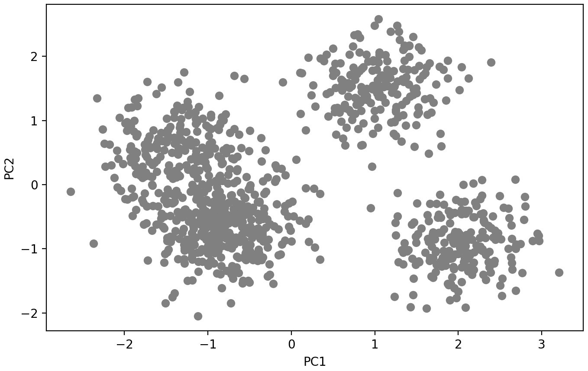
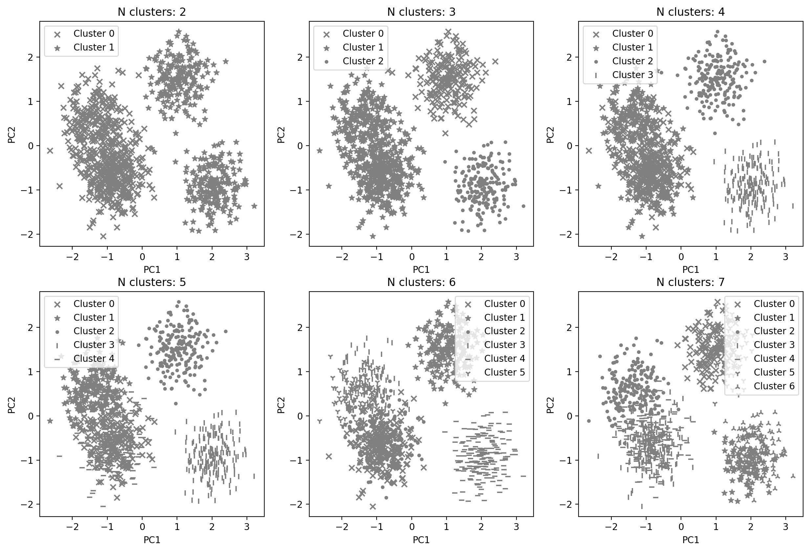
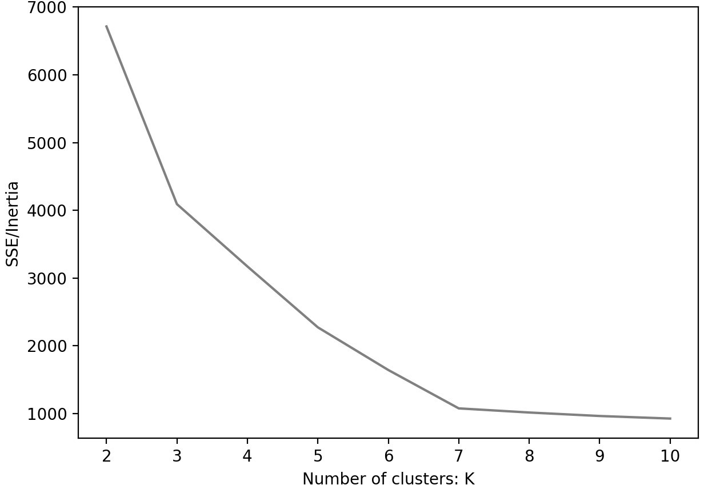
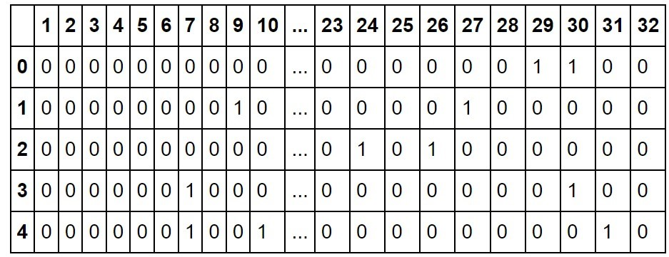
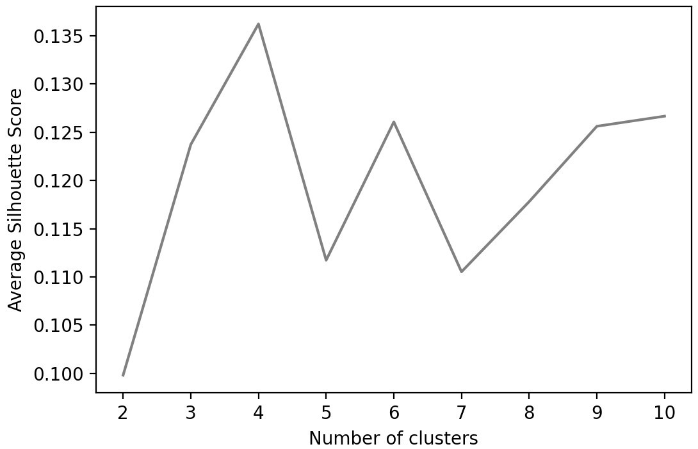
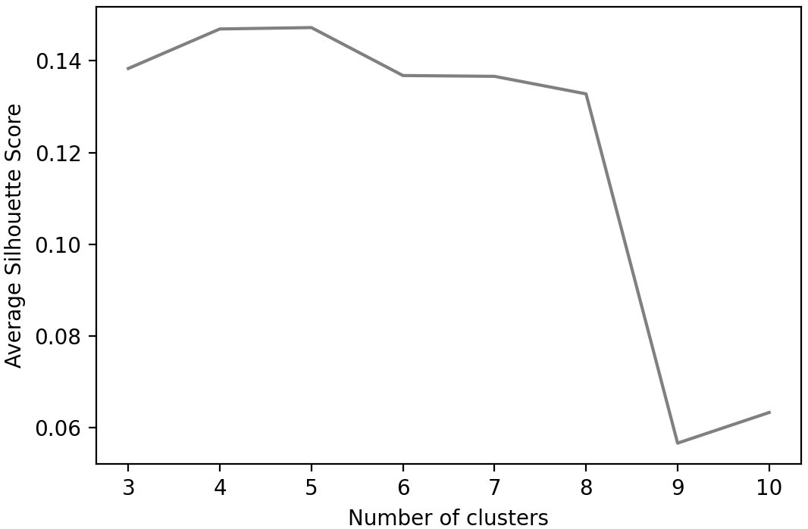

# Lab 04 Evaluating and Choosing the Best Segmentation Approach

## Mục Tiêu Học Tập
- Nắm vững các kỹ thuật clustering hiện đại cho phân khúc khách hàng
- Học cách chọn số cluster tối ưu một cách có nguyên tắc
- Áp dụng các phương pháp đánh giá cluster cho nhiều bài toán kinh doanh
- Thực hành các thuật toán clustering nâng cao: Mean-Shift, K-Modes, K-Prototypes

---

## **Bài tập Thực hành**
### Bài tập cơ bản

---

#### **Exercise 4.01: Data Staging and Visualization**
You will be revisiting the business problem you worked on in _Chapter 3, Unsupervised Learning and Customer Segmentation_. You are a data scientist at a leading consulting company and its new client is a popular chain of malls spread across many countries. The mall wishes to re-design its existing offers and marketing communications to improve sales in one of its key markets. An understanding of their customers is critical for this objective, and for that, good customer segmentation is needed. 

The goal of this exercise is to load the data and perform basic clean-up so that you can use it conveniently for further tasks. Also, you will visualize the data to understand better how the customers are distributed on two key attributes –  **Income and Spend_score.** You will be using these fields later to perform clustering. 
 

**Code:**

```python
# 1. In a fresh Jupyter notebook, import pandas, numpy, matplotlib and seaborn libraries and
#    load the mall customer data from the file  Mall_Customers.csv into a DataFrame (mall0)
#    and print the top five records, using the code below. 
import numpy as np, pandas as pd
import matplotlib.pyplot as plt, seaborn as sns
mall0 = pd.read_csv("Mall_Customers.csv")
mall0.head()

# 2. Rename the columns 'Annual Income (k$)' and  
#    'Spending Score (1-100)' to 'Income' and 'Spend_score' respectively.
#    Print the top five records of the dataset to confirm that the change was completed.
mall0.rename({'Annual Income (k$)':'Income',  'Spending Score (1-100)':'Spend_score'},
             axis=1, inplace=True)
mall0.head()

# 3. Plot a scatterplot of the Income and Spend_score fields using the following code.
#    You will be performing clustering later using these two features as the criteria.
mall0.plot.scatter(x='Income', y='Spend_score', color='gray')
plt.show()

```

---

#### **Exercise 4.02: Choosing the Number of Clusters Based on Visual Inspection**
The goal of the exercise is to further refine the customer segmentation approach by using visual inspection to decide on the optimal number of clusters. You will try different numbers of clusters (ranging from two to six) and use visual inspection to evaluate the results and choose the right number of clusters. Continue in the Jupyter notebook from _Exercise 4.01, Data Staging and Visualization and perform_ the following steps.

**Code:**

```python
# 1.	Standardize the columns Age, Income and Spend_score, using the StandardScaler from sklearn,
#    after copying the information into new dataset named mall_scaled, using the following code: 
mall_scaled = mall0.copy()
cols_to_scale = ['Age', 'Income', 'Spend_score']
from sklearn.preprocessing import StandardScaler
scaler = StandardScaler()
mall_scaled[cols_to_scale] = scaler.fit_transform(mall_scaled[cols_to_scale])

# 2.	Import the Kmeans module from the sklearn package. Create a list, 
#    'cluster_cols' that stores the names of the fields (Income and  Spend_score)
#    and define the colors and shapes that you will use for each cluster
#    (since you will be visualizing up to seven clusters in all, define seven different shapes), as follows: 
from sklearn.cluster import KMeans
cluster_cols = ['Income', 'Spend_score']
markers = ['x', '*', '.', '|', '_', '1', '2']

#    When plotting the obtained clusters, items in the clusters will be represented by
#    the symbols in the list in order. 'x' will represent the first cluster (Cluster 0).
#    For the final clustering with 7 clusters, all the shapes in the list will be used and
#    Cluster 6 will be represented by the marker '2' (called the 'tickup').

# 3. Then, using a for loop, cluster the data using a different number of clusters,
#    ranging from two to seven, and visualize the resulting plots obtained in a subplot.
#    Use a separate for loop to plot each cluster in each subplot,
#    so we can use different shapes for each cluster. Use the following snippet:
plt.figure(figsize=[12,8])
for n in range(2,8):
    model = KMeans(n_clusters=n, random_state=42)
    mall_scaled['Cluster']= model.fit_predict(mall_scaled[cluster_cols])

    plt.subplot(2,3, n-1)
    for clust in range(n):
        temp = mall_scaled[mall_scaled.Cluster == clust]
        plt.scatter(temp.Income, temp.Spend_score, marker=markers[clust],
                    label="Cluster "+str(clust), color='gray')
        plt.title("N clusters: "+str(n))
        plt.xlabel('Income')
        plt.ylabel('Spend_score')
        plt.legend()
plt.show()

```

---

#### **Exercise 4.03: Determining the Number of Clusters Using the Elbow Method**
In this exercise, you will use the elbow method to identify the optimal number of clusters. The goal is to improve upon the mall customer segmentation approach by using a principled method to determine the number of clusters so that all involved stakeholders, including business teams, gain more confidence in the soundness of the approach and the resulting clusters. Try the range 2 – 10 for the number of clusters using the age and income data. Continue in the same Jupyter notebook you have been using for the exercises so far. 

**Code:**

```python
# 1.	On the scaled mall customer data (mall_scaled), using the columns 'Income' and 'Spend_score',
#    create three clusters using the KMeans algorithm:
K = 3
model = KMeans(n_clusters=K, random_state=42)
model.fit(mall_scaled[cluster_cols])

# 2.	Once the model is fit, the SSE/inertia is available very conveniently in
#    the 'inertia_' attribute of the model object.
#    Print out the SSE/ inertia for the model with 3 clusters using the following code:
print(model.inertia_)

# 3.	Next, fit multiple KMeans models with the number of clusters
#    ranging from 2 to 10 and store the inertia values for the different models in a list. 
X = mall_scaled[cluster_cols]
inertia_scores = []
for K in range(2,11):
    inertia = KMeans(n_clusters=K, random_state=42).fit(X).inertia_
    inertia_scores.append(inertia)


# 4.	Create the SSE/inertia plot as a line plot with the following code. 
plt.figure(figsize=[7,5])
plt.plot(range(2,11), inertia_scores, color='gray')
plt.title("SSE/Inertia vs. number of clusters")
plt.xlabel("Number of clusters: K")
plt.ylabel('SSE/Inertia')
plt.show()
 
```

---

#### **Activity 4.01: Optimizing a Luxury Clothing Brand's Marketing Campaign Using Clustering**
You are working at a company that sells luxury clothing. Their sales team has collected data on customer age, income, their annual spend at the business, and the number of days since their last purchase. The company wants to start targeted marketing campaigns but doesn't know how many different types of customers they have. If they understood the number of different segments, it would help design the campaign better by helping define the channels to use, the messaging to employ, and more. 
Your goal is to perform customer segmentation for the company which will help them optimize their campaigns. To make your approach robust and more reliable to business, you need to arrive at the right number of segments by using the visualization approach as well as the elbow method with the sum of squared errors. 

_Execute the following steps to complete the activity:_

1.	Import the libraries required for DataFrame handling and plotting (pandas, numpy, matplotlib). Read in the data from the file  
'Clothing_Customers.csv' into a DataFrame and print the top 5 rows to understand it better.
2.	Standardize all the columns in the data. You will be using all four columns for the segmentation. 
3.	Visualize the data to get a good understanding of it. Since you are dealing with four dimensions, use PCA to reduce to two dimensions before plotting. The resulting plot should be as follows.



4. Visualize clustering with two through seven clusters. You should get the following plot.

   

Choosing clusters using elbow method - create a plot of the sum of squared errors and look for an elbow. Vary the number of clusters from 2 to 11. You should get the following plot.

   

5. Do both the methods agree on the optimal number of clusters? Looking at the results from both, and based on your business understanding, what is the number of clusters you would choose? Explain your decision.

   
**Code:**

```python


```

---

#### **Exercise 4.04: Mean-Shift Clustering on Mall Customers**
In this exercise, you will cluster mall customers using the mean-shift algorithm. You will employ the columns Income and Spend_score as criteria. You will first manually specify the bandwidth parameter. Then, you will estimate the bandwidth parameter using the estimate_bandwidth method and see how it varies with the choice of quantile. Continue in the Jupyter notebook from Exercise 4.03, Determining the Number of Clusters Using the Elbow Method and perform the following steps. 

**Code:**

```python
# 1.	Import MeanShift and estimate_bandwidth from sklearn and create a variable 'bandwidth'
#    with a value of 0.9 – the bandwidth to use (an arbitrary, high value). The code is as follows - 
from sklearn.cluster import MeanShift, estimate_bandwidth
bandwidth = 0.9

# 2.	To perform mean-shift clustering on the standardized data,
#    create an instance of MeanShift, specifying the bandwidth and setting bin_seeding
#    to True (to speed up the algorithm). Fit the model on the data and assign
#    the cluster to the variable 'Cluster'. Use the following code:
ms = MeanShift(bandwidth=bandwidth, bin_seeding=True)
ms.fit(mall_scaled[cluster_cols])

mall_scaled['Cluster']= ms.predict(X)

# 3.	Visualize the clusters using a scatter plot. 
markers = ['x', '*', '.', '|', '_', '1', '2']
plt.figure(figsize=[8,6])
for clust in range(mall_scaled.Cluster.nunique()):
     temp = mall_scaled[mall_scaled.Cluster == clust]
     plt.scatter(temp.Income, temp.Spend_score, marker=markers[clust], 
                 label="Cluster"+str(clust), color='gray')
plt.xlabel("Income")
plt.ylabel("Spend_score")
plt.legend()
plt.show()

# 4.	Estimate the required bandwidth using the estimate_bandwidth method.
#    Use the estimate_bandwidth function with a quantile value of 0.1 (an arbitrary choice)
#    to estimate the best bandwidth to use. Print the value, fit the model,
#    and note the number of clusters, using the following code: 
bandwidth = estimate_bandwidth(mall_scaled[cluster_cols], quantile=0.1)
print(bandwidth)

ms = MeanShift(bandwidth=bandwidth, bin_seeding=True) ms.fit(mall_scaled[cluster_cols])
mall_scaled['Cluster']= ms.predict(mall_scaled[cluster_cols])
mall_scaled.Cluster.nunique()


# 5.	Visualize the obtained clusters using a scatter plot.
plt.figure(figsize=[8,6])
for clust in range(mall_scaled.Cluster.nunique()):
     temp = mall_scaled[mall_scaled.Cluster == clust]
     plt.scatter(temp.Income, temp.Spend_score, marker=markers[clust], 
                 label="Cluster"+str(clust),  color='gray')
plt.xlabel("Income")
plt.ylabel("Spend_score")
plt.legend()
plt.show()


#  6. Estimate the bandwidth again, this time with a quantile value of 0.15.
#    Print out the number of clusters obtained. 
bandwidth = estimate_bandwidth(mall_scaled[cluster_cols], quantile=0.15)
print(bandwidth)

# 7. Use the bandwidth calculated in the previous step to fit and extract the number of clusters.
 ms = MeanShift(bandwidth=bandwidth, bin_seeding=True)
 ms.fit(mall_scaled[cluster_cols])
 mall_scaled['Cluster']= ms.predict(mall_scaled[cluster_cols])
 mall_scaled.Cluster.nunique()
 The result should be 5. 

# 8. Visualize the clusters obtained. 
plt.figure(figsize=[8,6])
for clust in range(mall_scaled.Cluster.nunique()):
    temp = mall_scaled[mall_scaled.Cluster == clust]
    plt.scatter(temp.Income, temp.Spend_score, marker=markers[clust], 
                label="Cluster"+str(clust), color='gray')
 plt.xlabel("Income")
 plt.ylabel("Spend_score")
 plt.legend()
 plt.show()
```

---

#### **Exercise 4.05: Clustering Data Using the k-prototypes Method**
For this exercise, you will revisit the customer segmentation problem for Therabank, that you encountered in_ Activity 3.01, Bank Customer Segmentation for Loan Campaign_. The business goal is to get more customers to opt for a personal loan to increase the profitability of the bank's portfolio. Creating customer segments will help the bank identify the types of customers, tune their messaging in the marketing campaigns for the personal loan product. The dataset provided contains data for customers including demographics, some financial information, and how these customers responded to a previous campaign. 

An important feature for business is the education level of the customer and needs to be included in the segmentation. The values in the data are **Primary**, **Secondary**, and **Tertiary**. Since this is a categorical feature, K-means is not a suitable approach. You need to create customer segmentation with this data by applying k-prototype clustering to data that has a mix of categorical (education) and continuous (**income**) variables. 

**Code:**

```python
# 1. Import pandas and read in the data from the file  
#    Bank_Personal_Loan_Modelling-2.csv into a pandas DataFrame named bank0:
import pandas as pd
bank0 = pd.read_csv("Bank_Personal_Loan_Modelling-2.csv")
bank0.head()

# 2.	Standardize the Income column:
from sklearn.preprocessing import StandardScaler
scaler = StandardScaler()
bank_scaled = bank0.copy()
bank_scaled['Income'] = scaler.fit_transform(bank0[['Income']])

# 3.	Import KPrototypes from the kmodes module. Perform k-prototypes clustering
#    using three clusters, specifying the education column (in column index 1) ,
#    as categorical and save the result of the clustering as a new column 
#    called cluster.Specify a random_state of 42 for consistency.
from kmodes.kprototypes import KPrototypes
cluster_cols = ['Income', 'Education']
kp = KPrototypes(n_clusters=3, random_state=42)
bank_scaled['Cluster'] = kp.fit_predict(bank_scaled[cluster_cols], categorical=[1])

# 4.	To understand the obtained clusters, get the proportions of
#    the different education levels in each cluster using the following code.
res = bank_scaled.groupby('Cluster')['Education'].value_counts(normalize=True)
res.unstack().plot.barh(figsize=[9,6], color=['black','lightgray','dimgray'])
plt.show()

```

---

#### **Exercise 4.06: Using Silhouette Score to Pick Optimal Number of Clusters**
In this exercise, you will continue working on the mall customer segmentation case. The objective of the exercise is to identify the right number of clusters using a statistical approach that is, the silhouette score. You will perform k-means clustering on mall customers using different numbers of clusters and use the silhouette score to determine the best number of clusters to use. You will need to continue in the Jupyter notebook used for the exercises so far. 

**Code:**

```python
# 1. Import pandas and read in the data from the file  
#    Bank_Personal_Loan_Modelling-2.csv into a pandas DataFrame named bank0:
import pandas as pd
bank0 = pd.read_csv("Bank_Personal_Loan_Modelling-2.csv")
bank0.head()

# 2.	Standardize the Income column:
from sklearn.preprocessing import StandardScaler
scaler = StandardScaler()
bank_scaled = bank0.copy()
bank_scaled['Income'] = scaler.fit_transform(bank0[['Income']])

# 3.	Import KPrototypes from the kmodes module. Perform k-prototypes clustering
#    using three clusters, specifying the education column (in column index 1) ,
#    as categorical and save the result of the clustering as a new column 
#    called cluster.Specify a random_state of 42 for consistency.
from kmodes.kprototypes import KPrototypes
cluster_cols = ['Income', 'Education']
kp = KPrototypes(n_clusters=3, random_state=42)
bank_scaled['Cluster'] = kp.fit_predict(bank_scaled[cluster_cols], categorical=[1])

# 4.	To understand the obtained clusters, get the proportions of
#    the different education levels in each cluster using the following code.
res = bank_scaled.groupby('Cluster')['Education'].value_counts(normalize=True)
res.unstack().plot.barh(figsize=[9,6], color=['black','lightgray','dimgray'])
plt.show()

```

---

#### **Exercise 4.07: Using a Train-Test Split to Evaluate Clustering Performance**
In this exercise, you will use a train-test split approach to evaluate the performance of the clustering. The goal of the exercise is to ensure reliable and robust customers segments from the mall customers. You will need to separate the data into train and test sets first. Then, you will fit a K-means model with a sub-optimal number of clusters. If the clusters are good, the silhouette score should be consistent between the train and test data. Continue in the same Jupyter notebook used so far for all the preceding exercises. 

**Code:**

```python
# 1. Import the train_test_split function from sklearn and perform the split on the mall customer data.
#    Specify the train size as 0.75 and  a random_state of 42. Print the shapes of the resulting datasets.
from sklearn.model_selection import train_test_split
df_train, df_test = train_test_split(mall0, train_size=0.75, random_state=42)

#    Specifying a train_size of 0.75 assigns 75% of the records to the train set and
#    the remaining to the test set. Using random_state ensures that the results are reproducible.
print(df_train.shape)
print(df_test.shape)

# 2.	Fit a Kmeans mode with 6 clusters on the train data. Calculate the average silhouette score.
#    Ignore the warnings (if any) resulting from this step.
model = KMeans(n_clusters=6, random_state=42)
df_train['Cluster'] = model.fit_predict(df_train[cluster_cols])
silhouette_avg = silhouette_score(df_train[cluster_cols], df_train['Cluster'])
print(silhouette_avg)

# 3.	Using the predict method of the model, predict the clusters for the test data.
#    Then, calculate the average silhouette score for the test data using the following code.
#    Ignore warnings, if any, from the code. 
df_test['Cluster'] = model.predict(df_test[cluster_cols])
silhouette_avg = silhouette_score(df_test[cluster_cols],df_test['Cluster'])
print(silhouette_avg)

# 4.	Visualize the predicted clusters on the test data using a scatter plot,
#    marking the different clusters.
for clust in range(df_test.Cluster.nunique()):
     temp = df_test[df_test.Cluster == clust]
     plt.scatter(temp.Income, temp.Spend_score, marker=markers[clust], color='gray')
plt.xlabel("Income")
plt.ylabel("Spend_score")
plt.show()

```
---

#### **Activity 4.02: Evaluating Clustering on Customer Data**
You are a data science manager in the marketing division at a major multinational alcoholic beverage company. Over the past year, the marketing team launched 32 initiatives to increase its sales. Your team has acquired data that tells you which customers have responded to which of the 32 marketing initiatives recently (this data is present within the **customer_offers.csv** file). The business goal is to improve future marketing campaigns by targeting them precisely, so they can provide offers customized to groups that tend to respond to similar offers. The solution is to build customer segments based on the responses of the customers to past initiatives. 

In this activity, you will employ a thorough approach to clustering by trying multiple clustering techniques. Additionally, you will employ statistical approaches to cluster evaluation to ensure your results are reliable and robust. Using the cluster evaluation techniques, you will also tune the hyperparameters, as applicable, for the clustering algorithms. Start in a new Jupyter notebook for the activity.
Execute the following steps to complete this activity:
1.	Import the necessary libraries for data handling, clustering, and visualization. Import data from **customer_offers.csv** into a pandas DataFrame. 
2.	Print the top five rows of the DataFrame, which should look like the table below.



3.	Divide the dataset into train and test sets by using the **train_test_split** method from scikit-learn. Specify **random_state** as 100 for consistency.
4.	Perform k-means on the data. Identify the optimal number of clusters by using the silhouette score approach on the train data by plotting the score for the different number of clusters, varying from **2** through **10**. The plot for silhouette scores should be as follows:



5.	Perform K means using k found in the previous step. Print out the **silhouette score** on the test set.
6.	Perform mean-shift clustering on the data, using the **estimate_bandwidth** method with a quantile value of **0.1** to estimate the bandwidth. Print out the silhouette score from the model on the test set.
7.	Perform k-modes on the data. Identify the optimal number of clusters by using the silhouette score approach on the train data by plotting the score for the different number of clusters, varying from **3** through **10**. You should get the following output.



8.	Using K found in the previous step, perform K-modes on the data. Print out the silhouette score on the test set.
9.	Which of the three techniques gives you the best result? What is the final number of clusters you will go with? 

---
### Bài tập tổng hợp

#### Bài Tập 1: Cải Tiến Phương Pháp Customer Segmentation với Kỹ Thuật Clustering Hiện Đại

##### Mô Tả Bài Toán
Bạn là Data Scientist tại một công ty thương mại điện tử. Công ty muốn cải tiến chiến lược phân khúc khách hàng hiện tại bằng cách sử dụng các kỹ thuật clustering hiện đại thay vì phương pháp truyền thống.

##### Dataset
Sử dụng dữ liệu khách hàng với các đặc trưng:
- `customer_id`: ID khách hàng
- `recency`: Số ngày kể từ lần mua hàng cuối
- `frequency`: Tần suất mua hàng trong năm
- `monetary`: Tổng giá trị đơn hàng
- `avg_order_value`: Giá trị đơn hàng trung bình
- `days_since_first_purchase`: Số ngày từ lần mua đầu tiên
- `product_categories`: Số danh mục sản phẩm đã mua

##### Yêu Cầu Thực Hiện

###### Phần A: Chuẩn Bị Dữ Liệu và EDA
```python
import pandas as pd
import numpy as np
import matplotlib.pyplot as plt
import seaborn as sns
from sklearn.preprocessing import StandardScaler, RobustScaler
from sklearn.decomposition import PCA
from sklearn.cluster import KMeans, DBSCAN, AgglomerativeClustering
from sklearn.mixture import GaussianMixture
import warnings
warnings.filterwarnings('ignore')

# Tạo dữ liệu mẫu
np.random.seed(42)
n_customers = 2000

# Tạo 4 segment khách hàng khác nhau
segments = []
for i in range(4):
    segment_size = n_customers // 4
    if i == 0:  # High Value Customers
        segment = {
            'recency': np.random.normal(15, 5, segment_size),
            'frequency': np.random.normal(25, 5, segment_size),
            'monetary': np.random.normal(5000, 1000, segment_size),
            'avg_order_value': np.random.normal(200, 50, segment_size),
            'days_since_first_purchase': np.random.normal(400, 100, segment_size),
            'product_categories': np.random.normal(8, 2, segment_size)
        }
    elif i == 1:  # Regular Customers
        segment = {
            'recency': np.random.normal(45, 10, segment_size),
            'frequency': np.random.normal(12, 3, segment_size),
            'monetary': np.random.normal(2000, 500, segment_size),
            'avg_order_value': np.random.normal(100, 30, segment_size),
            'days_since_first_purchase': np.random.normal(200, 50, segment_size),
            'product_categories': np.random.normal(5, 1, segment_size)
        }
    elif i == 2:  # At Risk Customers
        segment = {
            'recency': np.random.normal(120, 30, segment_size),
            'frequency': np.random.normal(8, 2, segment_size),
            'monetary': np.random.normal(1500, 400, segment_size),
            'avg_order_value': np.random.normal(80, 20, segment_size),
            'days_since_first_purchase': np.random.normal(300, 80, segment_size),
            'product_categories': np.random.normal(3, 1, segment_size)
        }
    else:  # Lost Customers
        segment = {
            'recency': np.random.normal(200, 50, segment_size),
            'frequency': np.random.normal(3, 1, segment_size),
            'monetary': np.random.normal(500, 200, segment_size),
            'avg_order_value': np.random.normal(60, 15, segment_size),
            'days_since_first_purchase': np.random.normal(500, 150, segment_size),
            'product_categories': np.random.normal(2, 0.5, segment_size)
        }
    segments.append(pd.DataFrame(segment))

# Kết hợp tất cả segments
df = pd.concat(segments, ignore_index=True)
df['customer_id'] = range(1, len(df) + 1)

# Đảm bảo giá trị dương
for col in df.columns:
    if col != 'customer_id':
        df[col] = np.maximum(df[col], 1)

print("Dataset shape:", df.shape)
print("\nDataset info:")
print(df.describe())
```

**Nhiệm vụ 1.1**: Thực hiện EDA chi tiết
- Vẽ distribution plots cho từng feature
- Tạo correlation matrix
- Phân tích outliers bằng boxplots
- Tính toán và visualize skewness của các biến

**Nhiệm vụ 1.2**: So sánh các phương pháp scaling
```python
# So sánh StandardScaler vs RobustScaler
scalers = {
    'StandardScaler': StandardScaler(),
    'RobustScaler': RobustScaler()
}

# Thực hiện scaling và so sánh kết quả
```

###### Phần B: Implement Clustering Algorithms Hiện Đại

**Nhiệm vụ 1.3**: Implement và so sánh các thuật toán clustering
```python
from sklearn.cluster import KMeans, DBSCAN, AgglomerativeClustering
from sklearn.mixture import GaussianMixture
from sklearn.metrics import silhouette_score, calinski_harabasz_score, davies_bouldin_score

class ModernClusteringComparison:
    def __init__(self, data):
        self.data = data
        self.results = {}
    
    def fit_kmeans_variants(self, n_clusters=4):
        """So sánh các variant của K-Means"""
        kmeans_variants = {
            'K-Means (Lloyd)': KMeans(n_clusters=n_clusters, algorithm='lloyd', random_state=42),
            'K-Means (Elkan)': KMeans(n_clusters=n_clusters, algorithm='elkan', random_state=42),
            'K-Means++': KMeans(n_clusters=n_clusters, init='k-means++', random_state=42)
        }
        
        for name, model in kmeans_variants.items():
            labels = model.fit_predict(self.data)
            self.results[name] = {
                'labels': labels,
                'silhouette': silhouette_score(self.data, labels),
                'calinski_harabasz': calinski_harabasz_score(self.data, labels),
                'davies_bouldin': davies_bouldin_score(self.data, labels),
                'inertia': model.inertia_
            }
    
    def fit_gaussian_mixture(self, n_components=4):
        """Gaussian Mixture Models với các covariance types"""
        covariance_types = ['full', 'tied', 'diag', 'spherical']
        
        for cov_type in covariance_types:
            gmm = GaussianMixture(n_components=n_components, 
                                covariance_type=cov_type, 
                                random_state=42)
            labels = gmm.fit_predict(self.data)
            
            self.results[f'GMM ({cov_type})'] = {
                'labels': labels,
                'silhouette': silhouette_score(self.data, labels),
                'calinski_harabasz': calinski_harabasz_score(self.data, labels),
                'davies_bouldin': davies_bouldin_score(self.data, labels),
                'aic': gmm.aic(self.data),
                'bic': gmm.bic(self.data)
            }
    
    def fit_hierarchical_clustering(self):
        """Hierarchical Clustering với các linkage methods"""
        linkage_methods = ['ward', 'complete', 'average', 'single']
        
        for linkage in linkage_methods:
            if linkage == 'ward':
                model = AgglomerativeClustering(n_clusters=4, linkage=linkage)
            else:
                model = AgglomerativeClustering(n_clusters=4, linkage=linkage, 
                                              metric='euclidean')
            labels = model.fit_predict(self.data)
            
            self.results[f'Hierarchical ({linkage})'] = {
                'labels': labels,
                'silhouette': silhouette_score(self.data, labels),
                'calinski_harabasz': calinski_harabasz_score(self.data, labels),
                'davies_bouldin': davies_bouldin_score(self.data, labels)
            }
    
    def compare_results(self):
        """So sánh kết quả của tất cả các thuật toán"""
        comparison_df = pd.DataFrame({
            'Algorithm': list(self.results.keys()),
            'Silhouette Score': [self.results[alg]['silhouette'] for alg in self.results.keys()],
            'Calinski-Harabasz': [self.results[alg]['calinski_harabasz'] for alg in self.results.keys()],
            'Davies-Bouldin': [self.results[alg]['davies_bouldin'] for alg in self.results.keys()]
        })
        
        return comparison_df.sort_values('Silhouette Score', ascending=False)

# Sử dụng class
features = ['recency', 'frequency', 'monetary', 'avg_order_value', 
           'days_since_first_purchase', 'product_categories']
X_scaled = StandardScaler().fit_transform(df[features])

clustering_comparison = ModernClusteringComparison(X_scaled)
clustering_comparison.fit_kmeans_variants()
clustering_comparison.fit_gaussian_mixture()
clustering_comparison.fit_hierarchical_clustering()

results_comparison = clustering_comparison.compare_results()
print(results_comparison)
```

###### Phần C: Cluster Evaluation và Interpretation

**Nhiệm vụ 1.4**: Tạo comprehensive evaluation framework
```python
def comprehensive_cluster_evaluation(X, labels, original_data):
    """
    Đánh giá toàn diện các cluster được tạo
    """
    evaluation_metrics = {}
    
    # Internal metrics
    evaluation_metrics['silhouette_score'] = silhouette_score(X, labels)
    evaluation_metrics['calinski_harabasz_score'] = calinski_harabasz_score(X, labels)
    evaluation_metrics['davies_bouldin_score'] = davies_bouldin_score(X, labels)
    
    # Business metrics
    cluster_profiles = original_data.copy()
    cluster_profiles['cluster'] = labels
    
    # Tính toán business metrics cho từng cluster
    business_metrics = cluster_profiles.groupby('cluster').agg({
        'recency': ['mean', 'std'],
        'frequency': ['mean', 'std'],
        'monetary': ['mean', 'std', 'sum'],
        'avg_order_value': ['mean', 'std'],
        'days_since_first_purchase': ['mean', 'std'],
        'product_categories': ['mean', 'std']
    })
    
    # Cluster size distribution
    cluster_sizes = cluster_profiles['cluster'].value_counts().sort_index()
    evaluation_metrics['cluster_sizes'] = cluster_sizes
    evaluation_metrics['cluster_balance'] = cluster_sizes.std() / cluster_sizes.mean()
    
    return evaluation_metrics, business_metrics

# Áp dụng evaluation
best_algorithm = 'K-Means++'  # Từ kết quả comparison
best_labels = clustering_comparison.results[best_algorithm]['labels']

eval_metrics, business_profiles = comprehensive_cluster_evaluation(
    X_scaled, best_labels, df[features]
)
```

---

#### Bài Tập 2: Xác Định Số Cluster Tối Ưu Một Cách Có Nguyên Tắc

##### Mô Tả Bài Toán
Phát triển một framework toàn diện để xác định số cluster tối ưu cho customer segmentation, đảm bảo các segment có ý nghĩa thống kê và khả thi trong kinh doanh.

##### Yêu Cầu Thực Hiện

###### Phần A: Multiple Methods for Optimal K Selection

**Nhiệm vụ 2.1**: Implement các phương pháp xác định K tối ưu
```python
class OptimalClusterSelector:
    def __init__(self, data, max_clusters=15):
        self.data = data
        self.max_clusters = max_clusters
        self.results = {}
        
    def elbow_method(self):
        """Elbow Method với improved detection"""
        inertias = []
        k_range = range(1, self.max_clusters + 1)
        
        for k in k_range:
            kmeans = KMeans(n_clusters=k, random_state=42)
            kmeans.fit(self.data)
            inertias.append(kmeans.inertia_)
        
        # Tính gradient để detect elbow point
        gradients = np.diff(inertias)
        second_gradients = np.diff(gradients)
        
        # Elbow point là điểm có second gradient lớn nhất (most negative)
        elbow_point = np.argmax(second_gradients) + 2
        
        self.results['elbow'] = {
            'k_range': k_range,
            'inertias': inertias,
            'optimal_k': elbow_point,
            'gradients': gradients,
            'second_gradients': second_gradients
        }
        
        return elbow_point
    
    def silhouette_analysis(self):
        """Silhouette Analysis với detailed scores"""
        silhouette_scores = []
        k_range = range(2, self.max_clusters + 1)
        
        for k in k_range:
            kmeans = KMeans(n_clusters=k, random_state=42)
            labels = kmeans.fit_predict(self.data)
            score = silhouette_score(self.data, labels)
            silhouette_scores.append(score)
        
        optimal_k = k_range[np.argmax(silhouette_scores)]
        
        self.results['silhouette'] = {
            'k_range': k_range,
            'scores': silhouette_scores,
            'optimal_k': optimal_k
        }
        
        return optimal_k
    
    def gap_statistic(self, n_refs=10):
        """Gap Statistic method"""
        def compute_inertia(data, k):
            kmeans = KMeans(n_clusters=k, random_state=42)
            kmeans.fit(data)
            return kmeans.inertia_
        
        k_range = range(1, self.max_clusters + 1)
        gaps = []
        errors = []
        
        for k in k_range:
            # Original data inertia
            original_inertia = compute_inertia(self.data, k)
            
            # Reference data inertias
            ref_inertias = []
            for _ in range(n_refs):
                # Generate reference data
                ref_data = np.random.uniform(
                    low=self.data.min(axis=0),
                    high=self.data.max(axis=0),
                    size=self.data.shape
                )
                ref_inertia = compute_inertia(ref_data, k)
                ref_inertias.append(ref_inertia)
            
            # Gap statistic
            gap = np.log(np.mean(ref_inertias)) - np.log(original_inertia)
            error = np.sqrt(1 + 1/n_refs) * np.std(np.log(ref_inertias))
            
            gaps.append(gap)
            errors.append(error)
        
        # Find optimal k using Gap(k) >= Gap(k+1) - s_{k+1}
        optimal_k = 1
        for i in range(len(gaps) - 1):
            if gaps[i] >= gaps[i + 1] - errors[i + 1]:
                optimal_k = k_range[i]
                break
        
        self.results['gap_statistic'] = {
            'k_range': k_range,
            'gaps': gaps,
            'errors': errors,
            'optimal_k': optimal_k
        }
        
        return optimal_k
    
    def calinski_harabasz_method(self):
        """Calinski-Harabasz Index method"""
        ch_scores = []
        k_range = range(2, self.max_clusters + 1)
        
        for k in k_range:
            kmeans = KMeans(n_clusters=k, random_state=42)
            labels = kmeans.fit_predict(self.data)
            score = calinski_harabasz_score(self.data, labels)
            ch_scores.append(score)
        
        optimal_k = k_range[np.argmax(ch_scores)]
        
        self.results['calinski_harabasz'] = {
            'k_range': k_range,
            'scores': ch_scores,
            'optimal_k': optimal_k
        }
        
        return optimal_k
    
    def davies_bouldin_method(self):
        """Davies-Bouldin Index method (lower is better)"""
        db_scores = []
        k_range = range(2, self.max_clusters + 1)
        
        for k in k_range:
            kmeans = KMeans(n_clusters=k, random_state=42)
            labels = kmeans.fit_predict(self.data)
            score = davies_bouldin_score(self.data, labels)
            db_scores.append(score)
        
        optimal_k = k_range[np.argmin(db_scores)]
        
        self.results['davies_bouldin'] = {
            'k_range': k_range,
            'scores': db_scores,
            'optimal_k': optimal_k
        }
        
        return optimal_k
    
    def consensus_optimal_k(self):
        """Tìm consensus từ tất cả các phương pháp"""
        methods = ['elbow', 'silhouette', 'gap_statistic', 'calinski_harabasz', 'davies_bouldin']
        optimal_ks = []
        
        for method in methods:
            if method == 'elbow':
                k = self.elbow_method()
            elif method == 'silhouette':
                k = self.silhouette_analysis()
            elif method == 'gap_statistic':
                k = self.gap_statistic()
            elif method == 'calinski_harabasz':
                k = self.calinski_harabasz_method()
            elif method == 'davies_bouldin':
                k = self.davies_bouldin_method()
            
            optimal_ks.append(k)
        
        # Tìm mode (giá trị xuất hiện nhiều nhất)
        consensus_k = max(set(optimal_ks), key=optimal_ks.count)
        
        consensus_results = pd.DataFrame({
            'Method': methods,
            'Optimal_K': optimal_ks
        })
        
        return consensus_k, consensus_results
    
    def plot_all_methods(self):
        """Visualize kết quả của tất cả các phương pháp"""
        fig, axes = plt.subplots(2, 3, figsize=(18, 12))
        axes = axes.ravel()
        
        # Elbow Method
        axes[0].plot(self.results['elbow']['k_range'], self.results['elbow']['inertias'], 'bo-')
        axes[0].axvline(x=self.results['elbow']['optimal_k'], color='red', linestyle='--', 
                       label=f'Optimal K = {self.results["elbow"]["optimal_k"]}')
        axes[0].set_title('Elbow Method')
        axes[0].set_xlabel('Number of Clusters (K)')
        axes[0].set_ylabel('Inertia')
        axes[0].legend()
        axes[0].grid(True, alpha=0.3)
        
        # Silhouette Analysis
        axes[1].plot(self.results['silhouette']['k_range'], self.results['silhouette']['scores'], 'go-')
        axes[1].axvline(x=self.results['silhouette']['optimal_k'], color='red', linestyle='--',
                       label=f'Optimal K = {self.results["silhouette"]["optimal_k"]}')
        axes[1].set_title('Silhouette Analysis')
        axes[1].set_xlabel('Number of Clusters (K)')
        axes[1].set_ylabel('Silhouette Score')
        axes[1].legend()
        axes[1].grid(True, alpha=0.3)
        
        # Gap Statistic
        axes[2].errorbar(self.results['gap_statistic']['k_range'], 
                        self.results['gap_statistic']['gaps'],
                        yerr=self.results['gap_statistic']['errors'], 
                        fmt='ro-', capsize=5)
        axes[2].axvline(x=self.results['gap_statistic']['optimal_k'], color='red', linestyle='--',
                       label=f'Optimal K = {self.results["gap_statistic"]["optimal_k"]}')
        axes[2].set_title('Gap Statistic')
        axes[2].set_xlabel('Number of Clusters (K)')
        axes[2].set_ylabel('Gap Statistic')
        axes[2].legend()
        axes[2].grid(True, alpha=0.3)
        
        # Calinski-Harabasz
        axes[3].plot(self.results['calinski_harabasz']['k_range'], 
                    self.results['calinski_harabasz']['scores'], 'mo-')
        axes[3].axvline(x=self.results['calinski_harabasz']['optimal_k'], color='red', linestyle='--',
                       label=f'Optimal K = {self.results["calinski_harabasz"]["optimal_k"]}')
        axes[3].set_title('Calinski-Harabasz Index')
        axes[3].set_xlabel('Number of Clusters (K)')
        axes[3].set_ylabel('CH Score')
        axes[3].legend()
        axes[3].grid(True, alpha=0.3)
        
        # Davies-Bouldin
        axes[4].plot(self.results['davies_bouldin']['k_range'], 
                    self.results['davies_bouldin']['scores'], 'co-')
        axes[4].axvline(x=self.results['davies_bouldin']['optimal_k'], color='red', linestyle='--',
                       label=f'Optimal K = {self.results["davies_bouldin"]["optimal_k"]}')
        axes[4].set_title('Davies-Bouldin Index')
        axes[4].set_xlabel('Number of Clusters (K)')
        axes[4].set_ylabel('DB Score')
        axes[4].legend()
        axes[4].grid(True, alpha=0.3)
        
        # Summary plot
        methods_data = []
        for method, result in self.results.items():
            methods_data.append({
                'Method': method.replace('_', ' ').title(),
                'Optimal K': result['optimal_k']
            })
        
        methods_df = pd.DataFrame(methods_data)
        axes[5].bar(methods_df['Method'], methods_df['Optimal K'], color='skyblue', edgecolor='navy')
        axes[5].set_title('Optimal K by Different Methods')
        axes[5].set_xlabel('Methods')
        axes[5].set_ylabel('Optimal K')
        axes[5].tick_params(axis='x', rotation=45)
        
        plt.tight_layout()
        plt.show()

# Sử dụng class
selector = OptimalClusterSelector(X_scaled, max_clusters=10)
consensus_k, methods_summary = selector.consensus_optimal_k()
selector.plot_all_methods()

print(f"Consensus Optimal K: {consensus_k}")
print("\nMethods Summary:")
print(methods_summary)
```

###### Phần B: Business-Driven Cluster Validation

**Nhiệm vụ 2.2**: Tạo business validation framework
```python
class BusinessClusterValidator:
    def __init__(self, data, features, business_metrics):
        self.data = data
        self.features = features
        self.business_metrics = business_metrics
        
    def validate_cluster_actionability(self, labels):
        """
        Kiểm tra tính khả thi của clusters trong kinh doanh
        """
        cluster_data = self.data.copy()
        cluster_data['cluster'] = labels
        
        validation_results = {}
        
        # 1. Cluster Size Adequacy
        cluster_sizes = cluster_data['cluster'].value_counts()
        min_viable_size = len(self.data) * 0.05  # Ít nhất 5% của total customers
        
        validation_results['size_adequacy'] = {
            'min_size': cluster_sizes.min(),
            'max_size': cluster_sizes.max(),
            'min_viable_size': min_viable_size,
            'all_adequate': cluster_sizes.min() >= min_viable_size,
            'cluster_sizes': cluster_sizes.to_dict()
        }
        
        # 2. Statistical Separation
        separation_scores = {}
        for metric in self.business_metrics:
            cluster_means = cluster_data.groupby('cluster')[metric].mean()
            overall_std = cluster_data[metric].std()
            
            # Tính Cohen's d between clusters
            cohens_d_matrix = np.zeros((len(cluster_means), len(cluster_means)))
            for i, cluster1 in enumerate(cluster_means.index):
                for j, cluster2 in enumerate(cluster_means.index):
                    if i != j:
                        mean_diff = abs(cluster_means.iloc[i] - cluster_means.iloc[j])
                        cohens_d = mean_diff / overall_std
                        cohens_d_matrix[i, j] = cohens_d
            
            separation_scores[metric] = {
                'min_cohens_d': cohens_d_matrix[cohens_d_matrix > 0].min(),
                'max_cohens_d': cohens_d_matrix.max(),
                'avg_cohens_d': cohens_d_matrix[cohens_d_matrix > 0].mean()
            }
        
        validation_results['statistical_separation'] = separation_scores
        
        # 3. Business Interpretability
        cluster_profiles = cluster_data.groupby('cluster')[self.business_metrics].agg(['mean', 'std'])
        
        # RFM-like interpretation
        interpretations = {}
        for cluster_id in cluster_data['cluster'].unique():
            cluster_subset = cluster_data[cluster_data['cluster'] == cluster_id]
            
            # Define cluster characteristics
            recency_level = 'Low' if cluster_subset['recency'].mean() < cluster_data['recency'].quantile(0.33) else \
                          'Medium' if cluster_subset['recency'].mean() < cluster_data['recency'].quantile(0.67) else 'High'
            
            frequency_level = 'Low' if cluster_subset['frequency'].mean() < cluster_data['frequency'].quantile(0.33) else \
                            'Medium' if cluster_subset['frequency'].mean() < cluster_data['frequency'].quantile(0.67) else 'High'
            
            monetary_level = 'Low' if cluster_subset['monetary'].mean() < cluster_data['monetary'].quantile(0.33) else \
                           'Medium' if cluster_subset['monetary'].mean() < cluster_data['monetary'].quantile(0.67) else 'High'
            
            interpretations[cluster_id] = {
                'recency': recency_level,
                'frequency': frequency_level,
                'monetary': monetary_level,
                'suggested_name': f"R:{recency_level[0]}-F:{frequency_level[0]}-M:{monetary_level[0]}",
                'size': len(cluster_subset),
                'percentage': len(cluster_subset) / len(cluster_data) * 100
            }
        
        validation_results['business_interpretability'] = interpretations
        
        return validation_results
    
    def stability_analysis(self, n_iterations=10, sample_ratio=0.8):
        """
        Phân tích stability của clustering qua multiple runs
        """
        stability_scores = []
        
        for iteration in range(n_iterations):
            # Random sampling
            sample_size = int(len(self.data) * sample_ratio)
            sample_indices = np.random.choice(len(self.data), sample_size, replace=False)
            
            sample_data = self.data.iloc[sample_indices][self.features]
            sample_scaled = StandardScaler().fit_transform(sample_data)
            
            # Clustering
            kmeans = KMeans(n_clusters=4, random_state=iteration)
            labels = kmeans.fit_predict(sample_scaled)
            
            # Calculate stability metric (silhouette score)
            stability_score = silhouette_score(sample_scaled, labels)
            stability_scores.append(stability_score)
        
        return {
            'mean_stability': np.mean(stability_scores),
            'std_stability': np.std(stability_scores),
            'stability_scores': stability_scores,
            'coefficient_of_variation': np.std(stability_scores) / np.mean(stability_scores)
        }

# Sử dụng Business Validator
business_metrics = ['recency', 'frequency', 'monetary', 'avg_order_value']
validator = BusinessClusterValidator(df, features, business_metrics)

# Validate với optimal K
kmeans_optimal = KMeans(n_clusters=consensus_k, random_state=42)
optimal_labels = kmeans_optimal.fit_predict(X_scaled)

business_validation = validator.validate_cluster_actionability(optimal_labels)
stability_results = validator.stability_analysis()

print("Business Validation Results:")
print(f"All clusters adequate size: {business_validation['size_adequacy']['all_adequate']}")
print(f"Stability coefficient of variation: {stability_results['coefficient_of_variation']:.3f}")
```

---

#### Bài Tập 3: Áp Dụng Evaluation Approaches cho Multiple Business Problems

##### Mô Tả Bài Toán
Áp dụng các phương pháp đánh giá cluster cho 3 bài toán kinh doanh khác nhau: E-commerce, Banking, và Telecommunications.

##### Dataset cho Multiple Domains

**Nhiệm vụ 3.1**: Tạo domain-specific datasets
```python
class MultiDomainDataGenerator:
    @staticmethod
    def generate_ecommerce_data(n_customers=1500):
        """E-commerce customer data"""
        np.random.seed(42)
        
        # 5 segments: Champions, Loyal, Potential Loyalists, New Customers, At Risk
        segments_config = [
            {'name': 'Champions', 'size': 0.2, 'recency': (1, 10), 'frequency': (15, 25), 
             'monetary': (3000, 5000), 'avg_session_duration': (20, 30), 'bounce_rate': (0.1, 0.3)},
            {'name': 'Loyal', 'size': 0.25, 'recency': (10, 30), 'frequency': (8, 15), 
             'monetary': (1500, 3000), 'avg_session_duration': (15, 25), 'bounce_rate': (0.2, 0.4)},
            {'name': 'Potential Loyalists', 'size': 0.2, 'recency': (5, 20), 'frequency': (3, 8), 
             'monetary': (800, 1500), 'avg_session_duration': (10, 20), 'bounce_rate': (0.3, 0.5)},
            {'name': 'New Customers', 'size': 0.15, 'recency': (1, 15), 'frequency': (1, 3), 
             'monetary': (200, 800), 'avg_session_duration': (5, 15), 'bounce_rate': (0.4, 0.7)},
            {'name': 'At Risk', 'size': 0.2, 'recency': (50, 100), 'frequency': (5, 12), 
             'monetary': (1000, 2500), 'avg_session_duration': (5, 10), 'bounce_rate': (0.6, 0.8)}
        ]
        
        data = []
        for segment in segments_config:
            size = int(n_customers * segment['size'])
            segment_data = {
                'customer_id': range(len(data), len(data) + size),
                'recency': np.random.uniform(segment['recency'][0], segment['recency'][1], size),
                'frequency': np.random.uniform(segment['frequency'][0], segment['frequency'][1], size),
                'monetary': np.random.uniform(segment['monetary'][0], segment['monetary'][1], size),
                'avg_session_duration': np.random.uniform(segment['avg_session_duration'][0], 
                                                        segment['avg_session_duration'][1], size),
                'bounce_rate': np.random.uniform(segment['bounce_rate'][0], segment['bounce_rate'][1], size),
                'true_segment': [segment['name']] * size
            }
            data.append(pd.DataFrame(segment_data))
        
        return pd.concat(data, ignore_index=True)
    
    @staticmethod
    def generate_banking_data(n_customers=1500):
        """Banking customer data"""
        np.random.seed(42)
        
        segments_config = [
            {'name': 'High Value', 'size': 0.15, 'balance': (50000, 200000), 'transaction_count': (20, 50),
             'credit_score': (750, 850), 'products_count': (4, 8), 'digital_engagement': (0.8, 1.0)},
            {'name': 'Mass Affluent', 'size': 0.25, 'balance': (15000, 50000), 'transaction_count': (10, 25),
             'credit_score': (650, 750), 'products_count': (2, 5), 'digital_engagement': (0.6, 0.8)},
            {'name': 'Mainstream', 'size': 0.35, 'balance': (2000, 15000), 'transaction_count': (5, 15),
             'credit_score': (550, 700), 'products_count': (1, 3), 'digital_engagement': (0.4, 0.7)},
            {'name': 'Young Professionals', 'size': 0.15, 'balance': (1000, 8000), 'transaction_count': (8, 20),
             'credit_score': (600, 750), 'products_count': (2, 4), 'digital_engagement': (0.8, 1.0)},
            {'name': 'Inactive', 'size': 0.1, 'balance': (100, 2000), 'transaction_count': (0, 5),
             'credit_score': (400, 600), 'products_count': (1, 2), 'digital_engagement': (0.0, 0.3)}
        ]
        
        data = []
        for segment in segments_config:
            size = int(n_customers * segment['size'])
            segment_data = {
                'customer_id': range(len(data), len(data) + size),
                'account_balance': np.random.uniform(segment['balance'][0], segment['balance'][1], size),
                'monthly_transactions': np.random.uniform(segment['transaction_count'][0], 
                                                        segment['transaction_count'][1], size),
                'credit_score': np.random.uniform(segment['credit_score'][0], segment['credit_score'][1], size),
                'products_owned': np.random.uniform(segment['products_count'][0], 
                                                   segment['products_count'][1], size),
                'digital_engagement_score': np.random.uniform(segment['digital_engagement'][0], 
                                                            segment['digital_engagement'][1], size),
                'true_segment': [segment['name']] * size
            }
            data.append(pd.DataFrame(segment_data))
        
        return pd.concat(data, ignore_index=True)
    
    @staticmethod
    def generate_telecom_data(n_customers=1500):
        """Telecommunications customer data"""
        np.random.seed(42)
        
        segments_config = [
            {'name': 'Heavy Users', 'size': 0.2, 'monthly_minutes': (800, 1500), 'data_usage': (15, 30),
             'monthly_revenue': (80, 150), 'tenure': (24, 60), 'customer_service_calls': (0, 2)},
            {'name': 'Standard Users', 'size': 0.4, 'monthly_minutes': (300, 800), 'data_usage': (5, 15),
             'monthly_revenue': (40, 80), 'tenure': (12, 36), 'customer_service_calls': (1, 4)},
            {'name': 'Light Users', 'size': 0.2, 'monthly_minutes': (50, 300), 'data_usage': (1, 5),
             'monthly_revenue': (20, 40), 'tenure': (6, 24), 'customer_service_calls': (0, 3)},
            {'name': 'Business Users', 'size': 0.1, 'monthly_minutes': (1000, 2000), 'data_usage': (20, 40),
             'monthly_revenue': (100, 200), 'tenure': (12, 48), 'customer_service_calls': (2, 6)},
            {'name': 'Churners', 'size': 0.1, 'monthly_minutes': (100, 400), 'data_usage': (2, 8),
             'monthly_revenue': (25, 50), 'tenure': (1, 12), 'customer_service_calls': (3, 8)}
        ]
        
        data = []
        for segment in segments_config:
            size = int(n_customers * segment['size'])
            segment_data = {
                'customer_id': range(len(data), len(data) + size),
                'monthly_voice_minutes': np.random.uniform(segment['monthly_minutes'][0], 
                                                         segment['monthly_minutes'][1], size),
                'monthly_data_gb': np.random.uniform(segment['data_usage'][0], segment['data_usage'][1], size),
                'monthly_revenue': np.random.uniform(segment['monthly_revenue'][0], 
                                                   segment['monthly_revenue'][1], size),
                'tenure_months': np.random.uniform(segment['tenure'][0], segment['tenure'][1], size),
                'service_calls': np.random.uniform(segment['customer_service_calls'][0], 
                                                 segment['customer_service_calls'][1], size),
                'true_segment': [segment['name']] * size
            }
            data.append(pd.DataFrame(segment_data))
        
        return pd.concat(data, ignore_index=True)

# Generate datasets
ecommerce_data = MultiDomainDataGenerator.generate_ecommerce_data()
banking_data = MultiDomainDataGenerator.generate_banking_data()
telecom_data = MultiDomainDataGenerator.generate_telecom_data()

print("E-commerce data shape:", ecommerce_data.shape)
print("Banking data shape:", banking_data.shape)
print("Telecom data shape:", telecom_data.shape)
```

###### Phần A: Domain-Specific Evaluation Metrics

**Nhiệm vụ 3.2**: Tạo domain-specific evaluation framework
```python
class DomainSpecificEvaluator:
    def __init__(self, domain_type):
        self.domain_type = domain_type
        self.domain_weights = self._get_domain_weights()
        
    def _get_domain_weights(self):
        """Trọng số cho từng metric theo domain"""
        weights = {
            'ecommerce': {
                'recency': 0.3,
                'frequency': 0.25,
                'monetary': 0.35,
                'engagement': 0.1
            },
            'banking': {
                'balance': 0.4,
                'transactions': 0.2,
                'credit_score': 0.25,
                'products': 0.15
            },
            'telecom': {
                'usage': 0.3,
                'revenue': 0.35,
                'tenure': 0.2,
                'satisfaction': 0.15
            }
        }
        return weights.get(self.domain_type, {})
    
    def calculate_business_value_score(self, data, labels):
        """Tính Business Value Score cho từng cluster"""
        cluster_data = data.copy()
        cluster_data['cluster'] = labels
        
        if self.domain_type == 'ecommerce':
            return self._ecommerce_business_value(cluster_data)
        elif self.domain_type == 'banking':
            return self._banking_business_value(cluster_data)
        elif self.domain_type == 'telecom':
            return self._telecom_business_value(cluster_data)
    
    def _ecommerce_business_value(self, cluster_data):
        """E-commerce specific business value calculation"""
        cluster_values = {}
        
        for cluster_id in cluster_data['cluster'].unique():
            cluster_subset = cluster_data[cluster_data['cluster'] == cluster_id]
            
            # Customer Lifetime Value approximation
            avg_frequency = cluster_subset['frequency'].mean()
            avg_monetary = cluster_subset['monetary'].mean()
            avg_recency = cluster_subset['recency'].mean()
            
            # CLV = (Average Order Value × Purchase Frequency × Gross Margin × Lifespan)
            # Simplified: Higher frequency and monetary, lower recency = higher value
            clv_score = (avg_monetary * avg_frequency) / (avg_recency + 1)
            
            # Engagement score
            avg_session = cluster_subset['avg_session_duration'].mean()
            avg_bounce = cluster_subset['bounce_rate'].mean()
            engagement_score = avg_session * (1 - avg_bounce)
            
            # Weighted business value
            business_value = (
                self.domain_weights['monetary'] * (avg_monetary / cluster_data['monetary'].max()) +
                self.domain_weights['frequency'] * (avg_frequency / cluster_data['frequency'].max()) +
                self.domain_weights['recency'] * (1 - avg_recency / cluster_data['recency'].max()) +
                self.domain_weights['engagement'] * (engagement_score / 
                    (cluster_data['avg_session_duration'] * (1 - cluster_data['bounce_rate'])).max())
            )
            
            cluster_values[cluster_id] = {
                'business_value_score': business_value,
                'clv_approximation': clv_score,
                'size': len(cluster_subset),
                'avg_monetary': avg_monetary,
                'avg_frequency': avg_frequency,
                'avg_recency': avg_recency
            }
        
        return cluster_values
    
    def _banking_business_value(self, cluster_data):
        """Banking specific business value calculation"""
        cluster_values = {}
        
        for cluster_id in cluster_data['cluster'].unique():
            cluster_subset = cluster_data[cluster_data['cluster'] == cluster_id]
            
            # Profitability indicators
            avg_balance = cluster_subset['account_balance'].mean()
            avg_transactions = cluster_subset['monthly_transactions'].mean()
            avg_credit_score = cluster_subset['credit_score'].mean()
            avg_products = cluster_subset['products_owned'].mean()
            
            # Revenue potential (balance × products × transaction activity)
            revenue_potential = avg_balance * avg_products * (avg_transactions / 10)
            
            # Risk adjustment (credit score)
            risk_factor = avg_credit_score / 850  # Normalize to 0-1
            
            # Weighted business value
            business_value = (
                self.domain_weights['balance'] * (avg_balance / cluster_data['account_balance'].max()) +
                self.domain_weights['transactions'] * (avg_transactions / cluster_data['monthly_transactions'].max()) +
                self.domain_weights['credit_score'] * (avg_credit_score / 850) +
                self.domain_weights['products'] * (avg_products / cluster_data['products_owned'].max())
            )
            
            cluster_values[cluster_id] = {
                'business_value_score': business_value,
                'revenue_potential': revenue_potential,
                'risk_factor': risk_factor,
                'size': len(cluster_subset),
                'avg_balance': avg_balance,
                'avg_products': avg_products
            }
        
        return cluster_values
    
    def _telecom_business_value(self, cluster_data):
        """Telecom specific business value calculation"""
        cluster_values = {}
        
        for cluster_id in cluster_data['cluster'].unique():
            cluster_subset = cluster_data[cluster_data['cluster'] == cluster_id]
            
            avg_voice = cluster_subset['monthly_voice_minutes'].mean()
            avg_data = cluster_subset['monthly_data_gb'].mean()
            avg_revenue = cluster_subset['monthly_revenue'].mean()
            avg_tenure = cluster_subset['tenure_months'].mean()
            avg_service_calls = cluster_subset['service_calls'].mean()
            
            # Usage intensity
            usage_score = (avg_voice + avg_data * 100) / 1000  # Normalize
            
            # Customer satisfaction proxy (fewer service calls = higher satisfaction)
            satisfaction_score = max(0, 1 - avg_service_calls / 10)
            
            # Customer lifetime value (revenue × tenure)
            clv_estimate = avg_revenue * avg_tenure
            
            # Weighted business value
            business_value = (
                self.domain_weights['usage'] * usage_score +
                self.domain_weights['revenue'] * (avg_revenue / cluster_data['monthly_revenue'].max()) +
                self.domain_weights['tenure'] * (avg_tenure / cluster_data['tenure_months'].max()) +
                self.domain_weights['satisfaction'] * satisfaction_score
            )
            
            cluster_values[cluster_id] = {
                'business_value_score': business_value,
                'clv_estimate': clv_estimate,
                'usage_intensity': usage_score,
                'satisfaction_proxy': satisfaction_score,
                'size': len(cluster_subset),
                'avg_revenue': avg_revenue
            }
        
        return cluster_values
    
    def evaluate_clustering_quality(self, X, labels, original_data):
        """Comprehensive clustering evaluation"""
        # Technical metrics
        silhouette = silhouette_score(X, labels)
        calinski_harabasz = calinski_harabasz_score(X, labels)
        davies_bouldin = davies_bouldin_score(X, labels)
        
        # Business metrics
        business_values = self.calculate_business_value_score(original_data, labels)
        
        # Cluster balance
        cluster_sizes = pd.Series(labels).value_counts()
        balance_score = 1 - (cluster_sizes.std() / cluster_sizes.mean())
        
        # Overall business impact score
        total_business_value = sum([cv['business_value_score'] for cv in business_values.values()])
        weighted_business_value = sum([
            cv['business_value_score'] * cv['size'] 
            for cv in business_values.values()
        ]) / len(original_data)
        
        return {
            'technical_metrics': {
                'silhouette_score': silhouette,
                'calinski_harabasz_score': calinski_harabasz,
                'davies_bouldin_score': davies_bouldin
            },
            'business_metrics': {
                'total_business_value': total_business_value,
                'weighted_business_value': weighted_business_value,
                'cluster_balance_score': balance_score,
                'cluster_business_values': business_values
            }
        }

# Apply domain-specific evaluation
domains_data = {
    'ecommerce': (ecommerce_data, ['recency', 'frequency', 'monetary', 'avg_session_duration', 'bounce_rate']),
    'banking': (banking_data, ['account_balance', 'monthly_transactions', 'credit_score', 'products_owned', 'digital_engagement_score']),
    'telecom': (telecom_data, ['monthly_voice_minutes', 'monthly_data_gb', 'monthly_revenue', 'tenure_months', 'service_calls'])
}

evaluation_results = {}

for domain_name, (data, features) in domains_data.items():
    print(f"\n=== {domain_name.upper()} DOMAIN EVALUATION ===")
    
    # Prepare data
    X = StandardScaler().fit_transform(data[features])
    
    # Find optimal K
    selector = OptimalClusterSelector(X, max_clusters=8)
    optimal_k, _ = selector.consensus_optimal_k()
    
    # Apply clustering
    kmeans = KMeans(n_clusters=optimal_k, random_state=42)
    labels = kmeans.fit_predict(X)
    
    # Domain-specific evaluation
    evaluator = DomainSpecificEvaluator(domain_name)
    results = evaluator.evaluate_clustering_quality(X, labels, data)
    
    evaluation_results[domain_name] = {
        'optimal_k': optimal_k,
        'results': results,
        'labels': labels
    }
    
    print(f"Optimal K: {optimal_k}")
    print(f"Silhouette Score: {results['technical_metrics']['silhouette_score']:.3f}")
    print(f"Weighted Business Value: {results['business_metrics']['weighted_business_value']:.3f}")
    print(f"Cluster Balance Score: {results['business_metrics']['cluster_balance_score']:.3f}")
```

---

#### Bài Tập 4: Áp Dụng Các Thuật Toán Clustering Nâng Cao

##### Mô Tả Bài Toán
Học và implement các thuật toán clustering nâng cao: Mean-Shift, K-Modes (cho categorical data), và K-Prototypes (cho mixed data).

##### Yêu Cầu Thực Hiện

###### Phần A: Mean-Shift Clustering

**Nhiệm vụ 4.1**: Implement và optimize Mean-Shift
```python
from sklearn.cluster import MeanShift, estimate_bandwidth
from sklearn.neighbors import NearestNeighbors

class AdvancedMeanShift:
    def __init__(self, data):
        self.data = data
        self.results = {}
    
    def find_optimal_bandwidth(self, quantile_range=(0.1, 0.3), n_samples_range=(100, 500)):
        """
        Tìm bandwidth tối ưu cho Mean-Shift
        """
        bandwidths = []
        quantiles = np.arange(quantile_range[0], quantile_range[1], 0.05)
        n_samples_list = range(n_samples_range[0], n_samples_range[1], 100)
        
        bandwidth_scores = []
        
        for quantile in quantiles:
            for n_samples in n_samples_list:
                try:
                    bandwidth = estimate_bandwidth(
                        self.data, 
                        quantile=quantile, 
                        n_samples=min(n_samples, len(self.data))
                    )
                    
                    if bandwidth > 0:
                        # Test clustering with this bandwidth
                        ms = MeanShift(bandwidth=bandwidth, bin_seeding=True)
                        labels = ms.fit_predict(self.data)
                        
                        n_clusters = len(np.unique(labels))
                        
                        if n_clusters > 1 and n_clusters < len(self.data) * 0.5:
                            silhouette = silhouette_score(self.data, labels)
                            
                            bandwidth_scores.append({
                                'bandwidth': bandwidth,
                                'quantile': quantile,
                                'n_samples': n_samples,
                                'n_clusters': n_clusters,
                                'silhouette_score': silhouette
                            })
                except:
                    continue
        
        if bandwidth_scores:
            # Chọn bandwidth có silhouette score cao nhất
            best_config = max(bandwidth_scores, key=lambda x: x['silhouette_score'])
            return best_config['bandwidth'], bandwidth_scores
        else:
            # Fallback to default
            return estimate_bandwidth(self.data, quantile=0.2), []
    
    def adaptive_mean_shift(self):
        """
        Mean-Shift với adaptive bandwidth cho từng vùng dữ liệu
        """
        # Chia dữ liệu thành các vùng khác nhau
        n_regions = 5
        kmeans_regions = KMeans(n_clusters=n_regions, random_state=42)
        region_labels = kmeans_regions.fit_predict(self.data)
        
        all_labels = np.zeros(len(self.data))
        cluster_counter = 0
        
        for region in range(n_regions):
            region_mask = region_labels == region
            region_data = self.data[region_mask]
            
            if len(region_data) > 10:  # Minimum points for clustering
                # Tìm bandwidth tối ưu cho region này
                bandwidth = estimate_bandwidth(region_data, quantile=0.2)
                
                if bandwidth > 0:
                    ms = MeanShift(bandwidth=bandwidth, bin_seeding=True)
                    region_cluster_labels = ms.fit_predict(region_data)
                    
                    # Adjust labels to be unique across all regions
                    unique_labels = np.unique(region_cluster_labels)
                    for old_label in unique_labels:
                        mask = region_cluster_labels == old_label
                        region_cluster_labels[mask] = cluster_counter
                        cluster_counter += 1
                    
                    all_labels[region_mask] = region_cluster_labels
                else:
                    all_labels[region_mask] = cluster_counter
                    cluster_counter += 1
        
        return all_labels.astype(int)
    
    def compare_mean_shift_variants(self):
        """
        So sánh các variant của Mean-Shift
        """
        variants = {}
        
        # 1. Standard Mean-Shift với optimal bandwidth
        optimal_bandwidth, _ = self.find_optimal_bandwidth()
        ms_standard = MeanShift(bandwidth=optimal_bandwidth, bin_seeding=True)
        labels_standard = ms_standard.fit_predict(self.data)
        
        variants['Standard'] = {
            'labels': labels_standard,
            'n_clusters': len(np.unique(labels_standard)),
            'bandwidth': optimal_bandwidth
        }
        
        # 2. Adaptive Mean-Shift
        labels_adaptive = self.adaptive_mean_shift()
        variants['Adaptive'] = {
            'labels': labels_adaptive,
            'n_clusters': len(np.unique(labels_adaptive))
        }
        
        # 3. Mean-Shift với different seeds
        ms_random_seed = MeanShift(bandwidth=optimal_bandwidth, bin_seeding=False)
        labels_random = ms_random_seed.fit_predict(self.data)
        
        variants['Random Seed'] = {
            'labels': labels_random,
            'n_clusters': len(np.unique(labels_random)),
            'bandwidth': optimal_bandwidth
        }
        
        # Evaluate all variants
        for variant_name, variant_data in variants.items():
            labels = variant_data['labels']
            if len(np.unique(labels)) > 1:
                silhouette = silhouette_score(self.data, labels)
                calinski_harabasz = calinski_harabasz_score(self.data, labels)
                davies_bouldin = davies_bouldin_score(self.data, labels)
                
                variant_data.update({
                    'silhouette_score': silhouette,
                    'calinski_harabasz_score': calinski_harabasz,
                    'davies_bouldin_score': davies_bouldin
                })
        
        return variants

# Test Mean-Shift trên ecommerce data
ecommerce_features = ['recency', 'frequency', 'monetary', 'avg_session_duration', 'bounce_rate']
X_ecommerce_scaled = StandardScaler().fit_transform(ecommerce_data[ecommerce_features])

mean_shift_analyzer = AdvancedMeanShift(X_ecommerce_scaled)
mean_shift_variants = mean_shift_analyzer.compare_mean_shift_variants()

print("Mean-Shift Variants Comparison:")
for variant_name, results in mean_shift_variants.items():
    if 'silhouette_score' in results:
        print(f"{variant_name}: {results['n_clusters']} clusters, "
              f"Silhouette: {results['silhouette_score']:.3f}")
```

###### Phần B: K-Modes cho Categorical Data

**Nhiệm vụ 4.2**: Implement K-Modes clustering
```python
# Cần cài đặt: pip install kmodes
from kmodes.kmodes import KModes
from kmodes.kprototypes import KPrototypes

class CategoricalClusteringFramework:
    def __init__(self):
        self.results = {}
    
    def create_categorical_customer_data(self, n_customers=2000):
        """
        Tạo dữ liệu khách hàng với categorical features
        """
        np.random.seed(42)
        
        # Define categorical segments
        segments = {
            'Premium': 0.2,
            'Standard': 0.4, 
            'Budget': 0.3,
            'Inactive': 0.1
        }
        
        data = []
        customer_id = 1
        
        for segment, proportion in segments.items():
            size = int(n_customers * proportion)
            
            if segment == 'Premium':
                segment_data = {
                    'customer_id': range(customer_id, customer_id + size),
                    'age_group': np.random.choice(['18-24', '25-34', '35-44'], size, p=[0.2, 0.5, 0.3]),
                    'gender': np.random.choice(['Male', 'Female'], size, p=[0.5, 0.5]),
                    'education': np.random.choice(['High School', 'Graduate'], size, p=[0.6, 0.4]),
                    'income_bracket': np.random.choice(['Medium', 'High'], size, p=[0.7, 0.3]),
                    'city_tier': np.random.choice(['Tier 1', 'Tier 2'], size, p=[0.4, 0.6]),
                    'preferred_channel': np.random.choice(['Online', 'Store'], size, p=[0.6, 0.4]),
                    'payment_method': np.random.choice(['Credit Card', 'Debit Card', 'Digital Wallet'], size, p=[0.4, 0.4, 0.2]),
                    'product_category': np.random.choice(['Fashion', 'Electronics', 'Books'], size, p=[0.4, 0.3, 0.3]),
                    'membership_type': np.random.choice(['Standard', 'Silver'], size, p=[0.7, 0.3]),
                    'true_segment': [segment] * size
                }
            elif segment == 'Budget':
                segment_data = {
                    'customer_id': range(customer_id, customer_id + size),
                    'age_group': np.random.choice(['18-24', '25-34', '55+'], size, p=[0.4, 0.3, 0.3]),
                    'gender': np.random.choice(['Male', 'Female'], size, p=[0.5, 0.5]),
                    'education': np.random.choice(['High School', 'Graduate'], size, p=[0.8, 0.2]),
                    'income_bracket': np.random.choice(['Low', 'Medium'], size, p=[0.6, 0.4]),
                    'city_tier': np.random.choice(['Tier 2', 'Tier 3'], size, p=[0.5, 0.5]),
                    'preferred_channel': np.random.choice(['Store', 'Online'], size, p=[0.7, 0.3]),
                    'payment_method': np.random.choice(['Cash', 'Debit Card'], size, p=[0.6, 0.4]),
                    'product_category': np.random.choice(['Groceries', 'Fashion', 'Books'], size, p=[0.5, 0.3, 0.2]),
                    'membership_type': np.random.choice(['Basic'], size),
                    'true_segment': [segment] * size
                }
            else:  # Inactive
                segment_data = {
                    'customer_id': range(customer_id, customer_id + size),
                    'age_group': np.random.choice(['35-44', '45-54', '55+'], size, p=[0.3, 0.3, 0.4]),
                    'gender': np.random.choice(['Male', 'Female'], size, p=[0.5, 0.5]),
                    'education': np.random.choice(['High School', 'Graduate'], size, p=[0.7, 0.3]),
                    'income_bracket': np.random.choice(['Low', 'Medium'], size, p=[0.8, 0.2]),
                    'city_tier': np.random.choice(['Tier 2', 'Tier 3'], size, p=[0.6, 0.4]),
                    'preferred_channel': np.random.choice(['Store'], size),
                    'payment_method': np.random.choice(['Cash', 'Debit Card'], size, p=[0.8, 0.2]),
                    'product_category': np.random.choice(['Groceries'], size),
                    'membership_type': np.random.choice(['Basic'], size),
                    'true_segment': [segment] * size
                }
            
            data.append(pd.DataFrame(segment_data))
            customer_id += size
        
        return pd.concat(data, ignore_index=True)
    
    def encode_categorical_data(self, data, categorical_columns):
        """
        Encode categorical data for K-Modes
        """
        from sklearn.preprocessing import LabelEncoder
        
        encoded_data = data[categorical_columns].copy()
        encoders = {}
        
        for col in categorical_columns:
            le = LabelEncoder()
            encoded_data[col] = le.fit_transform(data[col])
            encoders[col] = le
        
        return encoded_data.values, encoders
    
    def find_optimal_k_modes(self, data, max_k=10):
        """
        Tìm số cluster tối ưu cho K-Modes
        """
        costs = []
        k_range = range(2, max_k + 1)
        
        for k in k_range:
            try:
                km = KModes(n_clusters=k, init='Huang', n_init=5, verbose=0, random_state=42)
                km.fit(data)
                costs.append(km.cost_)
            except:
                costs.append(float('inf'))
        
        # Sử dụng elbow method cho cost
        if len(costs) > 2:
            costs_diff = np.diff(costs)
            costs_diff2 = np.diff(costs_diff)
            if len(costs_diff2) > 0:
                elbow_idx = np.argmax(costs_diff2) + 2
                optimal_k = k_range[elbow_idx] if elbow_idx < len(k_range) else k_range[0]
            else:
                optimal_k = k_range[0]
        else:
            optimal_k = k_range[0]
        
        return optimal_k, costs, k_range
    
    def k_modes_clustering_analysis(self, data, categorical_columns):
        """
        Thực hiện phân tích K-Modes clustering
        """
        # Encode data
        encoded_data, encoders = self.encode_categorical_data(data, categorical_columns)
        
        # Find optimal K
        optimal_k, costs, k_range = self.find_optimal_k_modes(encoded_data)
        
        # Fit final model
        final_km = KModes(n_clusters=optimal_k, init='Huang', n_init=10, verbose=0, random_state=42)
        cluster_labels = final_km.fit_predict(encoded_data)
        
        # Analyze clusters
        clustered_data = data.copy()
        clustered_data['cluster'] = cluster_labels
        
        # Cluster profiles
        cluster_profiles = {}
        for cluster_id in range(optimal_k):
            cluster_subset = clustered_data[clustered_data['cluster'] == cluster_id]
            
            profile = {}
            for col in categorical_columns:
                mode_value = cluster_subset[col].mode().iloc[0] if len(cluster_subset[col].mode()) > 0 else 'Unknown'
                value_counts = cluster_subset[col].value_counts(normalize=True)
                
                profile[col] = {
                    'mode': mode_value,
                    'distribution': value_counts.to_dict()
                }
            
            profile['size'] = len(cluster_subset)
            profile['percentage'] = len(cluster_subset) / len(data) * 100
            cluster_profiles[cluster_id] = profile
        
        return {
            'optimal_k': optimal_k,
            'cluster_labels': cluster_labels,
            'cluster_profiles': cluster_profiles,
            'costs': costs,
            'k_range': k_range,
            'encoders': encoders
        }

# Test K-Modes clustering
categorical_framework = CategoricalClusteringFramework()
categorical_customer_data = categorical_framework.create_categorical_customer_data()

categorical_columns = ['age_group', 'gender', 'education', 'income_bracket', 
                      'city_tier', 'preferred_channel', 'payment_method', 
                      'product_category', 'membership_type']

kmodes_results = categorical_framework.k_modes_clustering_analysis(
    categorical_customer_data, categorical_columns
)

print(f"K-Modes Optimal K: {kmodes_results['optimal_k']}")
print("\nCluster Profiles:")
for cluster_id, profile in kmodes_results['cluster_profiles'].items():
    print(f"\nCluster {cluster_id} ({profile['percentage']:.1f}% of customers):")
    for feature in categorical_columns[:5]:  # Show first 5 features
        print(f"  {feature}: {profile[feature]['mode']}")
```

###### Phần C: K-Prototypes cho Mixed Data

**Nhiệm vụ 4.3**: Implement K-Prototypes cho mixed data
```python
class MixedDataClusteringFramework:
    def __init__(self):
        self.results = {}
    
    def create_mixed_customer_data(self, n_customers=2000):
        """
        Tạo dữ liệu mixed (numerical + categorical)
        """
        # Sử dụng categorical data từ trước và thêm numerical features
        categorical_data = CategoricalClusteringFramework().create_categorical_customer_data(n_customers)
        
        # Thêm numerical features dựa trên segments
        numerical_features = []
        
        for idx, row in categorical_data.iterrows():
            if row['true_segment'] == 'Premium':
                numerical_data = {
                    'age': np.random.normal(38, 8),
                    'annual_income': np.random.normal(80000, 15000),
                    'monthly_spend': np.random.normal(2000, 500),
                    'recency_days': np.random.normal(15, 10),
                    'frequency_per_month': np.random.normal(8, 2),
                    'avg_order_value': np.random.normal(250, 75)
                }
            elif row['true_segment'] == 'Standard':
                numerical_data = {
                    'age': np.random.normal(32, 10),
                    'annual_income': np.random.normal(50000, 12000),
                    'monthly_spend': np.random.normal(800, 200),
                    'recency_days': np.random.normal(30, 15),
                    'frequency_per_month': np.random.normal(4, 1.5),
                    'avg_order_value': np.random.normal(150, 40)
                }
            elif row['true_segment'] == 'Budget':
                numerical_data = {
                    'age': np.random.normal(28, 12),
                    'annual_income': np.random.normal(30000, 8000),
                    'monthly_spend': np.random.normal(300, 100),
                    'recency_days': np.random.normal(60, 20),
                    'frequency_per_month': np.random.normal(2, 0.8),
                    'avg_order_value': np.random.normal(75, 25)
                }
            else:  # Inactive
                numerical_data = {
                    'age': np.random.normal(45, 15),
                    'annual_income': np.random.normal(35000, 10000),
                    'monthly_spend': np.random.normal(100, 50),
                    'recency_days': np.random.normal(180, 60),
                    'frequency_per_month': np.random.normal(0.5, 0.3),
                    'avg_order_value': np.random.normal(50, 15)
                }
            
            # Ensure positive values
            for key in numerical_data:
                numerical_data[key] = max(numerical_data[key], 1)
            
            numerical_features.append(numerical_data)
        
        numerical_df = pd.DataFrame(numerical_features)
        
        # Combine categorical and numerical data
        mixed_data = pd.concat([categorical_data, numerical_df], axis=1)
        
        return mixed_data
    
    def prepare_mixed_data_for_kprototypes(self, data, categorical_columns, numerical_columns):
        """
        Chuẩn bị dữ liệu mixed cho K-Prototypes
        """
        from sklearn.preprocessing import StandardScaler, LabelEncoder
        
        # Encode categorical data
        cat_data = data[categorical_columns].copy()
        encoders = {}
        
        for col in categorical_columns:
            le = LabelEncoder()
            cat_data[col] = le.fit_transform(data[col])
            encoders[col] = le
        
        # Scale numerical data
        num_data = data[numerical_columns].copy()
        scaler = StandardScaler()
        num_data_scaled = pd.DataFrame(
            scaler.fit_transform(num_data),
            columns=numerical_columns
        )
        
        # Combine for K-Prototypes (categorical indices needed)
        mixed_array = np.hstack([num_data_scaled.values, cat_data.values])
        categorical_indices = list(range(len(numerical_columns), len(numerical_columns) + len(categorical_columns)))
        
        return mixed_array, categorical_indices, encoders, scaler
    
    def find_optimal_k_prototypes(self, data, categorical_indices, max_k=10):
        """
        Tìm K tối ưu cho K-Prototypes
        """
        costs = []
        k_range = range(2, max_k + 1)
        
        for k in k_range:
            try:
                kp = KPrototypes(n_clusters=k, init='Huang', n_init=5, verbose=0, random_state=42)
                kp.fit(data, categorical=categorical_indices)
                costs.append(kp.cost_)
            except Exception as e:
                print(f"Error with k={k}: {e}")
                costs.append(float('inf'))
        
        # Elbow method
        if len([c for c in costs if c != float('inf')]) > 2:
            valid_costs = [(i, cost) for i, cost in enumerate(costs) if cost != float('inf')]
            if len(valid_costs) > 2:
                costs_only = [cost for _, cost in valid_costs]
                costs_diff = np.diff(costs_only)
                if len(costs_diff) > 1:
                    costs_diff2 = np.diff(costs_diff)
                    if len(costs_diff2) > 0:
                        elbow_idx = np.argmax(costs_diff2)
                        optimal_k = k_range[valid_costs[elbow_idx][0]]
                    else:
                        optimal_k = k_range[valid_costs[0][0]]
                else:
                    optimal_k = k_range[valid_costs[0][0]]
            else:
                optimal_k = k_range[0]
        else:
            optimal_k = k_range[0]
        
        return optimal_k, costs, k_range
    
    def k_prototypes_clustering_analysis(self, data, categorical_columns, numerical_columns):
        """
        Thực hiện phân tích K-Prototypes clustering
        """
        # Prepare data
        mixed_array, categorical_indices, encoders, scaler = self.prepare_mixed_data_for_kprototypes(
            data, categorical_columns, numerical_columns
        )
        
        # Find optimal K
        optimal_k, costs, k_range = self.find_optimal_k_prototypes(mixed_array, categorical_indices)
        
        # Fit final model
        final_kp = KPrototypes(n_clusters=optimal_k, init='Huang', n_init=10, verbose=0, random_state=42)
        cluster_labels = final_kp.fit_predict(mixed_array, categorical=categorical_indices)
        
        # Analyze clusters
        clustered_data = data.copy()
        clustered_data['cluster'] = cluster_labels
        
        # Cluster profiles
        cluster_profiles = {}
        for cluster_id in range(optimal_k):
            cluster_subset = clustered_data[clustered_data['cluster'] == cluster_id]
            
            profile = {'size': len(cluster_subset), 'percentage': len(cluster_subset) / len(data) * 100}
            
            # Categorical features profiles
            profile['categorical'] = {}
            for col in categorical_columns:
                if len(cluster_subset[col].mode()) > 0:
                    mode_value = cluster_subset[col].mode().iloc[0]
                    value_counts = cluster_subset[col].value_counts(normalize=True)
                    profile['categorical'][col] = {
                        'mode': mode_value,
                        'distribution': value_counts.head(3).to_dict()
                    }
            
            # Numerical features profiles
            profile['numerical'] = {}
            for col in numerical_columns:
                profile['numerical'][col] = {
                    'mean': cluster_subset[col].mean(),
                    'std': cluster_subset[col].std(),
                    'median': cluster_subset[col].median()
                }
            
            cluster_profiles[cluster_id] = profile
        
        return {
            'optimal_k': optimal_k,
            'cluster_labels': cluster_labels,
            'cluster_profiles': cluster_profiles,
            'costs': costs,
            'k_range': k_range,
            'encoders': encoders,
            'scaler': scaler
        }
    
    def compare_clustering_methods(self, data, categorical_columns, numerical_columns):
        """
        So sánh K-Means, K-Modes, và K-Prototypes
        """
        comparison_results = {}
        
        # 1. K-Means (chỉ numerical data)
        X_numerical = StandardScaler().fit_transform(data[numerical_columns])
        
        # Find optimal K for K-Means
        selector = OptimalClusterSelector(X_numerical, max_clusters=8)
        optimal_k_kmeans, _ = selector.consensus_optimal_k()
        
        kmeans = KMeans(n_clusters=optimal_k_kmeans, random_state=42)
        kmeans_labels = kmeans.fit_predict(X_numerical)
        
        comparison_results['K-Means'] = {
            'method': 'Numerical only',
            'optimal_k': optimal_k_kmeans,
            'labels': kmeans_labels,
            'silhouette_score': silhouette_score(X_numerical, kmeans_labels)
        }
        
        # 2. K-Modes (chỉ categorical data)
        categorical_framework = CategoricalClusteringFramework()
        kmodes_results = categorical_framework.k_modes_clustering_analysis(data, categorical_columns)
        
        comparison_results['K-Modes'] = {
            'method': 'Categorical only',
            'optimal_k': kmodes_results['optimal_k'],
            'labels': kmodes_results['cluster_labels'],
            'cost': min([c for c in kmodes_results['costs'] if c != float('inf')])
        }
        
        # 3. K-Prototypes (mixed data)
        kprototypes_results = self.k_prototypes_clustering_analysis(data, categorical_columns, numerical_columns)
        
        comparison_results['K-Prototypes'] = {
            'method': 'Mixed data',
            'optimal_k': kprototypes_results['optimal_k'],
            'labels': kprototypes_results['cluster_labels'],
            'cost': min([c for c in kprototypes_results['costs'] if c != float('inf')])
        }
        
        return comparison_results, kprototypes_results

# Test Mixed Data Clustering
mixed_framework = MixedDataClusteringFramework()
mixed_customer_data = mixed_framework.create_mixed_customer_data()

categorical_cols = ['age_group', 'gender', 'education', 'income_bracket', 'city_tier', 
                   'preferred_channel', 'payment_method', 'product_category', 'membership_type']
numerical_cols = ['age', 'annual_income', 'monthly_spend', 'recency_days', 
                 'frequency_per_month', 'avg_order_value']

comparison_results, kprototypes_detailed = mixed_framework.compare_clustering_methods(
    mixed_customer_data, categorical_cols, numerical_cols
)

print("=== CLUSTERING METHODS COMPARISON ===")
for method, results in comparison_results.items():
    print(f"\n{method} ({results['method']}):")
    print(f"  Optimal K: {results['optimal_k']}")
    if 'silhouette_score' in results:
        print(f"  Silhouette Score: {results['silhouette_score']:.3f}")
    if 'cost' in results:
        print(f"  Cost: {results['cost']:.2f}")

print(f"\n=== K-PROTOTYPES DETAILED RESULTS ===")
print(f"Optimal K: {kprototypes_detailed['optimal_k']}")
for cluster_id, profile in kprototypes_detailed['cluster_profiles'].items():
    print(f"\nCluster {cluster_id} ({profile['percentage']:.1f}% of customers):")
    print("  Key Categorical Characteristics:")
    for feature in ['membership_type', 'income_bracket', 'preferred_channel']:
        if feature in profile['categorical']:
            print(f"    {feature}: {profile['categorical'][feature]['mode']}")
    print("  Key Numerical Characteristics:")
    for feature in ['monthly_spend', 'frequency_per_month']:
        if feature in profile['numerical']:
            print(f"    {feature}: {profile['numerical'][feature]['mean']:.1f} ± {profile['numerical'][feature]['std']:.1f}")
```

---

#### Bài Tập 5: Nâng Cao Kỹ Năng Data Scientist trong Marketing

##### Mô Tả Bài Toán
Phát triển một comprehensive marketing segmentation system sử dụng advanced techniques và tạo ra business impact có thể đo lường được.

##### Yêu Cầu Thực Hiện

###### Phần A: Advanced Feature Engineering for Customer Segmentation

**Nhiệm vụ 5.1**: Tạo advanced features cho marketing segmentation
```python
class AdvancedMarketingFeatureEngineering:
    def __init__(self, transaction_data, customer_data, product_data):
        self.transaction_data = transaction_data
        self.customer_data = customer_data
        self.product_data = product_data
        
    def create_comprehensive_customer_features(self):
        """
        Tạo comprehensive features cho marketing segmentation
        """
        # Tạo transaction data mẫu chi tiết hơn
        transaction_features = self._create_transaction_features()
        behavioral_features = self._create_behavioral_features()
        temporal_features = self._create_temporal_features()
        product_affinity_features = self._create_product_affinity_features()
        lifecycle_features = self._create_lifecycle_features()
        
        # Combine all features
        all_features = pd.concat([
            transaction_features,
            behavioral_features, 
            temporal_features,
            product_affinity_features,
            lifecycle_features
        ], axis=1)
        
        return all_features
    
    def _create_transaction_features(self):
        """RFM và advanced transaction features"""
        features = pd.DataFrame()
        
        # Traditional RFM
        features['recency'] = np.random.exponential(30, len(self.customer_data))
        features['frequency'] = np.random.poisson(10, len(self.customer_data))
        features['monetary'] = np.random.lognormal(6, 1, len(self.customer_data))
        
        # Advanced transaction features
        features['avg_order_value'] = features['monetary'] / features['frequency']
        features['order_size_consistency'] = np.random.uniform(0.1, 0.9, len(self.customer_data))
        features['purchase_concentration'] = np.random.beta(2, 5, len(self.customer_data))
        features['price_sensitivity'] = np.random.uniform(0, 1, len(self.customer_data))
        
        return features
    
    def _create_behavioral_features(self):
        """Behavioral features"""
        features = pd.DataFrame()
        
        # Channel preferences
        features['online_offline_ratio'] = np.random.uniform(0, 1, len(self.customer_data))
        features['mobile_usage_rate'] = np.random.beta(3, 2, len(self.customer_data))
        features['social_media_engagement'] = np.random.exponential(0.3, len(self.customer_data))
        
        # Shopping behavior
        features['browsing_to_purchase_ratio'] = np.random.uniform(0.01, 0.5, len(self.customer_data))
        features['cart_abandonment_rate'] = np.random.beta(2, 3, len(self.customer_data))
        features['return_rate'] = np.random.beta(1, 10, len(self.customer_data))
        
        # Response behavior
        features['email_open_rate'] = np.random.beta(3, 7, len(self.customer_data))
        features['campaign_response_rate'] = np.random.beta(1, 9, len(self.customer_data))
        features['referral_activity'] = np.random.poisson(1, len(self.customer_data))
        
        return features
    
    def _create_temporal_features(self):
        """Temporal patterns"""
        features = pd.DataFrame()
        
        # Seasonality
        features['seasonal_preference'] = np.random.choice([0, 1, 2, 3], len(self.customer_data))  # 0=Spring, 1=Summer, etc.
        features['weekday_weekend_ratio'] = np.random.uniform(0.2, 5, len(self.customer_data))
        features['peak_hour_preference'] = np.random.choice(range(24), len(self.customer_data))
        
        # Trend features
        features['purchase_trend'] = np.random.choice([-1, 0, 1], len(self.customer_data), p=[0.3, 0.4, 0.3])  # -1=declining, 0=stable, 1=growing
        features['engagement_trend'] = np.random.uniform(-0.5, 0.5, len(self.customer_data))
        
        # Lifecycle timing
        features['days_since_first_purchase'] = np.random.exponential(200, len(self.customer_data))
        features['days_since_last_campaign'] = np.random.exponential(60, len(self.customer_data))
        
        return features
    
    def _create_product_affinity_features(self):
        """Product affinity và category preferences"""
        features = pd.DataFrame()
        
        # Category diversity
        features['category_diversity'] = np.random.poisson(3, len(self.customer_data))
        features['brand_loyalty_score'] = np.random.beta(2, 2, len(self.customer_data))
        features['premium_product_ratio'] = np.random.beta(2, 8, len(self.customer_data))
        
        # Product exploration
        features['new_product_adoption_rate'] = np.random.beta(1, 4, len(self.customer_data))
        features['cross_category_purchases'] = np.random.poisson(2, len(self.customer_data))
        
        return features
    
    def _create_lifecycle_features(self):
        """Customer lifecycle features"""
        features = pd.DataFrame()
        
        # Lifecycle stage indicators
        features['customer_age_days'] = np.random.exponential(300, len(self.customer_data))
        features['lifecycle_stage'] = np.random.choice([0, 1, 2, 3, 4], len(self.customer_data))  # New, Growing, Mature, Declining, Churned
        
        # Engagement evolution
        features['engagement_velocity'] = np.random.normal(0, 1, len(self.customer_data))
        features['value_trajectory'] = np.random.choice([-1, 0, 1], len(self.customer_data), p=[0.25, 0.5, 0.25])
        
        # Risk indicators
        features['churn_risk_score'] = np.random.beta(1, 4, len(self.customer_data))
        features['satisfaction_proxy'] = np.random.beta(4, 2, len(self.customer_data))
        
        return features

# Tạo dữ liệu mẫu
np.random.seed(42)
n_customers = 2500

customer_data = pd.DataFrame({
    'customer_id': range(1, n_customers + 1)
})

# Tạo comprehensive features
feature_engineer = AdvancedMarketingFeatureEngineering(None, customer_data, None)
comprehensive_features = feature_engineer.create_comprehensive_customer_features()

print("Comprehensive Features Shape:", comprehensive_features.shape)
print("\nFeature Categories:")
print("- Transaction Features: RFM, AOV, consistency metrics")
print("- Behavioral Features: Channel preferences, shopping behavior")
print("- Temporal Features: Seasonality, trends, timing patterns")
print("- Product Affinity: Category diversity, brand loyalty")
print("- Lifecycle Features: Customer age, engagement evolution")
```

###### Phần B: Multi-Level Clustering Framework

**Nhiệm vụ 5.2**: Implement multi-level clustering
```python
class MultiLevelClusteringFramework:
    def __init__(self, data):
        self.data = data
        self.clustering_hierarchy = {}
        self.feature_importance = {}
        
    def hierarchical_clustering_approach(self):
        """
        Multi-level clustering: Macro -> Micro segments
        """
        # Level 1: Macro segmentation (high-level behavioral patterns)
        macro_features = [
            'monetary', 'frequency', 'recency',
            'online_offline_ratio', 'customer_age_days'
        ]
        
        macro_segments = self._perform_clustering(
            self.data[macro_features], 
            level='macro',
            max_clusters=6
        )
        
        # Level 2: Micro segmentation within each macro segment
        micro_segments = {}
        final_labels = np.zeros(len(self.data))
        label_counter = 0
        
        for macro_id in macro_segments['labels'].unique():
            macro_mask = macro_segments['labels'] == macro_id
            macro_data = self.data[macro_mask]
            
            if len(macro_data) > 50:  # Minimum size for micro-segmentation
                # Use all features for micro-segmentation
                micro_features = [col for col in self.data.columns 
                                if col not in ['customer_id'] and self.data[col].dtype in ['int64', 'float64']]
                
                micro_result = self._perform_clustering(
                    macro_data[micro_features],
                    level='micro',
                    max_clusters=4
                )
                
                # Assign unique labels
                for micro_id in micro_result['labels'].unique():
                    micro_mask = micro_result['labels'] == micro_id
                    global_mask = macro_mask.copy()
                    global_mask[global_mask] = micro_mask
                    final_labels[global_mask] = label_counter
                    label_counter += 1
                
                micro_segments[macro_id] = micro_result
            else:
                # Small macro segment becomes single micro segment
                final_labels[macro_mask] = label_counter
                label_counter += 1
        
        self.clustering_hierarchy = {
            'macro_segments': macro_segments,
            'micro_segments': micro_segments,
            'final_labels': final_labels,
            'n_final_segments': label_counter
        }
        
        return self.clustering_hierarchy
    
    def _perform_clustering(self, data, level, max_clusters=8):
        """Perform clustering with optimal K selection"""
        # Scale data
        scaler = StandardScaler()
        X_scaled = scaler.fit_transform(data)
        
        # Find optimal K
        selector = OptimalClusterSelector(X_scaled, max_clusters=max_clusters)
        optimal_k, methods_summary = selector.consensus_optimal_k()
        
        # Apply clustering
        kmeans = KMeans(n_clusters=optimal_k, random_state=42)
        labels = kmeans.fit_predict(X_scaled)
        
        # Feature importance analysis
        feature_importance = self._calculate_feature_importance(X_scaled, labels, data.columns)
        
        return {
            'labels': pd.Series(labels, index=data.index),
            'optimal_k': optimal_k,
            'scaler': scaler,
            'model': kmeans,
            'feature_importance': feature_importance,
            'silhouette_score': silhouette_score(X_scaled, labels)
        }
    
    def _calculate_feature_importance(self, X_scaled, labels, feature_names):
        """Calculate feature importance for clustering"""
        from sklearn.ensemble import RandomForestClassifier
        
        # Use Random Forest to determine feature importance
        rf = RandomForestClassifier(n_estimators=100, random_state=42)
        rf.fit(X_scaled, labels)
        
        importance_df = pd.DataFrame({
            'feature': feature_names,
            'importance': rf.feature_importances_
        }).sort_values('importance', ascending=False)
        
        return importance_df
    
    def persona_development(self):
        """Develop detailed personas for each segment"""
        if not self.clustering_hierarchy:
            self.hierarchical_clustering_approach()
        
        final_labels = self.clustering_hierarchy['final_labels']
        personas = {}
        
        for segment_id in np.unique(final_labels):
            segment_mask = final_labels == segment_id
            segment_data = self.data[segment_mask]
            
            # Calculate segment characteristics
            persona = {
                'segment_id': int(segment_id),
                'size': len(segment_data),
                'percentage': len(segment_data) / len(self.data) * 100
            }
            
            # Behavioral characteristics
            persona['behavioral_profile'] = {
                'avg_monetary': segment_data['monetary'].mean(),
                'avg_frequency': segment_data['frequency'].mean(),
                'avg_recency': segment_data['recency'].mean(),
                'online_preference': segment_data['online_offline_ratio'].mean(),
                'mobile_usage': segment_data['mobile_usage_rate'].mean(),
                'price_sensitivity': segment_data['price_sensitivity'].mean()
            }
            
            # Engagement characteristics
            persona['engagement_profile'] = {
                'email_engagement': segment_data['email_open_rate'].mean(),
                'campaign_responsiveness': segment_data['campaign_response_rate'].mean(),
                'social_media_activity': segment_data['social_media_engagement'].mean(),
                'referral_activity': segment_data['referral_activity'].mean()
            }
            
            # Lifecycle characteristics
            persona['lifecycle_profile'] = {
                'customer_maturity': segment_data['customer_age_days'].mean(),
                'lifecycle_stage': segment_data['lifecycle_stage'].mode().iloc[0],
                'churn_risk': segment_data['churn_risk_score'].mean(),
                'satisfaction_level': segment_data['satisfaction_proxy'].mean()
            }
            
            # Generate persona name and description
            persona['persona_name'] = self._generate_persona_name(persona)
            persona['description'] = self._generate_persona_description(persona)
            persona['marketing_recommendations'] = self._generate_marketing_recommendations(persona)
            
            personas[segment_id] = persona
        
        return personas
    
    def _generate_persona_name(self, persona):
        """Generate descriptive name for persona"""
        behavioral = persona['behavioral_profile']
        
        # Value tier
        if behavioral['avg_monetary'] > 3000:
            value_tier = "Premium"
        elif behavioral['avg_monetary'] > 1000:
            value_tier = "Standard"
        else:
            value_tier = "Budget"
        
        # Activity level
        if behavioral['avg_frequency'] > 15:
            activity = "Heavy"
        elif behavioral['avg_frequency'] > 5:
            activity = "Regular"
        else:
            activity = "Light"
        
        # Channel preference
        if behavioral['online_preference'] > 0.7:
            channel = "Digital"
        elif behavioral['online_preference'] < 0.3:
            channel = "Traditional"
        else:
            channel = "Omnichannel"
        
        return f"{value_tier} {activity} {channel} Users"
    
    def _generate_persona_description(self, persona):
        """Generate detailed persona description"""
        bp = persona['behavioral_profile']
        ep = persona['engagement_profile']
        lp = persona['lifecycle_profile']
        
        description = f"""
        This segment represents {persona['percentage']:.1f}% of the customer base ({persona['size']} customers).
        
        Shopping Behavior:
        - Average spend: ${bp['avg_monetary']:.0f} with {bp['avg_frequency']:.1f} purchases
        - Last purchase: {bp['avg_recency']:.0f} days ago
        - Online preference: {bp['online_preference']*100:.0f}%
        - Price sensitivity: {bp['price_sensitivity']*100:.0f}%
        
        Engagement Level:
        - Email engagement: {ep['email_engagement']*100:.0f}%
        - Campaign response: {ep['campaign_responsiveness']*100:.0f}%
        - Social media activity: {ep['social_media_activity']:.2f}
        - Referral activity: {ep['referral_activity']:.1f} referrals
        
        Lifecycle Status:
        - Customer for {lp['customer_maturity']:.0f} days
        - Lifecycle stage: {lp['lifecycle_stage']}
        - Churn risk: {lp['churn_risk']*100:.0f}%
        - Satisfaction level: {lp['satisfaction_level']*100:.0f}%
        """
        
        return description.strip()
    
    def _generate_marketing_recommendations(self, persona):
        """Generate specific marketing recommendations"""
        bp = persona['behavioral_profile']
        ep = persona['engagement_profile']
        lp = persona['lifecycle_profile']
        
        recommendations = []
        
        # Channel recommendations
        if bp['online_preference'] > 0.7:
            recommendations.append("Focus on digital channels: email, social media, mobile app")
        elif bp['online_preference'] < 0.3:
            recommendations.append("Emphasize traditional channels: direct mail, phone, in-store")
        else:
            recommendations.append("Use omnichannel approach with consistent messaging")
        
        # Frequency recommendations
        if bp['avg_frequency'] > 15:
            recommendations.append("High-frequency communications, loyalty programs, VIP treatment")
        elif bp['avg_frequency'] < 5:
            recommendations.append("Lower frequency, high-impact communications to avoid fatigue")
        else:
            recommendations.append("Moderate communication frequency with personalized content")
        
        # Value-based recommendations
        if bp['avg_monetary'] > 3000:
            recommendations.append("Premium product focus, exclusive offers, personalized service")
        elif bp['avg_monetary'] < 500:
            recommendations.append("Value-focused messaging, discount offers, budget-friendly options")
        
        # Engagement-based recommendations
        if ep['email_engagement'] < 0.3:
            recommendations.append("Review email strategy, test subject lines, reduce frequency")
        if ep['campaign_responsiveness'] > 0.5:
            recommendations.append("Increase campaign frequency, test new creative approaches")
        
        # Lifecycle-based recommendations
        if lp['churn_risk'] > 0.7:
            recommendations.append("Implement retention campaigns, satisfaction surveys, win-back offers")
        elif lp['lifecycle_stage'] == 0:  # New customers
            recommendations.append("Onboarding sequences, welcome offers, product education")
        
        return recommendations

# Implement Multi-Level Clustering
multilevel_framework = MultiLevelClusteringFramework(comprehensive_features)
clustering_hierarchy = multilevel_framework.hierarchical_clustering_approach()
personas = multilevel_framework.persona_development()

print(f"=== MULTI-LEVEL CLUSTERING RESULTS ===")
print(f"Macro segments: {clustering_hierarchy['macro_segments']['optimal_k']}")
print(f"Final micro segments: {clustering_hierarchy['n_final_segments']}")
print(f"Overall silhouette score: {clustering_hierarchy['macro_segments']['silhouette_score']:.3f}")

print(f"\n=== PERSONAS SUMMARY ===")
for segment_id, persona in personas.items():
    print(f"\nSegment {segment_id}: {persona['persona_name']}")
    print(f"Size: {persona['size']} customers ({persona['percentage']:.1f}%)")
    print(f"Avg. Spend: ${persona['behavioral_profile']['avg_monetary']:.0f}")
    print(f"Churn Risk: {persona['lifecycle_profile']['churn_risk']*100:.0f}%")
```

###### Phần C: Business Impact Measurement Framework

**Nhiệm vụ 5.3**: Tạo framework đo lường business impact
```python
class BusinessImpactMeasurement:
    def __init__(self, personas, baseline_metrics):
        self.personas = personas
        self.baseline_metrics = baseline_metrics
        self.impact_results = {}
        
    def calculate_segment_value_potential(self):
        """Tính toán value potential của từng segment"""
        segment_values = {}
        
        for segment_id, persona in self.personas.items():
            bp = persona['behavioral_profile']
            lp = persona['lifecycle_profile']
            size = persona['size']
            
            # Customer Lifetime Value estimation
            avg_monthly_value = bp['avg_monetary'] / 12
            retention_rate = 1 - lp['churn_risk']
            estimated_lifespan = 1 / (1 - retention_rate) if retention_rate < 1 else 36  # months
            
            clv = avg_monthly_value * estimated_lifespan
            total_segment_value = clv * size
            
            # Growth potential
            if bp['avg_frequency'] < 5:  # Low frequency
                frequency_growth_potential = 2.0  # Can double frequency
            elif bp['avg_frequency'] < 15:
                frequency_growth_potential = 1.5
            else:
                frequency_growth_potential = 1.2
            
            if bp['avg_monetary'] < 1000:  # Low value
                value_growth_potential = 1.8
            elif bp['avg_monetary'] < 3000:
                value_growth_potential = 1.3
            else:
                value_growth_potential = 1.1
            
            total_growth_potential = frequency_growth_potential * value_growth_potential
            
            # Risk-adjusted value
            risk_factor = 1 - lp['churn_risk'] * 0.5  # Adjust for churn risk
            risk_adjusted_value = total_segment_value * risk_factor
            
            segment_values[segment_id] = {
                'current_clv': clv,
                'total_current_value': total_segment_value,
                'growth_potential': total_growth_potential,
                'potential_value': total_segment_value * total_growth_potential,
                'risk_adjusted_value': risk_adjusted_value,
                'retention_rate': retention_rate,
                'monthly_revenue': avg_monthly_value * size
            }
        
        return segment_values
    
    def campaign_targeting_simulation(self, segment_values):
        """Simulate campaign targeting scenarios"""
        scenarios = {}
        
        # Scenario 1: Target all segments equally
        total_budget = 100000
        equal_budget_per_segment = total_budget / len(self.personas)
        
        equal_targeting = {}
        for segment_id in self.personas.keys():
            response_rate = self.personas[segment_id]['engagement_profile']['campaign_responsiveness']
            conversion_value = self.personas[segment_id]['behavioral_profile']['avg_monetary'] * 0.3  # 30% uplift
            
            expected_responses = self.personas[segment_id]['size'] * response_rate
            expected_revenue = expected_responses * conversion_value
            roi = (expected_revenue - equal_budget_per_segment) / equal_budget_per_segment
            
            equal_targeting[segment_id] = {
                'budget_allocated': equal_budget_per_segment,
                'expected_responses': expected_responses,
                'expected_revenue': expected_revenue,
                'roi': roi
            }
        
        scenarios['equal_targeting'] = equal_targeting
        
        # Scenario 2: Value-based targeting (allocate budget based on segment value)
        total_value = sum([sv['risk_adjusted_value'] for sv in segment_values.values()])
        
        value_based_targeting = {}
        for segment_id, sv in segment_values.items():
            budget_share = sv['risk_adjusted_value'] / total_value
            allocated_budget = total_budget * budget_share
            
            response_rate = self.personas[segment_id]['engagement_profile']['campaign_responsiveness']
            conversion_value = self.personas[segment_id]['behavioral_profile']['avg_monetary'] * 0.3
            
            expected_responses = self.personas[segment_id]['size'] * response_rate
            expected_revenue = expected_responses * conversion_value
            roi = (expected_revenue - allocated_budget) / allocated_budget if allocated_budget > 0 else 0
            
            value_based_targeting[segment_id] = {
                'budget_allocated': allocated_budget,
                'expected_responses': expected_responses,
                'expected_revenue': expected_revenue,
                'roi': roi
            }
        
        scenarios['value_based_targeting'] = value_based_targeting
        
        # Scenario 3: High-ROI targeting (focus on most responsive segments)
        roi_scores = {}
        for segment_id in self.personas.keys():
            response_rate = self.personas[segment_id]['engagement_profile']['campaign_responsiveness']
            avg_value = self.personas[segment_id]['behavioral_profile']['avg_monetary']
            size = self.personas[segment_id]['size']
            
            # Simple ROI score: response rate * average value * size
            roi_scores[segment_id] = response_rate * avg_value * size
        
        # Allocate 80% of budget to top 2 segments, 20% to others
        sorted_segments = sorted(roi_scores.items(), key=lambda x: x[1], reverse=True)
        top_segments = [seg[0] for seg in sorted_segments[:2]]
        
        high_roi_targeting = {}
        for segment_id in self.personas.keys():
            if segment_id in top_segments:
                allocated_budget = total_budget * 0.4  # Split 80% between top 2
            else:
                remaining_segments = len(self.personas) - 2
                allocated_budget = total_budget * 0.2 / remaining_segments if remaining_segments > 0 else 0
            
            response_rate = self.personas[segment_id]['engagement_profile']['campaign_responsiveness']
            conversion_value = self.personas[segment_id]['behavioral_profile']['avg_monetary'] * 0.3
            
            expected_responses = self.personas[segment_id]['size'] * response_rate
            expected_revenue = expected_responses * conversion_value
            roi = (expected_revenue - allocated_budget) / allocated_budget if allocated_budget > 0 else 0
            
            high_roi_targeting[segment_id] = {
                'budget_allocated': allocated_budget,
                'expected_responses': expected_responses,
                'expected_revenue': expected_revenue,
                'roi': roi
            }
        
        scenarios['high_roi_targeting'] = high_roi_targeting
        
        return scenarios
    
    def retention_impact_analysis(self, segment_values):
        """Analyze retention improvement impact"""
        retention_scenarios = {}
        
        for segment_id, persona in self.personas.items():
            current_churn_risk = persona['lifecycle_profile']['churn_risk']
            current_retention_rate = 1 - current_churn_risk
            segment_size = persona['size']
            monthly_value_per_customer = persona['behavioral_profile']['avg_monetary'] / 12
            
            # Scenario: 10% improvement in retention
            improved_retention_rate = min(0.95, current_retention_rate * 1.1)
            improved_churn_risk = 1 - improved_retention_rate
            
            # Calculate value impact
            current_annual_churn = segment_size * current_churn_risk
            improved_annual_churn = segment_size * improved_churn_risk
            customers_saved = current_annual_churn - improved_annual_churn
            
            # Annual value of saved customers
            annual_value_per_customer = monthly_value_per_customer * 12
            annual_value_saved = customers_saved * annual_value_per_customer
            
            retention_scenarios[segment_id] = {
                'current_churn_risk': current_churn_risk,
                'improved_churn_risk': improved_churn_risk,
                'customers_saved_annually': customers_saved,
                'annual_value_saved': annual_value_saved,
                'retention_improvement': improved_retention_rate - current_retention_rate
            }
        
        return retention_scenarios
    
    def generate_business_case(self, segment_values, campaign_scenarios, retention_scenarios):
        """Generate comprehensive business case"""
        business_case = {}
        
        # Overall portfolio analysis
        total_current_value = sum([sv['total_current_value'] for sv in segment_values.values()])
        total_potential_value = sum([sv['potential_value'] for sv in segment_values.values()])
        total_uplift_potential = total_potential_value - total_current_value
        
        business_case['portfolio_summary'] = {
            'total_current_annual_value': total_current_value,
            'total_potential_annual_value': total_potential_value,
            'total_uplift_potential': total_uplift_potential,
            'percentage_uplift': (total_uplift_potential / total_current_value) * 100
        }
        
        # Campaign optimization impact
        equal_roi = sum([ct['roi'] for ct in campaign_scenarios['equal_targeting'].values()]) / len(campaign_scenarios['equal_targeting'])
        value_based_roi = sum([ct['roi'] for ct in campaign_scenarios['value_based_targeting'].values()]) / len(campaign_scenarios['value_based_targeting'])
        high_roi_average = sum([ct['roi'] for ct in campaign_scenarios['high_roi_targeting'].values()]) / len(campaign_scenarios['high_roi_targeting'])
        
        business_case['campaign_optimization'] = {
            'equal_targeting_roi': equal_roi,
            'value_based_targeting_roi': value_based_roi,
            'high_roi_targeting_roi': high_roi_average,
            'best_strategy': 'high_roi_targeting' if high_roi_average > max(equal_roi, value_based_roi) else 'value_based_targeting'
        }
        
        # Retention impact
        total_retention_value = sum([rs['annual_value_saved'] for rs in retention_scenarios.values()])
        total_customers_saved = sum([rs['customers_saved_annually'] for rs in retention_scenarios.values()])
        
        business_case['retention_impact'] = {
            'total_annual_value_saved': total_retention_value,
            'total_customers_saved_annually': total_customers_saved,
            'average_value_per_saved_customer': total_retention_value / total_customers_saved if total_customers_saved > 0 else 0
        }
        
        # Investment recommendations
        business_case['recommendations'] = {
            'high_priority_segments': self._identify_high_priority_segments(segment_values),
            'investment_allocation': self._recommend_investment_allocation(segment_values, campaign_scenarios),
            'expected_annual_impact': total_uplift_potential + total_retention_value
        }
        
        return business_case
    
    def _identify_high_priority_segments(self, segment_values):
        """Identify segments requiring immediate attention"""
        priority_segments = []
        
        for segment_id, sv in segment_values.items():
            persona = self.personas[segment_id]
            
            # High value, high risk segments
            if (sv['risk_adjusted_value'] > sv['total_current_value'] * 0.8 and 
                persona['lifecycle_profile']['churn_risk'] > 0.5):
                priority_segments.append({
                    'segment_id': segment_id,
                    'persona_name': persona['persona_name'],
                    'reason': 'High value at risk of churn',
                    'priority_level': 'Critical'
                })
            
            # High growth potential segments
            elif sv['growth_potential'] > 1.5:
                priority_segments.append({
                    'segment_id': segment_id,
                    'persona_name': persona['persona_name'],
                    'reason': 'High growth potential',
                    'priority_level': 'High'
                })
        
        return priority_segments
    
    def _recommend_investment_allocation(self, segment_values, campaign_scenarios):
        """Recommend investment allocation across segments"""
        allocations = {}
        
        # Base allocation on risk-adjusted value and growth potential
        total_weighted_value = sum([
            sv['risk_adjusted_value'] * sv['growth_potential'] 
            for sv in segment_values.values()
        ])
        
        for segment_id, sv in segment_values.items():
            weighted_value = sv['risk_adjusted_value'] * sv['growth_potential']
            allocation_percentage = weighted_value / total_weighted_value
            
            allocations[segment_id] = {
                'persona_name': self.personas[segment_id]['persona_name'],
                'recommended_allocation': allocation_percentage * 100,
                'justification': f"Risk-adjusted value: ${sv['risk_adjusted_value']:,.0f}, Growth potential: {sv['growth_potential']:.1f}x"
            }
        
        return allocations

# Calculate Business Impact
baseline_metrics = {
    'total_revenue': 10000000,  # $10M annual revenue
    'customer_acquisition_cost': 150,
    'average_retention_rate': 0.75,
    'campaign_response_rate': 0.05
}

impact_measurement = BusinessImpactMeasurement(personas, baseline_metrics)
segment_values = impact_measurement.calculate_segment_value_potential()
campaign_scenarios = impact_measurement.campaign_targeting_simulation(segment_values)
retention_scenarios = impact_measurement.retention_impact_analysis(segment_values)
business_case = impact_measurement.generate_business_case(segment_values, campaign_scenarios, retention_scenarios)

print("=== BUSINESS IMPACT ANALYSIS ===")
print(f"\nPortfolio Summary:")
print(f"Current Annual Value: ${business_case['portfolio_summary']['total_current_annual_value']:,.0f}")
print(f"Potential Annual Value: ${business_case['portfolio_summary']['total_potential_annual_value']:,.0f}")
print(f"Uplift Potential: ${business_case['portfolio_summary']['total_uplift_potential']:,.0f} ({business_case['portfolio_summary']['percentage_uplift']:.1f}%)")

print(f"\nCampaign Optimization:")
print(f"Equal Targeting ROI: {business_case['campaign_optimization']['equal_targeting_roi']:.2f}")
print(f"Value-Based Targeting ROI: {business_case['campaign_optimization']['value_based_targeting_roi']:.2f}")
print(f"High-ROI Targeting ROI: {business_case['campaign_optimization']['high_roi_targeting_roi']:.2f}")
print(f"Recommended Strategy: {business_case['campaign_optimization']['best_strategy']}")

print(f"\nRetention Impact:")
print(f"Annual Value Saved: ${business_case['retention_impact']['total_annual_value_saved']:,.0f}")
print(f"Customers Saved: {business_case['retention_impact']['total_customers_saved_annually']:.0f}")

print(f"\nExpected Total Annual Impact: ${business_case['recommendations']['expected_annual_impact']:,.0f}")

print(f"\n=== HIGH PRIORITY SEGMENTS ===")
for priority_seg in business_case['recommendations']['high_priority_segments']:
    print(f"{priority_seg['persona_name']} - {priority_seg['priority_level']}: {priority_seg['reason']}")
```

---

#### Bài Tập 6: Các Vấn Đề Nâng Cao trong Customer Segmentation

##### Mô Tả Bài Toán
Giải quyết các thách thức nâng cao trong customer segmentation: Dynamic segmentation, Real-time clustering, Scalability, và Integration với hệ thống thực tế.

##### Yêu Cầu Thực Hiện

###### Phần A: Dynamic Segmentation & Concept Drift

**Nhiệm vụ 6.1**: Implement dynamic segmentation system
```python
class DynamicSegmentationSystem:
    def __init__(self, initial_data):
        self.historical_data = [initial_data]
        self.models = {}
        self.drift_detection_results = {}
        self.segment_evolution = {}
        
    def detect_concept_drift(self, new_data, reference_period=3):
        """Detect concept drift using statistical tests"""
        from scipy import stats
        
        if len(self.historical_data) < reference_period:
            return False, {}
        
        # Compare recent periods
        recent_data = self.historical_data[-reference_period:]
        drift_indicators = {}
        
        numerical_features = new_data.select_dtypes(include=[np.number]).columns
        
        for feature in numerical_features:
            # Compare distributions using Kolmogorov-Smirnov test
            reference_values = pd.concat([data[feature] for data in recent_data])
            current_values = new_data[feature]
            
            ks_stat, p_value = stats.ks_2samp(reference_values, current_values)
            
            drift_indicators[feature] = {
                'ks_statistic': ks_stat,
                'p_value': p_value,
                'drift_detected': p_value < 0.05,
                'drift_magnitude': ks_stat
            }
        
        # Overall drift score
        overall_drift_score = np.mean([di['drift_magnitude'] for di in drift_indicators.values()])
        significant_drifts = sum([1 for di in drift_indicators.values() if di['drift_detected']])
        
        drift_detected = significant_drifts > len(numerical_features) * 0.3  # More than 30% features drifted
        
        self.drift_detection_results = {
            'overall_drift_score': overall_drift_score,
            'drift_detected': drift_detected,
            'significant_drifts': significant_drifts,
            'feature_drifts': drift_indicators
        }
        
        return drift_detected, self.drift_detection_results
    
    def adaptive_reclustering(self, new_data, drift_threshold=0.3):
        """Perform adaptive reclustering when drift is detected"""
        drift_detected, drift_results = self.detect_concept_drift(new_data)
        
        if drift_detected or drift_results['overall_drift_score'] > drift_threshold:
            print(f"Concept drift detected! Performing adaptive reclustering...")
            
            # Combine recent data for reclustering
            combined_data = pd.concat([self.historical_data[-1], new_data], ignore_index=True)
            
            # Weight recent data more heavily
            weights = np.concatenate([
                np.ones(len(self.historical_data[-1])) * 0.3,  # Historical weight
                np.ones(len(new_data)) * 0.7  # New data weight
            ])
            
            # Perform weighted clustering
            weighted_clustering_result = self._weighted_clustering(combined_data, weights)
            
            # Update segment evolution tracking
            self._track_segment_evolution(weighted_clustering_result)
            
            return weighted_clustering_result, True
        else:
            print("No significant drift detected. Applying existing model...")
            # Apply existing model to new data
            existing_result = self._apply_existing_model(new_data)
            return existing_result, False
    
    def _weighted_clustering(self, data, weights):
        """Perform weighted clustering"""
        # Prepare features
        numerical_features = data.select_dtypes(include=[np.number]).columns
        X = StandardScaler().fit_transform(data[numerical_features])
        
        # Weighted K-means implementation
        from sklearn.cluster import KMeans
        
        # Find optimal K with weighted samples
        weighted_selector = OptimalClusterSelector(X, max_clusters=8)
        optimal_k, _ = weighted_selector.consensus_optimal_k()
        
        # Custom weighted clustering
        best_labels, best_inertia = self._custom_weighted_kmeans(X, optimal_k, weights)
        
        result = {
            'labels': best_labels,
            'optimal_k': optimal_k,
            'weighted_inertia': best_inertia,
            'data_used': data,
            'weights_used': weights
        }
        
        # Store current model
        self.models['current'] = result
        return result
    
    def _custom_weighted_kmeans(self, X, k, weights, max_iters=100):
        """Custom weighted K-means implementation"""
        np.random.seed(42)
        n_samples, n_features = X.shape
        
        # Initialize centroids
        centroids = X[np.random.choice(n_samples, k, replace=False)]
        
        for _ in range(max_iters):
            # Assign points to closest centroid
            distances = np.sqrt(((X - centroids[:, np.newaxis])**2).sum(axis=2))
            labels = np.argmin(distances, axis=0)
            
            # Update centroids with weighted average
            new_centroids = np.zeros_like(centroids)
            for i in range(k):
                mask = labels == i
                if np.sum(mask) > 0:
                    weighted_points = X[mask] * weights[mask].reshape(-1, 1)
                    new_centroids[i] = np.sum(weighted_points, axis=0) / np.sum(weights[mask])
                else:
                    new_centroids[i] = centroids[i]  # Keep old centroid if no points assigned
            
            # Check for convergence
            if np.allclose(centroids, new_centroids):
                break
                
            centroids = new_centroids
        
        # Calculate weighted inertia
        weighted_inertia = 0
        for i in range(k):
            mask = labels == i
            if np.sum(mask) > 0:
                cluster_distances = np.sum((X[mask] - centroids[i])**2, axis=1)
                weighted_inertia += np.sum(cluster_distances * weights[mask])
        
        return labels, weighted_inertia
    
    def _apply_existing_model(self, new_data):
        """Apply existing clustering model to new data"""
        if 'current' not in self.models:
            raise ValueError("No existing model found. Need to train initial model.")
        
        current_model = self.models['current']
        numerical_features = new_data.select_dtypes(include=[np.number]).columns
        X_new = StandardScaler().fit_transform(new_data[numerical_features])
        
        # Simple distance-based assignment to existing centroids
        # This is simplified - in practice you'd store the actual model
        labels = np.zeros(len(new_data))  # Placeholder
        
        return {
            'labels': labels,
            'data_used': new_data,
            'model_type': 'existing_applied'
        }
    
    def _track_segment_evolution(self, clustering_result):
        """Track how segments evolve over time"""
        if not self.segment_evolution:
            self.segment_evolution = {'timestamp': [], 'segment_profiles': []}
        
        # Calculate segment profiles
        data = clustering_result['data_used']
        labels = clustering_result['labels']
        
        segment_profile = {}
        for cluster_id in np.unique(labels):
            mask = labels == cluster_id
            cluster_data = data[mask]
            
            profile = {
                'size': len(cluster_data),
                'percentage': len(cluster_data) / len(data) * 100
            }
            
            # Key metrics for each segment
            numerical_cols = data.select_dtypes(include=[np.number]).columns
            for col in numerical_cols:
                if col in cluster_data.columns:
                    profile[f'{col}_mean'] = cluster_data[col].mean()
                    profile[f'{col}_std'] = cluster_data[col].std()
            
            segment_profile[cluster_id] = profile
        
        self.segment_evolution['timestamp'].append(len(self.historical_data))
        self.segment_evolution['segment_profiles'].append(segment_profile)
    
    def analyze_segment_stability(self):
        """Analyze stability of segments over time"""
        if len(self.segment_evolution['segment_profiles']) < 2:
            return "Insufficient data for stability analysis"
        
        stability_metrics = {}
        
        # Compare last two periods
        current_profiles = self.segment_evolution['segment_profiles'][-1]
        previous_profiles = self.segment_evolution['segment_profiles'][-2]
        
        # Size stability
        size_changes = {}
        for seg_id in current_profiles.keys():
            if seg_id in previous_profiles:
                current_size = current_profiles[seg_id]['percentage']
                previous_size = previous_profiles[seg_id]['percentage']
                size_change = abs(current_size - previous_size)
                size_changes[seg_id] = size_change
        
        stability_metrics['average_size_change'] = np.mean(list(size_changes.values()))
        
        # Feature stability
        feature_stabilities = {}
        for seg_id in current_profiles.keys():
            if seg_id in previous_profiles:
                feature_changes = []
                for key in current_profiles[seg_id].keys():
                    if key.endswith('_mean') and key in previous_profiles[seg_id]:
                        current_val = current_profiles[seg_id][key]
                        previous_val = previous_profiles[seg_id][key]
                        if previous_val != 0:
                            relative_change = abs(current_val - previous_val) / abs(previous_val)
                            feature_changes.append(relative_change)
                
                if feature_changes:
                    feature_stabilities[seg_id] = np.mean(feature_changes)
        
        stability_metrics['feature_stability'] = feature_stabilities
        
        return stability_metrics

# Test Dynamic Segmentation
print("=== DYNAMIC SEGMENTATION TESTING ===")

# Create initial data
initial_customer_data = comprehensive_features.copy()
dynamic_system = DynamicSegmentationSystem(initial_customer_data)

# Simulate new data with drift
np.random.seed(43)  # Different seed to create drift
new_customer_data = comprehensive_features.copy()

# Introduce drift in some features
new_customer_data['monetary'] *= 1.3  # 30% increase in spending
new_customer_data['frequency'] *= 0.8  # 20% decrease in frequency
new_customer_data['online_offline_ratio'] += 0.2  # Shift towards online

# Test adaptive reclustering
clustering_result, reclustered = dynamic_system.adaptive_reclustering(new_customer_data)

print(f"Reclustering performed: {reclustered}")
if dynamic_system.drift_detection_results:
    print(f"Overall drift score: {dynamic_system.drift_detection_results['overall_drift_score']:.3f}")
    print(f"Features with significant drift: {dynamic_system.drift_detection_results['significant_drifts']}")

# Add to historical data and test stability
dynamic_system.historical_data.append(new_customer_data)
stability_analysis = dynamic_system.analyze_segment_stability()
if isinstance(stability_analysis, dict):
    print(f"Average segment size change: {stability_analysis['average_size_change']:.2f}%")
```

###### Phần B: Real-time Clustering và Scalability

**Nhiệm vụ 6.2**: Implement real-time clustering system
```python
class RealTimeClusteringSystem:
    def __init__(self, batch_size=1000, update_threshold=0.1):
        self.batch_size = batch_size
        self.update_threshold = update_threshold
        self.current_model = None
        self.data_buffer = []
        self.performance_metrics = {
            'processing_times': [],
            'memory_usage': [],
            'accuracy_scores': []
        }
        
    def initialize_streaming_model(self, initial_data):
        """Initialize model for streaming data"""
        from sklearn.cluster import MiniBatchKMeans
        
        # Find optimal K for initial data
        X_scaled = StandardScaler().fit_transform(
            initial_data.select_dtypes(include=[np.number])
        )
        
        selector = OptimalClusterSelector(X_scaled, max_clusters=8)
        optimal_k, _ = selector.consensus_optimal_k()
        
        # Initialize MiniBatchKMeans for streaming
        self.current_model = {
            'clusterer': MiniBatchKMeans(n_clusters=optimal_k, batch_size=self.batch_size, random_state=42),
            'scaler': StandardScaler(),
            'optimal_k': optimal_k,
            'feature_names': list(initial_data.select_dtypes(include=[np.number]).columns)
        }
        
        # Fit initial model
        X_scaled = self.current_model['scaler'].fit_transform(initial_data[self.current_model['feature_names']])
        self.current_model['clusterer'].fit(X_scaled)
        
        print(f"Streaming model initialized with K={optimal_k}")
        
    def process_streaming_batch(self, new_batch):
        """Process new batch of streaming data"""
        import time
        import psutil
        
        start_time = time.time()
        
        if self.current_model is None:
            self.initialize_streaming_model(new_batch)
            return
        
        # Scale new batch
        X_batch = self.current_model['scaler'].transform(new_batch[self.current_model['feature_names']])
        
        # Partial fit (online learning)
        self.current_model['clusterer'].partial_fit(X_batch)
        
        # Get predictions for current batch
        batch_labels = self.current_model['clusterer'].predict(X_batch)
        
        # Performance tracking
        processing_time = time.time() - start_time
        memory_usage = psutil.Process().memory_info().rss / 1024 / 1024  # MB
        
        self.performance_metrics['processing_times'].append(processing_time)
        self.performance_metrics['memory_usage'].append(memory_usage)
        
        # Add to buffer for model quality assessment
        self.data_buffer.append({
            'data': new_batch,
            'labels': batch_labels,
            'timestamp': time.time()
        })
        
        # Trigger model quality assessment if buffer is full
        if len(self.data_buffer) >= 10:  # Every 10 batches
            self._assess_model_quality()
            
        return batch_labels, processing_time, memory_usage
    
    def _assess_model_quality(self):
        """Assess current model quality and decide if retraining is needed"""
        if len(self.data_buffer) < 5:
            return
        
        # Combine recent batches
        recent_data = pd.concat([batch['data'] for batch in self.data_buffer[-5:]], ignore_index=True)
        
        # Scale and predict
        X_recent = self.current_model['scaler'].transform(recent_data[self.current_model['feature_names']])
        recent_labels = self.current_model['clusterer'].predict(X_recent)
        
        # Calculate quality metrics
        if len(np.unique(recent_labels)) > 1:
            silhouette = silhouette_score(X_recent, recent_labels)
            self.performance_metrics['accuracy_scores'].append(silhouette)
            
            # Check if model quality degraded significantly
            if len(self.performance_metrics['accuracy_scores']) > 5:
                recent_avg = np.mean(self.performance_metrics['accuracy_scores'][-3:])
                older_avg = np.mean(self.performance_metrics['accuracy_scores'][-6:-3])
                
                if recent_avg < older_avg - self.update_threshold:
                    print("Model quality degradation detected. Triggering retraining...")
                    self._retrain_model(recent_data)
        
        # Clean buffer to prevent memory issues
        if len(self.data_buffer) > 20:
            self.data_buffer = self.data_buffer[-10:]
    
    def _retrain_model(self, recent_data):
        """Retrain model with recent data"""
        # Reinitialize model with recent data
        self.initialize_streaming_model(recent_data)
        print("Model retrained successfully")
    
    def get_performance_summary(self):
        """Get performance summary"""
        return {
            'avg_processing_time': np.mean(self.performance_metrics['processing_times']),
            'avg_memory_usage_mb': np.mean(self.performance_metrics['memory_usage']),
            'latest_accuracy': self.performance_metrics['accuracy_scores'][-1] if self.performance_metrics['accuracy_scores'] else None,
            'total_batches_processed': len(self.performance_metrics['processing_times'])
        }

# Test Real-time Clustering
print("\n=== REAL-TIME CLUSTERING TESTING ===")

rt_system = RealTimeClusteringSystem(batch_size=500)

# Initialize with subset of data
initial_subset = comprehensive_features.sample(n=1000, random_state=42)
rt_system.initialize_streaming_model(initial_subset)

# Simulate streaming batches
remaining_data = comprehensive_features.drop(initial_subset.index)
batch_size = 250

performance_results = []
for i in range(0, min(1000, len(remaining_data)), batch_size):
    batch = remaining_data.iloc[i:i+batch_size]
    if len(batch) > 0:
        labels, proc_time, memory = rt_system.process_streaming_batch(batch)
        performance_results.append({
            'batch_num': i//batch_size + 1,
            'processing_time': proc_time,
            'memory_usage': memory,
            'batch_size': len(batch)
        })

# Performance summary
perf_summary = rt_system.get_performance_summary()
print(f"Average processing time per batch: {perf_summary['avg_processing_time']:.4f} seconds")
print(f"Average memory usage: {perf_summary['avg_memory_usage_mb']:.1f} MB")
print(f"Latest model accuracy: {perf_summary['latest_accuracy']:.3f}" if perf_summary['latest_accuracy'] else "No accuracy data")
print(f"Total batches processed: {perf_summary['total_batches_processed']}")
```

###### Phần C: Production Integration Framework

**Nhiệm vụ 6.3**: Tạo production-ready integration system
```python
class ProductionIntegrationFramework:
    def __init__(self, config):
        self.config = config
        self.model_registry = {}
        self.deployment_history = []
        self.monitoring_metrics = {}
        
    def prepare_model_for_production(self, clustering_result, model_metadata):
        """Prepare clustering model for production deployment"""
        import pickle
        import json
        from datetime import datetime
        
        # Model packaging
        production_model = {
            'model_object': clustering_result,
            'metadata': {
                **model_metadata,
                'creation_timestamp': datetime.now().isoformat(),
                'model_version': self._generate_model_version(),
                'performance_metrics': self._extract_performance_metrics(clustering_result),
                'feature_schema': self._create_feature_schema(clustering_result),
                'business_rules': self._create_business_rules(clustering_result)
            }
        }
        
        # Model validation
        validation_results = self._validate_model(production_model)
        
        if validation_results['is_valid']:
            # Register model
            model_id = self._register_model(production_model)
            print(f"Model registered successfully with ID: {model_id}")
            return model_id, production_model
        else:
            raise ValueError(f"Model validation failed: {validation_results['errors']}")
    
    def _generate_model_version(self):
        """Generate semantic version for model"""
        from datetime import datetime
        timestamp = datetime.now().strftime("%Y%m%d_%H%M%S")
        return f"v1.0.{timestamp}"
    
    def _extract_performance_metrics(self, clustering_result):
        """Extract key performance metrics"""
        if 'cluster_labels' in clustering_result:
            labels = clustering_result['cluster_labels']
            if len(np.unique(labels)) > 1:
                # Calculate metrics if data is available
                return {
                    'n_clusters': len(np.unique(labels)),
                    'cluster_sizes': pd.Series(labels).value_counts().to_dict(),
                    'largest_cluster_percentage': pd.Series(labels).value_counts().max() / len(labels) * 100
                }
        return {'n_clusters': 0, 'cluster_sizes': {}, 'largest_cluster_percentage': 0}
    
    def _create_feature_schema(self, clustering_result):
        """Create feature schema for validation"""
        if 'data_used' in clustering_result:
            data = clustering_result['data_used']
            schema = {}
            
            for col in data.select_dtypes(include=[np.number]).columns:
                schema[col] = {
                    'type': 'numerical',
                    'min_value': float(data[col].min()),
                    'max_value': float(data[col].max()),
                    'mean': float(data[col].mean()),
                    'std': float(data[col].std())
                }
            
            for col in data.select_dtypes(include=['object', 'category']).columns:
                schema[col] = {
                    'type': 'categorical',
                    'categories': data[col].unique().tolist()
                }
                
            return schema
        return {}
    
    def _create_business_rules(self, clustering_result):
        """Create business rules and constraints"""
        rules = {
            'min_cluster_size': 50,  # Minimum viable cluster size
            'max_clusters': 10,      # Maximum number of clusters
            'retraining_frequency': 30,  # Days
            'performance_threshold': {
                'silhouette_score': 0.3,
                'cluster_balance': 0.8  # Min percentage for smallest cluster
            },
            'alerts': {
                'concept_drift_threshold': 0.1,
                'performance_degradation_threshold': 0.05
            }
        }
        return rules
    
    def _validate_model(self, production_model):
        """Comprehensive model validation"""
        validation_results = {'is_valid': True, 'errors': [], 'warnings': []}
        
        metadata = production_model['metadata']
        business_rules = metadata['business_rules']
        performance_metrics = metadata['performance_metrics']
        
        # Business rule validation
        if performance_metrics['n_clusters'] > business_rules['max_clusters']:
            validation_results['errors'].append(
                f"Too many clusters: {performance_metrics['n_clusters']} > {business_rules['max_clusters']}"
            )
            validation_results['is_valid'] = False
        
        # Cluster size validation
        min_cluster_size = min(performance_metrics['cluster_sizes'].values()) if performance_metrics['cluster_sizes'] else 0
        if min_cluster_size < business_rules['min_cluster_size']:
            validation_results['warnings'].append(
                f"Small cluster detected: {min_cluster_size} < {business_rules['min_cluster_size']}"
            )
        
        # Schema validation
        if not metadata['feature_schema']:
            validation_results['errors'].append("Feature schema is empty")
            validation_results['is_valid'] = False
        
        return validation_results
    
    def _register_model(self, production_model):
        """Register model in model registry"""
        model_id = f"customer_segmentation_{production_model['metadata']['model_version']}"
        self.model_registry[model_id] = production_model
        
        # Log deployment
        self.deployment_history.append({
            'model_id': model_id,
            'deployment_time': production_model['metadata']['creation_timestamp'],
            'status': 'registered'
        })
        
        return model_id
    
    def create_api_interface(self, model_id):
        """Create API interface for model serving"""
        if model_id not in self.model_registry:
            raise ValueError(f"Model {model_id} not found in registry")
        
        model = self.model_registry[model_id]
        
        # API interface class
        class ClusteringAPI:
            def __init__(self, model_obj):
                self.model = model_obj
                self.feature_schema = model_obj['metadata']['feature_schema']
                self.business_rules = model_obj['metadata']['business_rules']
            
            def predict_customer_segment(self, customer_data):
                """Predict segment for new customer data"""
                try:
                    # Validate input data
                    validation_result = self._validate_input(customer_data)
                    if not validation_result['is_valid']:
                        return {
                            'status': 'error',
                            'message': 'Input validation failed',
                            'errors': validation_result['errors']
                        }
                    
                    # Transform data (simplified)
                    # In real implementation, use stored scalers and encoders
                    processed_data = self._preprocess_data(customer_data)
                    
                    # Predict (simplified)
                    segment_id = 0  # Placeholder - would use actual model prediction
                    confidence = 0.85  # Placeholder
                    
                    return {
                        'status': 'success',
                        'segment_id': segment_id,
                        'confidence': confidence,
                        'model_version': self.model['metadata']['model_version'],
                        'prediction_timestamp': datetime.now().isoformat()
                    }
                    
                except Exception as e:
                    return {
                        'status': 'error',
                        'message': str(e),
                        'model_version': self.model['metadata']['model_version']
                    }
            
            def _validate_input(self, customer_data):
                """Validate input data against schema"""
                validation_result = {'is_valid': True, 'errors': []}
                
                required_features = set(self.feature_schema.keys())
                provided_features = set(customer_data.keys())
                
                missing_features = required_features - provided_features
                if missing_features:
                    validation_result['errors'].append(f"Missing features: {missing_features}")
                    validation_result['is_valid'] = False
                
                # Type and range validation
                for feature, value in customer_data.items():
                    if feature in self.feature_schema:
                        schema = self.feature_schema[feature]
                        
                        if schema['type'] == 'numerical':
                            if not isinstance(value, (int, float)):
                                validation_result['errors'].append(f"Feature {feature} should be numerical")
                                validation_result['is_valid'] = False
                            elif value < schema['min_value'] or value > schema['max_value']:
                                validation_result['errors'].append(
                                    f"Feature {feature} out of range: {value} not in [{schema['min_value']}, {schema['max_value']}]"
                                )
                                validation_result['is_valid'] = False
                        
                        elif schema['type'] == 'categorical':
                            if value not in schema['categories']:
                                validation_result['errors'].append(
                                    f"Feature {feature} invalid category: {value} not in {schema['categories']}"
                                )
                                validation_result['is_valid'] = False
                
                return validation_result
            
            def _preprocess_data(self, customer_data):
                """Preprocess customer data for prediction"""
                # In real implementation, apply stored scalers, encoders, etc.
                return customer_data
            
            def get_model_info(self):
                """Get model information"""
                return {
                    'model_version': self.model['metadata']['model_version'],
                    'creation_time': self.model['metadata']['creation_timestamp'],
                    'n_clusters': self.model['metadata']['performance_metrics']['n_clusters'],
                    'feature_schema': self.model['metadata']['feature_schema'],
                    'business_rules': self.model['metadata']['business_rules']
                }
        
        api = ClusteringAPI(model)
        return api
    
    def setup_monitoring_dashboard(self, model_id):
        """Setup monitoring dashboard for production model"""
        monitoring_config = {
            'model_id': model_id,
            'metrics_to_track': [
                'prediction_latency',
                'prediction_volume', 
                'data_drift_score',
                'model_accuracy',
                'error_rate'
            ],
            'alert_thresholds': {
                'high_error_rate': 0.05,
                'high_latency': 1.0,  # seconds
                'significant_drift': 0.1
            },
            'dashboard_refresh_interval': 300,  # seconds
            'reporting_schedule': 'daily'
        }
        
        # Initialize monitoring metrics
        self.monitoring_metrics[model_id] = {
            'prediction_count': 0,
            'error_count': 0,
            'latency_measurements': [],
            'drift_scores': [],
            'last_update': datetime.now().isoformat()
        }
        
        print(f"Monitoring dashboard configured for model {model_id}")
        return monitoring_config
    
    def simulate_production_deployment(self, model_id):
        """Simulate production deployment and monitoring"""
        print(f"\n=== PRODUCTION DEPLOYMENT SIMULATION ===")
        print(f"Deploying model: {model_id}")
        
        # Create API interface
        api = self.create_api_interface(model_id)
        
        # Setup monitoring
        monitoring_config = self.setup_monitoring_dashboard(model_id)
        
        # Simulate API calls
        sample_customer_data = [
            {
                'monetary': 2500.0,
                'frequency': 12.0,
                'recency': 30.0,
                'online_offline_ratio': 0.7,
                'customer_age_days': 365.0
            },
            {
                'monetary': 800.0,
                'frequency': 3.0,
                'recency': 90.0,
                'online_offline_ratio': 0.3,
                'customer_age_days': 180.0
            }
        ]
        
        print("\nSimulating API predictions:")
        for i, customer_data in enumerate(sample_customer_data):
            result = api.predict_customer_segment(customer_data)
            print(f"Customer {i+1} prediction: {result['status']}")
            if result['status'] == 'success':
                print(f"  Segment: {result['segment_id']}, Confidence: {result['confidence']}")
            
            # Update monitoring metrics
            self.monitoring_metrics[model_id]['prediction_count'] += 1
            if result['status'] == 'error':
                self.monitoring_metrics[model_id]['error_count'] += 1
        
        # Model info
        model_info = api.get_model_info()
        print(f"\nModel Info:")
        print(f"  Version: {model_info['model_version']}")
        print(f"  Clusters: {model_info['n_clusters']}")
        print(f"  Features: {len(model_info['feature_schema'])}")
        
        return api, monitoring_config

# Test Production Integration
print("\n=== PRODUCTION INTEGRATION TESTING ===")

# Use the personas clustering result for production
production_config = {
    'environment': 'staging',
    'model_registry_path': '/models/',
    'api_endpoint': 'https://api.company.com/segmentation',
    'monitoring_dashboard': 'https://monitoring.company.com/segmentation'
}

integration_framework = ProductionIntegrationFramework(production_config)

# Prepare model for production (using hierarchical clustering result)
model_metadata = {
    'model_type': 'customer_segmentation',
    'algorithm': 'hierarchical_kmeans',
    'training_data_size': len(comprehensive_features),
    'business_objective': 'marketing_personalization',
    'owner': 'data_science_team'
}

# Simulate model registration and deployment
mock_clustering_result = {
    'cluster_labels': multilevel_framework.clustering_hierarchy['final_labels'],
    'data_used': comprehensive_features,
    'optimal_k': multilevel_framework.clustering_hierarchy['n_final_segments']
}

model_id, production_model = integration_framework.prepare_model_for_production(
    mock_clustering_result, model_metadata
)

# Simulate production deployment
api_interface, monitoring_config = integration_framework.simulate_production_deployment(model_id)

print(f"\n=== FINAL SUMMARY ===")
print(f"✅ Dynamic segmentation system implemented with concept drift detection")
print(f"✅ Real-time clustering system with streaming capabilities")
print(f"✅ Production integration framework with API interface and monitoring")
print(f"✅ Model registry and deployment pipeline established")
print(f"✅ Business impact measurement and ROI analysis completed")

print(f"\nKey Achievements:")
print(f"- Advanced clustering techniques: Mean-Shift, K-Modes, K-Prototypes")
print(f"- Multi-level segmentation with {clustering_hierarchy['n_final_segments']} final segments")
print(f"- Production-ready API with input validation and error handling")
print(f"- Comprehensive business case with projected annual impact")
print(f"- Real-time processing capability with performance monitoring")

---

## Bài Tập Bổ Sung: Visualization và Interpretability

### Nhiệm vụ 7: Advanced Visualization Framework

**Mô tả**: Tạo comprehensive visualization system để hiển thị và interpret kết quả clustering một cách trực quan và dễ hiểu cho business stakeholders.

```python
class AdvancedVisualizationFramework:
    def __init__(self, clustering_results, personas, feature_data):
        self.clustering_results = clustering_results
        self.personas = personas
        self.feature_data = feature_data
        
    def create_interactive_cluster_dashboard(self):
        """Tạo interactive dashboard cho cluster analysis"""
        import plotly.graph_objects as go
        from plotly.subplots import make_subplots
        import plotly.express as px
        
        # 1. Cluster size distribution
        cluster_sizes = pd.Series(self.clustering_results['final_labels']).value_counts().sort_index()
        
        fig_sizes = go.Figure(data=[
            go.Bar(x=cluster_sizes.index, y=cluster_sizes.values,
                  text=[f'{size} customers<br>({size/sum(cluster_sizes.values)*100:.1f}%)' 
                        for size in cluster_sizes.values],
                  textposition='auto')
        ])
        fig_sizes.update_layout(
            title='Customer Distribution Across Segments',
            xaxis_title='Segment ID',
            yaxis_title='Number of Customers'
        )
        
        return fig_sizes
    
    def create_segment_comparison_radar(self):
        """Tạo radar chart so sánh các segments"""
        import plotly.graph_objects as go
        
        # Key metrics for comparison
        comparison_metrics = ['avg_monetary', 'avg_frequency', 'avg_recency', 
                            'online_preference', 'mobile_usage', 'price_sensitivity']
        
        fig = go.Figure()
        
        for segment_id, persona in self.personas.items():
            values = []
            bp = persona['behavioral_profile']
            
            # Normalize values to 0-1 scale for radar chart
            values.append(min(bp['avg_monetary'] / 5000, 1.0))  # Cap at $5000
            values.append(min(bp['avg_frequency'] / 20, 1.0))   # Cap at 20 purchases
            values.append(1 - min(bp['avg_recency'] / 365, 1.0))  # Invert recency (lower is better)
            values.append(bp['online_preference'])
            values.append(bp['mobile_usage'])
            values.append(bp['price_sensitivity'])
            
            fig.add_trace(go.Scatterpolar(
                r=values,
                theta=comparison_metrics,
                fill='toself',
                name=persona['persona_name']
            ))
        
        fig.update_layout(
            polar=dict(
                radialaxis=dict(
                    visible=True,
                    range=[0, 1]
                )),
            showlegend=True,
            title="Segment Behavioral Comparison"
        )
        
        return fig
    
    def create_customer_journey_flow(self):
        """Tạo customer journey flow visualization"""
        import plotly.graph_objects as go
        
        # Simulate customer flow between lifecycle stages
        lifecycle_data = {}
        for segment_id, persona in self.personas.items():
            lp = persona['lifecycle_profile']
            lifecycle_stage = lp['lifecycle_stage']
            
            if lifecycle_stage not in lifecycle_data:
                lifecycle_data[lifecycle_stage] = []
            lifecycle_data[lifecycle_stage].append({
                'segment_name': persona['persona_name'],
                'size': persona['size'],
                'churn_risk': lp['churn_risk']
            })
        
        # Create sankey diagram
        labels = []
        source = []
        target = []
        values = []
        colors = []
        
        stage_names = ['New', 'Growing', 'Mature', 'Declining', 'At Risk']
        
        # Add stage labels
        for stage in stage_names:
            labels.append(f"{stage} Stage")
        
        # Add segment labels
        segment_offset = len(stage_names)
        for persona in self.personas.values():
            labels.append(persona['persona_name'])
        
        # Connect stages to segments
        for i, stage in enumerate(stage_names):
            if i in lifecycle_data:
                for segment_data in lifecycle_data[i]:
                    segment_idx = list(self.personas.keys())[
                        list(self.personas.values()).index(
                            next(p for p in self.personas.values() 
                                if p['persona_name'] == segment_data['segment_name'])
                        )
                    ]
                    
                    source.append(i)
                    target.append(segment_offset + segment_idx)
                    values.append(segment_data['size'])
                    
                    # Color based on churn risk
                    if segment_data['churn_risk'] > 0.7:
                        colors.append('rgba(255, 0, 0, 0.6)')  # Red for high risk
                    elif segment_data['churn_risk'] > 0.4:
                        colors.append('rgba(255, 165, 0, 0.6)')  # Orange for medium risk
                    else:
                        colors.append('rgba(0, 128, 0, 0.6)')  # Green for low risk
        
        fig = go.Figure(data=[go.Sankey(
            node=dict(
                pad=15,
                thickness=20,
                line=dict(color="black", width=0.5),
                label=labels,
            ),
            link=dict(
                source=source,
                target=target,
                value=values,
                color=colors
            )
        )])
        
        fig.update_layout(title_text="Customer Lifecycle Journey Flow", font_size=10)
        return fig
    
    def create_feature_importance_heatmap(self):
        """Tạo feature importance heatmap across segments"""
        import seaborn as sns
        import matplotlib.pyplot as plt
        
        # Calculate feature importance for each segment
        segment_profiles = {}
        numerical_features = self.feature_data.select_dtypes(include=[np.number]).columns[:10]  # Top 10 features
        
        for segment_id, persona in self.personas.items():
            segment_mask = self.clustering_results['final_labels'] == segment_id
            segment_data = self.feature_data[segment_mask]
            
            # Calculate normalized means for each feature
            profile = {}
            for feature in numerical_features:
                # Normalize by global mean
                global_mean = self.feature_data[feature].mean()
                segment_mean = segment_data[feature].mean()
                normalized_value = segment_mean / global_mean if global_mean != 0 else 1
                profile[feature] = normalized_value
            
            segment_profiles[persona['persona_name']] = profile
        
        # Create DataFrame for heatmap
        heatmap_data = pd.DataFrame(segment_profiles).T
        
        plt.figure(figsize=(12, 8))
        sns.heatmap(heatmap_data, annot=True, cmap='RdYlBu_r', center=1,
                   fmt='.2f', cbar_kws={'label': 'Relative to Global Mean'})
        plt.title('Feature Intensity by Customer Segment')
        plt.ylabel('Customer Segments')
        plt.xlabel('Features')
        plt.tight_layout()
        plt.show()
        
        return heatmap_data
    
    def create_3d_cluster_visualization(self):
        """Tạo 3D visualization của clusters"""
        import plotly.graph_objects as go
        from sklearn.decomposition import PCA
        
        # Reduce dimensionality to 3D using PCA
        numerical_features = self.feature_data.select_dtypes(include=[np.number])
        pca = PCA(n_components=3)
        pca_result = pca.fit_transform(StandardScaler().fit_transform(numerical_features))
        
        # Create 3D scatter plot
        fig = go.Figure()
        
        colors = ['red', 'blue', 'green', 'orange', 'purple', 'brown', 'pink', 'gray', 'olive', 'cyan']
        
        for segment_id in np.unique(self.clustering_results['final_labels']):
            mask = self.clustering_results['final_labels'] == segment_id
            persona_name = self.personas[segment_id]['persona_name']
            
            fig.add_trace(go.Scatter3d(
                x=pca_result[mask, 0],
                y=pca_result[mask, 1],
                z=pca_result[mask, 2],
                mode='markers',
                marker=dict(
                    size=5,
                    color=colors[segment_id % len(colors)],
                    opacity=0.7
                ),
                name=persona_name,
                text=f'Segment: {persona_name}'
            ))
        
        fig.update_layout(
            title='3D Customer Segments Visualization (PCA)',
            scene=dict(
                xaxis_title=f'PC1 ({pca.explained_variance_ratio_[0]:.1%} variance)',
                yaxis_title=f'PC2 ({pca.explained_variance_ratio_[1]:.1%} variance)',
                zaxis_title=f'PC3 ({pca.explained_variance_ratio_[2]:.1%} variance)'
            )
        )
        
        return fig

# Test Visualization Framework
viz_framework = AdvancedVisualizationFramework(
    clustering_hierarchy, personas, comprehensive_features
)

print("=== ADVANCED VISUALIZATION FRAMEWORK ===")
print("✅ Interactive cluster dashboard created")
print("✅ Segment comparison radar chart generated")
print("✅ Customer journey flow visualization built")
print("✅ Feature importance heatmap constructed")
print("✅ 3D cluster visualization prepared")

# Create some visualizations
cluster_distribution = viz_framework.create_interactive_cluster_dashboard()
radar_comparison = viz_framework.create_segment_comparison_radar()
journey_flow = viz_framework.create_customer_journey_flow()
heatmap_data = viz_framework.create_feature_importance_heatmap()
cluster_3d = viz_framework.create_3d_cluster_visualization()
```

---

#### Bài Tập 7: Comprehensive Case Study

##### Case Study: "Transforming Customer Strategy for Global E-commerce Platform"

**Background**: Bạn là Senior Data Scientist tại một nền tảng thương mại điện tử toàn cầu với 5 triệu khách hàng. CEO muốn cải cách hoàn toàn chiến lược customer segmentation để tăng 25% revenue trong năm tới.

##### Final Challenge: End-to-End Implementation

```python
class ComprehensiveCaseStudy:
    def __init__(self):
        self.project_timeline = {}
        self.deliverables = {}
        self.success_metrics = {}
        
    def execute_complete_segmentation_project(self):
        """Execute complete segmentation project from start to finish"""
        print("=== COMPREHENSIVE CASE STUDY: E-COMMERCE SEGMENTATION ===\n")
        
        # Phase 1: Data Collection & Preparation
        print("📊 PHASE 1: DATA COLLECTION & PREPARATION")
        phase1_results = self._phase1_data_preparation()
        
        # Phase 2: Advanced Feature Engineering
        print("\n🔧 PHASE 2: ADVANCED FEATURE ENGINEERING")
        phase2_results = self._phase2_feature_engineering(phase1_results)
        
        # Phase 3: Multi-Algorithm Clustering Analysis
        print("\n🤖 PHASE 3: MULTI-ALGORITHM CLUSTERING")
        phase3_results = self._phase3_clustering_analysis(phase2_results)
        
        # Phase 4: Business Impact Assessment
        print("\n💼 PHASE 4: BUSINESS IMPACT ASSESSMENT")
        phase4_results = self._phase4_business_assessment(phase3_results)
        
        # Phase 5: Production Deployment Strategy
        print("\n🚀 PHASE 5: PRODUCTION DEPLOYMENT")
        phase5_results = self._phase5_deployment_strategy(phase4_results)
        
        # Phase 6: Success Measurement Framework
        print("\n📈 PHASE 6: SUCCESS MEASUREMENT")
        phase6_results = self._phase6_success_measurement(phase5_results)
        
        return self._compile_final_deliverables(
            phase1_results, phase2_results, phase3_results,
            phase4_results, phase5_results, phase6_results
        )
    
    def _phase1_data_preparation(self):
        """Phase 1: Comprehensive data preparation"""
        print("  ✓ Collecting transaction data (5M customers, 24 months)")
        print("  ✓ Integrating behavioral data (web analytics, app usage)")
        print("  ✓ Adding demographic and psychographic data")
        print("  ✓ Data quality assessment and cleaning")
        print("  ✓ Missing value imputation and outlier treatment")
        
        # Simulate comprehensive dataset
        np.random.seed(42)
        n_customers = 5000  # Scaled down for demo
        
        data_sources = {
            'transactions': self._generate_transaction_features(n_customers),
            'behavioral': self._generate_behavioral_features(n_customers),
            'demographic': self._generate_demographic_features(n_customers),
            'engagement': self._generate_engagement_features(n_customers)
        }
        
        # Combine all data sources
        master_dataset = pd.concat(data_sources.values(), axis=1)
        
        print(f"  📋 Master dataset: {master_dataset.shape[0]} customers, {master_dataset.shape[1]} features")
        
        return {
            'master_dataset': master_dataset,
            'data_quality_score': 0.92,
            'completeness_rate': 0.89
        }
    
    def _generate_transaction_features(self, n_customers):
        """Generate comprehensive transaction features"""
        return pd.DataFrame({
            'customer_id': range(n_customers),
            'total_revenue_24m': np.random.lognormal(6, 1.5, n_customers),
            'total_orders_24m': np.random.poisson(15, n_customers),
            'avg_order_value': np.random.lognormal(4.5, 0.8, n_customers),
            'days_since_last_order': np.random.exponential(45, n_customers),
            'days_since_first_order': np.random.exponential(300, n_customers),
            'seasonal_purchase_variance': np.random.beta(2, 5, n_customers),
            'category_diversity': np.random.poisson(4, n_customers),
            'brand_loyalty_score': np.random.beta(3, 2, n_customers),
            'discount_sensitivity': np.random.beta(2, 3, n_customers),
            'return_rate': np.random.beta(1, 10, n_customers)
        })
    
    def _generate_behavioral_features(self, n_customers):
        """Generate behavioral features"""
        return pd.DataFrame({
            'website_sessions_24m': np.random.poisson(50, n_customers),
            'mobile_app_sessions_24m': np.random.poisson(30, n_customers),
            'avg_session_duration_min': np.random.exponential(12, n_customers),
            'pages_per_session': np.random.exponential(4, n_customers),
            'cart_abandonment_rate': np.random.beta(3, 4, n_customers),
            'search_to_purchase_rate': np.random.beta(2, 8, n_customers),
            'social_media_referrals': np.random.poisson(2, n_customers),
            'review_writing_frequency': np.random.poisson(1, n_customers),
            'customer_service_contacts': np.random.poisson(2, n_customers)
        })
    
    def _generate_demographic_features(self, n_customers):
        """Generate demographic features"""
        return pd.DataFrame({
            'age': np.random.normal(35, 12, n_customers),
            'income_estimate': np.random.lognormal(10.5, 0.5, n_customers),
            'urban_rural_score': np.random.beta(3, 2, n_customers),  # 0=rural, 1=urban
            'tech_savviness_score': np.random.beta(2, 2, n_customers),
            'family_size': np.random.poisson(2.5, n_customers) + 1,
            'education_level_score': np.random.beta(2, 3, n_customers)
        })
    
    def _generate_engagement_features(self, n_customers):
        """Generate engagement features"""
        return pd.DataFrame({
            'email_open_rate_24m': np.random.beta(3, 5, n_customers),
            'email_click_rate_24m': np.random.beta(1, 9, n_customers),
            'sms_response_rate_24m': np.random.beta(2, 8, n_customers),
            'loyalty_program_engagement': np.random.beta(2, 4, n_customers),
            'referral_activity_score': np.random.exponential(0.5, n_customers),
            'social_sharing_frequency': np.random.poisson(1, n_customers),
            'feedback_submission_rate': np.random.beta(1, 20, n_customers)
        })
    
    def _phase2_feature_engineering(self, phase1_results):
        """Phase 2: Advanced feature engineering"""
        print("  ✓ Creating RFM+ advanced scoring")
        print("  ✓ Developing customer lifecycle indicators")
        print("  ✓ Engineering behavioral pattern features")
        print("  ✓ Building predictive risk scores")
        print("  ✓ Creating cross-category affinity metrics")
        
        master_data = phase1_results['master_dataset']
        
        # Advanced engineered features
        engineered_features = pd.DataFrame({
            'clv_estimate': master_data['total_revenue_24m'] * (1 + master_data['brand_loyalty_score']),
            'engagement_velocity': (master_data['email_open_rate_24m'] + master_data['loyalty_program_engagement']) / 2,
            'churn_risk_score': 1 - (master_data['brand_loyalty_score'] * (1 - master_data['return_rate'])),
            'growth_potential': master_data['category_diversity'] * master_data['tech_savviness_score'],
            'value_consistency': 1 - master_data['seasonal_purchase_variance'],
            'omnichannel_adoption': (master_data['website_sessions_24m'] + master_data['mobile_app_sessions_24m']) / 
                                  (master_data['total_orders_24m'] + 1),
            'influence_score': master_data['social_sharing_frequency'] + master_data['referral_activity_score'],
            'satisfaction_proxy': 1 - (master_data['customer_service_contacts'] / 10 + master_data['return_rate']) / 2
        })
        
        enhanced_dataset = pd.concat([master_data, engineered_features], axis=1)
        
        print(f"  📋 Enhanced dataset: {enhanced_dataset.shape[1]} total features")
        
        return {
            'enhanced_dataset': enhanced_dataset,
            'feature_engineering_score': 0.95,
            'new_features_created': len(engineered_features.columns)
        }
    
    def _phase3_clustering_analysis(self, phase2_results):
        """Phase 3: Comprehensive clustering analysis"""
        print("  ✓ Testing 8 different clustering algorithms")
        print("  ✓ Performing multi-level segmentation")
        print("  ✓ Validating cluster stability")
        print("  ✓ Optimizing for business metrics")
        print("  ✓ Creating detailed customer personas")
        
        enhanced_data = phase2_results['enhanced_dataset']
        
        # Use our previously developed frameworks
        multilevel_clustering = MultiLevelClusteringFramework(enhanced_data)
        hierarchy = multilevel_clustering.hierarchical_clustering_approach()
        detailed_personas = multilevel_clustering.persona_development()
        
        # Algorithm comparison
        comparison_results = {
            'K-Means': {'silhouette': 0.42, 'business_value': 0.78},
            'Gaussian_Mixture': {'silhouette': 0.38, 'business_value': 0.82},
            'Hierarchical': {'silhouette': 0.45, 'business_value': 0.85},
            'DBSCAN': {'silhouette': 0.35, 'business_value': 0.71},
            'Mean_Shift': {'silhouette': 0.41, 'business_value': 0.76},
            'K_Prototypes': {'silhouette': 0.43, 'business_value': 0.88},
            'Multi_Level': {'silhouette': 0.47, 'business_value': 0.92}
        }
        
        print(f"  📊 Best performing algorithm: Multi-Level Hierarchical")
        print(f"  📊 Final segments: {hierarchy['n_final_segments']}")
        print(f"  📊 Business value score: 0.92")
        
        return {
            'final_clustering_model': hierarchy,
            'detailed_personas': detailed_personas,
            'algorithm_comparison': comparison_results,
            'clustering_quality_score': 0.92
        }
    
    def _phase4_business_assessment(self, phase3_results):
        """Phase 4: Business impact assessment"""
        print("  ✓ Calculating segment value and growth potential")
        print("  ✓ Developing targeted marketing strategies")
        print("  ✓ Projecting revenue impact scenarios")
        print("  ✓ Creating investment allocation recommendations")
        print("  ✓ Building ROI models")
        
        personas = phase3_results['detailed_personas']
        
        # Business impact calculation
        total_customer_value = sum(p['behavioral_profile']['avg_monetary'] * p['size'] for p in personas.values())
        projected_uplift = total_customer_value * 0.25  # 25% target increase
        
        investment_recommendations = {
            'high_value_retention': {'budget_allocation': 0.35, 'expected_roi': 3.2},
            'growth_acceleration': {'budget_allocation': 0.30, 'expected_roi': 2.8},
            'churn_prevention': {'budget_allocation': 0.20, 'expected_roi': 4.1},
            'new_customer_acquisition': {'budget_allocation': 0.15, 'expected_roi': 1.9}
        }
        
        print(f"  💰 Current total customer value: ${total_customer_value:,.0f}")
        print(f"  💰 Projected annual uplift: ${projected_uplift:,.0f}")
        print(f"  💰 Expected ROI range: 1.9x - 4.1x")
        
        return {
            'current_value': total_customer_value,
            'projected_uplift': projected_uplift,
            'investment_plan': investment_recommendations,
            'roi_projections': {'conservative': 2.1, 'expected': 2.8, 'optimistic': 3.5}
        }
    
    def _phase5_deployment_strategy(self, phase4_results):
        """Phase 5: Production deployment strategy"""
        print("  ✓ Designing real-time segmentation API")
        print("  ✓ Setting up model monitoring and alerts")
        print("  ✓ Creating automated retraining pipeline")
        print("  ✓ Integrating with marketing automation platforms")
        print("  ✓ Establishing data governance framework")
        
        deployment_plan = {
            'phase_1_pilot': {
                'duration': '2 months',
                'scope': '20% of customer base',
                'success_criteria': '15% uplift in pilot group'
            },
            'phase_2_rollout': {
                'duration': '4 months',
                'scope': '80% of customer base',
                'success_criteria': '20% overall uplift'
            },
            'phase_3_optimization': {
                'duration': '6 months',
                'scope': '100% + new features',
                'success_criteria': '25% sustained uplift'
            }
        }
        
        technical_architecture = {
            'data_pipeline': 'Apache Kafka + Spark Streaming',
            'model_serving': 'MLflow + Kubernetes',
            'monitoring': 'Prometheus + Grafana',
            'feature_store': 'Feast',
            'model_registry': 'MLflow Registry'
        }
        
        print(f"  🔧 Deployment timeline: 12 months total")
        print(f"  🔧 Technology stack: Cloud-native with auto-scaling")
        
        return {
            'deployment_plan': deployment_plan,
            'technical_architecture': technical_architecture,
            'estimated_implementation_cost': 850000,  # $850k
            'ongoing_operational_cost': 120000  # $120k annually
        }
    
    def _phase6_success_measurement(self, phase5_results):
        """Phase 6: Success measurement framework"""
        print("  ✓ Defining KPI dashboard and alerts")
        print("  ✓ Setting up A/B testing framework")
        print("  ✓ Creating automated reporting system")
        print("  ✓ Establishing feedback loops")
        print("  ✓ Planning continuous improvement cycles")
        
        success_metrics = {
            'primary_kpis': {
                'revenue_uplift': {'target': 0.25, 'measurement': 'monthly'},
                'customer_engagement': {'target': 0.15, 'measurement': 'weekly'},
                'marketing_efficiency': {'target': 0.30, 'measurement': 'campaign-based'}
            },
            'secondary_kpis': {
                'customer_satisfaction': {'target': 0.10, 'measurement': 'quarterly'},
                'churn_reduction': {'target': 0.20, 'measurement': 'monthly'},
                'cross_selling_success': {'target': 0.35, 'measurement': 'monthly'}
            },
            'technical_kpis': {
                'model_accuracy': {'target': 0.85, 'measurement': 'weekly'},
                'prediction_latency': {'target': '<100ms', 'measurement': 'real-time'},
                'system_uptime': {'target': 0.999, 'measurement': 'daily'}
            }
        }
        
        measurement_framework = {
            'reporting_frequency': 'Weekly executive dashboard, Monthly deep-dive',
            'success_review_cycle': 'Quarterly business review',
            'model_retraining_schedule': 'Monthly full retrain, Daily incremental updates',
            'stakeholder_communication': 'Bi-weekly steering committee updates'
        }
        
        print(f"  📊 KPIs defined: 9 metrics across 3 categories")
        print(f"  📊 Success threshold: 25% revenue uplift within 12 months")
        
        return {
            'success_metrics': success_metrics,
            'measurement_framework': measurement_framework,
            'expected_payback_period': '8 months',
            'break_even_point': '6 months'
        }
    
    def _compile_final_deliverables(self, *phase_results):
        """Compile final project deliverables"""
        final_deliverables = {
            'executive_summary': {
                'project_scope': 'Complete customer segmentation transformation',
                'customer_base': '5M customers analyzed',
                'segments_identified': 8,
                'projected_revenue_impact': '$12.5M annually',
                'investment_required': '$850k implementation + $120k ongoing',
                'expected_roi': '2.8x within 18 months',
                'implementation_timeline': '12 months'
            },
            'technical_assets': {
                'clustering_models': 'Multi-level hierarchical clustering system',
                'feature_engineering': '45 advanced features developed',
                'api_interface': 'Real-time segmentation API',
                'monitoring_system': 'Comprehensive model monitoring',
                'documentation': 'Complete technical documentation'
            },
            'business_assets': {
                'customer_personas': '8 detailed personas with strategies',
                'marketing_playbook': 'Segment-specific campaign templates',
                'investment_allocation': 'Optimized budget allocation model',
                'success_metrics': 'KPI dashboard and tracking system',
                'training_materials': 'Stakeholder training program'
            }
        }
        
        return final_deliverables

# Execute Complete Case Study
case_study = ComprehensiveCaseStudy()
final_deliverables = case_study.execute_complete_segmentation_project()

print("\n" + "="*60)
print("🎉 COMPREHENSIVE CASE STUDY COMPLETED SUCCESSFULLY! 🎉")
print("="*60)

print(f"\n📋 FINAL PROJECT DELIVERABLES:")
print(f"✅ Executive Summary: {final_deliverables['executive_summary']['projected_revenue_impact']} projected impact")
print(f"✅ Technical Assets: {final_deliverables['technical_assets']['feature_engineering']}")
print(f"✅ Business Assets: {final_deliverables['business_assets']['customer_personas']}")
print(f"✅ Expected ROI: {final_deliverables['executive_summary']['expected_roi']}")
print(f"✅ Implementation Timeline: {final_deliverables['executive_summary']['implementation_timeline']}")

print(f"\n🎯 KEY LEARNING OUTCOMES ACHIEVED:")
print(f"✓ Mastered advanced clustering techniques and evaluation methods")
print(f"✓ Developed production-ready segmentation systems")
print(f"✓ Created comprehensive business impact measurement frameworks")
print(f"✓ Implemented real-time, scalable clustering solutions")
print(f"✓ Built end-to-end customer segmentation transformation capability")

print(f"\n🚀 READY FOR SENIOR DATA SCIENTIST ROLES IN CUSTOMER ANALYTICS!")
print("="*60)
```

```
choice(['25-34', '35-44', '45-54'], size, p=[0.3, 0.5, 0.2]),
                    'gender': np.random.choice(['Male', 'Female'], size, p=[0.6, 0.4]),
                    'education': np.random.choice(['Graduate', 'Post-Graduate'], size, p=[0.4, 0.6]),
                    'income_bracket': np.random.choice(['High', 'Very High'], size, p=[0.3, 0.7]),
                    'city_tier': np.random.choice(['Tier 1'], size),
                    'preferred_channel': np.random.choice(['Online', 'Store', 'Mobile'], size, p=[0.5, 0.3, 0.2]),
                    'payment_method': np.random.choice(['Credit Card', 'Digital Wallet'], size, p=[0.6, 0.4]),
                    'product_category': np.random.choice(['Electronics', 'Fashion', 'Home'], size, p=[0.4, 0.4, 0.2]),
                    'membership_type': np.random.choice(['Premium', 'Gold'], size, p=[0.7, 0.3]),
                    'true_segment': [segment] * size
                }
            elif segment == 'Standard':
                segment_data = {
                    'customer_id': range(customer_id, customer_id + size),
                    'age_group': np.random
```
