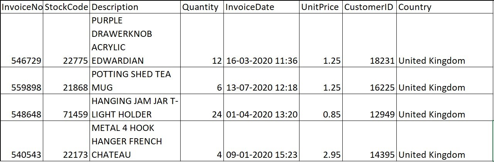
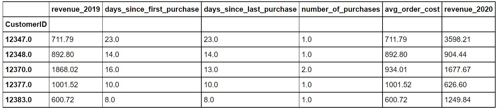

# Lab 05 Predicting Customer Revenue Using Linear Regression

## **Mục tiêu học tập**
Sau khi hoàn thành bài học này, học viên sẽ có thể:
- Hiểu rõ nhu cầu và tầm quan trọng của customer segmentation
- Nắm vững thuật toán K-means và ứng dụng trong phân khúc khách hàng
- Thực hiện phân tích thống kê mô tả và tổng hợp dữ liệu
- Sử dụng các công cụ Python để thực hiện segmentation
- Phân tích và diễn giải kết quả phân khúc khách hàng
- Áp dụng các kỹ thuật nâng cao trong customer segmentation
## **Bài tập Thực hành**
### Bài tập cơ bản

---

#### **Exercise 5.01: Predicting Sales from Advertising Spend Using Linear Regression**
HINA Inc. is a large FMCG company that is streamlining its marketing budget. This involves taking stock of all its marketing strategies. This, in turn, means re-assessing the effectiveness of its existing spend on various marketing channels. As a marketing analyst, you need to figure out if spending money on TV advertising campaigns results in a direct increase in sales. In other words, you need to find out if the TV advertising spend and the sales figures share a linear relationship. Linear regression seems perfect for the job as it models the relationship as a line. 
You are provided with historical advertising data – weekly sales and spend on each channel – for almost the 4 previous years. Using linear regression, you will make a model that predicts sales based on TV channel spend and study the obtained relationship.

**Code:**

```python
# 1.	Import the relevant libraries for plotting and data manipulation, load advertising.csv
#    dataset into a pandas DataFrame, and print the top five records using the following code:
import numpy as np, pandas as pd import matplotlib.pyplot as plt, seaborn as sns advertising = pd.read_csv("advertising.csv") advertising.head()


# 2.	Visualize the association between TV and Sales through a scatter plot using the following code:
plt.scatter(advertising.TV, advertising.Sales, \             marker="+", color='gray') plt.xlabel("TV") plt.ylabel("Sales") plt.show()


# 3.	Import LinearRegression from sklearn and create an instance of LinearRegression using the following code:
from sklearn.linear_model import LinearRegression lr = LinearRegression()

# 4.	Fit a linear regression model, supplying the TV column as the features and Sales as the outcome, using the fit method of LinearRegression: 
lr.fit(advertising[['TV']], advertising[['Sales']])

# 5.	Using the predict method of the model, create a sales_pred variable containing the predictions from the model:
sales_pred = lr.predict(advertising[['TV']])

# 6.	Plot the predicted sales as a line over the scatter plot of Sales versus TV (using the simple line plot). This should help you assess how well the line fits the data and if it indeed is a good representation of the relationship:
plt.plot(advertising.TV, sales_pred,"k--") plt.scatter(advertising.TV, advertising.Sales, \             marker='+', color='gray') plt.xlabel("TV") plt.ylabel('Sales') plt.show()


```

---

#### **Exercise 5.02: Creating Features for Customer Revenue Prediction**
Azra is a big high-fashion retailer with operations in multiple countries. To optimize their marketing activities, Azra seeks to identify high-value customers – customers that are expected to bring high revenue to the retailer – and have a differential marketing strategy for them. You are a marketing analytics manager at Azra and have a solution to this business problem. The key idea is that a predictive model can be employed to predict the next year's revenue of the customer based on the previous year's purchases. A customer with higher predicted revenue is naturally  a higher-value customer. 
To validate this approach, you plan to build a model to predict the revenue of the customer in 2020 based on the purchases made in 2019. If the model performs well, the approach gets validated. The 2020 purchase data can then be used to predict customer revenue for 2021 and help the company identify high-value customers. 
You have historical transaction data for the years 2019 and 2020 in the file  azra_retail_transactions.csv. 

The first few records are shown in Figure 5.10. For each transaction, you have the following: 
•	Customer identifier (CustomerID)
•	The number of units purchased (Quantity) 
•	The date and time of the purchase (InvoiceDate) 
•	The unit cost (UnitPrice) 
•	Some other information about the item purchased (StockCode, Description) and the customer (Country)
The dataset looks like the following:



The goal of this exercise is to manipulate the data and create variables that will allow you to model the customer spend for the year 2020, based on the past activity. The total customer spends for 2020 will therefore be the dependent variable. The independent variables will be features that capture information about the customer's past purchase behavior. Note that this also requires aggregation of the data in order to get one record for each customer. 
More concretely, you will be creating the following variables from the transactions data: 
•	revenue_2019 (total revenue for the year 2019)
•	days_since_first_purchase (the number of days since the first purchase by the customer)
•	days_since_last_purchase (the number of days since the customer's most recent purchase)
•	number_of_purchases (the total number of purchases by the customer in 2019)
•	avg_order_cost (the average value of the orders placed by the customer in 2019)
•	revenue_2020 (the total revenue for the year 2020)
revenue_2020 will be the dependent variable in the model, the rest being the independent variables. The modified dataset with the created features should look like the table in Figure 5.11.




**Code:**

```python
# 1. Import pandas and load the data from retail_transactions.csv into a DataFrame named df, then print the first five records of the DataFrame. Also, import the datetime module as it will come in handy later:
import pandas as pd import datetime as dt df = pd.read_csv('azra_retail_transactions.csv') df.head()

# 2.	Convert the InvoiceDate column to date format using the to_datetime method from pandas: 
df['InvoiceDate'] = pd.to_datetime(df['InvoiceDate'])

# 3.	Calculate the revenue for each row, by multiplying Quantity by UnitPrice. 
Print the first five records of the dataset to verify the result:
df['revenue'] = df['UnitPrice']*df['Quantity'] df.head()


# 4.	In the dataset, each invoice could be spread over multiple rows, one for each type of product purchased (since the row is for each product, and a customer can buy multiple products in an order). These can be combined such that data for each transaction is on a single row. To do so, perform a groupby operation on InvoiceNo. However, before that, you need to specify how to combine those rows that are grouped together. Use the following code: 
operations = {'revenue':'sum',\
              'InvoiceDate':'first',\               'CustomerID':'first'} df = df.groupby('InvoiceNo').agg(operations)

# 5.	Finally, use the head function to display the result:
df.head()

# 6.	You will be using the year of the transaction to derive features for 2019 and 2020. Create a separate column named year for the year. To do that, use the year attribute of the InvoiceDate column, as follows:
df['year'] = df['InvoiceDate'].dt.year

# 7.	For each transaction, calculate how many days' difference there is between the last day of 2019 and the invoice date using the following code. Use the datetime module we imported earlier:
df['days_since'] = (dt.datetime(year=2019, month=12, day=31) \                     - df['InvoiceDate']).apply(lambda x: x.days)

# 8.	Next, create the features for days since the first and last purchase, along with the number of purchases and total revenue for 2019. Define a set of aggregation functions for each of the variables and apply them using the groupby method. You will calculate the sum of revenue. For the days_since column, you will calculate the maximum and the minimum number of days, as well as the number of unique values (giving you how many separate days this customer made a purchase on). Since these are your predictors, store the result in a variable, X, using the following code:
operations = {'revenue':'sum',\               'days_since':['max','min','nunique']}
X = df[df['year'] == 2019].groupby('CustomerID').agg(operations)

# 9.	Now, use the head function to see the results:
X.head()

# 10. To simplify this, reset the names of the columns to make them easier to refer to later. Use the following code and print the results using the head function:
X.columns = [' '.join(col).strip() for col in X.columns.values]
X.head()

# 11.	Derive one more feature: the average spend per order. Calculate this by dividing revenue sum by days_since nunique (note that this is the average spend per day. For simplicity, assume that a customer only makes one order in a day): 
X['avg_order_cost'] = X['revenue sum']/X['days_since nunique']

# 12.	You need the outcome that you will be predicting, which is just the sum of revenue for 2020. Calculate this with a simple groupby operation and store the values in the y variable, as follows:
y = df[df['year'] == 2020].groupby('CustomerID')['revenue'].sum()

# 13.	Put your predictors and outcomes into a single DataFrame, wrangled_df, and rename the columns to have more intuitive names. Finally, look at the resulting DataFrame, using the head function:
wrangled_df = pd.concat([X,y], axis=1) wrangled_df.columns = ['revenue_2019',\
                       'days_since_first_purchase',\
                       'days_since_last_purchase',\
                       'number_of_purchases',\
                       'avg_order_cost',\                        'revenue_2020'] wrangled_df.head()

# 14.	To drop the customers without values, drop rows where either of the revenue columns are null, as follows:
wrangled_df = wrangled_df[~wrangled_df.revenue_2019.isnull()] wrangled_df = wrangled_df[~wrangled_df.revenue_2020.isnull()]

# 15.	As a final data-cleaning step, it's often a good idea to get rid of outliers. A standard definition is that an outlier is any data point more than three standard deviations above the median. Use this criterion to drop customers that are outliers in terms of 2019 or 2020 revenue:
wrangled_df = wrangled_df[wrangled_df.revenue_2020 \               < ((wrangled_df.revenue_2020.median()) \               + wrangled_df.revenue_2020.std()*3)] wrangled_df = wrangled_df[wrangled_df.revenue_2019 \               < ((wrangled_df.revenue_2019.median()) \
              + wrangled_df.revenue_2019.std()*3)]
16.	It's often a good idea after you've done your data cleaning and feature engineering, to save the new data as a new file, so that, as you're developing your model, you don't need to run the data through the whole feature engineering and cleaning pipeline each time you want to rerun your code. You can do this using the to_csv function. Also, take a look at your final DataFrame using the head function:
wrangled_df.to_csv('wrangled_transactions.csv') wrangled_df.head()

```

---

#### **Exercise 5.03: Examining Relationships between Predictors and the Outcome**
In _Exercise 5.02, Creating Features for Customer Revenue Prediction_, you helped the e-commerce company Azra to transform the raw transaction data into a transformed dataset that has useful dependent and independent features that can be used for model building. In this exercise, you will continue the model-building process by analyzing the relationship between the predictors (independent variables) and the outcome (dependent variable). This will help you identify how the different purchase history-related features affect the future revenue of the customer. This will also help you assess whether the associations in the data make business sense. 
You will use scatter plots to visualize the relationships and use correlations to quantify them. Continue in the same Jupyter notebook you used for the previous exercises. Perform the following steps: 

**Code:**

```python
# 1.	Use pandas to import the data you saved at the end of the last exercise (wrangled_transactions.csv). The CustomerID field is not needed for the analysis. Assign CustomerId as the index for the DataFrame:
df = pd.read_csv('wrangled_transactions.csv', \                  index_col='CustomerID')


# 2.	Using the plot method of the pandas DataFrame, make a scatter plot with days_since_first_purchase on the x axis and revenue_2020 on the y axis to examine the relationship between them:
df.plot.scatter(x="days_since_first_purchase", \                 y="revenue_2020", \                 figsize=[6,6], color='gray') plt.show()

# 3. Using the pairplot function of the seaborn library, create pairwise scatter plots of all the features. Use the following code:
import seaborn as sns sns.set_palette('Greys_r') sns.pairplot(df) plt.show()

# 4. Using the pairplot function and the y_vars parameter, limit the view to the row for your target variable, that is, revenue_2020:
sns.pairplot(df, x_vars=df.columns, y_vars="revenue_2020") plt.show()

# 5. Next, use correlations to quantify the associations between the variables. Use the corr method on the pandas DataFrame, as in the following code:
df.corr()

 
```

---

#### **Activity 5.01: Examining the Relationship between Store Location and Revenue**
You are working at a company that sells luxury clothing. Their sales team has collected data on customer age, income, their annual spend at the business, and the number of days since their last purchase. The company wants to start targeted marketing campaigns but doesn't know how many different types of customers they have. If they understood the number of different segments, it would help design the campaign better by helping define the channels to use, the messaging to employ, and more. 
Your goal is to perform customer segmentation for the company which will help them optimize their campaigns. To make your approach robust and more reliable to business, you need to arrive at the right number of segments by using the visualization approach as well as the elbow method with the sum of squared errors. 

_Execute the following steps to complete the activity:_

1.	Import the libraries required for DataFrame handling and plotting (pandas, numpy, matplotlib). Read in the data from the file  
'Clothing_Customers.csv' into a DataFrame and print the top 5 rows to understand it better.
2.	Standardize all the columns in the data. You will be using all four columns for the segmentation. 
3.	Visualize the data to get a good understanding of it. Since you are dealing with four dimensions, use PCA to reduce to two dimensions before plotting. The resulting plot should be as follows.


4. Visualize clustering with two through seven clusters. You should get the following plot.

   

Choosing clusters using elbow method - create a plot of the sum of squared errors and look for an elbow. Vary the number of clusters from 2 to 11. You should get the following plot.

   

5. Do both the methods agree on the optimal number of clusters? Looking at the results from both, and based on your business understanding, what is the number of clusters you would choose? Explain your decision.

   
**Code:**

```python


```

---

#### **Exercise 5.04: Building a Linear Model Predicting Customer Spend**
In this exercise, you will cluster mall customers using the mean-shift algorithm. You will employ the columns Income and Spend_score as criteria. You will first manually specify the bandwidth parameter. Then, you will estimate the bandwidth parameter using the estimate_bandwidth method and see how it varies with the choice of quantile. Continue in the Jupyter notebook from Exercise 4.03, Determining the Number of Clusters Using the Elbow Method and perform the following steps. 

**Code:**

```python
# 1.	Import MeanShift and estimate_bandwidth from sklearn and create a variable 'bandwidth'
#    with a value of 0.9 – the bandwidth to use (an arbitrary, high value). The code is as follows - 
from sklearn.cluster import MeanShift, estimate_bandwidth
bandwidth = 0.9

# 2.	To perform mean-shift clustering on the standardized data,
#    create an instance of MeanShift, specifying the bandwidth and setting bin_seeding
#    to True (to speed up the algorithm). Fit the model on the data and assign
#    the cluster to the variable 'Cluster'. Use the following code:
ms = MeanShift(bandwidth=bandwidth, bin_seeding=True)
ms.fit(mall_scaled[cluster_cols])

mall_scaled['Cluster']= ms.predict(X)

# 3.	Visualize the clusters using a scatter plot. 
markers = ['x', '*', '.', '|', '_', '1', '2']
plt.figure(figsize=[8,6])
for clust in range(mall_scaled.Cluster.nunique()):
     temp = mall_scaled[mall_scaled.Cluster == clust]
     plt.scatter(temp.Income, temp.Spend_score, marker=markers[clust], 
                 label="Cluster"+str(clust), color='gray')
plt.xlabel("Income")
plt.ylabel("Spend_score")
plt.legend()
plt.show()

# 4.	Estimate the required bandwidth using the estimate_bandwidth method.
#    Use the estimate_bandwidth function with a quantile value of 0.1 (an arbitrary choice)
#    to estimate the best bandwidth to use. Print the value, fit the model,
#    and note the number of clusters, using the following code: 
bandwidth = estimate_bandwidth(mall_scaled[cluster_cols], quantile=0.1)
print(bandwidth)

ms = MeanShift(bandwidth=bandwidth, bin_seeding=True) ms.fit(mall_scaled[cluster_cols])
mall_scaled['Cluster']= ms.predict(mall_scaled[cluster_cols])
mall_scaled.Cluster.nunique()


# 5.	Visualize the obtained clusters using a scatter plot.
plt.figure(figsize=[8,6])
for clust in range(mall_scaled.Cluster.nunique()):
     temp = mall_scaled[mall_scaled.Cluster == clust]
     plt.scatter(temp.Income, temp.Spend_score, marker=markers[clust], 
                 label="Cluster"+str(clust),  color='gray')
plt.xlabel("Income")
plt.ylabel("Spend_score")
plt.legend()
plt.show()


#  6. Estimate the bandwidth again, this time with a quantile value of 0.15.
#    Print out the number of clusters obtained. 
bandwidth = estimate_bandwidth(mall_scaled[cluster_cols], quantile=0.15)
print(bandwidth)

# 7. Use the bandwidth calculated in the previous step to fit and extract the number of clusters.
 ms = MeanShift(bandwidth=bandwidth, bin_seeding=True)
 ms.fit(mall_scaled[cluster_cols])
 mall_scaled['Cluster']= ms.predict(mall_scaled[cluster_cols])
 mall_scaled.Cluster.nunique()
 The result should be 5. 

# 8. Visualize the clusters obtained. 
plt.figure(figsize=[8,6])
for clust in range(mall_scaled.Cluster.nunique()):
    temp = mall_scaled[mall_scaled.Cluster == clust]
    plt.scatter(temp.Income, temp.Spend_score, marker=markers[clust], 
                label="Cluster"+str(clust), color='gray')
 plt.xlabel("Income")
 plt.ylabel("Spend_score")
 plt.legend()
 plt.show()
```

---

#### **Exercise 4.05: Clustering Data Using the k-prototypes Method**
For this exercise, you will revisit the customer segmentation problem for Therabank, that you encountered in_ Activity 3.01, Bank Customer Segmentation for Loan Campaign_. The business goal is to get more customers to opt for a personal loan to increase the profitability of the bank's portfolio. Creating customer segments will help the bank identify the types of customers, tune their messaging in the marketing campaigns for the personal loan product. The dataset provided contains data for customers including demographics, some financial information, and how these customers responded to a previous campaign. 

An important feature for business is the education level of the customer and needs to be included in the segmentation. The values in the data are **Primary**, **Secondary**, and **Tertiary**. Since this is a categorical feature, K-means is not a suitable approach. You need to create customer segmentation with this data by applying k-prototype clustering to data that has a mix of categorical (education) and continuous (**income**) variables. 

**Code:**

```python
# 1. Import pandas and read in the data from the file  
#    Bank_Personal_Loan_Modelling-2.csv into a pandas DataFrame named bank0:
import pandas as pd
bank0 = pd.read_csv("Bank_Personal_Loan_Modelling-2.csv")
bank0.head()

# 2.	Standardize the Income column:
from sklearn.preprocessing import StandardScaler
scaler = StandardScaler()
bank_scaled = bank0.copy()
bank_scaled['Income'] = scaler.fit_transform(bank0[['Income']])

# 3.	Import KPrototypes from the kmodes module. Perform k-prototypes clustering
#    using three clusters, specifying the education column (in column index 1) ,
#    as categorical and save the result of the clustering as a new column 
#    called cluster.Specify a random_state of 42 for consistency.
from kmodes.kprototypes import KPrototypes
cluster_cols = ['Income', 'Education']
kp = KPrototypes(n_clusters=3, random_state=42)
bank_scaled['Cluster'] = kp.fit_predict(bank_scaled[cluster_cols], categorical=[1])

# 4.	To understand the obtained clusters, get the proportions of
#    the different education levels in each cluster using the following code.
res = bank_scaled.groupby('Cluster')['Education'].value_counts(normalize=True)
res.unstack().plot.barh(figsize=[9,6], color=['black','lightgray','dimgray'])
plt.show()

```

---

#### **Exercise 4.06: Using Silhouette Score to Pick Optimal Number of Clusters**
In this exercise, you will continue working on the mall customer segmentation case. The objective of the exercise is to identify the right number of clusters using a statistical approach that is, the silhouette score. You will perform k-means clustering on mall customers using different numbers of clusters and use the silhouette score to determine the best number of clusters to use. You will need to continue in the Jupyter notebook used for the exercises so far. 

**Code:**

```python
# 1. Import pandas and read in the data from the file  
#    Bank_Personal_Loan_Modelling-2.csv into a pandas DataFrame named bank0:
import pandas as pd
bank0 = pd.read_csv("Bank_Personal_Loan_Modelling-2.csv")
bank0.head()

# 2.	Standardize the Income column:
from sklearn.preprocessing import StandardScaler
scaler = StandardScaler()
bank_scaled = bank0.copy()
bank_scaled['Income'] = scaler.fit_transform(bank0[['Income']])

# 3.	Import KPrototypes from the kmodes module. Perform k-prototypes clustering
#    using three clusters, specifying the education column (in column index 1) ,
#    as categorical and save the result of the clustering as a new column 
#    called cluster.Specify a random_state of 42 for consistency.
from kmodes.kprototypes import KPrototypes
cluster_cols = ['Income', 'Education']
kp = KPrototypes(n_clusters=3, random_state=42)
bank_scaled['Cluster'] = kp.fit_predict(bank_scaled[cluster_cols], categorical=[1])

# 4.	To understand the obtained clusters, get the proportions of
#    the different education levels in each cluster using the following code.
res = bank_scaled.groupby('Cluster')['Education'].value_counts(normalize=True)
res.unstack().plot.barh(figsize=[9,6], color=['black','lightgray','dimgray'])
plt.show()

```

---

#### **Exercise 4.07: Using a Train-Test Split to Evaluate Clustering Performance**
In this exercise, you will use a train-test split approach to evaluate the performance of the clustering. The goal of the exercise is to ensure reliable and robust customers segments from the mall customers. You will need to separate the data into train and test sets first. Then, you will fit a K-means model with a sub-optimal number of clusters. If the clusters are good, the silhouette score should be consistent between the train and test data. Continue in the same Jupyter notebook used so far for all the preceding exercises. 

**Code:**

```python
# 1. Import the train_test_split function from sklearn and perform the split on the mall customer data.
#    Specify the train size as 0.75 and  a random_state of 42. Print the shapes of the resulting datasets.
from sklearn.model_selection import train_test_split
df_train, df_test = train_test_split(mall0, train_size=0.75, random_state=42)

#    Specifying a train_size of 0.75 assigns 75% of the records to the train set and
#    the remaining to the test set. Using random_state ensures that the results are reproducible.
print(df_train.shape)
print(df_test.shape)

# 2.	Fit a Kmeans mode with 6 clusters on the train data. Calculate the average silhouette score.
#    Ignore the warnings (if any) resulting from this step.
model = KMeans(n_clusters=6, random_state=42)
df_train['Cluster'] = model.fit_predict(df_train[cluster_cols])
silhouette_avg = silhouette_score(df_train[cluster_cols], df_train['Cluster'])
print(silhouette_avg)

# 3.	Using the predict method of the model, predict the clusters for the test data.
#    Then, calculate the average silhouette score for the test data using the following code.
#    Ignore warnings, if any, from the code. 
df_test['Cluster'] = model.predict(df_test[cluster_cols])
silhouette_avg = silhouette_score(df_test[cluster_cols],df_test['Cluster'])
print(silhouette_avg)

# 4.	Visualize the predicted clusters on the test data using a scatter plot,
#    marking the different clusters.
for clust in range(df_test.Cluster.nunique()):
     temp = df_test[df_test.Cluster == clust]
     plt.scatter(temp.Income, temp.Spend_score, marker=markers[clust], color='gray')
plt.xlabel("Income")
plt.ylabel("Spend_score")
plt.show()

```
---

#### **Activity 5.02: Predicting Store Revenue Using Linear Regression**
You are a data science manager in the marketing division at a major multinational alcoholic beverage company. Over the past year, the marketing team launched 32 initiatives to increase its sales. Your team has acquired data that tells you which customers have responded to which of the 32 marketing initiatives recently (this data is present within the **customer_offers.csv** file). The business goal is to improve future marketing campaigns by targeting them precisely, so they can provide offers customized to groups that tend to respond to similar offers. The solution is to build customer segments based on the responses of the customers to past initiatives. 

In this activity, you will employ a thorough approach to clustering by trying multiple clustering techniques. Additionally, you will employ statistical approaches to cluster evaluation to ensure your results are reliable and robust. Using the cluster evaluation techniques, you will also tune the hyperparameters, as applicable, for the clustering algorithms. Start in a new Jupyter notebook for the activity.
Execute the following steps to complete this activity:
1.	Import the necessary libraries for data handling, clustering, and visualization. Import data from **customer_offers.csv** into a pandas DataFrame. 
2.	Print the top five rows of the DataFrame, which should look like the table below.


3.	Divide the dataset into train and test sets by using the **train_test_split** method from scikit-learn. Specify **random_state** as 100 for consistency.
4.	Perform k-means on the data. Identify the optimal number of clusters by using the silhouette score approach on the train data by plotting the score for the different number of clusters, varying from **2** through **10**. The plot for silhouette scores should be as follows:


5.	Perform K means using k found in the previous step. Print out the **silhouette score** on the test set.
6.	Perform mean-shift clustering on the data, using the **estimate_bandwidth** method with a quantile value of **0.1** to estimate the bandwidth. Print out the silhouette score from the model on the test set.
7.	Perform k-modes on the data. Identify the optimal number of clusters by using the silhouette score approach on the train data by plotting the score for the different number of clusters, varying from **3** through **10**. You should get the following output.


8.	Using K found in the previous step, perform K-modes on the data. Print out the silhouette score on the test set.
9.	Which of the three techniques gives you the best result? What is the final number of clusters you will go with? 

---
## Bài tập tổng hợp

# Bài Tập Ứng Dụng: Unsupervised Learning và Customer Segmentation

## Mục Tiêu Học Tập
- Nắm vững các kỹ thuật clustering hiện đại cho phân khúc khách hàng
- Học cách chọn số cluster tối ưu một cách có nguyên tắc
- Áp dụng các phương pháp đánh giá cluster cho nhiều bài toán kinh doanh
- Thực hành các thuật toán clustering nâng cao: Mean-Shift, K-Modes, K-Prototypes

---

## Bài Tập 1: Cải Tiến Phương Pháp Customer Segmentation với Kỹ Thuật Clustering Hiện Đại

### Mô Tả Bài Toán
Bạn là Data Scientist tại một công ty thương mại điện tử. Công ty muốn cải tiến chiến lược phân khúc khách hàng hiện tại bằng cách sử dụng các kỹ thuật clustering hiện đại thay vì phương pháp truyền thống.

### Dataset
Sử dụng dữ liệu khách hàng với các đặc trưng:
- `customer_id`: ID khách hàng
- `recency`: Số ngày kể từ lần mua hàng cuối
- `frequency`: Tần suất mua hàng trong năm
- `monetary`: Tổng giá trị đơn hàng
- `avg_order_value`: Giá trị đơn hàng trung bình
- `days_since_first_purchase`: Số ngày từ lần mua đầu tiên
- `product_categories`: Số danh mục sản phẩm đã mua

### Yêu Cầu Thực Hiện

#### Phần A: Chuẩn Bị Dữ Liệu và EDA
```python
import pandas as pd
import numpy as np
import matplotlib.pyplot as plt
import seaborn as sns
from sklearn.preprocessing import StandardScaler, RobustScaler
from sklearn.decomposition import PCA
from sklearn.cluster import KMeans, DBSCAN, AgglomerativeClustering
from sklearn.mixture import GaussianMixture
import warnings
warnings.filterwarnings('ignore')

# Tạo dữ liệu mẫu
np.random.seed(42)
n_customers = 2000

# Tạo 4 segment khách hàng khác nhau
segments = []
for i in range(4):
    segment_size = n_customers // 4
    if i == 0:  # High Value Customers
        segment = {
            'recency': np.random.normal(15, 5, segment_size),
            'frequency': np.random.normal(25, 5, segment_size),
            'monetary': np.random.normal(5000, 1000, segment_size),
            'avg_order_value': np.random.normal(200, 50, segment_size),
            'days_since_first_purchase': np.random.normal(400, 100, segment_size),
            'product_categories': np.random.normal(8, 2, segment_size)
        }
    elif i == 1:  # Regular Customers
        segment = {
            'recency': np.random.normal(45, 10, segment_size),
            'frequency': np.random.normal(12, 3, segment_size),
            'monetary': np.random.normal(2000, 500, segment_size),
            'avg_order_value': np.random.normal(100, 30, segment_size),
            'days_since_first_purchase': np.random.normal(200, 50, segment_size),
            'product_categories': np.random.normal(5, 1, segment_size)
        }
    elif i == 2:  # At Risk Customers
        segment = {
            'recency': np.random.normal(120, 30, segment_size),
            'frequency': np.random.normal(8, 2, segment_size),
            'monetary': np.random.normal(1500, 400, segment_size),
            'avg_order_value': np.random.normal(80, 20, segment_size),
            'days_since_first_purchase': np.random.normal(300, 80, segment_size),
            'product_categories': np.random.normal(3, 1, segment_size)
        }
    else:  # Lost Customers
        segment = {
            'recency': np.random.normal(200, 50, segment_size),
            'frequency': np.random.normal(3, 1, segment_size),
            'monetary': np.random.normal(500, 200, segment_size),
            'avg_order_value': np.random.normal(60, 15, segment_size),
            'days_since_first_purchase': np.random.normal(500, 150, segment_size),
            'product_categories': np.random.normal(2, 0.5, segment_size)
        }
    segments.append(pd.DataFrame(segment))

# Kết hợp tất cả segments
df = pd.concat(segments, ignore_index=True)
df['customer_id'] = range(1, len(df) + 1)

# Đảm bảo giá trị dương
for col in df.columns:
    if col != 'customer_id':
        df[col] = np.maximum(df[col], 1)

print("Dataset shape:", df.shape)
print("\nDataset info:")
print(df.describe())
```

**Nhiệm vụ 1.1**: Thực hiện EDA chi tiết
- Vẽ distribution plots cho từng feature
- Tạo correlation matrix
- Phân tích outliers bằng boxplots
- Tính toán và visualize skewness của các biến

**Nhiệm vụ 1.2**: So sánh các phương pháp scaling
```python
# So sánh StandardScaler vs RobustScaler
scalers = {
    'StandardScaler': StandardScaler(),
    'RobustScaler': RobustScaler()
}

# Thực hiện scaling và so sánh kết quả
```

#### Phần B: Implement Clustering Algorithms Hiện Đại

**Nhiệm vụ 1.3**: Implement và so sánh các thuật toán clustering
```python
from sklearn.cluster import KMeans, DBSCAN, AgglomerativeClustering
from sklearn.mixture import GaussianMixture
from sklearn.metrics import silhouette_score, calinski_harabasz_score, davies_bouldin_score

class ModernClusteringComparison:
    def __init__(self, data):
        self.data = data
        self.results = {}
    
    def fit_kmeans_variants(self, n_clusters=4):
        """So sánh các variant của K-Means"""
        kmeans_variants = {
            'K-Means (Lloyd)': KMeans(n_clusters=n_clusters, algorithm='lloyd', random_state=42),
            'K-Means (Elkan)': KMeans(n_clusters=n_clusters, algorithm='elkan', random_state=42),
            'K-Means++': KMeans(n_clusters=n_clusters, init='k-means++', random_state=42)
        }
        
        for name, model in kmeans_variants.items():
            labels = model.fit_predict(self.data)
            self.results[name] = {
                'labels': labels,
                'silhouette': silhouette_score(self.data, labels),
                'calinski_harabasz': calinski_harabasz_score(self.data, labels),
                'davies_bouldin': davies_bouldin_score(self.data, labels),
                'inertia': model.inertia_
            }
    
    def fit_gaussian_mixture(self, n_components=4):
        """Gaussian Mixture Models với các covariance types"""
        covariance_types = ['full', 'tied', 'diag', 'spherical']
        
        for cov_type in covariance_types:
            gmm = GaussianMixture(n_components=n_components, 
                                covariance_type=cov_type, 
                                random_state=42)
            labels = gmm.fit_predict(self.data)
            
            self.results[f'GMM ({cov_type})'] = {
                'labels': labels,
                'silhouette': silhouette_score(self.data, labels),
                'calinski_harabasz': calinski_harabasz_score(self.data, labels),
                'davies_bouldin': davies_bouldin_score(self.data, labels),
                'aic': gmm.aic(self.data),
                'bic': gmm.bic(self.data)
            }
    
    def fit_hierarchical_clustering(self):
        """Hierarchical Clustering với các linkage methods"""
        linkage_methods = ['ward', 'complete', 'average', 'single']
        
        for linkage in linkage_methods:
            if linkage == 'ward':
                model = AgglomerativeClustering(n_clusters=4, linkage=linkage)
            else:
                model = AgglomerativeClustering(n_clusters=4, linkage=linkage, 
                                              metric='euclidean')
            labels = model.fit_predict(self.data)
            
            self.results[f'Hierarchical ({linkage})'] = {
                'labels': labels,
                'silhouette': silhouette_score(self.data, labels),
                'calinski_harabasz': calinski_harabasz_score(self.data, labels),
                'davies_bouldin': davies_bouldin_score(self.data, labels)
            }
    
    def compare_results(self):
        """So sánh kết quả của tất cả các thuật toán"""
        comparison_df = pd.DataFrame({
            'Algorithm': list(self.results.keys()),
            'Silhouette Score': [self.results[alg]['silhouette'] for alg in self.results.keys()],
            'Calinski-Harabasz': [self.results[alg]['calinski_harabasz'] for alg in self.results.keys()],
            'Davies-Bouldin': [self.results[alg]['davies_bouldin'] for alg in self.results.keys()]
        })
        
        return comparison_df.sort_values('Silhouette Score', ascending=False)

# Sử dụng class
features = ['recency', 'frequency', 'monetary', 'avg_order_value', 
           'days_since_first_purchase', 'product_categories']
X_scaled = StandardScaler().fit_transform(df[features])

clustering_comparison = ModernClusteringComparison(X_scaled)
clustering_comparison.fit_kmeans_variants()
clustering_comparison.fit_gaussian_mixture()
clustering_comparison.fit_hierarchical_clustering()

results_comparison = clustering_comparison.compare_results()
print(results_comparison)
```

#### Phần C: Cluster Evaluation và Interpretation

**Nhiệm vụ 1.4**: Tạo comprehensive evaluation framework
```python
def comprehensive_cluster_evaluation(X, labels, original_data):
    """
    Đánh giá toàn diện các cluster được tạo
    """
    evaluation_metrics = {}
    
    # Internal metrics
    evaluation_metrics['silhouette_score'] = silhouette_score(X, labels)
    evaluation_metrics['calinski_harabasz_score'] = calinski_harabasz_score(X, labels)
    evaluation_metrics['davies_bouldin_score'] = davies_bouldin_score(X, labels)
    
    # Business metrics
    cluster_profiles = original_data.copy()
    cluster_profiles['cluster'] = labels
    
    # Tính toán business metrics cho từng cluster
    business_metrics = cluster_profiles.groupby('cluster').agg({
        'recency': ['mean', 'std'],
        'frequency': ['mean', 'std'],
        'monetary': ['mean', 'std', 'sum'],
        'avg_order_value': ['mean', 'std'],
        'days_since_first_purchase': ['mean', 'std'],
        'product_categories': ['mean', 'std']
    })
    
    # Cluster size distribution
    cluster_sizes = cluster_profiles['cluster'].value_counts().sort_index()
    evaluation_metrics['cluster_sizes'] = cluster_sizes
    evaluation_metrics['cluster_balance'] = cluster_sizes.std() / cluster_sizes.mean()
    
    return evaluation_metrics, business_metrics

# Áp dụng evaluation
best_algorithm = 'K-Means++'  # Từ kết quả comparison
best_labels = clustering_comparison.results[best_algorithm]['labels']

eval_metrics, business_profiles = comprehensive_cluster_evaluation(
    X_scaled, best_labels, df[features]
)
```

---

## Bài Tập 2: Xác Định Số Cluster Tối Ưu Một Cách Có Nguyên Tắc

### Mô Tả Bài Toán
Phát triển một framework toàn diện để xác định số cluster tối ưu cho customer segmentation, đảm bảo các segment có ý nghĩa thống kê và khả thi trong kinh doanh.

### Yêu Cầu Thực Hiện

#### Phần A: Multiple Methods for Optimal K Selection

**Nhiệm vụ 2.1**: Implement các phương pháp xác định K tối ưu
```python
class OptimalClusterSelector:
    def __init__(self, data, max_clusters=15):
        self.data = data
        self.max_clusters = max_clusters
        self.results = {}
        
    def elbow_method(self):
        """Elbow Method với improved detection"""
        inertias = []
        k_range = range(1, self.max_clusters + 1)
        
        for k in k_range:
            kmeans = KMeans(n_clusters=k, random_state=42)
            kmeans.fit(self.data)
            inertias.append(kmeans.inertia_)
        
        # Tính gradient để detect elbow point
        gradients = np.diff(inertias)
        second_gradients = np.diff(gradients)
        
        # Elbow point là điểm có second gradient lớn nhất (most negative)
        elbow_point = np.argmax(second_gradients) + 2
        
        self.results['elbow'] = {
            'k_range': k_range,
            'inertias': inertias,
            'optimal_k': elbow_point,
            'gradients': gradients,
            'second_gradients': second_gradients
        }
        
        return elbow_point
    
    def silhouette_analysis(self):
        """Silhouette Analysis với detailed scores"""
        silhouette_scores = []
        k_range = range(2, self.max_clusters + 1)
        
        for k in k_range:
            kmeans = KMeans(n_clusters=k, random_state=42)
            labels = kmeans.fit_predict(self.data)
            score = silhouette_score(self.data, labels)
            silhouette_scores.append(score)
        
        optimal_k = k_range[np.argmax(silhouette_scores)]
        
        self.results['silhouette'] = {
            'k_range': k_range,
            'scores': silhouette_scores,
            'optimal_k': optimal_k
        }
        
        return optimal_k
    
    def gap_statistic(self, n_refs=10):
        """Gap Statistic method"""
        def compute_inertia(data, k):
            kmeans = KMeans(n_clusters=k, random_state=42)
            kmeans.fit(data)
            return kmeans.inertia_
        
        k_range = range(1, self.max_clusters + 1)
        gaps = []
        errors = []
        
        for k in k_range:
            # Original data inertia
            original_inertia = compute_inertia(self.data, k)
            
            # Reference data inertias
            ref_inertias = []
            for _ in range(n_refs):
                # Generate reference data
                ref_data = np.random.uniform(
                    low=self.data.min(axis=0),
                    high=self.data.max(axis=0),
                    size=self.data.shape
                )
                ref_inertia = compute_inertia(ref_data, k)
                ref_inertias.append(ref_inertia)
            
            # Gap statistic
            gap = np.log(np.mean(ref_inertias)) - np.log(original_inertia)
            error = np.sqrt(1 + 1/n_refs) * np.std(np.log(ref_inertias))
            
            gaps.append(gap)
            errors.append(error)
        
        # Find optimal k using Gap(k) >= Gap(k+1) - s_{k+1}
        optimal_k = 1
        for i in range(len(gaps) - 1):
            if gaps[i] >= gaps[i + 1] - errors[i + 1]:
                optimal_k = k_range[i]
                break
        
        self.results['gap_statistic'] = {
            'k_range': k_range,
            'gaps': gaps,
            'errors': errors,
            'optimal_k': optimal_k
        }
        
        return optimal_k
    
    def calinski_harabasz_method(self):
        """Calinski-Harabasz Index method"""
        ch_scores = []
        k_range = range(2, self.max_clusters + 1)
        
        for k in k_range:
            kmeans = KMeans(n_clusters=k, random_state=42)
            labels = kmeans.fit_predict(self.data)
            score = calinski_harabasz_score(self.data, labels)
            ch_scores.append(score)
        
        optimal_k = k_range[np.argmax(ch_scores)]
        
        self.results['calinski_harabasz'] = {
            'k_range': k_range,
            'scores': ch_scores,
            'optimal_k': optimal_k
        }
        
        return optimal_k
    
    def davies_bouldin_method(self):
        """Davies-Bouldin Index method (lower is better)"""
        db_scores = []
        k_range = range(2, self.max_clusters + 1)
        
        for k in k_range:
            kmeans = KMeans(n_clusters=k, random_state=42)
            labels = kmeans.fit_predict(self.data)
            score = davies_bouldin_score(self.data, labels)
            db_scores.append(score)
        
        optimal_k = k_range[np.argmin(db_scores)]
        
        self.results['davies_bouldin'] = {
            'k_range': k_range,
            'scores': db_scores,
            'optimal_k': optimal_k
        }
        
        return optimal_k
    
    def consensus_optimal_k(self):
        """Tìm consensus từ tất cả các phương pháp"""
        methods = ['elbow', 'silhouette', 'gap_statistic', 'calinski_harabasz', 'davies_bouldin']
        optimal_ks = []
        
        for method in methods:
            if method == 'elbow':
                k = self.elbow_method()
            elif method == 'silhouette':
                k = self.silhouette_analysis()
            elif method == 'gap_statistic':
                k = self.gap_statistic()
            elif method == 'calinski_harabasz':
                k = self.calinski_harabasz_method()
            elif method == 'davies_bouldin':
                k = self.davies_bouldin_method()
            
            optimal_ks.append(k)
        
        # Tìm mode (giá trị xuất hiện nhiều nhất)
        consensus_k = max(set(optimal_ks), key=optimal_ks.count)
        
        consensus_results = pd.DataFrame({
            'Method': methods,
            'Optimal_K': optimal_ks
        })
        
        return consensus_k, consensus_results
    
    def plot_all_methods(self):
        """Visualize kết quả của tất cả các phương pháp"""
        fig, axes = plt.subplots(2, 3, figsize=(18, 12))
        axes = axes.ravel()
        
        # Elbow Method
        axes[0].plot(self.results['elbow']['k_range'], self.results['elbow']['inertias'], 'bo-')
        axes[0].axvline(x=self.results['elbow']['optimal_k'], color='red', linestyle='--', 
                       label=f'Optimal K = {self.results["elbow"]["optimal_k"]}')
        axes[0].set_title('Elbow Method')
        axes[0].set_xlabel('Number of Clusters (K)')
        axes[0].set_ylabel('Inertia')
        axes[0].legend()
        axes[0].grid(True, alpha=0.3)
        
        # Silhouette Analysis
        axes[1].plot(self.results['silhouette']['k_range'], self.results['silhouette']['scores'], 'go-')
        axes[1].axvline(x=self.results['silhouette']['optimal_k'], color='red', linestyle='--',
                       label=f'Optimal K = {self.results["silhouette"]["optimal_k"]}')
        axes[1].set_title('Silhouette Analysis')
        axes[1].set_xlabel('Number of Clusters (K)')
        axes[1].set_ylabel('Silhouette Score')
        axes[1].legend()
        axes[1].grid(True, alpha=0.3)
        
        # Gap Statistic
        axes[2].errorbar(self.results['gap_statistic']['k_range'], 
                        self.results['gap_statistic']['gaps'],
                        yerr=self.results['gap_statistic']['errors'], 
                        fmt='ro-', capsize=5)
        axes[2].axvline(x=self.results['gap_statistic']['optimal_k'], color='red', linestyle='--',
                       label=f'Optimal K = {self.results["gap_statistic"]["optimal_k"]}')
        axes[2].set_title('Gap Statistic')
        axes[2].set_xlabel('Number of Clusters (K)')
        axes[2].set_ylabel('Gap Statistic')
        axes[2].legend()
        axes[2].grid(True, alpha=0.3)
        
        # Calinski-Harabasz
        axes[3].plot(self.results['calinski_harabasz']['k_range'], 
                    self.results['calinski_harabasz']['scores'], 'mo-')
        axes[3].axvline(x=self.results['calinski_harabasz']['optimal_k'], color='red', linestyle='--',
                       label=f'Optimal K = {self.results["calinski_harabasz"]["optimal_k"]}')
        axes[3].set_title('Calinski-Harabasz Index')
        axes[3].set_xlabel('Number of Clusters (K)')
        axes[3].set_ylabel('CH Score')
        axes[3].legend()
        axes[3].grid(True, alpha=0.3)
        
        # Davies-Bouldin
        axes[4].plot(self.results['davies_bouldin']['k_range'], 
                    self.results['davies_bouldin']['scores'], 'co-')
        axes[4].axvline(x=self.results['davies_bouldin']['optimal_k'], color='red', linestyle='--',
                       label=f'Optimal K = {self.results["davies_bouldin"]["optimal_k"]}')
        axes[4].set_title('Davies-Bouldin Index')
        axes[4].set_xlabel('Number of Clusters (K)')
        axes[4].set_ylabel('DB Score')
        axes[4].legend()
        axes[4].grid(True, alpha=0.3)
        
        # Summary plot
        methods_data = []
        for method, result in self.results.items():
            methods_data.append({
                'Method': method.replace('_', ' ').title(),
                'Optimal K': result['optimal_k']
            })
        
        methods_df = pd.DataFrame(methods_data)
        axes[5].bar(methods_df['Method'], methods_df['Optimal K'], color='skyblue', edgecolor='navy')
        axes[5].set_title('Optimal K by Different Methods')
        axes[5].set_xlabel('Methods')
        axes[5].set_ylabel('Optimal K')
        axes[5].tick_params(axis='x', rotation=45)
        
        plt.tight_layout()
        plt.show()

# Sử dụng class
selector = OptimalClusterSelector(X_scaled, max_clusters=10)
consensus_k, methods_summary = selector.consensus_optimal_k()
selector.plot_all_methods()

print(f"Consensus Optimal K: {consensus_k}")
print("\nMethods Summary:")
print(methods_summary)
```

#### Phần B: Business-Driven Cluster Validation

**Nhiệm vụ 2.2**: Tạo business validation framework
```python
class BusinessClusterValidator:
    def __init__(self, data, features, business_metrics):
        self.data = data
        self.features = features
        self.business_metrics = business_metrics
        
    def validate_cluster_actionability(self, labels):
        """
        Kiểm tra tính khả thi của clusters trong kinh doanh
        """
        cluster_data = self.data.copy()
        cluster_data['cluster'] = labels
        
        validation_results = {}
        
        # 1. Cluster Size Adequacy
        cluster_sizes = cluster_data['cluster'].value_counts()
        min_viable_size = len(self.data) * 0.05  # Ít nhất 5% của total customers
        
        validation_results['size_adequacy'] = {
            'min_size': cluster_sizes.min(),
            'max_size': cluster_sizes.max(),
            'min_viable_size': min_viable_size,
            'all_adequate': cluster_sizes.min() >= min_viable_size,
            'cluster_sizes': cluster_sizes.to_dict()
        }
        
        # 2. Statistical Separation
        separation_scores = {}
        for metric in self.business_metrics:
            cluster_means = cluster_data.groupby('cluster')[metric].mean()
            overall_std = cluster_data[metric].std()
            
            # Tính Cohen's d between clusters
            cohens_d_matrix = np.zeros((len(cluster_means), len(cluster_means)))
            for i, cluster1 in enumerate(cluster_means.index):
                for j, cluster2 in enumerate(cluster_means.index):
                    if i != j:
                        mean_diff = abs(cluster_means.iloc[i] - cluster_means.iloc[j])
                        cohens_d = mean_diff / overall_std
                        cohens_d_matrix[i, j] = cohens_d
            
            separation_scores[metric] = {
                'min_cohens_d': cohens_d_matrix[cohens_d_matrix > 0].min(),
                'max_cohens_d': cohens_d_matrix.max(),
                'avg_cohens_d': cohens_d_matrix[cohens_d_matrix > 0].mean()
            }
        
        validation_results['statistical_separation'] = separation_scores
        
        # 3. Business Interpretability
        cluster_profiles = cluster_data.groupby('cluster')[self.business_metrics].agg(['mean', 'std'])
        
        # RFM-like interpretation
        interpretations = {}
        for cluster_id in cluster_data['cluster'].unique():
            cluster_subset = cluster_data[cluster_data['cluster'] == cluster_id]
            
            # Define cluster characteristics
            recency_level = 'Low' if cluster_subset['recency'].mean() < cluster_data['recency'].quantile(0.33) else \
                          'Medium' if cluster_subset['recency'].mean() < cluster_data['recency'].quantile(0.67) else 'High'
            
            frequency_level = 'Low' if cluster_subset['frequency'].mean() < cluster_data['frequency'].quantile(0.33) else \
                            'Medium' if cluster_subset['frequency'].mean() < cluster_data['frequency'].quantile(0.67) else 'High'
            
            monetary_level = 'Low' if cluster_subset['monetary'].mean() < cluster_data['monetary'].quantile(0.33) else \
                           'Medium' if cluster_subset['monetary'].mean() < cluster_data['monetary'].quantile(0.67) else 'High'
            
            interpretations[cluster_id] = {
                'recency': recency_level,
                'frequency': frequency_level,
                'monetary': monetary_level,
                'suggested_name': f"R:{recency_level[0]}-F:{frequency_level[0]}-M:{monetary_level[0]}",
                'size': len(cluster_subset),
                'percentage': len(cluster_subset) / len(cluster_data) * 100
            }
        
        validation_results['business_interpretability'] = interpretations
        
        return validation_results
    
    def stability_analysis(self, n_iterations=10, sample_ratio=0.8):
        """
        Phân tích stability của clustering qua multiple runs
        """
        stability_scores = []
        
        for iteration in range(n_iterations):
            # Random sampling
            sample_size = int(len(self.data) * sample_ratio)
            sample_indices = np.random.choice(len(self.data), sample_size, replace=False)
            
            sample_data = self.data.iloc[sample_indices][self.features]
            sample_scaled = StandardScaler().fit_transform(sample_data)
            
            # Clustering
            kmeans = KMeans(n_clusters=4, random_state=iteration)
            labels = kmeans.fit_predict(sample_scaled)
            
            # Calculate stability metric (silhouette score)
            stability_score = silhouette_score(sample_scaled, labels)
            stability_scores.append(stability_score)
        
        return {
            'mean_stability': np.mean(stability_scores),
            'std_stability': np.std(stability_scores),
            'stability_scores': stability_scores,
            'coefficient_of_variation': np.std(stability_scores) / np.mean(stability_scores)
        }

# Sử dụng Business Validator
business_metrics = ['recency', 'frequency', 'monetary', 'avg_order_value']
validator = BusinessClusterValidator(df, features, business_metrics)

# Validate với optimal K
kmeans_optimal = KMeans(n_clusters=consensus_k, random_state=42)
optimal_labels = kmeans_optimal.fit_predict(X_scaled)

business_validation = validator.validate_cluster_actionability(optimal_labels)
stability_results = validator.stability_analysis()

print("Business Validation Results:")
print(f"All clusters adequate size: {business_validation['size_adequacy']['all_adequate']}")
print(f"Stability coefficient of variation: {stability_results['coefficient_of_variation']:.3f}")
```

---

## Bài Tập 3: Áp Dụng Evaluation Approaches cho Multiple Business Problems

### Mô Tả Bài Toán
Áp dụng các phương pháp đánh giá cluster cho 3 bài toán kinh doanh khác nhau: E-commerce, Banking, và Telecommunications.

### Dataset cho Multiple Domains

**Nhiệm vụ 3.1**: Tạo domain-specific datasets
```python
class MultiDomainDataGenerator:
    @staticmethod
    def generate_ecommerce_data(n_customers=1500):
        """E-commerce customer data"""
        np.random.seed(42)
        
        # 5 segments: Champions, Loyal, Potential Loyalists, New Customers, At Risk
        segments_config = [
            {'name': 'Champions', 'size': 0.2, 'recency': (1, 10), 'frequency': (15, 25), 
             'monetary': (3000, 5000), 'avg_session_duration': (20, 30), 'bounce_rate': (0.1, 0.3)},
            {'name': 'Loyal', 'size': 0.25, 'recency': (10, 30), 'frequency': (8, 15), 
             'monetary': (1500, 3000), 'avg_session_duration': (15, 25), 'bounce_rate': (0.2, 0.4)},
            {'name': 'Potential Loyalists', 'size': 0.2, 'recency': (5, 20), 'frequency': (3, 8), 
             'monetary': (800, 1500), 'avg_session_duration': (10, 20), 'bounce_rate': (0.3, 0.5)},
            {'name': 'New Customers', 'size': 0.15, 'recency': (1, 15), 'frequency': (1, 3), 
             'monetary': (200, 800), 'avg_session_duration': (5, 15), 'bounce_rate': (0.4, 0.7)},
            {'name': 'At Risk', 'size': 0.2, 'recency': (50, 100), 'frequency': (5, 12), 
             'monetary': (1000, 2500), 'avg_session_duration': (5, 10), 'bounce_rate': (0.6, 0.8)}
        ]
        
        data = []
        for segment in segments_config:
            size = int(n_customers * segment['size'])
            segment_data = {
                'customer_id': range(len(data), len(data) + size),
                'recency': np.random.uniform(segment['recency'][0], segment['recency'][1], size),
                'frequency': np.random.uniform(segment['frequency'][0], segment['frequency'][1], size),
                'monetary': np.random.uniform(segment['monetary'][0], segment['monetary'][1], size),
                'avg_session_duration': np.random.uniform(segment['avg_session_duration'][0], 
                                                        segment['avg_session_duration'][1], size),
                'bounce_rate': np.random.uniform(segment['bounce_rate'][0], segment['bounce_rate'][1], size),
                'true_segment': [segment['name']] * size
            }
            data.append(pd.DataFrame(segment_data))
        
        return pd.concat(data, ignore_index=True)
    
    @staticmethod
    def generate_banking_data(n_customers=1500):
        """Banking customer data"""
        np.random.seed(42)
        
        segments_config = [
            {'name': 'High Value', 'size': 0.15, 'balance': (50000, 200000), 'transaction_count': (20, 50),
             'credit_score': (750, 850), 'products_count': (4, 8), 'digital_engagement': (0.8, 1.0)},
            {'name': 'Mass Affluent', 'size': 0.25, 'balance': (15000, 50000), 'transaction_count': (10, 25),
             'credit_score': (650, 750), 'products_count': (2, 5), 'digital_engagement': (0.6, 0.8)},
            {'name': 'Mainstream', 'size': 0.35, 'balance': (2000, 15000), 'transaction_count': (5, 15),
             'credit_score': (550, 700), 'products_count': (1, 3), 'digital_engagement': (0.4, 0.7)},
            {'name': 'Young Professionals', 'size': 0.15, 'balance': (1000, 8000), 'transaction_count': (8, 20),
             'credit_score': (600, 750), 'products_count': (2, 4), 'digital_engagement': (0.8, 1.0)},
            {'name': 'Inactive', 'size': 0.1, 'balance': (100, 2000), 'transaction_count': (0, 5),
             'credit_score': (400, 600), 'products_count': (1, 2), 'digital_engagement': (0.0, 0.3)}
        ]
        
        data = []
        for segment in segments_config:
            size = int(n_customers * segment['size'])
            segment_data = {
                'customer_id': range(len(data), len(data) + size),
                'account_balance': np.random.uniform(segment['balance'][0], segment['balance'][1], size),
                'monthly_transactions': np.random.uniform(segment['transaction_count'][0], 
                                                        segment['transaction_count'][1], size),
                'credit_score': np.random.uniform(segment['credit_score'][0], segment['credit_score'][1], size),
                'products_owned': np.random.uniform(segment['products_count'][0], 
                                                   segment['products_count'][1], size),
                'digital_engagement_score': np.random.uniform(segment['digital_engagement'][0], 
                                                            segment['digital_engagement'][1], size),
                'true_segment': [segment['name']] * size
            }
            data.append(pd.DataFrame(segment_data))
        
        return pd.concat(data, ignore_index=True)
    
    @staticmethod
    def generate_telecom_data(n_customers=1500):
        """Telecommunications customer data"""
        np.random.seed(42)
        
        segments_config = [
            {'name': 'Heavy Users', 'size': 0.2, 'monthly_minutes': (800, 1500), 'data_usage': (15, 30),
             'monthly_revenue': (80, 150), 'tenure': (24, 60), 'customer_service_calls': (0, 2)},
            {'name': 'Standard Users', 'size': 0.4, 'monthly_minutes': (300, 800), 'data_usage': (5, 15),
             'monthly_revenue': (40, 80), 'tenure': (12, 36), 'customer_service_calls': (1, 4)},
            {'name': 'Light Users', 'size': 0.2, 'monthly_minutes': (50, 300), 'data_usage': (1, 5),
             'monthly_revenue': (20, 40), 'tenure': (6, 24), 'customer_service_calls': (0, 3)},
            {'name': 'Business Users', 'size': 0.1, 'monthly_minutes': (1000, 2000), 'data_usage': (20, 40),
             'monthly_revenue': (100, 200), 'tenure': (12, 48), 'customer_service_calls': (2, 6)},
            {'name': 'Churners', 'size': 0.1, 'monthly_minutes': (100, 400), 'data_usage': (2, 8),
             'monthly_revenue': (25, 50), 'tenure': (1, 12), 'customer_service_calls': (3, 8)}
        ]
        
        data = []
        for segment in segments_config:
            size = int(n_customers * segment['size'])
            segment_data = {
                'customer_id': range(len(data), len(data) + size),
                'monthly_voice_minutes': np.random.uniform(segment['monthly_minutes'][0], 
                                                         segment['monthly_minutes'][1], size),
                'monthly_data_gb': np.random.uniform(segment['data_usage'][0], segment['data_usage'][1], size),
                'monthly_revenue': np.random.uniform(segment['monthly_revenue'][0], 
                                                   segment['monthly_revenue'][1], size),
                'tenure_months': np.random.uniform(segment['tenure'][0], segment['tenure'][1], size),
                'service_calls': np.random.uniform(segment['customer_service_calls'][0], 
                                                 segment['customer_service_calls'][1], size),
                'true_segment': [segment['name']] * size
            }
            data.append(pd.DataFrame(segment_data))
        
        return pd.concat(data, ignore_index=True)

# Generate datasets
ecommerce_data = MultiDomainDataGenerator.generate_ecommerce_data()
banking_data = MultiDomainDataGenerator.generate_banking_data()
telecom_data = MultiDomainDataGenerator.generate_telecom_data()

print("E-commerce data shape:", ecommerce_data.shape)
print("Banking data shape:", banking_data.shape)
print("Telecom data shape:", telecom_data.shape)
```

#### Phần A: Domain-Specific Evaluation Metrics

**Nhiệm vụ 3.2**: Tạo domain-specific evaluation framework
```python
class DomainSpecificEvaluator:
    def __init__(self, domain_type):
        self.domain_type = domain_type
        self.domain_weights = self._get_domain_weights()
        
    def _get_domain_weights(self):
        """Trọng số cho từng metric theo domain"""
        weights = {
            'ecommerce': {
                'recency': 0.3,
                'frequency': 0.25,
                'monetary': 0.35,
                'engagement': 0.1
            },
            'banking': {
                'balance': 0.4,
                'transactions': 0.2,
                'credit_score': 0.25,
                'products': 0.15
            },
            'telecom': {
                'usage': 0.3,
                'revenue': 0.35,
                'tenure': 0.2,
                'satisfaction': 0.15
            }
        }
        return weights.get(self.domain_type, {})
    
    def calculate_business_value_score(self, data, labels):
        """Tính Business Value Score cho từng cluster"""
        cluster_data = data.copy()
        cluster_data['cluster'] = labels
        
        if self.domain_type == 'ecommerce':
            return self._ecommerce_business_value(cluster_data)
        elif self.domain_type == 'banking':
            return self._banking_business_value(cluster_data)
        elif self.domain_type == 'telecom':
            return self._telecom_business_value(cluster_data)
    
    def _ecommerce_business_value(self, cluster_data):
        """E-commerce specific business value calculation"""
        cluster_values = {}
        
        for cluster_id in cluster_data['cluster'].unique():
            cluster_subset = cluster_data[cluster_data['cluster'] == cluster_id]
            
            # Customer Lifetime Value approximation
            avg_frequency = cluster_subset['frequency'].mean()
            avg_monetary = cluster_subset['monetary'].mean()
            avg_recency = cluster_subset['recency'].mean()
            
            # CLV = (Average Order Value × Purchase Frequency × Gross Margin × Lifespan)
            # Simplified: Higher frequency and monetary, lower recency = higher value
            clv_score = (avg_monetary * avg_frequency) / (avg_recency + 1)
            
            # Engagement score
            avg_session = cluster_subset['avg_session_duration'].mean()
            avg_bounce = cluster_subset['bounce_rate'].mean()
            engagement_score = avg_session * (1 - avg_bounce)
            
            # Weighted business value
            business_value = (
                self.domain_weights['monetary'] * (avg_monetary / cluster_data['monetary'].max()) +
                self.domain_weights['frequency'] * (avg_frequency / cluster_data['frequency'].max()) +
                self.domain_weights['recency'] * (1 - avg_recency / cluster_data['recency'].max()) +
                self.domain_weights['engagement'] * (engagement_score / 
                    (cluster_data['avg_session_duration'] * (1 - cluster_data['bounce_rate'])).max())
            )
            
            cluster_values[cluster_id] = {
                'business_value_score': business_value,
                'clv_approximation': clv_score,
                'size': len(cluster_subset),
                'avg_monetary': avg_monetary,
                'avg_frequency': avg_frequency,
                'avg_recency': avg_recency
            }
        
        return cluster_values
    
    def _banking_business_value(self, cluster_data):
        """Banking specific business value calculation"""
        cluster_values = {}
        
        for cluster_id in cluster_data['cluster'].unique():
            cluster_subset = cluster_data[cluster_data['cluster'] == cluster_id]
            
            # Profitability indicators
            avg_balance = cluster_subset['account_balance'].mean()
            avg_transactions = cluster_subset['monthly_transactions'].mean()
            avg_credit_score = cluster_subset['credit_score'].mean()
            avg_products = cluster_subset['products_owned'].mean()
            
            # Revenue potential (balance × products × transaction activity)
            revenue_potential = avg_balance * avg_products * (avg_transactions / 10)
            
            # Risk adjustment (credit score)
            risk_factor = avg_credit_score / 850  # Normalize to 0-1
            
            # Weighted business value
            business_value = (
                self.domain_weights['balance'] * (avg_balance / cluster_data['account_balance'].max()) +
                self.domain_weights['transactions'] * (avg_transactions / cluster_data['monthly_transactions'].max()) +
                self.domain_weights['credit_score'] * (avg_credit_score / 850) +
                self.domain_weights['products'] * (avg_products / cluster_data['products_owned'].max())
            )
            
            cluster_values[cluster_id] = {
                'business_value_score': business_value,
                'revenue_potential': revenue_potential,
                'risk_factor': risk_factor,
                'size': len(cluster_subset),
                'avg_balance': avg_balance,
                'avg_products': avg_products
            }
        
        return cluster_values
    
    def _telecom_business_value(self, cluster_data):
        """Telecom specific business value calculation"""
        cluster_values = {}
        
        for cluster_id in cluster_data['cluster'].unique():
            cluster_subset = cluster_data[cluster_data['cluster'] == cluster_id]
            
            avg_voice = cluster_subset['monthly_voice_minutes'].mean()
            avg_data = cluster_subset['monthly_data_gb'].mean()
            avg_revenue = cluster_subset['monthly_revenue'].mean()
            avg_tenure = cluster_subset['tenure_months'].mean()
            avg_service_calls = cluster_subset['service_calls'].mean()
            
            # Usage intensity
            usage_score = (avg_voice + avg_data * 100) / 1000  # Normalize
            
            # Customer satisfaction proxy (fewer service calls = higher satisfaction)
            satisfaction_score = max(0, 1 - avg_service_calls / 10)
            
            # Customer lifetime value (revenue × tenure)
            clv_estimate = avg_revenue * avg_tenure
            
            # Weighted business value
            business_value = (
                self.domain_weights['usage'] * usage_score +
                self.domain_weights['revenue'] * (avg_revenue / cluster_data['monthly_revenue'].max()) +
                self.domain_weights['tenure'] * (avg_tenure / cluster_data['tenure_months'].max()) +
                self.domain_weights['satisfaction'] * satisfaction_score
            )
            
            cluster_values[cluster_id] = {
                'business_value_score': business_value,
                'clv_estimate': clv_estimate,
                'usage_intensity': usage_score,
                'satisfaction_proxy': satisfaction_score,
                'size': len(cluster_subset),
                'avg_revenue': avg_revenue
            }
        
        return cluster_values
    
    def evaluate_clustering_quality(self, X, labels, original_data):
        """Comprehensive clustering evaluation"""
        # Technical metrics
        silhouette = silhouette_score(X, labels)
        calinski_harabasz = calinski_harabasz_score(X, labels)
        davies_bouldin = davies_bouldin_score(X, labels)
        
        # Business metrics
        business_values = self.calculate_business_value_score(original_data, labels)
        
        # Cluster balance
        cluster_sizes = pd.Series(labels).value_counts()
        balance_score = 1 - (cluster_sizes.std() / cluster_sizes.mean())
        
        # Overall business impact score
        total_business_value = sum([cv['business_value_score'] for cv in business_values.values()])
        weighted_business_value = sum([
            cv['business_value_score'] * cv['size'] 
            for cv in business_values.values()
        ]) / len(original_data)
        
        return {
            'technical_metrics': {
                'silhouette_score': silhouette,
                'calinski_harabasz_score': calinski_harabasz,
                'davies_bouldin_score': davies_bouldin
            },
            'business_metrics': {
                'total_business_value': total_business_value,
                'weighted_business_value': weighted_business_value,
                'cluster_balance_score': balance_score,
                'cluster_business_values': business_values
            }
        }

# Apply domain-specific evaluation
domains_data = {
    'ecommerce': (ecommerce_data, ['recency', 'frequency', 'monetary', 'avg_session_duration', 'bounce_rate']),
    'banking': (banking_data, ['account_balance', 'monthly_transactions', 'credit_score', 'products_owned', 'digital_engagement_score']),
    'telecom': (telecom_data, ['monthly_voice_minutes', 'monthly_data_gb', 'monthly_revenue', 'tenure_months', 'service_calls'])
}

evaluation_results = {}

for domain_name, (data, features) in domains_data.items():
    print(f"\n=== {domain_name.upper()} DOMAIN EVALUATION ===")
    
    # Prepare data
    X = StandardScaler().fit_transform(data[features])
    
    # Find optimal K
    selector = OptimalClusterSelector(X, max_clusters=8)
    optimal_k, _ = selector.consensus_optimal_k()
    
    # Apply clustering
    kmeans = KMeans(n_clusters=optimal_k, random_state=42)
    labels = kmeans.fit_predict(X)
    
    # Domain-specific evaluation
    evaluator = DomainSpecificEvaluator(domain_name)
    results = evaluator.evaluate_clustering_quality(X, labels, data)
    
    evaluation_results[domain_name] = {
        'optimal_k': optimal_k,
        'results': results,
        'labels': labels
    }
    
    print(f"Optimal K: {optimal_k}")
    print(f"Silhouette Score: {results['technical_metrics']['silhouette_score']:.3f}")
    print(f"Weighted Business Value: {results['business_metrics']['weighted_business_value']:.3f}")
    print(f"Cluster Balance Score: {results['business_metrics']['cluster_balance_score']:.3f}")
```

---

## Bài Tập 4: Áp Dụng Các Thuật Toán Clustering Nâng Cao

### Mô Tả Bài Toán
Học và implement các thuật toán clustering nâng cao: Mean-Shift, K-Modes (cho categorical data), và K-Prototypes (cho mixed data).

### Yêu Cầu Thực Hiện

#### Phần A: Mean-Shift Clustering

**Nhiệm vụ 4.1**: Implement và optimize Mean-Shift
```python
from sklearn.cluster import MeanShift, estimate_bandwidth
from sklearn.neighbors import NearestNeighbors

class AdvancedMeanShift:
    def __init__(self, data):
        self.data = data
        self.results = {}
    
    def find_optimal_bandwidth(self, quantile_range=(0.1, 0.3), n_samples_range=(100, 500)):
        """
        Tìm bandwidth tối ưu cho Mean-Shift
        """
        bandwidths = []
        quantiles = np.arange(quantile_range[0], quantile_range[1], 0.05)
        n_samples_list = range(n_samples_range[0], n_samples_range[1], 100)
        
        bandwidth_scores = []
        
        for quantile in quantiles:
            for n_samples in n_samples_list:
                try:
                    bandwidth = estimate_bandwidth(
                        self.data, 
                        quantile=quantile, 
                        n_samples=min(n_samples, len(self.data))
                    )
                    
                    if bandwidth > 0:
                        # Test clustering with this bandwidth
                        ms = MeanShift(bandwidth=bandwidth, bin_seeding=True)
                        labels = ms.fit_predict(self.data)
                        
                        n_clusters = len(np.unique(labels))
                        
                        if n_clusters > 1 and n_clusters < len(self.data) * 0.5:
                            silhouette = silhouette_score(self.data, labels)
                            
                            bandwidth_scores.append({
                                'bandwidth': bandwidth,
                                'quantile': quantile,
                                'n_samples': n_samples,
                                'n_clusters': n_clusters,
                                'silhouette_score': silhouette
                            })
                except:
                    continue
        
        if bandwidth_scores:
            # Chọn bandwidth có silhouette score cao nhất
            best_config = max(bandwidth_scores, key=lambda x: x['silhouette_score'])
            return best_config['bandwidth'], bandwidth_scores
        else:
            # Fallback to default
            return estimate_bandwidth(self.data, quantile=0.2), []
    
    def adaptive_mean_shift(self):
        """
        Mean-Shift với adaptive bandwidth cho từng vùng dữ liệu
        """
        # Chia dữ liệu thành các vùng khác nhau
        n_regions = 5
        kmeans_regions = KMeans(n_clusters=n_regions, random_state=42)
        region_labels = kmeans_regions.fit_predict(self.data)
        
        all_labels = np.zeros(len(self.data))
        cluster_counter = 0
        
        for region in range(n_regions):
            region_mask = region_labels == region
            region_data = self.data[region_mask]
            
            if len(region_data) > 10:  # Minimum points for clustering
                # Tìm bandwidth tối ưu cho region này
                bandwidth = estimate_bandwidth(region_data, quantile=0.2)
                
                if bandwidth > 0:
                    ms = MeanShift(bandwidth=bandwidth, bin_seeding=True)
                    region_cluster_labels = ms.fit_predict(region_data)
                    
                    # Adjust labels to be unique across all regions
                    unique_labels = np.unique(region_cluster_labels)
                    for old_label in unique_labels:
                        mask = region_cluster_labels == old_label
                        region_cluster_labels[mask] = cluster_counter
                        cluster_counter += 1
                    
                    all_labels[region_mask] = region_cluster_labels
                else:
                    all_labels[region_mask] = cluster_counter
                    cluster_counter += 1
        
        return all_labels.astype(int)
    
    def compare_mean_shift_variants(self):
        """
        So sánh các variant của Mean-Shift
        """
        variants = {}
        
        # 1. Standard Mean-Shift với optimal bandwidth
        optimal_bandwidth, _ = self.find_optimal_bandwidth()
        ms_standard = MeanShift(bandwidth=optimal_bandwidth, bin_seeding=True)
        labels_standard = ms_standard.fit_predict(self.data)
        
        variants['Standard'] = {
            'labels': labels_standard,
            'n_clusters': len(np.unique(labels_standard)),
            'bandwidth': optimal_bandwidth
        }
        
        # 2. Adaptive Mean-Shift
        labels_adaptive = self.adaptive_mean_shift()
        variants['Adaptive'] = {
            'labels': labels_adaptive,
            'n_clusters': len(np.unique(labels_adaptive))
        }
        
        # 3. Mean-Shift với different seeds
        ms_random_seed = MeanShift(bandwidth=optimal_bandwidth, bin_seeding=False)
        labels_random = ms_random_seed.fit_predict(self.data)
        
        variants['Random Seed'] = {
            'labels': labels_random,
            'n_clusters': len(np.unique(labels_random)),
            'bandwidth': optimal_bandwidth
        }
        
        # Evaluate all variants
        for variant_name, variant_data in variants.items():
            labels = variant_data['labels']
            if len(np.unique(labels)) > 1:
                silhouette = silhouette_score(self.data, labels)
                calinski_harabasz = calinski_harabasz_score(self.data, labels)
                davies_bouldin = davies_bouldin_score(self.data, labels)
                
                variant_data.update({
                    'silhouette_score': silhouette,
                    'calinski_harabasz_score': calinski_harabasz,
                    'davies_bouldin_score': davies_bouldin
                })
        
        return variants

# Test Mean-Shift trên ecommerce data
ecommerce_features = ['recency', 'frequency', 'monetary', 'avg_session_duration', 'bounce_rate']
X_ecommerce_scaled = StandardScaler().fit_transform(ecommerce_data[ecommerce_features])

mean_shift_analyzer = AdvancedMeanShift(X_ecommerce_scaled)
mean_shift_variants = mean_shift_analyzer.compare_mean_shift_variants()

print("Mean-Shift Variants Comparison:")
for variant_name, results in mean_shift_variants.items():
    if 'silhouette_score' in results:
        print(f"{variant_name}: {results['n_clusters']} clusters, "
              f"Silhouette: {results['silhouette_score']:.3f}")
```

#### Phần B: K-Modes cho Categorical Data

**Nhiệm vụ 4.2**: Implement K-Modes clustering
```python
# Cần cài đặt: pip install kmodes
from kmodes.kmodes import KModes
from kmodes.kprototypes import KPrototypes

class CategoricalClusteringFramework:
    def __init__(self):
        self.results = {}
    
    def create_categorical_customer_data(self, n_customers=2000):
        """
        Tạo dữ liệu khách hàng với categorical features
        """
        np.random.seed(42)
        
        # Define categorical segments
        segments = {
            'Premium': 0.2,
            'Standard': 0.4, 
            'Budget': 0.3,
            'Inactive': 0.1
        }
        
        data = []
        customer_id = 1
        
        for segment, proportion in segments.items():
            size = int(n_customers * proportion)
            
            if segment == 'Premium':
                segment_data = {
                    'customer_id': range(customer_id, customer_id + size),
                    'age_group': np.random.choice(['18-24', '25-34', '35-44'], size, p=[0.2, 0.5, 0.3]),
                    'gender': np.random.choice(['Male', 'Female'], size, p=[0.5, 0.5]),
                    'education': np.random.choice(['High School', 'Graduate'], size, p=[0.6, 0.4]),
                    'income_bracket': np.random.choice(['Medium', 'High'], size, p=[0.7, 0.3]),
                    'city_tier': np.random.choice(['Tier 1', 'Tier 2'], size, p=[0.4, 0.6]),
                    'preferred_channel': np.random.choice(['Online', 'Store'], size, p=[0.6, 0.4]),
                    'payment_method': np.random.choice(['Credit Card', 'Debit Card', 'Cash'], size, p=[0.4, 0.4, 0.2]),
                    'product_category': np.random.choice(['Fashion', 'Electronics', 'Books'], size, p=[0.5, 0.3, 0.2]),
                    'membership_type': np.random.choice(['Standard', 'Silver'], size, p=[0.8, 0.2]),
                    'true_segment': [segment] * size
                }
            elif segment == 'Budget':
                segment_data = {
                    'customer_id': range(customer_id, customer_id + size),
                    'age_group': np.random.choice(['18-24', '45-54', '55+'], size, p=[0.4, 0.3, 0.3]),
                    'gender': np.random.choice(['Male', 'Female'], size, p=[0.4, 0.6]),
                    'education': np.random.choice(['High School', 'Graduate'], size, p=[0.8, 0.2]),
                    'income_bracket': np.random.choice(['Low', 'Medium'], size, p=[0.6, 0.4]),
                    'city_tier': np.random.choice(['Tier 2', 'Tier 3'], size, p=[0.5, 0.5]),
                    'preferred_channel': np.random.choice(['Store', 'Online'], size, p=[0.7, 0.3]),
                    'payment_method': np.random.choice(['Cash', 'Debit Card'], size, p=[0.6, 0.4]),
                    'product_category': np.random.choice(['Books', 'Home', 'Fashion'], size, p=[0.4, 0.4, 0.2]),
                    'membership_type': np.random.choice(['Basic'], size),
                    'true_segment': [segment] * size
                }
            else:  # Inactive
                segment_data = {
                    'customer_id': range(customer_id, customer_id + size),
                    'age_group': np.random.choice(['25-34', '45-54', '55+'], size, p=[0.2, 0.4, 0.4]),
                    'gender': np.random.choice(['Male', 'Female'], size, p=[0.5, 0.5]),
                    'education': np.random.choice(['High School', 'Graduate'], size, p=[0.7, 0.3]),
                    'income_bracket': np.random.choice(['Low', 'Medium'], size, p=[0.8, 0.2]),
                    'city_tier': np.random.choice(['Tier 2', 'Tier 3'], size, p=[0.6, 0.4]),
                    'preferred_channel': np.random.choice(['Store'], size),
                    'payment_method': np.random.choice(['Cash', 'Debit Card'], size, p=[0.8, 0.2]),
                    'product_category': np.random.choice(['Books'], size),
                    'membership_type': np.random.choice(['Basic'], size),
                    'true_segment': [segment] * size
                }
            
            data.append(pd.DataFrame(segment_data))
            customer_id += size
        
        return pd.concat(data, ignore_index=True)
    
    def implement_kmodes_clustering(self, categorical_data, k_range=(2, 8)):
        """
        Implement K-Modes clustering cho categorical data
        """
        # Chuẩn bị data cho K-Modes (chỉ categorical columns)
        categorical_columns = ['age_group', 'gender', 'education', 'income_bracket', 
                             'city_tier', 'preferred_channel', 'payment_method', 
                             'product_category', 'membership_type']
        
        X_categorical = categorical_data[categorical_columns].values
        
        # Custom distance function cho categorical data
        def matching_dissimilarity(X, Y):
            """Hamming distance cho categorical data"""
            return np.sum(X != Y, axis=1) / X.shape[1]
        
        kmodes_results = {}
        
        for k in range(k_range[0], k_range[1] + 1):
            try:
                kmodes = KModes(n_clusters=k, init='Huang', verbose=0, random_state=42)
                labels = kmodes.fit_predict(X_categorical)
                
                # Calculate categorical-specific metrics
                # Purity score
                true_labels = categorical_data['true_segment'].values
                purity = self._calculate_purity(labels, true_labels)
                
                # Categorical silhouette approximation
                # Use Gower distance for mixed data types
                cat_silhouette = self._categorical_silhouette(X_categorical, labels)
                
                kmodes_results[k] = {
                    'labels': labels,
                    'cost': kmodes.cost_,
                    'purity': purity,
                    'categorical_silhouette': cat_silhouette,
                    'n_iterations': kmodes.n_iter_
                }
                
            except Exception as e:
                print(f"Error with k={k}: {e}")
                continue
        
        return kmodes_results
    
    def _calculate_purity(self, cluster_labels, true_labels):
        """
        Calculate purity score for categorical clustering
        """
        total_samples = len(cluster_labels)
        cluster_purity = 0
        
        for cluster_id in np.unique(cluster_labels):
            cluster_mask = cluster_labels == cluster_id
            cluster_true_labels = true_labels[cluster_mask]
            
            if len(cluster_true_labels) > 0:
                # Find most frequent true label in this cluster
                unique, counts = np.unique(cluster_true_labels, return_counts=True)
                max_count = counts.max()
                cluster_purity += max_count
        
        return cluster_purity / total_samples
    
    def _categorical_silhouette(self, X, labels):
        """
        Approximation của silhouette score cho categorical data
        """
        n_samples = len(X)
        silhouette_scores = []
        
        for i in range(n_samples):
            same_cluster_mask = labels == labels[i]
            same_cluster_indices = np.where(same_cluster_mask)[0]
            same_cluster_indices = same_cluster_indices[same_cluster_indices != i]
            
            if len(same_cluster_indices) == 0:
                silhouette_scores.append(0)
                continue
            
            # Average distance to same cluster
            a = np.mean([
                np.sum(X[i] != X[j]) / len(X[i]) 
                for j in same_cluster_indices
            ])
            
            # Average distance to nearest different cluster
            b_scores = []
            for other_cluster in np.unique(labels):
                if other_cluster != labels[i]:
                    other_cluster_indices = np.where(labels == other_cluster)[0]
                    if len(other_cluster_indices) > 0:
                        avg_dist_to_cluster = np.mean([
                            np.sum(X[i] != X[j]) / len(X[i])
                            for j in other_cluster_indices
                        ])
                        b_scores.append(avg_dist_to_cluster)
            
            if b_scores:
                b = min(b_scores)
                silhouette_score = (b - a) / max(a, b) if max(a, b) > 0 else 0
                silhouette_scores.append(silhouette_score)
            else:
                silhouette_scores.append(0)
        
        return np.mean(silhouette_scores)

# Tạo và test categorical clustering
cat_framework = CategoricalClusteringFramework()
categorical_customer_data = cat_framework.create_categorical_customer_data()

print("Categorical Customer Data:")
print(categorical_customer_data.head())
print("\nData shape:", categorical_customer_data.shape)
print("\nCategorical columns info:")
for col in categorical_customer_data.select_dtypes(include=['object']).columns:
    if col not in ['customer_id', 'true_segment']:
        print(f"{col}: {categorical_customer_data[col].nunique()} unique values")

# Apply K-Modes clustering
kmodes_results = cat_framework.implement_kmodes_clustering(categorical_customer_data)

print("\nK-Modes Results:")
for k, results in kmodes_results.items():
    print(f"K={k}: Cost={results['cost']:.2f}, Purity={results['purity']:.3f}, "
          f"Cat_Silhouette={results['categorical_silhouette']:.3f}")
```

#### Phần C: K-Prototypes cho Mixed Data

**Nhiệm vụ 4.3**: Implement K-Prototypes cho mixed categorical và numerical data
```python
class MixedDataClusteringFramework:
    def __init__(self):
        self.results = {}
    
    def create_mixed_customer_data(self, n_customers=2000):
        """
        Tạo dữ liệu mixed (categorical + numerical)
        """
        # Sử dụng categorical data đã tạo
        cat_data = CategoricalClusteringFramework().create_categorical_customer_data(n_customers)
        
        # Thêm numerical features
        np.random.seed(42)
        
        # Numerical features based on segments
        numerical_features = {}
        for idx, segment in enumerate(cat_data['true_segment']):
            if segment == 'Premium':
                numerical_features.setdefault('annual_spend', []).append(
                    np.random.normal(8000, 1500))
                numerical_features.setdefault('avg_order_value', []).append(
                    np.random.normal(200, 50))
                numerical_features.setdefault('website_visits_per_month', []).append(
                    np.random.normal(25, 5))
                numerical_features.setdefault('customer_service_interactions', []).append(
                    np.random.normal(2, 1))
            elif segment == 'Standard':
                numerical_features.setdefault('annual_spend', []).append(
                    np.random.normal(3000, 800))
                numerical_features.setdefault('avg_order_value', []).append(
                    np.random.normal(100, 30))
                numerical_features.setdefault('website_visits_per_month', []).append(
                    np.random.normal(12, 4))
                numerical_features.setdefault('customer_service_interactions', []).append(
                    np.random.normal(1, 0.5))
            elif segment == 'Budget':
                numerical_features.setdefault('annual_spend', []).append(
                    np.random.normal(800, 300))
                numerical_features.setdefault('avg_order_value', []).append(
                    np.random.normal(50, 15))
                numerical_features.setdefault('website_visits_per_month', []).append(
                    np.random.normal(6, 2))
                numerical_features.setdefault('customer_service_interactions', []).append(
                    np.random.normal(3, 1))
            else:  # Inactive
                numerical_features.setdefault('annual_spend', []).append(
                    np.random.normal(200, 100))
                numerical_features.setdefault('avg_order_value', []).append(
                    np.random.normal(30, 10))
                numerical_features.setdefault('website_visits_per_month', []).append(
                    np.random.normal(2, 1))
                numerical_features.setdefault('customer_service_interactions', []).append(
                    np.random.normal(0.5, 0.3))
        
        # Add numerical features to dataframe
        for feature, values in numerical_features.items():
            cat_data[feature] = np.maximum(values, 0)  # Ensure non-negative
        
        return cat_data
    
    def optimize_kprototypes_gamma(self, mixed_data, k=4, gamma_range=(0.1, 2.0, 0.1)):
        """
        Optimize gamma parameter for K-Prototypes
        """
        categorical_columns = ['age_group', 'gender', 'education', 'income_bracket', 
                             'city_tier', 'preferred_channel', 'payment_method', 
                             'product_category', 'membership_type']
        numerical_columns = ['annual_spend', 'avg_order_value', 'website_visits_per_month', 
                           'customer_service_interactions']
        
        # Prepare data
        X_cat = mixed_data[categorical_columns].values
        X_num = mixed_data[numerical_columns].values
        X_mixed = np.column_stack([X_num, X_cat])
        
        # Mark categorical columns (last len(categorical_columns) columns)
        categorical_indices = list(range(len(numerical_columns), len(numerical_columns) + len(categorical_columns)))
        
        gamma_scores = []
        gammas = np.arange(gamma_range[0], gamma_range[1], gamma_range[2])
        
        for gamma in gammas:
            try:
                kproto = KPrototypes(n_clusters=k, gamma=gamma, verbose=0, random_state=42)
                labels = kproto.fit_predict(X_mixed, categorical=categorical_indices)
                
                # Custom evaluation metric for mixed data
                # Numerical part evaluation
                if len(np.unique(labels)) > 1:
                    num_silhouette = silhouette_score(X_num, labels)
                    
                    # Categorical part evaluation (purity)
                    true_labels = mixed_data['true_segment'].values
                    purity = self._calculate_purity(labels, true_labels)
                    
                    # Combined score
                    combined_score = 0.6 * num_silhouette + 0.4 * purity
                    
                    gamma_scores.append({
                        'gamma': gamma,
                        'combined_score': combined_score,
                        'numerical_silhouette': num_silhouette,
                        'categorical_purity': purity,
                        'cost': kproto.cost_,
                        'n_iterations': kproto.n_iter_
                    })
                    
            except Exception as e:
                print(f"Error with gamma={gamma}: {e}")
                continue
        
        if gamma_scores:
            best_gamma_config = max(gamma_scores, key=lambda x: x['combined_score'])
            return best_gamma_config['gamma'], gamma_scores
        else:
            return 1.0, []
    
    def compare_mixed_data_algorithms(self, mixed_data):
        """
        So sánh các thuật toán cho mixed data
        """
        categorical_columns = ['age_group', 'gender', 'education', 'income_bracket', 
                             'city_tier', 'preferred_channel', 'payment_method', 
                             'product_category', 'membership_type']
        numerical_columns = ['annual_spend', 'avg_order_value', 'website_visits_per_month', 
                           'customer_service_interactions']
        
        # Prepare different data representations
        X_num = StandardScaler().fit_transform(mixed_data[numerical_columns])
        X_cat = mixed_data[categorical_columns].values
        X_mixed = np.column_stack([mixed_data[numerical_columns].values, X_cat])
        categorical_indices = list(range(len(numerical_columns), len(numerical_columns) + len(categorical_columns)))
        
        results = {}
        
        # 1. K-Means on numerical only
        kmeans_num = KMeans(n_clusters=4, random_state=42)
        labels_num_only = kmeans_num.fit_predict(X_num)
        
        results['K-Means (Numerical Only)'] = {
            'labels': labels_num_only,
            'silhouette': silhouette_score(X_num, labels_num_only),
            'purity': self._calculate_purity(labels_num_only, mixed_data['true_segment'].values)
        }
        
        # 2. K-Modes on categorical only
        try:
            kmodes = KModes(n_clusters=4, init='Huang', verbose=0, random_state=42)
            labels_cat_only = kmodes.fit_predict(X_cat)
            
            results['K-Modes (Categorical Only)'] = {
                'labels': labels_cat_only,
                'cost': kmodes.cost_,
                'purity': self._calculate_purity(labels_cat_only, mixed_data['true_segment'].values)
            }
        except Exception as e:
            print(f"K-Modes error: {e}")
        
        # 3. K-Prototypes (optimal gamma)
        try:
            optimal_gamma, _ = self.optimize_kprototypes_gamma(mixed_data)
            kproto = KPrototypes(n_clusters=4, gamma=optimal_gamma, verbose=0, random_state=42)
            labels_mixed = kproto.fit_predict(X_mixed, categorical=categorical_indices)
            
            results['K-Prototypes (Mixed Data)'] = {
                'labels': labels_mixed,
                'cost': kproto.cost_,
                'gamma': optimal_gamma,
                'numerical_silhouette': silhouette_score(X_num, labels_mixed),
                'purity': self._calculate_purity(labels_mixed, mixed_data['true_segment'].values)
            }
        except Exception as e:
            print(f"K-Prototypes error: {e}")
        
        # 4. Ensemble approach: Combine numerical and categorical clustering
        ensemble_labels = self._ensemble_clustering(labels_num_only, labels_cat_only if 'K-Modes (Categorical Only)' in results else labels_num_only)
        
        results['Ensemble Approach'] = {
            'labels': ensemble_labels,
            'numerical_silhouette': silhouette_score(X_num, ensemble_labels),
            'purity': self._calculate_purity(ensemble_labels, mixed_data['true_segment'].values)
        }
        
        return results
    
    def _calculate_purity(self, cluster_labels, true_labels):
        """Calculate purity score"""
        total_samples = len(cluster_labels)
        cluster_purity = 0
        
        for cluster_id in np.unique(cluster_labels):
            cluster_mask = cluster_labels == cluster_id
            cluster_true_labels = true_labels[cluster_mask]
            
            if len(cluster_true_labels) > 0:
                unique, counts = np.unique(cluster_true_labels, return_counts=True)
                max_count = counts.max()
                cluster_purity += max_count
        
        return cluster_purity / total_samples
    
    def _ensemble_clustering(self, num_labels, cat_labels):
        """
        Combine numerical and categorical clustering results
        """
        # Create consensus labels based on majority voting
        n_samples = len(num_labels)
        ensemble_labels = np.zeros(n_samples)
        
        # Create mapping based on co-occurrence
        for i in range(n_samples):
            num_cluster = num_labels[i]
            cat_cluster = cat_labels[i]
            
            # Simple combination: weight both equally
            ensemble_labels[i] = num_cluster * 10 + cat_cluster
        
        # Remap to consecutive integers
        unique_labels = np.unique(ensemble_labels)
        label_mapping = {old: new for new, old in enumerate(unique_labels)}
        
        return np.array([label_mapping[label] for label in ensemble_labels])

# Generate và test mixed data clustering
mixed_framework = MixedDataClusteringFramework()
mixed_customer_data = mixed_framework.create_mixed_customer_data()

print("Mixed Data Sample:")
print(mixed_customer_data.head())
print("\nData types:")
print(mixed_customer_data.dtypes)

# Compare algorithms on mixed data
mixed_results = mixed_framework.compare_mixed_data_algorithms(mixed_customer_data)

print("\nMixed Data Clustering Results:")
for algorithm, results in mixed_results.items():
    print(f"\n{algorithm}:")
    if 'silhouette' in results:
        print(f"  Silhouette Score: {results['silhouette']:.3f}")
    if 'numerical_silhouette' in results:
        print(f"  Numerical Silhouette: {results['numerical_silhouette']:.3f}")
    if 'purity' in results:
        print(f"  Purity Score: {results['purity']:.3f}")
    if 'cost' in results:
        print(f"  Algorithm Cost: {results['cost']:.2f}")
```

---

## Bài Tập 5: Xây Dựng Arsenal Segmentation Techniques cho Marketing Impact

### Mô Tả Bài Toán
Phát triển một bộ công cụ segmentation toàn diện có thể tạo ra impact lớn trong marketing và business strategy.

### Yêu Cầu Thực Hiện

#### Phần A: Advanced Segmentation Techniques

**Nhiệm vụ 5.1**: Implement advanced segmentation framework
```python
import scipy.stats as stats
from sklearn.model_selection import cross_val_score
from sklearn.ensemble import RandomForestClassifier

class AdvancedSegmentationArsenal:
    def __init__(self):
        self.segmentation_models = {}
        self.evaluation_results = {}
    
    def cohort_based_segmentation(self, data, cohort_column='days_since_first_purchase'):
        """
        Cohort-based segmentation với time-series analysis
        """
        # Chia thành các cohort theo thời gian
        data_copy = data.copy()
        
        # Define cohort groups
        cohort_boundaries = np.percentile(data_copy[cohort_column], [25, 50, 75])
        
        def assign_cohort(days):
            if days <= cohort_boundaries[0]:
                return 'New (0-25%)'
            elif days <= cohort_boundaries[1]:
                return 'Growing (25-50%)'
            elif days <= cohort_boundaries[2]:
                return 'Mature (50-75%)'
            else:
                return 'Veteran (75%+)'
        
        data_copy['cohort'] = data_copy[cohort_column].apply(assign_cohort)
        
        # Analyze behavior patterns within each cohort
        cohort_analysis = {}
        
        for cohort in data_copy['cohort'].unique():
            cohort_data = data_copy[data_copy['cohort'] == cohort]
            
            # Apply clustering within cohort
            numerical_features = ['recency', 'frequency', 'monetary']
            if all(col in cohort_data.columns for col in numerical_features):
                X_cohort = StandardScaler().fit_transform(cohort_data[numerical_features])
                
                # Optimal K for this cohort
                optimal_k = min(4, len(cohort_data) // 50)  # At least 50 customers per cluster
                if optimal_k >= 2:
                    kmeans_cohort = KMeans(n_clusters=optimal_k, random_state=42)
                    cohort_labels = kmeans_cohort.fit_predict(X_cohort)
                    
                    cohort_analysis[cohort] = {
                        'size': len(cohort_data),
                        'n_clusters': optimal_k,
                        'labels': cohort_labels,
                        'silhouette': silhouette_score(X_cohort, cohort_labels),
                        'avg_metrics': cohort_data[numerical_features].mean().to_dict()
                    }
        
        return cohort_analysis, data_copy
    
    def behavioral_segmentation_with_feature_engineering(self, data):
        """
        Behavioral segmentation với advanced feature engineering
        """
        data_copy = data.copy()
        
        # Create advanced behavioral features
        if all(col in data_copy.columns for col in ['recency', 'frequency', 'monetary']):
            # RFM Composite Scores
            data_copy['recency_score'] = pd.qcut(data_copy['recency'], 5, labels=range(1, 6), duplicates='drop')
            data_copy['frequency_score'] = pd.qcut(data_copy['frequency'], 5, labels=range(1, 6), duplicates='drop')
            data_copy['monetary_score'] = pd.qcut(data_copy['monetary'], 5, labels=range(1, 6), duplicates='drop')
            
            # Convert to numeric
            data_copy['recency_score'] = pd.to_numeric(data_copy['recency_score'])
            data_copy['frequency_score'] = pd.to_numeric(data_copy['frequency_score'])
            data_copy['monetary_score'] = pd.to_numeric(data_copy['monetary_score'])
            
            # Composite behavioral scores
            data_copy['rfm_score'] = (data_copy['recency_score'] + 
                                    data_copy['frequency_score'] + 
                                    data_copy['monetary_score']) / 3
            
            # Customer lifecycle stage
            def lifecycle_stage(row):
                if row['frequency'] < data_copy['frequency'].quantile(0.25):
                    if row['recency'] < data_copy['recency'].quantile(0.5):
                        return 'New'
                    else:
                        return 'At Risk'
                elif row['frequency'] > data_copy['frequency'].quantile(0.75):
                    if row['monetary'] > data_copy['monetary'].quantile(0.75):
                        return 'Champion'
                    else:
                        return 'Loyal'
                else:
                    if row['recency'] < data_copy['recency'].quantile(0.5):
                        return 'Potential Loyalist'
                    else:
                        return 'Hibernating'
            
            data_copy['lifecycle_stage'] = data_copy.apply(lifecycle_stage, axis=1)
            
            # Advanced ratios
            data_copy['avg_order_value'] = data_copy['monetary'] / np.maximum(data_copy['frequency'], 1)
            data_copy['purchase_intensity'] = data_copy['frequency'] / np.maximum(data_copy['recency'], 1)
            data_copy['value_consistency'] = data_copy['monetary'] / (data_copy['recency'] + 1)
        
        # Feature selection based on business importance
        advanced_features = ['rfm_score', 'avg_order_value', 'purchase_intensity', 'value_consistency']
        if all(col in data_copy.columns for col in advanced_features):
            X_advanced = StandardScaler().fit_transform(data_copy[advanced_features])
            
            # Multiple clustering approaches
            clustering_results = {}
            
            # 1. K-Means with advanced features
            kmeans_advanced = KMeans(n_clusters=5, random_state=42)
            labels_advanced = kmeans_advanced.fit_predict(X_advanced)
            
            clustering_results['K-Means Advanced Features'] = {
                'labels': labels_advanced,
                'silhouette': silhouette_score(X_advanced, labels_advanced),
                'features_used': advanced_features
            }
            
            # 2. Gaussian Mixture with advanced features
            gmm_advanced = GaussianMixture(n_components=5, random_state=42)
            labels_gmm = gmm_advanced.fit_predict(X_advanced)
            
            clustering_results['GMM Advanced Features'] = {
                'labels': labels_gmm,
                'silhouette': silhouette_score(X_advanced, labels_gmm),
                'aic': gmm_advanced.aic(X_advanced),
                'bic': gmm_advanced.bic(X_advanced)
            }
            
            return clustering_results, data_copy
        
        return {}, data_copy
    
    def predictive_segmentation_with_validation(self, data, target_column='true_segment'):
        """
        Predictive segmentation với cross-validation
        """
        # Prepare features (exclude target và ID columns)
        feature_columns = [col for col in data.columns 
                          if col not in [target_column, 'customer_id', 'lifecycle_stage']]
        
        # Handle categorical variables
        X = pd.get_dummies(data[feature_columns], drop_first=True)
        y = data[target_column]
        
        # Feature importance analysis
        rf = RandomForestClassifier(n_estimators=100, random_state=42)
        rf.fit(X, y)
        
        feature_importance = pd.DataFrame({
            'feature': X.columns,
            'importance': rf.feature_importances_
        }).sort_values('importance', ascending=False)
        
        # Cross-validation score
        cv_scores = cross_val_score(rf, X, y, cv=5, scoring='accuracy')
        
        # Predict clusters and analyze
        predicted_segments = rf.predict(X)
        
        # Confusion matrix analysis
        from sklearn.metrics import classification_report, confusion_matrix
        
        return {
            'feature_importance': feature_importance,
            'cv_accuracy_mean': cv_scores.mean(),
            'cv_accuracy_std': cv_scores.std(),
            'predicted_segments': predicted_segments,
            'classification_report': classification_report(y, predicted_segments),
            'confusion_matrix': confusion_matrix(y, predicted_segments)
        }
    
    def business_impact_quantification(self, data, labels, revenue_column='monetary'):
        """
        Quantify business impact của segmentation
        """
        data_with_clusters = data.copy()
        data_with_clusters['cluster'] = labels
        
        # Calculate business metrics
        cluster_analysis = data_with_clusters.groupby('cluster').agg({
            revenue_column: ['sum', 'mean', 'count'],
            'frequency': ['mean'],
            'recency': ['mean']
        }).round(2)
        
        # Business impact calculations.choice(['25-34', '35-44', '45-54'], size, p=[0.3, 0.5, 0.2]),
                    'gender': np.random.choice(['Male', 'Female'], size, p=[0.6, 0.4]),
                    'education': np.random.choice(['Graduate', 'Post-Graduate'], size, p=[0.4, 0.6]),
                    'income_bracket': np.random.choice(['High', 'Very High'], size, p=[0.3, 0.7]),
                    'city_tier': np.random.choice(['Tier 1'], size),
                    'preferred_channel': np.random.choice(['Online', 'Store', 'Mobile'], size, p=[0.5, 0.3, 0.2]),
                    'payment_method': np.random.choice(['Credit Card', 'Digital Wallet'], size, p=[0.6, 0.4]),
                    'product_category': np.random.choice(['Electronics', 'Fashion', 'Home'], size, p=[0.4, 0.4, 0.2]),
                    'membership_type': np.random.choice(['Premium', 'Gold'], size, p=[0.7, 0.3]),
                    'true_segment': [segment] * size
                }
            elif segment == 'Standard':
                segment_data = {
                    'customer_id': range(customer_id, customer_id + size),
                    'age_group': np.random
## Hướng dẫn chấm điểm và đánh giá

### Rubric cho các bài tập:

**Bài Tập 1 (Cơ bản)**:
- Code functionality (40%)
- Data analysis quality (30%) 
- Business insights (20%)
- Presentation (10%)

**Bài Tập 2 (Trung bình)**:
- Technical implementation (35%)
- RFM analysis depth (25%)
- Method comparison (20%) 
- Strategic recommendations (20%)

**Bài Tập 3 (Nâng cao)**:
- Advanced techniques usage (30%)
- Feature engineering creativity (25%)
- Business impact analysis (25%)
- Innovation and insights (20%)

### Tiêu chí đánh giá chung:
- **Xuất sắc (90-100%)**: Vượt expectation, có insights độc đáo
- **Tốt (80-89%)**: Hoàn thành tốt tất cả requirements  
- **Khá (70-79%)**: Hoàn thành cơ bản với một số thiếu sót
- **Trung bình (60-69%)**: Hoàn thành một phần, thiếu insights
- **Yếu (<60%)
