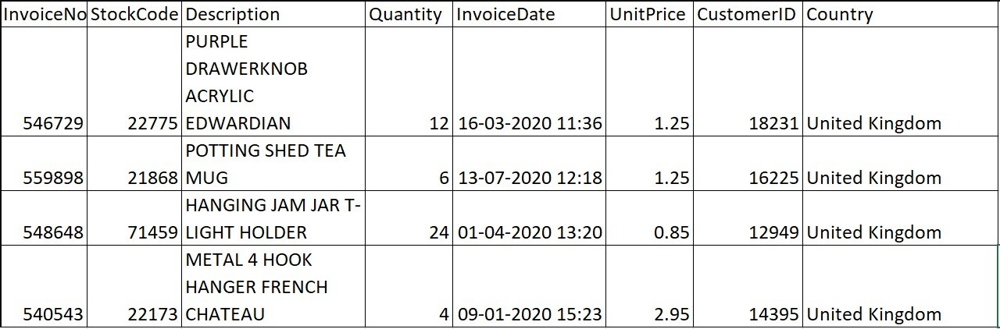
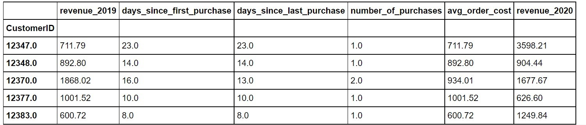
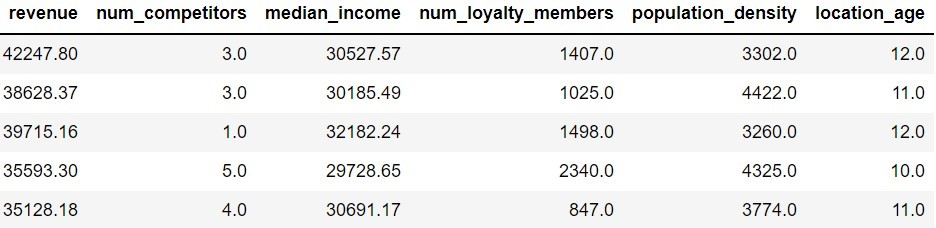
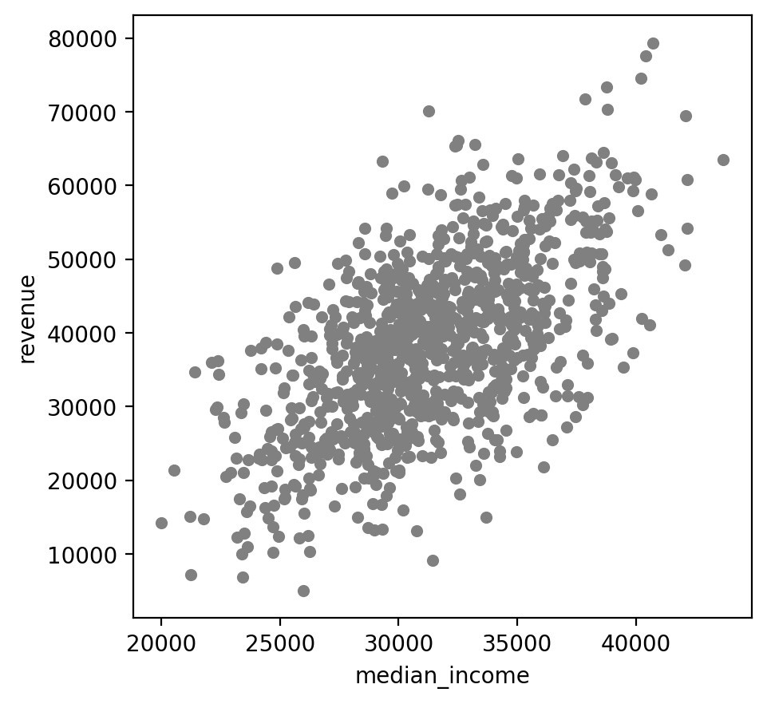
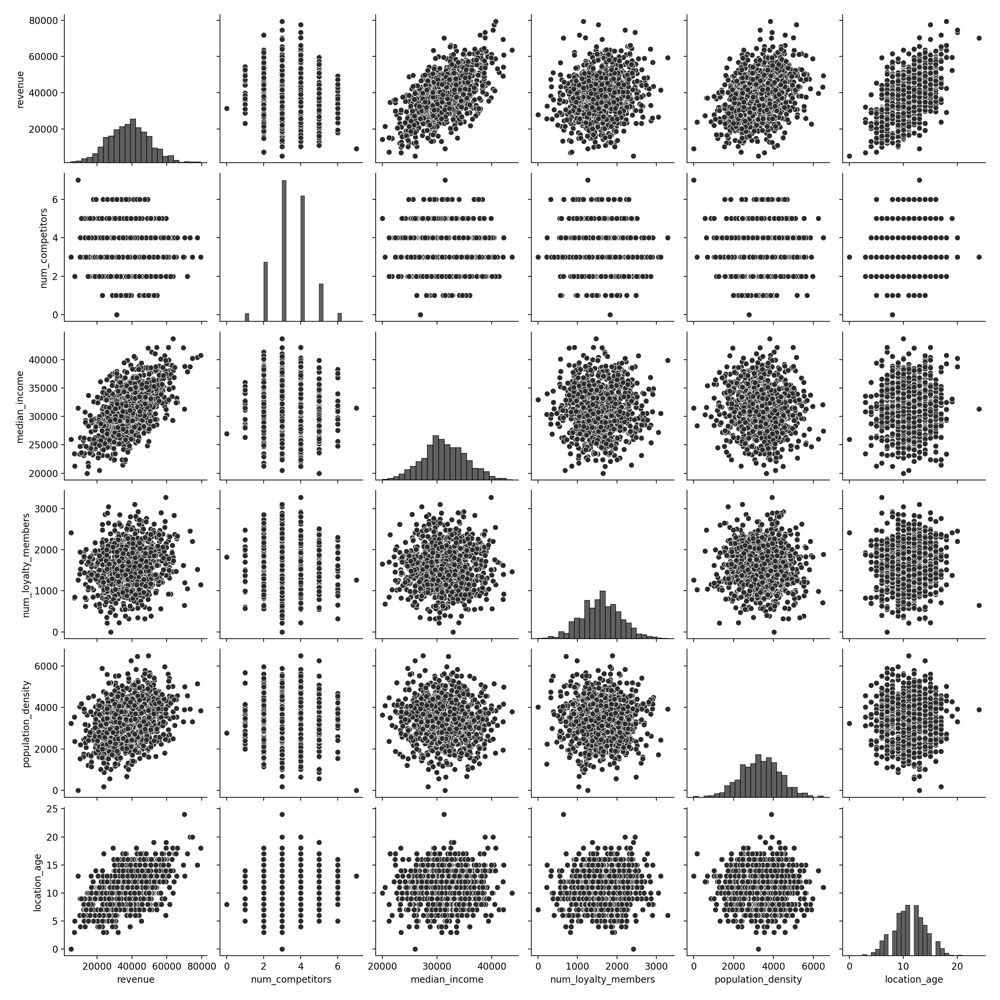
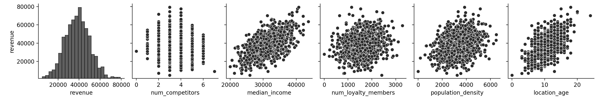
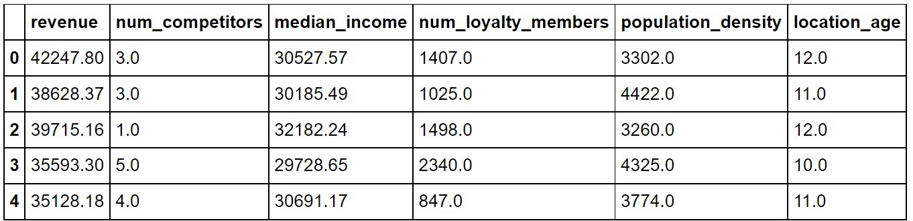
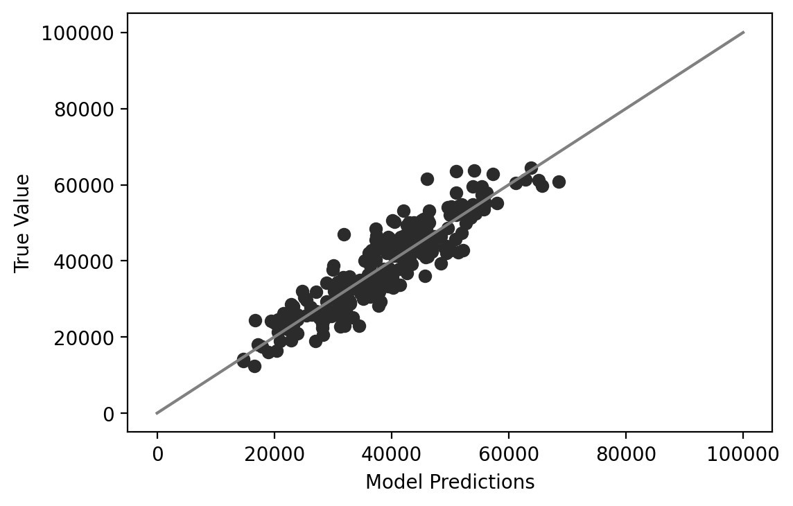

# Lab 05 Predicting Customer Revenue Using Linear Regression

## **Mục tiêu học tập**
Sau khi hoàn thành bài học này, học viên sẽ có thể:
- Hiểu rõ nhu cầu và tầm quan trọng của customer segmentation
- Nắm vững thuật toán K-means và ứng dụng trong phân khúc khách hàng
- Thực hiện phân tích thống kê mô tả và tổng hợp dữ liệu
- Sử dụng các công cụ Python để thực hiện segmentation
- Phân tích và diễn giải kết quả phân khúc khách hàng
- Áp dụng các kỹ thuật nâng cao trong customer segmentation

---

## **Bài tập Thực hành**
### Bài tập cơ bản

#### **Exercise 5.01: Predicting Sales from Advertising Spend Using Linear Regression**
HINA Inc. is a large FMCG company that is streamlining its marketing budget. This involves taking stock of all its marketing strategies. This, in turn, means re-assessing the effectiveness of its existing spend on various marketing channels. As a marketing analyst, you need to figure out if spending money on TV advertising campaigns results in a direct increase in sales. In other words, you need to find out if the TV advertising spend and the sales figures share a linear relationship. Linear regression seems perfect for the job as it models the relationship as a line. 
You are provided with historical advertising data – weekly sales and spend on each channel – for almost the 4 previous years. Using linear regression, you will make a model that predicts sales based on TV channel spend and study the obtained relationship.

**Code:**

```python
# 1.	Import the relevant libraries for plotting and data manipulation, load advertising.csv
#    dataset into a pandas DataFrame, and print the top five records using the following code:
import numpy as np, pandas as pd import matplotlib.pyplot as plt, seaborn as sns
advertising = pd.read_csv("advertising.csv")
advertising.head()


# 2.	Visualize the association between TV and Sales through a scatter plot using the following code:
plt.scatter(advertising.TV, advertising.Sales, marker="+", color='gray')
plt.xlabel("TV") plt.ylabel("Sales")

plt.show()


# 3.	Import LinearRegression from sklearn and create an instance of LinearRegression using the following code:
from sklearn.linear_model import LinearRegression

lr = LinearRegression()

# 4.	Fit a linear regression model, supplying the TV column as the features and Sales as the outcome,
#   	using the fit method of LinearRegression: 
lr.fit(advertising[['TV']], advertising[['Sales']])

# 5.	Using the predict method of the model, create a sales_pred variable containing the predictions from the model:
sales_pred = lr.predict(advertising[['TV']])

# 6.	Plot the predicted sales as a line over the scatter plot of Sales versus TV (using the simple line plot).
#   	This should help you assess how well the line fits the data and
#   	if it indeed is a good representation of the relationship:
plt.plot(advertising.TV, sales_pred,"k--")
plt.scatter(advertising.TV, advertising.Sales, marker='+', color='gray')
plt.xlabel("TV") plt.ylabel('Sales')

plt.show()

```

---

#### **Exercise 5.02: Creating Features for Customer Revenue Prediction**
Azra is a big high-fashion retailer with operations in multiple countries. To optimize their marketing activities, Azra seeks to identify high-value customers – customers that are expected to bring high revenue to the retailer – and have a differential marketing strategy for them. You are a marketing analytics manager at Azra and have a solution to this business problem. The key idea is that a predictive model can be employed to predict the next year's revenue of the customer based on the previous year's purchases. A customer with higher predicted revenue is naturally  a higher-value customer. 
To validate this approach, you plan to build a model to predict the revenue of the customer in 2020 based on the purchases made in 2019. If the model performs well, the approach gets validated. The 2020 purchase data can then be used to predict customer revenue for 2021 and help the company identify high-value customers. 
You have historical transaction data for the years 2019 and 2020 in the file  azra_retail_transactions.csv. 

The first few records are shown in Figure 5.10. For each transaction, you have the following: 
•	Customer identifier (CustomerID)
•	The number of units purchased (Quantity) 
•	The date and time of the purchase (InvoiceDate) 
•	The unit cost (UnitPrice) 
•	Some other information about the item purchased (StockCode, Description) and the customer (Country)
The dataset looks like the following:



The goal of this exercise is to manipulate the data and create variables that will allow you to model the customer spend for the year 2020, based on the past activity. The total customer spends for 2020 will therefore be the dependent variable. The independent variables will be features that capture information about the customer's past purchase behavior. Note that this also requires aggregation of the data in order to get one record for each customer. 
More concretely, you will be creating the following variables from the transactions data: 
•	revenue_2019 (total revenue for the year 2019)
•	days_since_first_purchase (the number of days since the first purchase by the customer)
•	days_since_last_purchase (the number of days since the customer's most recent purchase)
•	number_of_purchases (the total number of purchases by the customer in 2019)
•	avg_order_cost (the average value of the orders placed by the customer in 2019)
•	revenue_2020 (the total revenue for the year 2020)
revenue_2020 will be the dependent variable in the model, the rest being the independent variables. The modified dataset with the created features should look like the table in Figure 5.11.




**Code:**

```python
# 1.	Import pandas and load the data from retail_transactions.csv into a DataFrame named df,
#   	then print the first five records of the DataFrame.
#   	Also, import the datetime module as it will come in handy later:
import pandas as pd import datetime as dt

df = pd.read_csv('azra_retail_transactions.csv')
df.head()

# 2.	Convert the InvoiceDate column to date format using the to_datetime method from pandas: 
df['InvoiceDate'] = pd.to_datetime(df['InvoiceDate'])

# 3.	Calculate the revenue for each row, by multiplying Quantity by UnitPrice. 
#   	Print the first five records of the dataset to verify the result:
df['revenue'] = df['UnitPrice']*df['Quantity'] df.head()


# 4.	In the dataset, each invoice could be spread over multiple rows, one for each type of product purchased
#   	(since the row is for each product, and a customer can buy multiple products in an order).
#   	These can be combined such that data for each transaction is on a single row.
#   	To do so, perform a groupby operation on InvoiceNo. However, before that, you need to specify
#   	how to combine those rows that are grouped together. Use the following code: 
operations = {'revenue':'sum', 'InvoiceDate':'first', 'CustomerID':'first'}
df = df.groupby('InvoiceNo').agg(operations)

# 5.	Finally, use the head function to display the result:
df.head()

# 6.	You will be using the year of the transaction to derive features for 2019 and 2020.
#   	Create a separate column named year for the year.
#   	To do that, use the year attribute of the InvoiceDate column, as follows:
df['year'] = df['InvoiceDate'].dt.year

# 7.	For each transaction, calculate how many days' difference there is between the last day of 2019 and
#   	the invoice date using the following code. Use the datetime module we imported earlier:
df['days_since'] = (dt.datetime(year=2019, month=12, day=31) - df['InvoiceDate']).apply(lambda x: x.days)

# 8.	Next, create the features for days since the first and last purchase,
#   	along with the number of purchases and total revenue for 2019.
#   	Define a set of aggregation functions for each of the variables and apply them using the groupby method.
#   	You will calculate the sum of revenue. For the days_since column,
#   	you will calculate the maximum and the minimum number of days, as well as the number of unique values
#   	(giving you how many separate days this customer made a purchase on).
#   	Since these are your predictors, store the result in a variable, X, using the following code:
operations = {'revenue':'sum', 'days_since':['max','min','nunique']}
X = df[df['year'] == 2019].groupby('CustomerID').agg(operations)

# 9.	Now, use the head function to see the results:
X.head()

# 10. To simplify this, reset the names of the columns to make them easier to refer to later.
#   	Use the following code and print the results using the head function:
X.columns = [' '.join(col).strip() for col in X.columns.values]
X.head()

# 11.	Derive one more feature: the average spend per order.
#   	Calculate this by dividing revenue sum by days_since nunique (note that this is the average spend per day.
#   	For simplicity, assume that a customer only makes one order in a day): 
X['avg_order_cost'] = X['revenue sum'] / X['days_since nunique']

# 12.	You need the outcome that you will be predicting, which is just the sum of revenue for 2020.
#   	Calculate this with a simple groupby operation and store the values in the y variable, as follows:
y = df[df['year'] == 2020].groupby('CustomerID')['revenue'].sum()

# 13.	Put your predictors and outcomes into a single DataFrame, wrangled_df, and rename the columns to have more 
#   	intuitive names. Finally, look at the resulting DataFrame, using the head function:
wrangled_df = pd.concat([X,y], axis=1) wrangled_df.columns = ['revenue_2019', 'days_since_first_purchase',
                       'days_since_last_purchase', 'number_of_purchases', 'avg_order_cost', 'revenue_2020']
wrangled_df.head()

# 14.	To drop the customers without values, drop rows where either of the revenue columns are null, as follows:
wrangled_df = wrangled_df[~wrangled_df.revenue_2019.isnull()]
wrangled_df = wrangled_df[~wrangled_df.revenue_2020.isnull()]

# 15.	As a final data-cleaning step, it's often a good idea to get rid of outliers.
#   	A standard definition is that an outlier is any data point more than three standard deviations above the median.
#   	Use this criterion to drop customers that are outliers in terms of 2019 or 2020 revenue:
wrangled_df = wrangled_df[wrangled_df.revenue_2020  < ((wrangled_df.revenue_2020.median()) +
              wrangled_df.revenue_2020.std()*3)]
wrangled_df = wrangled_df[wrangled_df.revenue_2019 < ((wrangled_df.revenue_2019.median()) +
              wrangled_df.revenue_2019.std()*3)]

# 16.	It's often a good idea after you've done your data cleaning and feature engineering, to save the new data as 
#   	a new file, so that, as you're developing your model, you don't need to run the data through
#   	the whole feature engineering and cleaning pipeline each time you want to rerun your code.
#   	You can do this using the to_csv function. Also, take a look at your final DataFrame using the head function:
wrangled_df.to_csv('wrangled_transactions.csv')
wrangled_df.head()

```

---

#### **Exercise 5.03: Examining Relationships between Predictors and the Outcome**
In _Exercise 5.02, Creating Features for Customer Revenue Prediction_, you helped the e-commerce company Azra to transform the raw transaction data into a transformed dataset that has useful dependent and independent features that can be used for model building. In this exercise, you will continue the model-building process by analyzing the relationship between the predictors (independent variables) and the outcome (dependent variable). This will help you identify how the different purchase history-related features affect the future revenue of the customer. This will also help you assess whether the associations in the data make business sense. 
You will use scatter plots to visualize the relationships and use correlations to quantify them. Continue in the same Jupyter notebook you used for the previous exercises. Perform the following steps: 

**Code:**

```python
# 1.	Use pandas to import the data you saved at the end of the last exercise (wrangled_transactions.csv).
#   	The CustomerID field is not needed for the analysis. Assign CustomerId as the index for the DataFrame:
df = pd.read_csv('wrangled_transactions.csv',  index_col='CustomerID')


# 2.	Using the plot method of the pandas DataFrame, make a scatter plot with days_since_first_purchase
#   	on the x axis and revenue_2020 on the y axis to examine the relationship between them:
df.plot.scatter(x="days_since_first_purchase", y="revenue_2020", figsize=[6,6], color='gray')

plt.show()

# 3.	Using the pairplot function of the seaborn library, create pairwise scatter plots of all the features.
#   	Use the following code:
import seaborn as sns sns.set_palette('Greys_r') sns.pairplot(df) plt.show()

# 4.	Using the pairplot function and the y_vars parameter,
#   	limit the view to the row for your target variable, that is, revenue_2020:
sns.pairplot(df, x_vars=df.columns, y_vars="revenue_2020") plt.show()

# 5.	Next, use correlations to quantify the associations between the variables.
#   	Use the corr method on the pandas DataFrame, as in the following code:
df.corr()

 
```

---

#### **Activity 5.01: Examining the Relationship between Store Location and Revenue**
The fashion giant Azra also has several physical retail stores where customers can try and buy apparel and fashion accessories. With increased internet penetration and higher adoption of e-commerce among customers, the footfall to the physical stores has been decreasing. To optimize operation costs, the company wishes to understand the factors that affect the revenue of a store. This will help them take better calls regarding setting up future stores and making decisions about the existing ones. 
The data for the activity is in the file location_rev.csv. The file has data on several storefront locations and information about the surrounding area. This information includes the following: 
•	revenue (the revenue of the storefront at each location)
•	location_age (the number of years since the store opened)
•	num_competitors (the number of competitors in a 20-mile radius)
•	median_income (the median income of the residents in the area)
•	num_loyalty_members (the members enrolled in the loyalty program in the area)
•	population_density (the population density of the area)
The goal of the activity is to use the data to uncover some business insights that will help the company decide on the locations for its stores. You will visualize the different associations in the data and then quantify them using correlations. You will interpret the results and answer some questions pertinent to the business: 
•	Which variable has the strongest association with the revenue? 
•	Are all the associations intuitive and make business sense? 
 
_Perform these steps to complete the activity._

1. Load the necessary libraries (pandas, pyplot from matplotlib, and seaborn), read the data from location_rev.csv into a DataFrame, and examine the data by printing the top five rows. 



2. Using the pandas DataFrame's plot method, create a scatter plot between median_income and the revenue of the store. The output should look like the following:

   

3. Use seaborn's pairplot function to visualize the data and its relationships. 
You should get the following plot:

   

4. Using the y_vars parameter, plot only the row for associations with the revenue variable. The output should be as follows:

   

5. Finally, calculate correlations using the appropriate method(s) to quantify the relationships between the different variables and location revenue. Analyze the data so that you can answer the following questions:
a)	Which variables have the highest association with revenue? 
b)	Do the associations make business sense?
   
**Code:**

```python


```

---

#### **Exercise 5.04: Building a Linear Model Predicting Customer Spend**
Predicting the future revenue for a customer based on past transactions is a classic problem that linear regression can solve. In this exercise, you will create a linear regression model to predict customer revenue for 2020 for the high-fashion company Azra. In the previous exercises, you performed feature engineering to get the data ready for modeling and analyzed the relationships in the data. Now, using linear regression, you will create a model that describes how future revenue relates to the features based on past transactions.
You will train a linear regression model with revenue_2020 as the dependent variable and the rest of the variables as the independent variables. You will use the train-test approach to make sure you train the model on part of the data and assess it on the unseen test data. You will interpret the coefficients from the trained model and check whether they make business sense. To mathematically assess the performance of the model, you will check the correlation between the predicted values of revenue_2020 and the actual values. A higher correlation would indicate a higher performance of the model.
You will use the file **wrangled_transactions.csv** created in _Exercise 5.02, Creating Features for Transaction Data_. 
 

**Code:**

```python
# 1.	Import pandas and numpy using the following code:
import pandas as pd, numpy as np

# 2.	Create a new DataFrame named df and read the data from  wrangled_transactions.csv with CustomerID as the index:
df = pd.read_csv('wrangled_transactions.csv', \                  index_col='CustomerID')

# 3.	Look at the correlations between the variables again using the corr function:
df.corr()

# 4.	Store the independent and dependent variables in the X and y variables, respectively:
X = df[['revenue_2019',\
        'days_since_last_purchase',\
        'number_of_purchases',\         'avg_order_cost']] y = df['revenue_2020']

# 5.	Use sklearn to perform a train-test split on the data, so that you can assess the model on a dataset it was not trained on:
from sklearn.model_selection import train_test_split
X_train, X_test, y_train, y_test = train_test_split\
                                   (X, y, random_state = 100)

# 6.	Import LinearRegression from sklearn using the following code:
from sklearn.linear_model import LinearRegression

# 7.	Create a LinearRegression model, and fit it on the training data:
model = LinearRegression() model.fit(X_train,y_train)

# 8.	Examine the model coefficients by checking the coef_ property. Note that these are in the same order as your X columns: revenue_2019,  days_since_last_purchase, number_of_purchases, and  avg_order_cost:
model.coef_

# 9.	Check the intercept term of the model by checking the intercept_ property:
model.intercept_
This should give a value of 264.86. From steps 8 and 9, you can arrive at the model's full equation:
revenue_2020= 264.86.74 + 5.79*(revenue_2019) + 7.477*(days_since_ last_purchase) + 336.61*(number_of_purchases) – 2.056*(avg_order_ cost)

# 10.	You can now use the fitted model to make predictions about a customer outside of your dataset. Make a DataFrame that holds data for one customer, where revenue for 2019 is 1,000, the number of days since the last purchase is 20, the number of purchases made is 2, and the average order cost is 500. Have the model make a prediction on this one customer's data:
single_customer = pd.DataFrame({'revenue_2019': [1000],\                                 'days_since_last_purchase': [20],\
                                'number_of_purchases': [2],\                                 'avg_order_cost': [500]})
model.predict(single_customer)
The result should be an array with a single value of about 5847.67, indicating the predicted revenue for 2020 for a customer with this data.

# 11.	You can plot the model's predictions on the test set against the true value. First, import matplotlib, and make a scatter plot of the model predictions on X_test against y_test. Limit the x and y axes to a maximum value of 10,000 so that we get a better view of where most of the data points lie. Finally, add a line with slope 1, which will serve as your reference—if all the points lie on this line, it means you have a perfect relationship between your predictions and the true answer:
import matplotlib.pyplot as plt %matplotlib inline
plt.scatter(model.predict(X_test), y_test, color='gray') plt.xlim(0,10000) plt.ylim(0,10000) plt.plot([0, 10000], [0, 10000], 'k-') plt.xlabel('Model Predictions') plt.ylabel('True Value') plt.show()


# 12. To further examine the relationship, you can use correlation. Use the corrcoef method from NumPy to calculate the correlation between the predicted and the actual values of revenue_2020 for the test data:
np.corrcoef(model.predict(X_test), y_test)


```

---

#### **Activity 5.02: Predicting Store Revenue Using Linear Regression**
Revisit the problem you were solving earlier for the high-fashion company Azra. A good understanding of which factors drive the revenue for a storefront will be critical in helping the company decide the locations for upcoming stores in a way that maximizes the overall revenue. 
You will continue working on the dataset you explored in_ Activity 5.01, Examining the Relationship between Store Location and Revenue_. You have, for each store, the revenue along with information about the location of the store. In _Activity 5.01, Examining the Relationship between Store Location and Revenue_, you analyzed the relationship between the store revenue and the location-related features. 
Now, you will build a predictive model using linear regression to predict the revenue of a store using information about its location. You will use a train-test split approach to train the model on part of the data and assess the performance on unseen test data. You will assess the performance of the test data by calculating the correlation between the actual values and the predicted values of revenue. Additionally, you will examine the coefficients of the model to ensure that the model makes business sense. 
Complete the following tasks. Continue in the Jupyter notebook used for _Activity 5.01, Examining the Relationship between Store Location and Revenue_.

1. Import the necessary libraries and the data from **location_rev.csv** and view the first few rows, which should look as follows:



2.	Create a variable, X, with the predictors (all columns except revenue) in it, and store the outcome (revenue) in a separate variable, y.
3.	Split the data into a training and test set. Use random_state = 100.
4.	Create a linear regression model and fit it on the training data.
5.	Print out the model coefficients.
6.	Print out the model intercept.
7.	Produce a prediction for a location that has three competitors; a median income of 30,000; 1,200 loyalty members; a population density of 2,000; and a location age of 10. The result should be an array with a single value of 27573.21782447, indicating the predicted revenue for a customer with this data.
8.	Plot the model's predictions versus the true values on the test data. Your plot should look as follows:



9. Calculate the correlation between the model predictions and the true values of the test data.
The result should be around 0.91.

---
### Bài tập tổng hợp
#### Bài Tập 1: Model Improvement (Cấp độ Cơ bản)

**Yêu cầu**: Cải thiện mô hình hiện tại bằng cách:

1. Thêm feature engineering mới
2. Thử nghiệm với polynomial features
3. So sánh kết quả với mô hình gốc

```python
# Template cho học viên
from sklearn.preprocessing import PolynomialFeatures

def improve_model():
    """
    Bài tập: Cải thiện mô hình linear regression
    """
    # TODO: 1. Create new engineered features
    # Gợi ý: interaction features, polynomial features, binning
    
    # TODO: 2. Try polynomial regression
    poly = PolynomialFeatures(degree=2, include_bias=False)
    # Implement polynomial features
    
    # TODO: 3. Compare results
    # So sánh MAE, RMSE, R² với mô hình gốc
    
    pass

# Học viên tự implement
```

#### Bài Tập 2: Business Case Analysis (Cấp độ Trung bình)

**Scenario**: Bạn là Data Analyst tại một công ty retail online. Marketing team muốn biết:

1. Nên đầu tư marketing budget vào channel nào?
2. Khách hàng nào có tiềm năng revenue cao nhất?
3. Làm thế nào để tăng revenue per customer lên 20%?

**Yêu cầu**:
```python
def business_case_analysis():
    """
    Phân tích business case với linear regression model
    """
    # TODO: 1. Analyze marketing channel impact
    # Sử dụng coefficients để đánh giá hiệu quả từng channel
    
    # TODO: 2. Create customer scoring system
    # Rank customers theo predicted revenue
    
    # TODO: 3. Revenue optimization strategy
    # Tìm features có thể optimize để tăng revenue
    
    pass
```

#### Bài Tập 3: Advanced Implementation (Cấp độ Nâng cao)

**Yêu cầu**: Xây dựng complete ML pipeline

```python
class CustomerRevenuePredictor:
    """
    Complete ML pipeline for customer revenue prediction
    """
    
    def __init__(self):
        self.model = None
        self.scaler = None
        self.feature_names = None
    
    def preprocess_data(self, df):
        # TODO: Implement complete preprocessing pipeline
        pass
    
    def train(self, X, y):
        # TODO: Train model with cross-validation
        pass
    
    def predict(self, X):
        # TODO: Make predictions with confidence intervals
        pass
    
    def explain_prediction(self, customer_data):
        # TODO: Explain individual predictions
        pass
    
    def generate_report(self):
        # TODO: Generate business report
        pass

# Test với new data
predictor = CustomerRevenuePredictor()
# Implement và test
```

#### Bài Tập 4: Data Quality Assessment (Cấp độ Cơ bản)

**Mục tiêu**: Học cách đánh giá và cải thiện chất lượng dữ liệu trước khi modeling

**Dataset**: Bạn nhận được một dataset khách hàng mới với nhiều vấn đề về chất lượng dữ liệu

```python
import pandas as pd
import numpy as np
import matplotlib.pyplot as plt
import seaborn as sns

# Tạo dataset có vấn đề để thực hành
np.random.seed(123)
problematic_data = {
    'customer_id': ['CUST_' + str(i).zfill(4) for i in range(1, 501)],
    'age': np.concatenate([
        np.random.randint(18, 80, 450),  # Normal ages
        [-5, 150, 999, 0, -10]           # Invalid ages
    ]),
    'income': np.concatenate([
        np.random.normal(55000, 20000, 480),  # Normal incomes
        [0, -50000, 999999999, np.nan, None]  # Problematic values
    ]),
    'email': [f'user{i}@email.com' if i % 10 != 0 else 
             ('invalid_email' if i % 20 == 0 else np.nan) 
             for i in range(1, 501)],
    'registration_date': pd.date_range('2020-01-01', periods=500, freq='D'),
    'last_purchase_amount': np.concatenate([
        np.random.exponential(100, 470),      # Normal purchases
        [0, 0, -100, np.nan, 999999]         # Problematic values
    ])
}

df_problems = pd.DataFrame(problematic_data)

# === NHIỆM VỤ CỦA HỌC VIÊN ===

def data_quality_assessment(df):
    """
    Bài tập 1: Đánh giá chất lượng dữ liệu
    
    TODO: Hoàn thành các function sau
    """
    
    # 1. Phát hiện missing values
    def detect_missing_values():
        # TODO: Tạo report về missing values
        # - Số lượng và tỷ lệ missing values cho mỗi column
        # - Visualize missing data pattern
        # - Đề xuất cách xử lý
        pass
    
    # 2. Phát hiện outliers
    def detect_outliers():
        # TODO: Sử dụng multiple methods
        # - IQR method
        # - Z-score method  
        # - Isolation Forest (bonus)
        # - Visualize outliers bằng boxplot và scatter
        pass
    
    # 3. Validate data types và formats
    def validate_data_formats():
        # TODO: Check data consistency
        # - Email format validation
        # - Age reasonable ranges (18-100)
        # - Income positive values
        # - Date formats
        pass
    
    # 4. Tạo data quality report
    def create_quality_report():
        # TODO: Tạo comprehensive report
        # - Summary statistics
        # - Quality score (0-100)
        # - Recommended actions
        pass
    
    # Gọi các functions và return results
    return detect_missing_values(), detect_outliers(), validate_data_formats(), create_quality_report()

# Test function
# quality_results = data_quality_assessment(df_problems)
```

**Deliverable**:
- Jupyter notebook với complete data quality analysis
- Data cleaning pipeline
- Before/after comparison charts
- Written report về data quality issues tìm được

---

#### Bài Tập 5: A/B Testing Revenue Impact (Cấp độ Trung bình)

**Mục tiêu**: Sử dụng regression để phân tích impact của A/B test lên customer revenue

**Scenario**: 
Công ty đã chạy A/B test cho 2 tháng với 2 versions của product page:
- **Control Group (A)**: Original product page
- **Treatment Group (B)**: New design với enhanced features

```python
# Tạo A/B test dataset
np.random.seed(456)
n_customers = 2000

ab_test_data = {
    'customer_id': [f'AB_{i:04d}' for i in range(1, n_customers + 1)],
    'test_group': np.random.choice(['A', 'B'], n_customers, p=[0.5, 0.5]),
    'age': np.random.randint(18, 70, n_customers),
    'gender': np.random.choice(['Male', 'Female', 'Other'], n_customers, p=[0.45, 0.50, 0.05]),
    'previous_revenue': np.random.exponential(800, n_customers),
    'session_duration': np.random.normal(15, 5, n_customers),  # minutes
    'pages_viewed': np.random.poisson(8, n_customers),
    'device_type': np.random.choice(['Mobile', 'Desktop', 'Tablet'], n_customers, p=[0.6, 0.35, 0.05]),
    'marketing_channel': np.random.choice(['Organic', 'Paid', 'Social', 'Email'], n_customers)
}

# Create revenue với treatment effect
treatment_effect = 150  # $150 additional revenue for group B
df_ab = pd.DataFrame(ab_test_data)

# Revenue generation with treatment effect
base_revenue = (
    df_ab['previous_revenue'] * 0.3 +
    df_ab['session_duration'] * 10 +
    df_ab['pages_viewed'] * 15 +
    np.random.normal(0, 100, n_customers)
)

# Add treatment effect for group B
df_ab['post_test_revenue'] = np.where(
    df_ab['test_group'] == 'B', 
    base_revenue + treatment_effect + np.random.normal(0, 50, n_customers),
    base_revenue + np.random.normal(0, 50, n_customers)
)

# === NHIỆM VỤ CỦA HỌC VIÊN ===

class ABTestAnalyzer:
    """
    Bài tập 2: A/B Test Analysis với Regression
    """
    
    def __init__(self, data):
        self.data = data.copy()
        self.results = {}
    
    def descriptive_analysis(self):
        """
        TODO: 1. Phân tích mô tả cơ bản
        - So sánh revenue giữa 2 groups
        - Check balance của demographics
        - Visualize distributions
        """
        pass
    
    def statistical_significance_test(self):
        """
        TODO: 2. Kiểm định thống kê
        - T-test for revenue difference
        - Chi-square test for categorical variables
        - Effect size calculation (Cohen's d)
        """
        pass
    
    def regression_analysis(self):
        """
        TODO: 3. Regression Analysis (KEY PART)
        
        Model: revenue = β₀ + β₁*treatment + β₂*age + β₃*previous_revenue + ... + ε
        
        - Build regression model với treatment variable
        - Control for other factors (age, device, etc.)
        - Interpret treatment coefficient
        - Calculate confidence intervals
        """
        pass
    
    def segmentation_analysis(self):
        """
        TODO: 4. Segmented Analysis
        - Phân tích treatment effect theo demographics
        - Mobile vs Desktop users
        - New vs Returning customers
        - Age groups
        """
        pass
    
    def business_recommendations(self):
        """
        TODO: 5. Business Recommendations
        - Should we roll out treatment to all users?
        - What's the expected revenue impact?
        - Which segments benefit most?
        - ROI calculation
        """
        pass

# Test class
# analyzer = ABTestAnalyzer(df_ab)
# analyzer.descriptive_analysis()
# analyzer.regression_analysis()
```

**Expected Output**:
```python
# Ví dụ expected results
"""
A/B Test Analysis Results:
========================
1. Overall Impact:
   - Treatment Group Average Revenue: $1,234
   - Control Group Average Revenue: $1,089  
   - Difference: $145 (13.3% increase)
   - Statistical Significance: p < 0.001
   
2. Regression Results:
   - Treatment Effect: $142.7 (95% CI: $98.3 - $187.1)
   - R²: 0.67
   - Adjusted for: age, device, previous_revenue, session_duration
   
3. Segment Analysis:
   - Mobile users: +$167 revenue
   - Desktop users: +$128 revenue
   - Users 25-40: Highest treatment effect (+$201)
   
4. Business Recommendation: IMPLEMENT
   - Expected annual revenue increase: $2.1M
   - Implementation cost: $500K
   - ROI: 320%
"""
```

---

#### Bài Tập 6: Multi-Model Customer Lifetime Value System (Cấp độ Nâng cao)

**Mục tiêu**: Xây dựng hệ thống hoàn chỉnh để predict Customer Lifetime Value với multiple models

**Business Context**: 
Bạn là Senior Data Scientist tại một subscription-based business. Cần xây dựng CLV prediction system để:
- Optimize customer acquisition cost (CAC)
- Personalize retention strategies  
- Forecast long-term revenue

```python
import pandas as pd
import numpy as np
from sklearn.ensemble import RandomForestRegressor
from sklearn.linear_model import LinearRegression, Ridge, Lasso
from sklearn.metrics import mean_absolute_error, mean_squared_error, r2_score
from sklearn.model_selection import cross_val_score, GridSearchCV, TimeSeriesSplit
import joblib
import warnings
warnings.filterwarnings('ignore')

# Tạo complex subscription dataset
np.random.seed(789)
n_customers = 5000

subscription_data = {
    'customer_id': [f'SUB_{i:05d}' for i in range(1, n_customers + 1)],
    'signup_date': pd.date_range('2020-01-01', periods=n_customers, freq='D'),
    'subscription_tier': np.random.choice(['Basic', 'Premium', 'Enterprise'], 
                                        n_customers, p=[0.6, 0.3, 0.1]),
    'acquisition_channel': np.random.choice(['Organic', 'Paid_Search', 'Social', 'Referral'], 
                                          n_customers, p=[0.4, 0.3, 0.2, 0.1]),
    'initial_payment': np.random.choice([9.99, 19.99, 49.99], n_customers, p=[0.6, 0.3, 0.1]),
    'customer_age': np.random.randint(18, 65, n_customers),
    'company_size': np.random.choice(['1-10', '11-50', '51-200', '200+'], 
                                   n_customers, p=[0.5, 0.3, 0.15, 0.05]),
    
    # Behavioral features
    'first_month_logins': np.random.poisson(15, n_customers),
    'feature_adoption_score': np.random.beta(2, 5, n_customers),  # 0-1 scale
    'support_tickets_count': np.random.poisson(2, n_customers),
    'referrals_made': np.random.poisson(0.5, n_customers),
    
    # Engagement metrics
    'avg_session_duration': np.random.exponential(20, n_customers),  # minutes
    'monthly_active_days': np.random.randint(1, 31, n_customers),
    'integration_usage': np.random.choice([0, 1], n_customers, p=[0.7, 0.3]),
}

df_clv = pd.DataFrame(subscription_data)

# Generate complex CLV với multiple factors
def generate_realistic_clv(row):
    base_clv = row['initial_payment'] * 12  # Annual value
    
    # Tier multipliers
    tier_multiplier = {'Basic': 1.0, 'Premium': 2.5, 'Enterprise': 8.0}[row['subscription_tier']]
    
    # Channel quality
    channel_quality = {'Organic': 1.3, 'Referral': 1.5, 'Paid_Search': 1.1, 'Social': 0.9}[row['acquisition_channel']]
    
    # Behavioral impact
    engagement_score = (
        row['first_month_logins'] / 30 +
        row['feature_adoption_score'] +
        row['monthly_active_days'] / 31 +
        row['integration_usage'] * 0.5
    ) / 4
    
    # Final CLV calculation
    clv = base_clv * tier_multiplier * channel_quality * (0.5 + engagement_score) * np.random.uniform(0.8, 1.2)
    
    return max(clv, 0)  # Ensure non-negative

df_clv['actual_clv'] = df_clv.apply(generate_realistic_clv, axis=1)

# === NHIỆM VỤ NÂNG CAO ===

class CLVPredictionSystem:
    """
    Bài tập 3: Complete CLV Prediction System
    
    Requirements:
    1. Multiple model comparison
    2. Feature engineering pipeline
    3. Model interpretation
    4. Business simulation
    5. Production-ready code
    """
    
    def __init__(self):
        self.models = {}
        self.preprocessor = None
        self.feature_names = None
        self.best_model = None
        self.business_metrics = {}
    
    def advanced_feature_engineering(self, df):
        """
        TODO: 1. Sophisticated Feature Engineering
        
        Create advanced features:
        - Time-based features (seasonality, tenure)
        - Interaction features (tier × channel)
        - Behavioral clusters
        - Risk scores (churn probability)
        - Cohort analysis features
        """
        pass
    
    def model_comparison_pipeline(self, X, y):
        """
        TODO: 2. Multi-Model Comparison
        
        Compare models:
        - Linear Regression (baseline)
        - Ridge Regression (L2 regularization)
        - Lasso Regression (feature selection)
        - Random Forest (non-linear patterns)
        - Gradient Boosting (bonus: XGBoost/LightGBM)
        
        Use cross-validation and multiple metrics
        """
        models_to_test = {
            'Linear': LinearRegression(),
            'Ridge': Ridge(),
            'Lasso': Lasso(),
            'RandomForest': RandomForestRegressor(n_estimators=100, random_state=42)
        }
        
        # TODO: Implement grid search và cross-validation
        pass
    
    def feature_importance_analysis(self):
        """
        TODO: 3. Advanced Model Interpretation
        
        Implement:
        - Coefficient analysis (linear models)
        - Feature importance (tree models)  
        - SHAP values (if time permits)
        - Partial dependence plots
        """
        pass
    
    def business_simulation(self, model, X_test, y_test):
        """
        TODO: 4. Business Impact Simulation
        
        Simulate business scenarios:
        - Customer acquisition ROI
        - Retention campaign targeting
        - Pricing strategy optimization
        - Revenue forecasting
        """
        
        # Example simulation framework
        def simulate_acquisition_strategy():
            # TODO: If CAC = $100, which customers to acquire?
            predictions = model.predict(X_test)
            # Calculate ROI for different customer segments
            pass
        
        def simulate_retention_campaigns():
            # TODO: Which customers to target for retention?
            # High CLV + High churn risk = Priority
            pass
        
        pass
    
    def production_deployment_prep(self):
        """
        TODO: 5. Production Readiness
        
        Implement:
        - Model serialization/deserialization
        - Input validation
        - Prediction confidence intervals
        - Model monitoring setup
        - API endpoint template
        """
        
        def save_model_pipeline(self, filepath):
            # TODO: Save complete pipeline
            pass
        
        def load_model_pipeline(filepath):
            # TODO: Load và validate
            pass
        
        def predict_with_confidence(self, X):
            # TODO: Predictions với uncertainty quantification
            pass
        
        pass
    
    def generate_executive_report(self):
        """
        TODO: 6. Executive Summary Report
        
        Create business-friendly report:
        - Model performance in business terms
        - Expected revenue impact
        - Strategic recommendations
        - Implementation roadmap
        """
        pass

# === EVALUATION CRITERIA ===
"""
Advanced Exercise Evaluation:

Technical Excellence (40%):
- Code quality và best practices
- Multiple model implementation
- Proper cross-validation
- Feature engineering creativity

Business Impact (35%):
- Realistic business scenarios
- ROI calculations
- Strategic recommendations
- Executive communication

Innovation (25%):
- Creative feature engineering
- Advanced techniques usage
- Production considerations
- Novel insights discovery

Bonus Points:
- SHAP implementation
- Interactive visualizations
- Docker containerization
- Real-time prediction API
"""

# Test implementation
# clv_system = CLVPredictionSystem()
# clv_system.advanced_feature_engineering(df_clv)
# clv_system.model_comparison_pipeline(X, y)
```

**Expected Deliverables**:

1. **Technical Report** (Jupyter Notebook):
   - Complete model comparison với metrics
   - Feature importance analysis
   - Model interpretation visualizations

2. **Business Report** (PowerPoint/PDF):
   - Executive summary
   - ROI projections
   - Strategic recommendations

3. **Production Code** (Python files):
   - Clean, documented model pipeline
   - Unit tests
   - API endpoint example

4. **Interactive Dashboard** (Bonus):
   - Streamlit/Dash app
   - Real-time CLV predictions
   - Business scenario simulations

---

#### Bài Tập 7: Model Validation và Deployment

**Yêu cầu**: 
1. Implement cross-validation
2. Create model monitoring system
3. Build simple API endpoint

```python
from sklearn.model_selection import cross_val_score
from flask import Flask, request, jsonify

# TODO: 1. Cross-validation
def perform_cross_validation():
    # Implement 5-fold CV
    pass

# TODO: 2. Model monitoring
def monitor_model_performance():
    # Track model drift
    pass

# TODO: 3. Simple API
app = Flask(__name__)

@app.route('/predict', methods=['POST'])
def predict_revenue():
    # TODO: Implement prediction API
    pass
```

---

## Tài Liệu Tham Khảo và Đọc Thêm

### Essential Libraries Documentation
- **Scikit-learn**: [Linear Regression Guide](https://scikit-learn.org/stable/modules/linear_model.html)
- **Pandas**: [Data Manipulation](https://pandas.pydata.org/docs/)
- **NumPy**: [Numerical Computing](https://numpy.org/doc/)

### Advanced Topics
- **Regularization**: Ridge, Lasso, Elastic Net regression
- **Feature Selection**: Statistical methods, Recursive Feature Elimination
- **Model Interpretation**: SHAP values, LIME
- **Time Series**: When revenue has temporal dependencies

### Business Applications
- Customer Lifetime Value (CLV) modeling
- Price optimization
- Demand forecasting
- Marketing mix modeling

---

## Checklist Đánh Giá

### Kiến thức cơ bản ✓
- [ ] Hiểu được supervised learning và regression
- [ ] Nắm vững linear regression assumptions
- [ ] Biết cách đánh giá model performance

### Kỹ năng thực hành ✓
- [ ] Thực hiện EDA và data cleaning
- [ ] Engineer features hiệu quả
- [ ] Implement và evaluate linear regression
- [ ] Interpret results và derive insights

### Tư duy kinh doanh ✓
- [ ] Chuyển đổi business problems thành ML problems
- [ ] Diễn giải technical results cho business stakeholders
- [ ] Đưa ra recommendations dựa trên model insights

---

*Lưu ý: Bài giảng này được thiết kế cho học viên đã có kiến thức lập trình Python cơ bản. Các bài tập được sắp xếp theo độ khó tăng dần để học viên có thể phát triển kỹ năng từng bước.*
